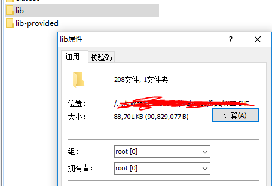
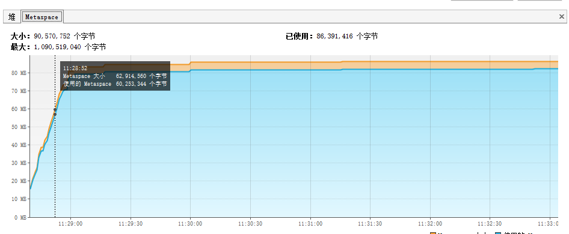
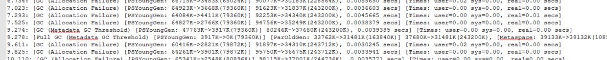
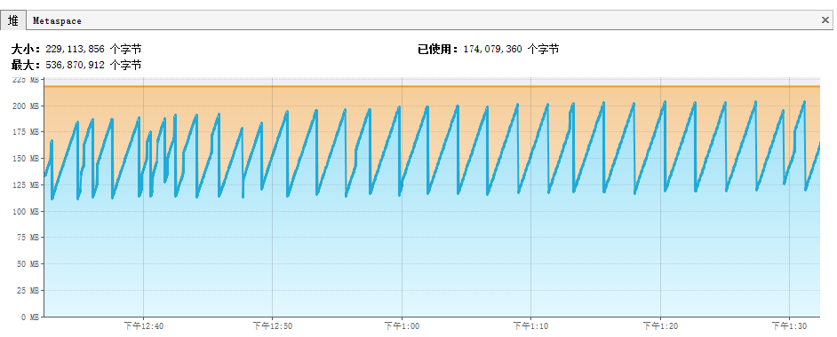
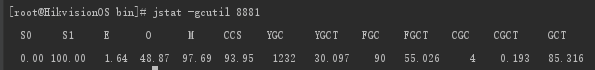
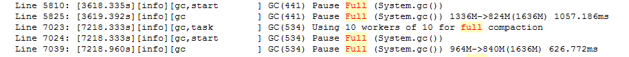
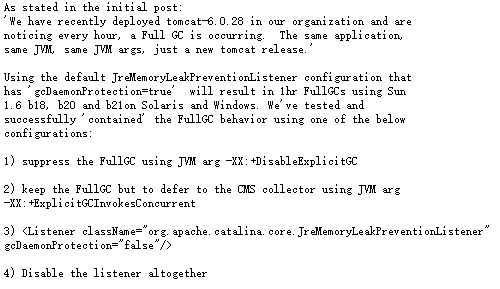
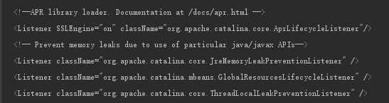
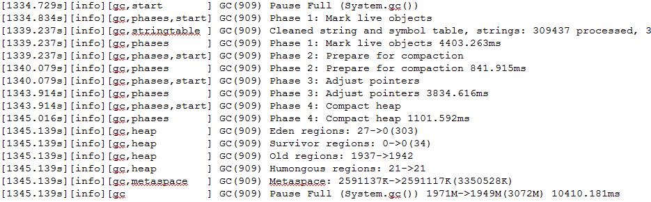

# 前言
因为前段时间出现了“内存泄漏”的问题，最后经过定位是linux内存分配的问题导致的，刚好手头的项目提测，就在自测环境中对JVM进行了一波调试
# tomcat所在进程内存占用上涨
在实际运行过程中，我们发现tomcat在运行时，所占用的内存总是大过我们配置的Xmx很多，而且隐隐的还存在一点点的上涨趋势，虽然不是很明显。看起来疑似内存泄漏，其实是Meatspace的占用在作祟，可以直接配置元空间大小来限制。元空间的大小估计可以根据放置在tomcatwebapp里面的war包中的lib文件夹大小估计，如下所示

我们看到元空间实际大小与lib文件夹大小所差无几
但是也不能直接把元空间大小配死在lib大小，应该给它一点伸展空间，防止元空间在处理动态加载类、动态代理等问题时溢出。
元空间大小可以通过以下两个参数进行配置
（1）元空间最大值，防止它侵占不该属于它的内存空间
-XX:MaxMetaspaceSize=256m
（2）元空间增加到这个值时触发GC
-XX:MetaspaceSize=40m
这里我配置的MetaspaceSize为40m，然后它在达到这个值时触发到了GC。这个是启动时的GC，如果你不介意，那就不需要在意这个值的大小，如果想要系统启动的更快，就可以把这个值配置的大一点。

# tomcat内存占用过大
高水位线和低水位线之间的空闲区域是防止服务在受到压力期间的缓冲区域，如果服务器一直是处于比较稳定的状态，这个缓冲区域就可以进行一定程度上的压缩，以减少不必要的内存开支。
这个缓冲区域可以通过Xmx和InitiatingHeapOccupancyPercent（指定在G1启动新一轮垃圾回收之前可以使用的堆内存百分比，这个百分比包含新生代和老年代的内存，启动并发GC周期时的堆内存占用百分比. G1之类的垃圾收集器用它来触发并发GC周期,基于整个堆的使用率,而不只是某一代内存的使用比. 值为 0 则表示"一直执行GC循环". 默认值为 45.）两个值进行调整。
将Xmx设置成256m，将InitiatingHeapOccupancyPercent设置成90，之后堆内存情况如下图所示

很明显这里基本上没什么空闲区域了，如果再往下调的话，服务可能经受不住一点点的tps，它会触发更多的GC以维持更多的空闲区域。

# fullGC次数过多
这个问题确实让我排查了两天都没有收获

然后在昨天晚上快下班的时候我瞥了一眼，发现一个规律，两次GC之间刚刚好3600秒，1个小时，这就有意思了，是不是有某个线程在定时触发呢。

在我一番查询资料之后发现，下面的这个说法，tomcat在每个小时会去触发fullGC。

图片原文链接
[http://mail-archives.apache.org/mod_mbox/tomcat-users/201008.mbox/%3CAANLkTino=BjP5LsBCwncB2HvNDzyKLr5y-8yWdt15a89@mail.gmail.com%3E](http://mail-archives.apache.org/mod_mbox/tomcat-users/201008.mbox/%3CAANLkTino=BjP5LsBCwncB2HvNDzyKLr5y-8yWdt15a89@mail.gmail.com%3E)
但是这里写的是tomcat6，而我们使用的不是6，就需要去求证一下真伪了，果不其然，在tomcat的server.xml中找到了它，这个防止内存泄漏的监听器会定时触发fullGC，如果不是特意配置的话，可以将其注释掉，或者采用CMS回收器。

# fullGC时间太长
当我为了避免更多次数的fullGC时，以及减少元空间和堆内存大小时，触发了另外一个问题，fullGC的时间更长了，变的不能接受了。
这里就需要配置打印GC日志了，我们需要观察到底是什么原因使得GC变的这么漫长
在jvm参数中配置
-XX:+PrintGCDetails
-Xloggc:/{path}/gc.log
然后发现以下日志信息，fullGC在回收时变的很疲软，时间持续很长，但回收内容寥寥无几。

可以调整GC的可用线程数和并行线程数，以及适当调整Xmx的值，不能太省了。
-XX:ParallelGCThreads=10
-XX:ConcGCThreads=2
-XX:G1ReservePercent=10
# CPU不够用
从图中我们可以看到，在服务启动过程中，gc非常频繁，一开始的时候也还行，但是到后面整个CPU使用情况折线图就奇形怪状了，这个时候服务也是不可用状态。其实在启动过程中，我看到了CPU总使用量多次达到了100%，同时根据日志情况，这个tomcat启动过程中，还导致了其他服务崩溃的情况。
这里的原因虽然是tomcat启动过程中cpu不够用导致的，但也是可以解决的，因为我们一个tomcat里面放置的服务太多了，可以减少，分开成多个tomcat部署。

# 总结
配置tomcat的JVM相关信息，需要仔细测试之后再确定，如果鲁莽的配置可能会导致更加复杂的问题，在调优时需要均衡考虑CPU情况，内存情况，以及服务器吞吐量等。