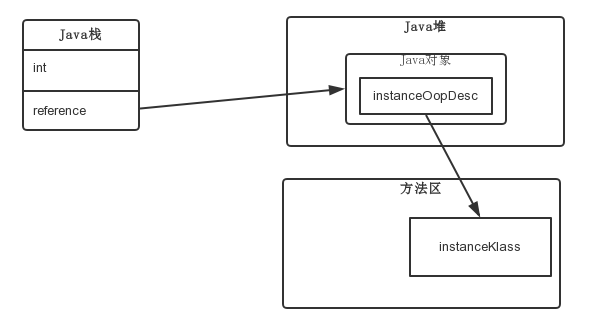
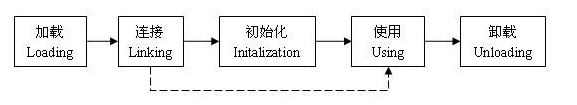
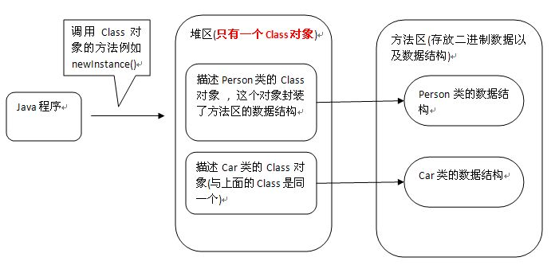

# 一、java执行引擎工作原理：方法调用
## 1.进行方法调用
Java语言的原子指令是字节码，java方法是对字节码的封装。
（1）invokestatic:调用静态方法
（2）invokespecial:调用实例构造器<init>方法、私有方法和父类方法（super(),super.method()）
（3）invokevirtual:调用非私有实例方法，虚方法表中存放着各个方法的实际入口地址。如果某个方法在子类中没有被重写，那子类的虚方法表里面的地址入口和父类相同签名的方法的地址入口是一致的，都指向父类的实现入口。如果子类中重写了这个方法，子类方法表中的地址将会替换为向子类实现版本的入口地址
（4）invokeinterface:调用接口方法，会在运行时期再确定一个实现此接口的对象
## 2.函数指针
指向函数的指针包含了函数的地址，可以通过它来调用函数，函数指针与指针函数的最大区别是函数指针的函数名是一个指针
## 3.执行逻辑运算
物理机器在调用函数时的一系列操作（1）参数入栈，（2）代码指针（3）调用函数的栈基地址入栈（4）为被调用方分配方法栈空间
有参数传递的调用机制
（1）保存调用者栈基地址，当前ip寄存器入栈
（2）调用函数时，在x86平台上，参数从右到左依次入栈
（3）一个方法所分配的栈空间大小，取决于该方法内部的局部变量空间、为被调用者所传递的入参大小
（4）被调用者在接收入参时，从8（%ebp）处开始，往上获取每一个入参参数，之所以从8开始，是因为还有ebp栈基地址寄存器和eip这个ip寄存器
（5）被调用者将返回结果保存在eax寄存器中，调用者从该寄存器中获取返回值
指针函数声明的是一个函数，与一般的函数声明并无多大区别，唯一有区别的就是指针函数的返回类型是一个指针，而一般的函数声明所返回的则是普通变量类型
函数指针声明的是一个指针，返回的是一个函数的首地址。
# 二、java数据结构
## 1.java数据结构
数据结构是计算机存储，组织数据的方式。数据结构是指相互之间存在一种或多种特定关系的数据元素的集合。在jvm加载java类的时候，就将类的类元信息（其实就是打包好的数据结构）保存到内存中，这样在运行期直接读取目标内存中的数据便能获取到相应的信息。
## 2.大端与小端
java采用的是大端序
（1）小端就是低位字节排放在内存的低地址端，高位字节排放在内存的高地址端
（2）大端就是高位字节排放在内存的低地址端，低位字节排放在内存的高地址端
（3）网络字节序，TCP/IP协议中使用的字节序通常称为网络字节序，TCP/IP各层协议将字节序定义为大端
# 三、java字节码实战

# 四、常量池解析
## 1.java字节码常量池的内存分配链路
（1）在堆区分配内存空间，通过object_space()->allocate(word_size)实现（2）初始化对象，通过在collectedHeap.inline.hpp中调用init_obj()进行对象初始化，所谓对象初始化，其实仅仅是清零（3）初始化oop，collectedHeap.inline.hpp中调用post_allocation_install_obj_kclass()完成oop初始化并赋值。JVM内部通过oop-class来描述一个java类。一个java类的实例数据会被存放在堆中，而为了支持运行期反射、虚函数分发等高级操作，java类实例指针oop会保存一个指针，用于指向java类的类描述对象，类描述对象中保存一个java类中所包含的全部成员变量和全部方法信息。
## 2.oop-kclass模型
OOP 指的是 Ordinary Object Pointer （普通对象指针），它用来表示对象的实例信息，看起来像个指针实际上是藏在指针里的对象。而 Klass 则包含元数据和方法信息，用来描述Java类。Klass是在class文件在加载过程中创建的，OOP则是在Java程序运行过程中new对象时创建的。（1）oop用来表示对象的实例信息，包含instanceOopDesc也叫对象头，其中mark word主要存储对象运行时记录信息，如hashcode，GC分代年龄，锁状态标志，线程ID，时间戳等，元数据指针，指向方法区的instanceKlass实例，还有实例数据。（2）klass 用来表示对象元数据信息，有两个功能：实现语言层面的java类，实现java对象的分发功能。一般jvm在加载class文件时，会在方法区创建instanceKlass，表示其元数据，包括常量池、字段、方法等。

# 五、类变量解析
Jvm解析类变量的逻辑：（1）获取java类中的变量数量（2）读取变量的访问标识（3）读取变量名称索引（4）读取变量类型索引（5）读取变量属性（6）判断变量类型（7）统计各类型数量。
java类中在堆内存中的内存空间，主要由java类非静态字段占据。Hotspot解析java类非静态字段和分配堆内存空间的主要逻辑为：（1）解析常量池，统计java类中非静态字段的总数量，按照5大类型（oops/longs/doubles/ints/shorts/chars/bytes）分别统计（2）计算java类字段的起始偏移量，起始偏移位置从父类继承的字段域的末尾开始（3）按照分配策略，计算5大类型中的每一个类型的起始偏移量。（4）以5大类型的起始量为基准，计算每一个大类型下各个具体字段的偏移量（5）计算java类在堆内存中的内存空间。
当java程序中使用new关键字创建java类的实例对象时，HotSpot便会从instanceKclass中读取java类所需要的堆内存大小并分配对应的内存空间。
# 六、java栈帧
jvm为每个新创建的线程都分配一个堆栈。堆栈以帧为单位保存线程的状态。jvm对堆栈只进行两种操作：以帧为单位的压栈和出栈操作。每一个栈帧都包括了局部变量表，操作数栈，动态连接，方法返回地址和一些额外的附加信息。
## 1.局部变量表创建的机制
局部变量表是一组变量值存储空间，用于存放方法参数和方法内部定义的局部变量。在Java程序编译为Class文件时，就在方法表的Code属性的max_locals数据项中确定了该方法需要分配的最大局部变量表的容量。在方法执行时，虚拟机是使用局部变量表完成参数变量列表的传递过程，如果是实例方法，那么局部变量表中的0位索引的Slot默认是用于传递方法所属对象实 例的引用，在方法中可以通过关键字“this”来访问这个隐含的参数。 
## 2.jvm栈帧的创建过程
由于java方法的入参和java方法内部的局部变量共同组成了局部变量表，局部变量表作为一个整体，自然不能被分隔，不能在中间插入一个return address，因此在对局部变量进行压栈时，必然要先把return address拿掉，待局部变量全部压栈完成之后，再将return address恢复到栈顶（1）恢复return address（2）创建新的栈帧，清晰的标出自己的栈底（3）将最后一个入参压栈（4）计算java方法的第一个字节码位置（5）将methodOop压栈（6）将ConstantPoolCache压栈（7）将局部变量压栈（8）将第一条字节码指令压栈（9）将操作数栈栈底地址压栈
## 3.slot大小与复用
虚拟机通过索引定位的方式使用局部变量表，索引值的范围是从 0 开始至局部变量表最大的 Slot 数量。如果访问的是 32 位数据类型的变量，索引 n 就代表了使用第 n 个 Slot，如果是 64 位数据类型的变量，则说明会同时使用 n 和 n+1 两个 Slot。
局部变量表的Slot是可以重用的，方法体中定义的变量作用域并不一定覆盖整个方法，如果某个值已经超出作用域时，那么这个变量对应的Slot可以交给其他变量使用。
## 4.操作数栈复用与深度
每一个操作数栈都会拥有一个明确的栈深度用于存储数值，一个32bit的数值可以用一个单位的栈深度来存储，而2个单位的栈深度则可以保存一个64bit的数值，当然操作数栈所需的容量大小在编译期就可以被完全确定下来，并保存在方法的Code属性中。指令复用可以减少内存空间的使用。
# 七、类方法解析
## 1.java方法签名解析
主要由3部分组成（1）方法标识：public、private、static、final、synchronized、native等（2）方法的名称（3）方法的描述，描述方法的返回值类型和入参信息。
## 2.java方法的code属性解析
主要包含属性总长度、最大栈深度、局部变量表数量、字节码指令。
## 3.LVT与LVTT
LocalVariableTable属性用于描述java方法栈帧中局部变量表中的变量与java源代码定义的变量之间的关系。LocalVariableTypeTable把记录的字段描述符的descriptor_index替换成字段特征签名。
## 4.method创建
methodOop包含java方法的一切信息，例如方法名、返回值类型、入参、字节码指令、栈深、局部变量表、行号表。HotSpot通过methodOop将javaclass字节码文件中的方法信息存储到了内存中，并且这片内存区域是结构化的，使得可以在jvm运行期间方便的访问java方法的各种属性信息。
## 5.<clinit>()方法与<init>（）方法
Java类中存在用static修饰的静态类型字段，或者存在使用static标记的代码块时，编译器会自动生成<clint>方法，而当java类定义了构造函数或者其非static类成员变来那个被赋予了初始值时，编译器会自动生成<init>方法。
## 6.使用HSDB查看运行时的字节码指令
## 7.vtable的概念与机制
Vtable表中保存当前类的每一个方法的指针，jvm会遍历vtable中的每一个指针成员，并根据指针读取到对应的method对象，判断invokevirtual指令所调用的方法名称和签名与vtable表中指针所指向的方法和签名是否一致，如果方法和签名完全一致，则算是找到了invokevirtual所实际调用的目标方法，jvm定位到目标方法的第一条字节码指令并开始执行。
# 八、执行引擎
## 1.JVM的取指与译码机制
Jvm为java字节码指令生成对应的汇编指令，实现字节码指令跳转（取指），jvm需要取出字节码指令后，需要将其翻译成不同的逻辑，然后才能去执行。
## 2.栈顶缓存原理
栈顶缓存的数据通过寄存器来暂存，降低对内存的读写次数。
## 3.栈帧重叠技术
使得两个相邻的栈帧出现一部分重叠，让前一个栈帧的操作数栈与后一个栈帧的局部变量表区域部分重叠在一起，这样在进行方法调用时就能共用这部分堆栈空间，并且减少额外的参数复制。 
# 九、类生命周期
## 1.类的生命周期

Java源程序(.java 文件)在经过Java编译器编译之后就被转换成Java字节代码(.class 文件)，java类的生命周期就是指一个class文件从加载到卸载的全过程。一个java类的完整的生命周期会经历加载、连接、初始化、使用、和卸载五个阶段，当然也有在加载或者连接之后没有被初始化就直接被使用的情况
## 2.类加载的内部实现

## 3.类的初始化
类的生命周期执行完加载和连接之后就开始了类的初始化，java虚拟机执行类的初始化语句，为类的静态变量赋值。在程序中，类的初始化有两种途径（1）在变量的声明处赋值（2）在静态代码块处赋值。
## 4.类加载器的本质
Java 中的类加载器是加载Java类文件（*.class）的一个类。类加载器负责从文件系统、网络或任何其 它资源中加载类文件。Java中使用的默认类加载器有以下三种：Bootstrap , Extension以及System or Application class loader。每个类加载器都有一个预定义的位置，它们在那里加载类文件，（1）Bootstrap ClassLoader - JRE/lib/rt.jar（2）Extension ClassLoader - JRE/lib/ext 或者任何指向java.ext.dirs的路径（3）Application ClassLoader - CLASSPATH环境变量、-classpath or -cp 命令行选项，JAR内部清单文件的类路径属性
原创文章转载请标明出处
更多文章请查看 
[http://www.canfeng.xyz](http://www.canfeng.xyz)