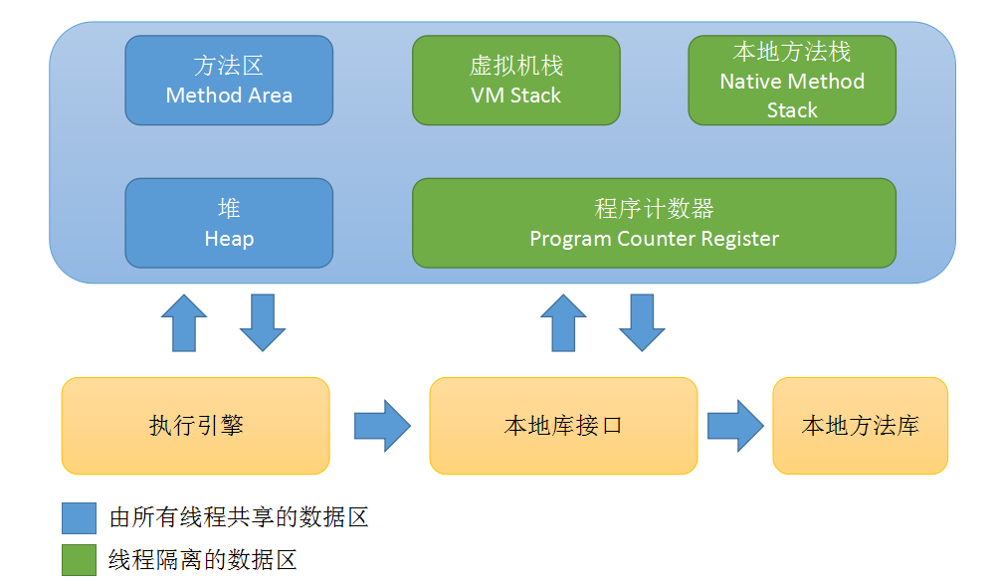
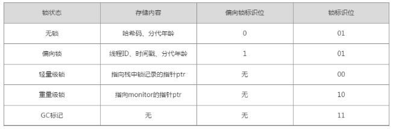
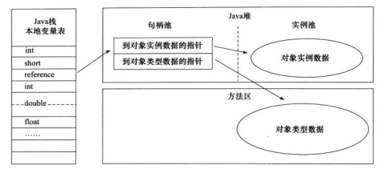
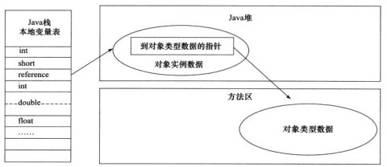
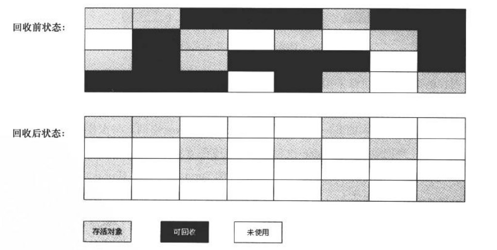
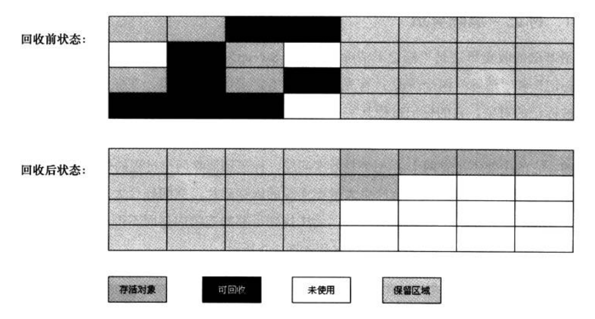
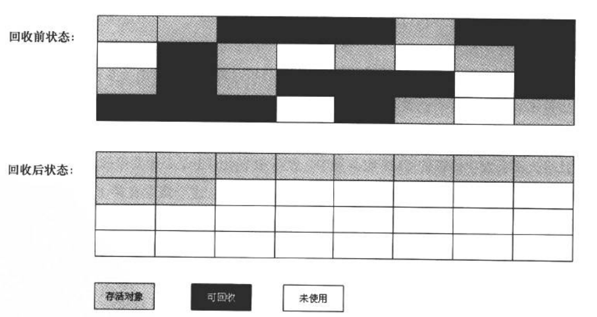
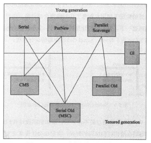

# 一、初识JVM
## 1.运行时数据区域

（1）程序计数器
程序计数器是一块较小的内存空间，字节码解释器工作时就是通过改变这个计数器的值来选取下一条需要执行的字节码指令（条件分支，循环、异常抛出等基础功能都需要这个计数器）它可以看作是当前线程所执行的字节码的行号指示器。
（2）java虚拟机栈
它描述的是java方法执行的内存模型，即每个方法在执行的同时都会创建一个栈帧用于存储局部变量表（存放了编译器可知的各种基本数据类型、对象引用、returnAddress类型）、操作数栈、动态链接、方法出口等信息。每个方法从调用到执行完成就对应了它的栈帧在虚拟机栈中入栈到出栈的过程。局部变量表所需的内存空间在编译期间完成分配，因此在运行期间不会改变局部变量表的大小，在进入一个方法时，栈帧中分配的局部变量表空间的大小是完全确定的。
如果线程请求的栈深度大于虚拟机所允许的深度会抛出StackOverflowError异常；但虚拟机栈是可以允许动态扩展的，如果在扩展时无法申请到足够的内存，就会抛出OutOfMemoryError异常。
（3）本地方法栈
    它的作用和虚拟机栈发挥的作用相似，本地方法栈执行的Native方法虚拟机栈执行java方法，不过本地方法栈对于实现的语言方式和数据结构没有要求，而且它在使用过程中也会抛出StackOverflowError，OutOfMemoryError异常。
（4）java堆
Java堆在虚拟机启动时创建，是被所有线程共享的一块内存区域，主要用于存放对象实例。现在的GC基本上采用分代收集算法：新生代、老年代。它可能会划分出多个线程私有的分配缓冲区，方便内存回收和分配内存。
Java堆可以处于物理上不连续的内存空间中，只要逻辑上连续即可，当设置的堆大小或者可扩展的内存不足以完成实例分配，将会抛出OutOfMemoryError。
（5）方法区
    是各个线程共享的内存区域，用于储存已经被虚拟机加载的类信息、常量、静态变量、即时编译器编译后的代码等数据。它不需要连续的内存，可以选择固定大小的和可以扩展的内存空间，这个区域的内存回收目标主要是针对常量池的回收和类型的卸载，当方法区无法满足内存内存需求时，会抛出OutOfMemoryError。
（6）运行时常量池
    它是方法区的一部分，用于存放编译期生成的各种字面量和符号引用，java语言并不要求常量一定只有在编译期才能产生，运行期间也可能将新的常量放入池中，如String类的intern()方法。
（7）直接内存
    JDK1.4中引入了NIO，引入了基于通道与缓冲区的I/O方式，它可以使用Native函数库直接分配堆外内存，然后通过一个存储在java堆中的DirectByteBuffer对象作为这块内存的引用进行操作，这样可以在某些场合显著提高性能，因为避免了java堆和Native堆中来回复制数据。
### 2.内存溢出异常
Java内部对象创建流程为（1）new对象指令（2）检查指令常量池是否能在常量池中定位到一个类符号的引用（3）检查这个符号代表的类是否已被加载、解析和初始化过（4）为新对象分配内存（指针碰撞和空闲列表）。对象在内存中分为三个区域：对象头、实例数据、对齐填充

虚拟机主流的对象访问方式使用句柄和直接指针两种（1）使用句柄方式时java堆中会划分出一块内存来作为句柄池，reference中存储的就是对象的句柄地址，句柄中包含了对象实例数据和类型数据的具体地址信息（2）使用字节指针访问的话，reference中存储的直接就是对象地址。

（1）java堆溢出
Java堆用于存储对象实例，不断的创建对象，避免垃圾回收机制清除这些对象（GC Roots到对象之间有可达的路径），然后对象数量达到最大堆的容量限制后就会产生内存溢出。如果是内存泄漏，可通过工具查看泄露对象GC Roots的引用链，于是就能找到泄漏对象是通过怎样的路径与GC Roots相关联并导致垃圾收集器无法自动回收他们，通过引用路径和类型信息定位出泄露代码位置。
如果一切正常，可以调整堆参数设置，或者调节一些对象的生命周期。
（2）虚拟机栈和本地方法栈溢出
栈容量只由Xss参数设定，栈中存在两种溢出异常现象：A.如果线程请求深度大于栈深度大于虚拟机允许的深度，抛出StackOverflowError；B.如果虚拟机在扩展内存时申请足够的内存空间，抛出OutOfMemoryError。
如果建立过多线程导致的内存溢出，在不能减少线程数时，只能通过减少最大堆和栈容量来换取更多线程。
（3）方法区和运行时常量池溢出
    一个类要被垃圾收集器回收掉，判定条件是比较苛刻的，在经常动态生成大量Class的应用中，需要特别注意类的回收状况。
（4）本机直接内存溢出
DirectMemory容量可以通过-XX:MaxDirectMemorySize指定，如果不指定则和java堆大小一致。使用DirectByteBuffer分配内存也会抛出内存溢出异常，但它抛出异常时并没有真正香操作系统申请分配内存，而是通过计算得知内存无法分配，于是手动抛出异常，真正申请分配内存的方法是unsafe.allocateMemory()。

## 二、垃圾收集与内存分配
### 1.判断对象是否已经死亡
（1）引用计数算法：给对象添加一个引用计数器，每当有一个地方引用时，计数器就+1；当引用失效时，计数器就-1，任何时刻计数器为0就表示该对象没有被引用。
（2）可达性算法：以GC Roots的对象作为起点，从这些节点开始向下搜索，搜索所走过的路径称为引用链，当一个对象到GC Roots没有任何引用链相连时，则此对象是不可用的。GC Roots对象包括：虚拟机栈中引用的对象、方法区中的类静态属性引用对象和常量引用对象、本地方法栈中JNI引用的对象。当对象没有与GC Roots相连接的引用链时，它会被第一次标记，且进行筛选。对象还可以通过finalize()方法拯救自己，恢复引用链。
（3）四种引用类型：强引用、软引用、弱引用、虚引用，强引用存在时垃圾回收便不会回收，软引用会在将要内存溢出时回收，弱引用只能存活到下一次垃圾回收之前，虚引用
（4）无用的类一般为：该类的实例都被回收，java堆中不存在该类的任何实例；加载该类的ClassLoader已经被回收；该类对应的java.lang.Class对象没有被任何地方引用，无法通过反射访问类方法。
### 2.垃圾回收算法
（1）标记清除算法：该算法的标记和清除过程效率不高，且标记清除之后会产生不连续的内存碎片，导致后续无法分配较大的对象。

（2）复制算法：将内存划分为相等的两块，通过复制的方式处理空间碎片

（3）标记整理算法：将所有存活的对象往一端移动，然后清理掉端边界以外的内存。

（4）分代收集算法：新生代中总有大批对象死亡，可以选用复制算法；老年代存活率高，采用标记清理或标记整理方法。
### 3.垃圾收集器

（1）Serial收集器在使用时会存在停顿
（2）ParNew收集器是Serial的多线程版本
（3）Parallel Scavenge收集器是一个新生代收集器，也是复制算法收集器，通过设置MaxGCPauseMills参数（最大停顿时间）和GCTimeRatio参数（吞吐量）给虚拟机设立一个优化目标。
（4）Serial Old收集器用于老年代，使用标记-整理算法
（5）Parallel Old是Parallel Scavenge的老年代版本使用多线程和标记整理算法
（6）CMS收集器是一种获取最短时间回收停顿时间为目标的收集器，使用的是标记清除算法，整个过程为：初始标记、并发标记、重新标记、并发标记。总体上说，内存回收过程是与用户线程一起并发执行的。它具有三个明显的缺陷：对CPU资源敏感、无法处理浮动垃圾、垃圾收集结束会存在大量内存碎片。
（7）G1收集器具有如下优点：并行与并发；分代收集；空间整合；可预测的停顿。G1收集器的运作流程：初始标记，并发标记，最终标记，筛选回收。
### 4内存分配策略
对象会优先分配在eden中，大对象会直接进入到老年代中。对象如果出生在Eden中，经过一次GC还存活，且能被Surivor容纳，年龄设为1，每经过一次GC，年龄就+1，达到预设年龄和进入老年代。不过虚拟机也不会一定要求年龄达到预设值才能进入老年代，如果Survivor空间中相同年龄的对象总大小超过Survivor的一半，大于等于该年龄的对象也可以进入老年代。
### 5.虚拟机小工具
（1）虚拟机进程状况工具：jps（jvm Process Status），可以列出正在运行的虚拟机进程
（2）虚拟机统计信息监视工具：jstat（jvm statistics Monitoring Tool），用于监视虚拟机各种运行状态信息的命令行工具，它可以显示本地或者远程虚拟机进程中的类装载、内存、垃圾手机、JIT编译运行数据
（3）java配置信息工具：jinfo(configuration Info for java)，用于实时查看和调整虚拟机各项参数，包含一些默认参数的设置。
（4）java内存映像工具：jmap(Memory Map for java)，用于生成堆转储快照
（5）虚拟机堆转储快照分析工具：jhat（jvm Heap Analysis Tool），分析jmap生成的快照，生成的dump文件分析结果可以在浏览器中查看
（6）java堆栈跟踪工具：jstack（Stack Trace for java），用于生成虚拟机当前时刻的线程快照，主要为了定位线程长时间出现停顿的原因
（7）java监视与管理控制台：JConsole（java Monitoring and Management Console）是一种基于JMX的可视化监视、管理工具。
（8）多合一故障处理工具：VisualVM（All-in-one java Troubleshooting Tool），功能最完善的运行监视和故障处理程序，可以做到：显示虚拟机进程以及进程的配置、环境信息；监视应用程序的CPU、GC、堆、方法区以及线程的信息；dump以及分析堆转储快照；方法级别的程序运行性能分析，找出被调用最多运行时间最长的方法等；离线程序快照分析。

原创文章转载请标明出处
更多文章请查看 
[http://www.canfeng.xyz](http://www.canfeng.xyz)