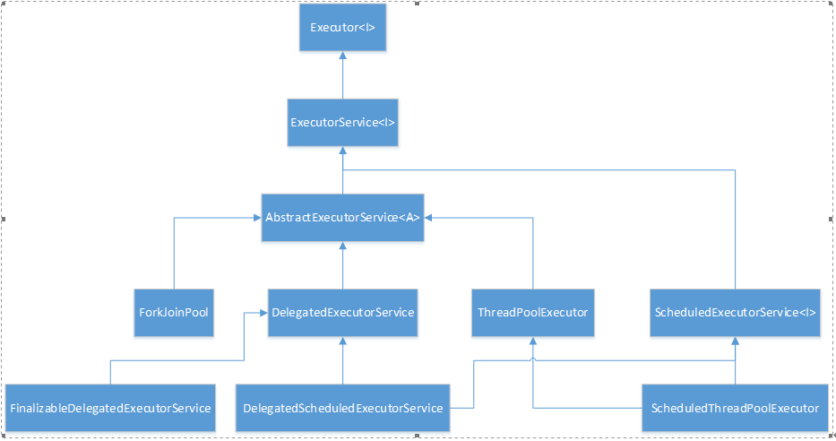

# 引言

在不断的学习中提升自己，收获成就感。
`积累知识是给未来的自己最好的礼物。`
# 1.Executor简介
在Executor接口介绍中定义了它的身份：一个用于执行被提交的任务的对象。这个接口提供了一种降低任务耦合的技术，包括了任务怎么运行，调度等。接口内部就声明了一个方法void execute(Runnable command);该方法只接受实现了Runnable接口的任务对象。
线程创建可以通过Executors类中的静态方法创建，只需要在接口中传入需要配置的参数即可。Executors它的内部提供了一些线程池的方法，算是一个线程池工厂吧。
# 2. ThreadPoolExecutor
普通线程池执行器，执行每个被提交的任务，一般通过Executors中的工厂方法进行配置。它有效解决了两种问题：（1）提升了线程执行大批量异步任务的表现，因为它降低了线程管理的耗费，不需要手动去创建线程和管理线程的生命周期。（2）还提供了一种在任务执行期间的资源（包括线程和消耗）跳转和管理手段。它还能提供一些统计能力，如已经完成的线程数目。
## 2.1重要的属性
（1）AtomicInteger
原子性的整型封装对象，可以用它安全的获取到当前线程数。它里面保持的整型由两部分组成，高三位是运行状态，低29位是线程数量
（2）CAPACITY
容量总值是1左移29位减1，就是29个1，约500百万个线程数。
（3）runState
运行状态有5种，占据了整型的高三位，RUNNING(-1<<29),SHUTDOWN（0<<29）,STOP(1<<29),TIDYING(2<<29),TERMINATED(3<<29)。运行状态是RUNNING->SHUTDOWN（执行方法shutdown()||finalize()）-> STOP（执行方法shutdownNow()）-> TIDYING（池和队列都空了）-> TERMINATED（执行方法terminated()，钩子方法完成）。awaitTermination()方法的会在线程状态到达TERMINATED时产生返回值。
（3）workerCount
当前运行的线程计数值，通过CAS对线程统计值进行加减操作
（4）workQueue
存储待执行的任务
## 2.2构造函数
``` java
public ThreadPoolExecutor(int corePoolSize,     //线程池中线程需要保持的个数，甚至是当他们处于空闲状态。

                              intmaximumPoolSize,  //最大允许的线程个数

                              longkeepAliveTime,    //当线程池中线程数超过了corePoolSize，闲置线程会等待结束的时间。

                              TimeUnit unit,    // keepAliveTime的时间单位

                             BlockingQueue workQueue, //用来存放由execute方法提交的任务

                              ThreadFactorythreadFactory,   //用来创建新的线程

                              RejectedExecutionHandlerhandler)   //当队列满的时候，任务提交阻塞的拒绝处理器
```
## 2.3 任务执行方法
提交一个实现了Runnable接口的任务，然后由线程池内部去执行，至于是新建线程还是选择哪个已有的线程去执行让线程池自行决定。
``` java
public void execute(Runnable command) {
       if (command == null)
           throw new NullPointerException();
       int c = ctl.get();
//当运行的线程数量少于corePoolSize，尝试新建一个线程（worker）去执行任务。
       if (workerCountOf(c) < corePoolSize) {
           if (addWorker(command, true))
                return;
    //如果添加线程失败，重新获取运行状态和线程计数值
          c = ctl.get();
       }
     //如果线程池的状态是isRunning，且阻塞队列中还能添加
       if (isRunning(c) && workQueue.offer(command)) {
    //再次获取计数和运行状态
           int recheck = ctl.get();
   //如果状态不是isRunning，且能够从阻塞队列中移除
           if (! isRunning(recheck) && remove(command))
   //那么拒绝这个新任务
                reject(command);
   //如果没有任务在运行，就新增加一个worker，这个worker中不能再放入task了，因为上面已经放入到queue中了。
           else if (workerCountOf(recheck) == 0)
                addWorker(null, false);
       }
   //如果增加worker失败，那么拒绝新任务。
       else if (!addWorker(command, false))
           reject(command);
}
```
## 2.4addWorker
增加worker，传入是否在core中增加的布尔值和任务。
``` java
private boolean addWorker(RunnablefirstTask, boolean core) {
       retry:
       for (;;) {
           int c = ctl.get();
           int rs = runStateOf(c);
           // Check if queue empty only if necessary.
     //这个逻辑写的也太混乱了，理解出来后就是：rs>SHUTDOWN，
     //或rs>=SHUTDOWN且firsttask不是空，或rs>=SHUTDOWN且workQueue是空的。
     //因为RUNNING是一个负数，所以运行状态的值是小于SHUTDOWN状态的。
           if (rs >= SHUTDOWN &&
                ! (rs == SHUTDOWN &&
                   firstTask == null &&
                   ! workQueue.isEmpty()))
                return false;
           for (;;) {
               //获取线程个数统计值
                int wc = workerCountOf(c);
               //当core是true时（即想在添加常驻线程），线程计数不能超过corePoolSize，否则不能超过maximumPoolSize。
                if (wc >= CAPACITY ||
                    wc >= (core ?corePoolSize : maximumPoolSize))
                    return false;
                //线程统计值+1，意味着worker还未新增就先增加一个计数值。
                if(compareAndIncrementWorkerCount(c))
                    break retry;
                //如果统计值增加失败，重新获取原子integer。
                c = ctl.get();  // Re-read ctl
                //运行状态改变了的话，回到最初的循环点。
                if (runStateOf(c) != rs)
                    continue retry;
                // else CAS failed due toworkerCount change; retry inner loop
           }
       }
       boolean workerStarted = false;
       boolean workerAdded = false;
       Worker w = null;
       try {
           w = new Worker(firstTask);
           final Thread t = w.thread;
           if (t != null) {
            //获取线程池的主锁，给它锁上，添加线程是一个原子操作，只能被当前线程操作。
                final ReentrantLock mainLock =this.mainLock;
                mainLock.lock();
                try {
                    // Recheck while holdinglock.
                    // Back out onThreadFactory failure or if
                    // shut down before lockacquired.
                    int rs =runStateOf(ctl.get());
                    if (rs < SHUTDOWN ||
                        (rs == SHUTDOWN&& firstTask == null)) {
              //如果线程还没使用就处于运行状态，直接报错，不知道什么情况下会这样
                        if (t.isAlive()) //precheck that t is startable
                            throw newIllegalThreadStateException();
                  //如果前面都正常，就在工作者队列中增加一个新的工作者。
                        workers.add(w);
                        int s = workers.size();
                   //当前池中的线程最大个数
                        if (s >largestPoolSize)
                            largestPoolSize =s;
                        workerAdded = true;
                    }
                } finally {
                    mainLock.unlock();
                }
                if (workerAdded) {
                    t.start();
                    workerStarted = true;
                }
           }
       } finally {
           //如果worker起不来就移除这个worker，并减去计数值。
           if (! workerStarted)
                addWorkerFailed(w);
       }
       //就是说明了增加成功标志是，成功启动。
       return workerStarted;
}
```
# 3. ForkJoinPool
它是将任务拆分成更小的任务，然后通过并行运算多个小任务再合并小任务的结果的形式加速总体任务的计算效率。从这里可以发现两个特征：小任务的结果，拆分合并，说明了两个问题，它执行的任务是可以拆分的，是有结果的，而不是void。感觉这个东西和现在的大数据基本思想是一致的：分布式任务执行。
## 3.1重要的属性
（1）WorkQueue工作者队列，内部用数组存放各个待执行的Task。
（2）ForkJoinWorkerThread工作线程，继承自Thread，因此它才是真正用来执行任务的最小单位。
（3）ForkJoinTask工作任务，继承自Future，Future是有返回值的异步实现方式，跟Runnable不同。它是用来定义实际任务的。
## 3.2构造函数
``` java
      public ForkJoinPool(int parallelism, //并行数，默认为可以获取到的处理器个数
                       ForkJoinWorkerThreadFactory factory, //用于创建新线程的工厂
                       UncaughtExceptionHandler handler,   //处理任务执行过程中不可回收的异常
                        boolean asyncMode) {   //true对应的FIFO模式，false对应的是LIFO模式
       this(checkParallelism(parallelism),
            checkFactory(factory),
            handler,
            asyncMode ? FIFO_QUEUE : LIFO_QUEUE,
            "ForkJoinPool-" +nextPoolId() + "-worker-");
       checkPermission();
    }
```
## 3.3 任务执行方法
外部通过调用execute方法传入Task执行，实际上内部都是使用externalPush去执行了Task中需要执行的任务。
``` java
public voidexecute(Runnable task) {  //传入的是Runnable的实现类
        if (task == null)
            throw new NullPointerException();
        ForkJoinTask job;
        if (task instanceofForkJoinTask) // avoid re-wrap
            job = (ForkJoinTask) task;
        else
            job = newForkJoinTask.RunnableExecuteAction(task);   //在这里需要进行包装一下，包装成ForkJoinTask类型。
        externalPush(job);
    }

  final void externalPush(ForkJoinTasktask) {
        WorkQueue[] ws; WorkQueue q; int m;
        int r = ThreadLocalRandom.getProbe();
        int rs = runState;
        if ((ws = workQueues) != null&& (m = (ws.length - 1)) >= 0 &&
            (q = ws[m & r & SQMASK]) !=null && r != 0 && rs > 0 &&
            U.compareAndSwapInt(q, QLOCK, 0,1)) {
            ForkJoinTask[] a; int am,n, s;
            if ((a = q.array) != null&&
                (am = a.length - 1) > (n = (s = q.top)- q.base)) {
                int j = ((am & s) <
                U.putOrderedObject(a, j, task);
                U.putOrderedInt(q, QTOP, s +1);
                U.putIntVolatile(q, QLOCK, 0);
               if (n <= 1)
                    signalWork(ws, q);
                return;
            }
            U.compareAndSwapInt(q, QLOCK, 1,0);
        }
        externalSubmit(task);
    }
```
## 3.4 举例
``` java
public class Test {

   public static void main(String[] args) throws InterruptedException,ExecutionException {
       int[] arr = new int[100];
       Random random = new Random();
       int total = 0;
       for (int i = 0, len = arr.length; i < len; i++) {
           int temp = random.nextInt(20);
           total += (arr[i] = temp);
       }
       System.out.println("初始化数组总和：" + total);
       SumTask task = new SumTask(arr, 0, arr.length);
       //设置并行数目
       ExecutorService pool = Executors.newWorkStealingPool(2);
       //提交分解的SumTask 任务，以及result类型
       Future future = pool.submit(task);
       System.out.println(future.get());
        pool.shutdown();
    }

   static class SumTask implements Callable {
       private static final int THRESHOLD = 20;
       private int array[];
       private int start;
       private int end;
       public SumTask(int[] array, int start, int end) {
           this.array = array;
           this.start = start;
           this.end = end;
       }

       @Override
       public Integer call() throws Exception {
           int sum = 0;
           if (end - start < THRESHOLD) {
                for (int i = start; i < end;i++) {
                    sum = sum + array[i];
                }
                return sum;
           } else { //当end -start > threshold , 将大任务拆分成小任务
                int middle = (start + end) / 2;
                SumTask left = newSumTask(array, start, middle);
                SumTask right = newSumTask(array, middle, end);
                int x = left.call();
                int y = right.call();
                return x + y;
           }
       }
    }
}
```
# 4. ScheduledThreadPoolExecutor
在ThreadPoolExecutor前面加上了Scheduled的修饰（实际上它就是继承了ThreadPoolExecutor），从字面上理解，它是ThreadPoolExecutor升级版，能按照规划的方式执行给定的任务。如可以给任务设置延时，设置运行周期，时间间隔等。

## 4.1构造函数
``` java
    //使用父类的构造函数，传入的queue为DelayedWorkQueue，时间单位纳秒，池的最大值整型最大值。
        public ScheduledThreadPoolExecutor(intcorePoolSize,
                                      ThreadFactory threadFactory,
                                      RejectedExecutionHandler handler) {
       super(corePoolSize, Integer.MAX_VALUE, 0, NANOSECONDS,
              new DelayedWorkQueue(),threadFactory, handler);
}
```
## 4.2 ScheduledFutureTask
它是ScheduledThreadPoolExecutor中的私有内部类，使用period来记录多久后重复执行；用time来记录他执行前需要等待的时间，也就是延时时间。
``` java
//内部的run方法
  public void run() {
            boolean periodic =isPeriodic();   //如果传入的周期时间是0，就返回false
            if(!canRunInCurrentRunState(periodic))
                cancel(false);
            else if (!periodic)
               ScheduledFutureTask.super.run();  //如果不是周期性的，调用父类的run方法，直接执行任务
            else if(ScheduledFutureTask.super.runAndReset()) {
                setNextRunTime();  //如果是周期型的，设置下次运行的时间
               reExecutePeriodic(outerTask);  //放入队列中，等时间到了就执行。
            }
        }
```
## 4.3 任务执行方法
execute(submit)方法在这里都是调用的schedule方法，然后ScheduledThreadPoolExecutor又新增了两个重要的方法：scheduleAtFixedRate，scheduleWithFixedDelay，这个两个方法支持了线程执行的周期和延时控制，方法内对command进行了包装，然后有调用了delayedExecute方法
``` java
//传入包装好的Task
    private voiddelayedExecute(RunnableScheduledFuture task) {
        if (isShutdown())
            reject(task);   //如果线程池的状态是已经shutdown的，那么拒绝该任务
        else {
            super.getQueue().add(task);
            if (isShutdown() &&
               !canRunInCurrentRunState(task.isPeriodic()) &&
                remove(task))
                task.cancel(false);       
            else
                ensurePrestart();    //调用addwork方法，增加worker,与ThreadPoolExecutor相同。
        }
    }
```
原创文章转载请标明出处
更多文章请查看 
[http://www.canfeng.xyz](http://www.canfeng.xyz)