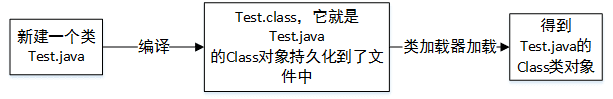

# 前言
Class类是一个看起来熟悉又看起来陌生的类，平时常常用到它，但却从来没有创建过它的实例对象，因为它的构造函数是私有的，只有虚拟机才能够创建它的对象，但是它绝对是一个核心类，以至于要学好java就必须要精通它，希望我的理解可以对你有所帮助。


# Class类是什么
（1）它是一个类，存在于java.lang包中，它的构造函数是私有的，由JVM（类加载器）创建Class对象，我们可以通过getClass()方法获取到Class对象。
``` java
    /*
     * 私有构造函数，使得只有jvm可以创建该类的对象，这个私有构造函数还可以防止通过默认构造函数创建类对象
     */
    private Class(ClassLoader loader) {
        // 初始化final变量ClassLoader
        classLoader = loader;
    }
```
（2）Class对象，通过它我们可以拿到创建的类的属性，方法等。


# Class类的作用
（1）获取类中属性的类型
（2）获取类中属性的名称
（3）获取类的方法
（4）获取类的基类等等
（5）综合上述可以利用它完成反射
# Class的主要方法
## 1.forName方法
输入需要加载的类的全路径名，得到类的Class对象
## 2.newInstance方法
``` java
  public T newInstance()
        throws InstantiationException, IllegalAccessException
    {
        if (System.getSecurityManager() != null) {
            checkMemberAccess(Member.PUBLIC, Reflection.getCallerClass(), false);
        }
        // NOTE: 下面的编码可能不是严格符合当前的java内存模型
        // 寻找构造器
        if (cachedConstructor == null) {
            if (this == Class.class) {
                throw new IllegalAccessException(
                    "Can not call newInstance() on the Class for java.lang.Class"
                );
            }
            try {
                Class<?>[] empty = {};
               //获取无参构造器，如果没有就抛出异常，说明这个方法只适用于有无参构造函数的类
                final Constructor<T> c = getConstructor0(empty, Member.DECLARED);
                // 设置构造器允许访问
                java.security.AccessController.doPrivileged(
                    new java.security.PrivilegedAction<Void>() {
                        public Void run() {
                                c.setAccessible(true);
                                return null;
                            }
                        });
                cachedConstructor = c;
            } catch (NoSuchMethodException e) {
                throw (InstantiationException)
                    new InstantiationException(getName()).initCause(e);
            }
        }
        Constructor<T> tmpConstructor = cachedConstructor;
        // 安全检查
        int modifiers = tmpConstructor.getModifiers();
        if (!Reflection.quickCheckMemberAccess(this, modifiers)) {
            Class<?> caller = Reflection.getCallerClass();
            if (newInstanceCallerCache != caller) {
                Reflection.ensureMemberAccess(caller, this, null, modifiers);
                newInstanceCallerCache = caller;
            }
        }
        // 执行无参构造函数创建实例对象
        try {
            return tmpConstructor.newInstance((Object[])null);
        } catch (InvocationTargetException e) {
            Unsafe.getUnsafe().throwException(e.getTargetException());
            // Not reached
            return null;
        }
    }
```
## 3.isInstance（native方法）
用于判断入参是否为当前Class对象（子类）的实现类
``` java
public class TestInfo {

    static {
        System.out.println("我是谁");
    }

    public TestInfo(){
        System.out.println("我是构造函数");
    }
    public String test="测试属性";
    public static void main(String[] args) {
        TestClass info=new TestClass();
        //返回结果是true因为info是子类的对象
System.out.println(TestInfo.class.isInstance(info));
    }
    public static class TestClass extends TestInfo{

    }
}
```
## 4.getName、getTypeName、getCanonicalName、getSimpleName
``` java
    public static void main(String[] args) {
        System.out.println(TestClass.class.getTypeName());
        System.out.println(TestClass.class.getCanonicalName());
        System.out.println(TestClass.class.getSimpleName());
        System.out.println(TestClass.class.getName());
        System.out.println("-------------------------------------------------------");
        System.out.println(TestClass[].class.getTypeName());
        System.out.println(TestClass[].class.getCanonicalName());
        System.out.println(TestClass[].class.getSimpleName());
        System.out.println(TestClass[].class.getName());
    }

    public static abstract class TestClass<T extends TestInfo, String> extends TestInfo implements Aware, Comparable<Integer> {
        public abstract void test();
    }

输出结果
com.hikvision.test.abc.TestInfo$TestClass
com.hikvision.test.abc.TestInfo.TestClass
TestClass
com.hikvision.test.abc.TestInfo$TestClass
-------------------------------------------------------
com.hikvision.test.abc.TestInfo$TestClass[]
com.hikvision.test.abc.TestInfo.TestClass[]
TestClass[]
[Lcom.hikvision.test.abc.TestInfo$TestClass;
```
## 5.getClassLoader
获取当前类的类加载器
## 6.getTypeParameters
获取泛型类中的泛型参数数组。
## 7.getSuperclass和getGenericSuperclass
都是获取父类信息，但是后者会带上泛型参数
## 8.getInterfaces和getGenericInterfaces
获取当前Class对象实现的接口数组，但是后者会带上接口的泛型参数，如
``` java
  public static void main(String[] args) {
        System.out.println(TestClass.class.getInterfaces()[1]);
    }

    public static abstract class TestClass<T extends TestInfo,String> extends TestInfo implements Aware,BeanFactory {
        public abstract void test();
    }
```
输出结果
interface org.springframework.beans.factory.BeanFactory
java.lang.Comparable<java.lang.Integer>

## 9.isAssignableFrom(native方法)
这个方法比较反人类，括号里的入参表示的是当前Class对象的父类或者是同一个对象时才成立。
``` java
//这样返回的是false
System.out.println(TestClass.class.isAssignableFrom(TestInfo.class));
```
## 10.isInterface(native方法)
判断是否为接口
## 11.isArray(native方法)
是否为数组
## 12.isPrimitive（native方法）
用于判断这个Class对象是否为基本类型，如int，byte，char等
## 13.isAnnotation
判断这个Class对象是否为注解
## 14.getComponentType
如果当前Class对象是数组，获取数组中的元素类型
## 15.getModifiers
获取属性或方法前面的修饰词对应的枚举值
## 16.getDeclaringClass
获取方法或属性的归属类，或者获取当前Class对象继承于哪个类
## 17.getSimpleName
Class对象的类名
## 18.getClasses、getDeclaredClasses
（1）获取Class对象中public修饰的内部类
（2）获取Class对象中的内部类，继承成员是不包含在内的
## 19.getFields、getField、getDeclaredFields
（1）获取public修饰的属性域
（2）根据输入的属性名查找对应的属性域
（3）获取Class对象中的属性域
## 20.getMethods、getMethod、getDeclaredMethods
（1）获取public修饰的方法
（2）根据输入的方法名和入参类型，查找对应的方法
（3）获取Class对象中的方法
## 21.getConstructors、getConstructor、getDeclaredConstructors
（1）获取public修饰的构造函数
（2）根据输入的方法名和入参类型，查找对应的构造函数
（3）获取Class对象中的构造函数
# 最后
类里面还有很多名称类似的方法，可以根据上述说明推测出他们的功能，还有一些不常用的方法，这里就不列举了