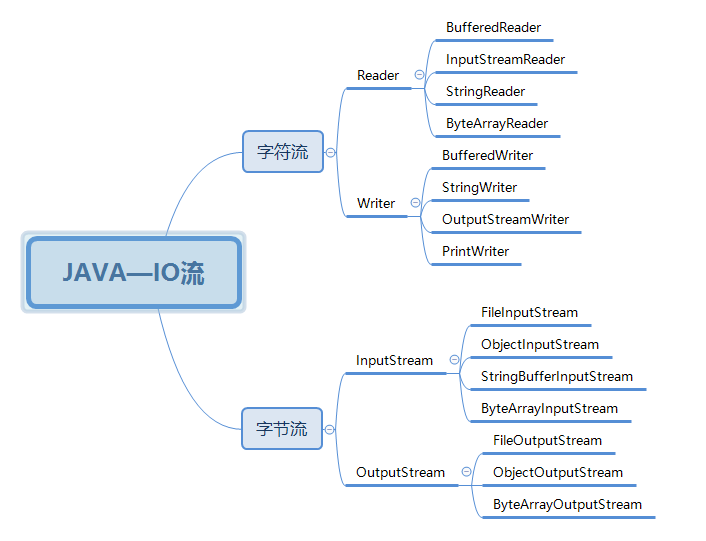

# 前言
``流``：把数据比作水流，水流的源头为水源，数据的源头为数据源。试想一下，数据从源头而来，我们在这头获取到数据流，然后对数据流进行处理。而处理方式就如同：我们取用河里的水，然后烧开，然后饮用一样。在这里我们需要学习JAVA是怎么实现的这个处理过程。
java的基础中必学的一课就是IO流，同时要学好java也必须要掌握好IO流的相关基础。
# 一、流的划分

# 二、Reader相关源码
## 2.1 Reader抽象类
（1）通过构造函数设置锁对象
（2）read读取流
抽象方法需要子类去实现
``` java
/**
	 * 将当前的流读到cbuf中
	 * @param cbuf 目标数组
	 * @param off 拷贝偏移量，从cbuf 的off之后开始存数据
	 * @param len 拷贝长度
	 * @return
	 * @throws IOException
	 */
	public abstract int read(char cbuf[], int off, int len) throws IOException;
```
（3）skip 方法
``` java
// 输入想要跳过的单位，返回实际跳过的单位
  public long skip(long n) throws IOException {
        if (n < 0L)
           //很明显不能跳过负数个单位
            throw new IllegalArgumentException("skip value is negative");
         // 最大只能跳过8912个单位
        int nn = (int) Math.min(n, maxSkipBufferSize);
        // 这里有个同步锁，说明当前线程在操作这个流的时候是不允许别的线程读取的
        synchronized (lock) {
            if ((skipBuffer == null) || (skipBuffer.length < nn))
                skipBuffer = new char[nn];
            long r = n;
            while (r > 0) {
                int nc = read(skipBuffer, 0, (int)Math.min(r, nn));
                if (nc == -1)
                    // 如果已经后面已经没有数据，则退出循环，这个r就意味着剩余没有跳过的单位数量
                    break;
                r -= nc;
            }
          //需要跳过的数量-还没有跳过的数量=真实跳过的数量
            return n - r;
        }
    }
```
（4）ready方法
是否流已经就绪
（5）markSupported方法
是否允许标记
（6）mark方法
标记当前在流中的位置
（7）reset方法
重置标记
（8）close方法
关闭流
## 2.2 BufferedReader
可以看到在类内没有一个方法是直接加锁的，但是在方法内部基本上都加上了锁，因为在适当的地方加锁可以提高代码效率。
``` java
public int read(char cbuf[], int off, int len) throws IOException {
		// 对当前对象加锁
		synchronized (lock) {
			// 流是否还打开着
			ensureOpen();
			// 移除数组越界的情况
			if ((off < 0) || (off > cbuf.length) || (len < 0) ||
					((off + len) > cbuf.length) || ((off + len) < 0)) {
				throw new IndexOutOfBoundsException();
			} else if (len == 0) {
				return 0;
			}
			// 尝试读取数据
			int n = read1(cbuf, off, len);
			if (n <= 0) return n;
			// 循环读取数据
			while ((n < len) && in.ready()) {
				int n1 = read1(cbuf, off + n, len - n);
				if (n1 <= 0) break;
				n += n1;
			}
			return n;
		}
	}
```
## 2.3 InputStreamReader
这个类差不多就是StreamDecoder包装了一层，而StreamDecoder又是依赖的InputStream
## 2.4 StringReader
字符串的流读取类
``` java
public int read(char cbuf[], int off, int len) throws IOException {
        synchronized (lock) {
            ensureOpen();
            if ((off < 0) || (off > cbuf.length) || (len < 0) ||
                ((off + len) > cbuf.length) || ((off + len) < 0)) {
                throw new IndexOutOfBoundsException();
            } else if (len == 0) {
                return 0;
            }
            if (next >= length)
                return -1;
            int n = Math.min(length - next, len);
          // 以char为单位进行读取
            str.getChars(next, next + n, cbuf, off);
            next += n;
            return n;
        }
    }
```
# 三、Writer相关源码
## 3.1 Writer抽象类
（1）通过构造函数设置锁对象
（2）write方法
方法内部通过构造函数传入的对象加锁实现同步
``` java
    /**
     * 将流写入到cbuf中.
     * @param  cbuf 需要写入的源数组
     * @param  off 从cbuf第一个位置开始的偏移量
     * @param  len 需要从cbuf拷贝的长度
     */
    public abstract void write(char cbuf[], int off, int len) throws IOException;
```
（3）append方法
在当前流后面附加上写入的内容，该方法是基于write方法的
（4）flush方法
将流刷入到目的地中，但是有个要注意的点，如果写入需要底层操作系统，如写入到硬盘的文件中，flush并不能一定保证写入到文件中。
（5）close方法
关闭流
## 3.2 BufferedWriter
``` java
 public void write(char cbuf[], int off, int len) throws IOException {
        synchronized (lock) {
            // 写流之前需要判断是否流还打开着
            ensureOpen();
            // 判断是否数组越界
            if ((off < 0) || (off > cbuf.length) || (len < 0) ||
                ((off + len) > cbuf.length) || ((off + len) < 0)) {
                throw new IndexOutOfBoundsException();
            } else if (len == 0) {
                return;
            }

            if (len >= nChars) {
               // 当超过一开始定义的charbuffer长度，那么直接刷到底层操作系统中，避免内存中数据量太大
               // 这个flushBuffer调用的是流对象的write方法，所以实际还需要看一下实现对象是怎么操作的
                flushBuffer();
                out.write(cbuf, off, len);
                return;
            }

            int b = off, t = off + len;
            while (b < t) {
                int d = min(nChars - nextChar, t - b);
                System.arraycopy(cbuf, b, cb, nextChar, d);
                b += d;
                nextChar += d;
                if (nextChar >= nChars)
                    flushBuffer();
            }
        }
    }
```
## 3.3 StringWriter
它调用的StringBuffer，write方法都是依赖了StringBuffer的append
## 3.4 OutputStreamWriter
它大部分是依赖StreamEncoder实现的方法功能，就像是包装了StreamEncoder一下，StreamEncoder也是继承了Writer，功能实现需要依赖OutputStream。
## 3.5 PrintWriter
（1）支持选择写入的编码格式
``` java
 public PrintWriter(String fileName, String csn)
        throws FileNotFoundException, UnsupportedEncodingException
    {
        this(toCharset(csn), new File(fileName));
    }
```
（2）这个类中，每次抛出异常都会记录，方便后面查询是否流处理是出现过异常
``` java
catch (IOException x) {
            trouble = true;
        }
```
# 四、InputStream主要源码
## 4.1 read()单字节读取
``` java
public abstract int read() throws IOException;
```
## 4.2 read(byte b[])多字节读取
将数据读入到byte b[]中
``` java
public int read(byte b[]) throws IOException {
        return read(b, 0, b.length);
    }
```
## 4.3 read(byte b[], int off, int len) 带偏移位置的读取
``` java
// 将数据读入到b[]中，从off偏移开始，读入len个长度的数据
public int read(byte b[], int off, int len) throws IOException {
        if (b == null) {
            throw new NullPointerException();
        } else if (off < 0 || len < 0 || len > b.length - off) {
            throw new IndexOutOfBoundsException();
        } else if (len == 0) {
            return 0;
        }
        // 尝试读取一个字节
        int c = read();
        if (c == -1) {
            return -1;
        }
        b[off] = (byte)c;

        int i = 1;
        try {
            //  循环读取数据，单个字节单个字节的读取，直到长度够
            for (; i < len ; i++) {
                c = read();
                if (c == -1) {
                    break;
                }
                b[off + i] = (byte)c;
            }
        } catch (IOException ee) {
        }
        return i;
    }
```
## 4.4 available数据长度获取
可见默认都是返回的0，需要子类自己去实现长度获取
``` java
public int available() throws IOException {
        return 0;
    }
```
## 4.5 transferTo
将流转移到OutputStream中，返回已经完成转移的长度
## 4.6 FileInputStream
在代码开发中常用的是文件流读取，它的打开流和读取流方法都是依赖native方法实现的，这里就不再深入了，不过它还依赖native实现了available方法，换句话说就是它能够获取到流的长度。
# 五、OutputStream主要源码
## 5.1 write写方法
``` java
// 将数据写入到b[]中，从off位置开始，写入长度为len
 public void write(byte b[], int off, int len) throws IOException {
        if (b == null) {
            throw new NullPointerException();
        } else if ((off < 0) || (off > b.length) || (len < 0) ||
                   ((off + len) > b.length) || ((off + len) < 0)) {
            throw new IndexOutOfBoundsException();
        } else if (len == 0) {
            return;
        }
        for (int i = 0 ; i < len ; i++) {
            write(b[off + i]);
        }
    }
```