# 引言：
在我初学java的时候甚至不知道有HashMap这个东西，所有的数据都是用Array进行存储，最多就使用一下ArrayList，但是当真正的业务下来的时候，根本不切实际，也就是在这个时候我接触到了Map这个工具，键值对存储的形式非常方便，但在处理实时数据时，Map的性能略有不足，当时就采用了Queue，关于性能方面也都是从百度上查询得到的。但是随着代码量的增长，以及对于程序内在了解的需求，促使我整体的了解一下Java的集合框架，而不是停留在应用上。因为Set（TreeSet和HashSet）中有部分内容涉及到了Map（TreeMap和HashMap），所以整体上从Map开始剖析。
# 一、Map
## 1 常用map继承关系
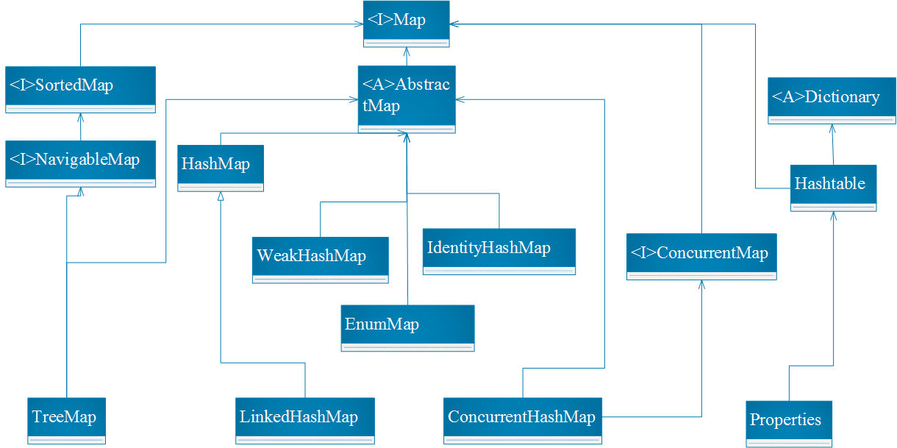

## 2 Map说明
Map从整体上说就是key和value的对应关系列表，即从key到value的映射关系。key和value的对应关系是一对一单向的对应关系，即key是唯一的，对应一个value，而value是非唯一的，可以对应多个key，换句话说，不同的key可能取出相同的value。
## 3 常用的Map
### 3.1 TreeMap
#### 3.1.1详细继承关系
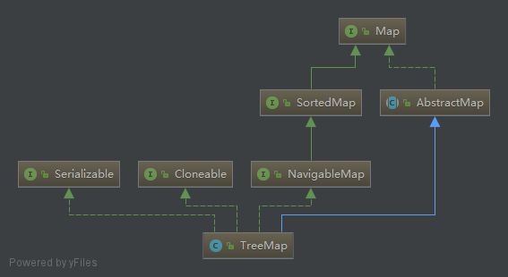

#### 3.1.2说明
TreeMap是一个有序的key-value集合，它是通过红黑树实现的，从图上可以看出它实现了NavigableMap接口意味着它是支持一系列导航方法，而NavigableMap接口又继承了SortedMap接口，所以是一个有序的map。如果不设置Comparator，那么它将使用自然顺序排序。TreeMap不是线程安全的。
#### 3.1.2.1 基于红黑树
TreeMap的本质是R-B Tree（红黑树），它包含了几个重要的成员变量，root、size、comparator，root是红黑树的根节点，它是Entry类型的，Entry是红黑树的节点，包含了红黑树的6个基本组成部分，key，value，left，right，parent，color。就是说它不仅保存在左枝的位置还保存了右枝的位置以及父节点的位置。
红黑树的五条特性：
（1）每个节点或者是黑色，或者是红色。
（2）根节点是黑色。
（3）每个叶子节点是黑色。
（4）如果一个节点是红色的，则它的子节点必须是黑色的。
（5）从一个节点到该节点的子孙节点的所有路径上包含相同数目的黑节点。
#### 3.1.2.2 基本操作
左旋：rotateLeft，
右旋：rotateRight，
插入修正：fixAfterInsertion，
删除修正：fixAfterDeletion，
插入操作：put
插入之后需要调用方法fixAfterInsertion，然后进行左旋右旋进行修正使得插入之后还是红黑树。
删除操作：remove
插入之后需要调用方法fixAfterDeletion，然后进行左旋右旋进行修正使得插入之后还是红黑树。
查询操作：get
遍历红黑树entry节点，并返回value。
查询操作：ceilingKey
返回最接近且大于输入的key值的key。
#### 3.1.2.3 注意
由于TreeMap是有entry构成的，通过entry遍历的效率比利用key遍历的效率来的高，因为获取到key需要先获取到entry。
### 3.2 LinkedHashMap
#### 3.2.1详细继承关系
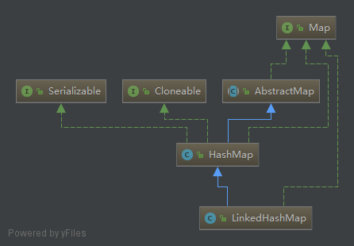

#### 3.2.2说明
LinkedHashMap跟HashMap一样都是线程不安全的，LinkedHashMap是一个有序（插入顺序）的HashMap，他的entry有before和after两个属性，用于生成双向链表，区别于hashMap，因为HashMap只有一个next指向下一个节点，当key值重复时，后插入的value会覆盖先前的value。
#### 3.2.3 重点
LinkedHashMap中重写了HashMap中的newNode方法，如下：
``` java
Node newNode(int hash, K key, V value, Node e) {
        LinkedHashMap.Entry p = newLinkedHashMap.Entry(hash, key, value, e);
        linkNodeLast(p);
        return p;
    }
  private voidlinkNodeLast(LinkedHashMap.Entry p) {
        LinkedHashMap.Entry last =tail;
        tail = p;
        if (last == null)
            head = p;
        else {
            p.before = last;
            last.after = p;
        }
    }
```
因此在每次put新数据时，都会添加节点间的前后关系，所以linkedHashMap可以保持链表顺序，所以它还可被用于保存需要维持插入顺序的缓存数据，保证数据的顺序。
### 3.3 WeakHashMap
#### 3.3.1详细继承关系
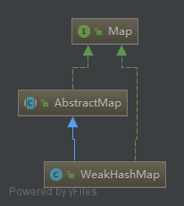

#### 3.3.2说明
WeakHashMap跟HashMap一样也是一个散列表，同样是以键值对的形式存在的。
#### 3.3.3 特点
（1）查看源码，可以发现它是由Entry节点组成的，每一个entry都有一个指向下一个entry的指针，因此它是一个单向链表，Entry继承了WeakReference，以及它的构造器参数表中存在ReferenceQueue。
（2）它的键都是弱键，即当键的引用不存在时，垃圾回收器会对这个键进行回收，同样的它对应的值也因为失去了键的映射也同样会被回收。
（3）当弱键因为失去引用被GC回收时，这个弱键会被添加到ReferenceQueue的队列中，基本上WeakHashMap中的每个操作都包含了expungeStaleEntries操作，该操作会将ReferenceQueue队列中存在的key从Entry链表中删除，即同步GC回收WeakHashMap中的键值对。
（4）当put操作输入的key为null时，内部会产生操作maskNull，将null标记为NULL_KEY以区分真正的null。
### 3.4 EnumMap
#### 3.4.1详细继承关系
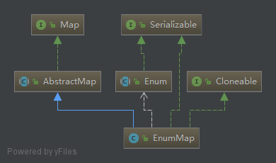

#### 3.4.2说明
EnumMap就如同它的名字一样，是一种枚举类型的map，它的值存储在Object数组中，它的键是枚举类型的。
#### 3.4.3 特点
（1）它的key有两个重要的属性，name和ordinal，name表示的是枚举常量的名称，ordinal表示的是它在枚举类中的序号，也是键对应的值在Obejct数组中的下标。
（2）在新建EnumMap对象时，value数组就已经确定的大小，也初始化了size，但是通过枚举类的类型新建的EnumMap定义了value数组的大小，却没有定义size的。另外每次进行put操作的时候，value数组的长度是不变的，若是新增则会增加size。
``` java
  public EnumMap(Class keyType) {
        this.keyType = keyType;
        keyUniverse = getKeyUniverse(keyType);
        vals = new Object[keyUniverse.length];
    }
publicEnumMap(EnumMap m) {
        keyType = m.keyType;
        keyUniverse = m.keyUniverse;
        vals = m.vals.clone();
        size = m.size;
    }
publicEnumMap(Map m) {
        if (m instanceof EnumMap) {
            EnumMap em =(EnumMap) m;
            keyType = em.keyType;
            keyUniverse = em.keyUniverse;
            vals = em.vals.clone();
            size = em.size;
        } else {
            if (m.isEmpty())
                throw newIllegalArgumentException("Specified map is empty");
            keyType =m.keySet().iterator().next().getDeclaringClass();
            keyUniverse =getKeyUniverse(keyType);
            vals = newObject[keyUniverse.length];
            putAll(m);
        }
    }
```
### 3.5 IdentityHashMap

#### 3.5.1详细继承关系
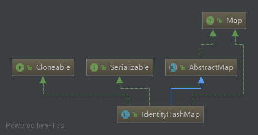

#### 3.5.2说明
IdentityHashMap的默认创建大小是64，由数组存放键值，键值相邻的存放在数组中。
#### 3.5.3 特点
（1）它的偶数位存放的都是键，奇数位存放的都是值
``` java
public V put(K key, V value) {
       final Object k = maskNull(key);
       retryAfterResize: for (;;) {
           final Object[] tab = table;
           final int len = tab.length;
           int i = hash(k, len);
           for (Object item; (item = tab[i]) != null;
                 i = nextKeyIndex(i, len)) {
                if (item == k){
                   @SuppressWarnings("unchecked")
                        V oldValue = (V) tab[i+ 1];
                    tab[i + 1] = value;
                    return oldValue;
                }
           }
           final int s = size + 1;
           // Use optimized form of 3 * s.
           // Next capacity is len, 2 * current capacity.
           if (s + (s << 1) > len &&resize(len))
                continue retryAfterResize;
           modCount++;
           tab[i] = k;
            tab[i + 1] = value;
           size = s;
           return null;
       }
}
```
（2）它的键是允许重复的，因为它的重复判断采用的只有==，也就是说引用相等才算相等，当两个键值相等却是不同对象时，是可以共存的，这个与其他Map是不同的。
（3）当它的键值对数超过数组长度的3倍时数组需要扩容，然后扩容后再进行值插入。
### 3.6 ConcurrentHashMap
#### 3.6.1详细继承关系
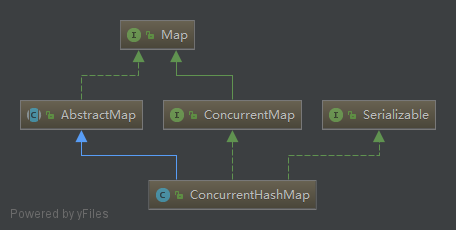

#### 3.6.2说明
ConcurrentHashMap并不是在基础的utils包中，它存在于utils内部的concurrent包中，之前看网上的集合框架笔记中基本上都没有将它包含进去，但是这个Map确实比较实用且应用较多，所以我将它也放进去了，它的优势在于线程安全，若是对于多线程不感兴趣的，完全可以跳过这个Map，但是同样这里不会细讲，因为这个类的源码（包含注释）相当多6000多行，并且这里只做用法讲解，并不深入，后续当我学完多线程之后再对其写一个特别篇。
#### 3.6.3 特点
（1）容量上限2的30次。默认16
（2）线程安全，支持并发
（3）不允许键和值为空
#### 3.6.4 基本方法
（1）get：该方法没有加锁，也就是说这个get方法取到的值是当前状态下的map中的值，若是有其他线程在进行put，则对当前get方法无影响
（2）put：这个方法我认为是它的核心了，在每次进行put的时候会对它的节点加上锁，而且在put时会进行判断节点是否是树节点，如果是树节点则按照树节点的形式进行插入。
（3）size：这个方法理论上是无法获取到精确值的，因为不可能让所有的线程停下来再进行一次统计，所以这个值只是个估计值，当然若是操作线程较少，应该是可以拿到精确值的。
### 3.7 Properties
#### 3.7.1详细继承关系
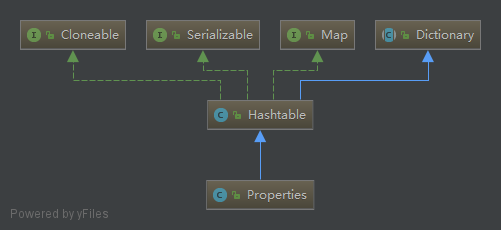

#### 3.7.2说明
既然说到了Properties，那就不得不提它的父类HashTable，笼统的讲hashTable是线程安全的，但是它锁的很鲁莽，直接对put方法加上了同步锁，因此如果有两个线程同时操作put方法，就需要进行等待，HashTable的节点也存在一个next指向下一个节点，整个HashTable是数组形式存在的。因为HashTable已经不推荐使用了，它的优化只是针对了使用老版本的代码，所以这里只将一下它的子类Properties。
#### 3.7.3 特点
（1）主要用于读取Java的配置文件，比如说从系统配置中获取配置参数Properties pps =System.getProperties();
（2）从配置文件中获取配置参数，先将文件转成流，再通过load读取流中的配置。
（3）通过getProperty，获取键值对应的配置
（4）通过setProperty，设置新的配置参数，实际调用的是HashTable的方法，因此是加了同步锁的。
（5）通过store方法保存配置到文件，由于store0内部采用了锁，因此这个方法是线程安全的。
# 二、Collection

## 1 常用类与Collection继承关系
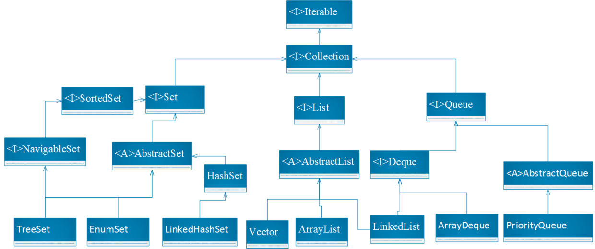

## 2 基础接口
Iterable接口是java 集合框架真正的顶级接口，起初它只有iterator抽象方法，在1.8中又加入了后两个方法，foreach用于遍历，spliterator提供了一个可以并行遍历元素的迭代器，这个接口中还可以看到修饰符default，由它修饰的方法可以拥有方法体，且这个方法不必由子类实现，感觉上像是抽象类，使用它比使用Iterator会方便很多，可以免于实现Iterator里面很多方法。
Collection接口派生除了Set、List、Queue，它定义了许多常用的基础方法去要求子类实现，完成数据操作，其中主要操作为增加元素操作、移除元素操作、为空判断、元素相等判断，还有迭代器，都需要在子类中实现。迭代器的主要功能为判断是否存在下一个元素以及返回下一个元素。
## 3 常用类
### 3.1 TreeSet
#### 3.1.1详细继承关系
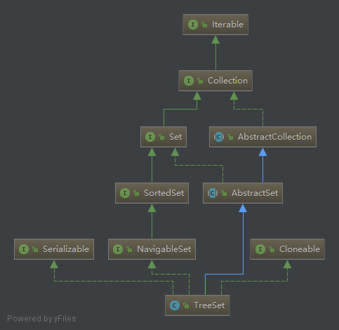

#### 3.1.2说明
在继承关系中可以看到，它继承了NavigableSet接口，在前面的TreeMap中我们看到它继承的是NavigableMap，事实上也是，TreeSet和TreeMap都是有序的。
#### 3.1.3特点
（1）TreeSet并不是线程安全的
（2）TreeSet是通过TreeMap构建的，TreeSet的值对应的就是Map的键，Map的值为一个空的Object对象。
（3）当我看到如下源码的时候，我很疑惑，因为Collection如果不是SortedSet，那么操作父类的addAll将导致新建Set无序，在类中也没有找到可以重置排序的操作，后来我进到最底层AbstractCollection中才发现，这个操作只会提示UnsupportedOperationException。所以TreeSet的构造器中支持的Collection只有SortedSet子类。
``` java
  public boolean addAll(Collection c) {
        // Use linear-time version ifapplicable
        if (m.size()==0 && c.size()> 0 &&
            c instanceof SortedSet &&
            m instanceof TreeMap) {
            SortedSet set =(SortedSet) c;
            TreeMap map =(TreeMap) m;
            Comparator cc = set.comparator();
            Comparator mc =map.comparator();
            if (cc==mc || (cc != null&& cc.equals(mc))) {
                map.addAllForTreeSet(set,PRESENT);
                return true;
            }
        }
        return super.addAll(c);
    }
```
### 3.2 EnumSet
#### 3.2.1详细继承关系
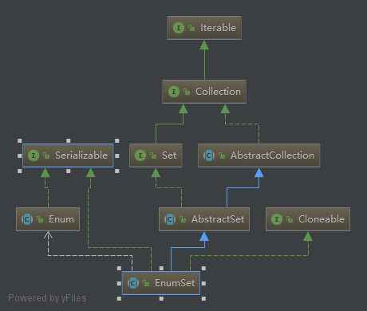

#### 3.2.2说明
EnumSet是一个抽象类，它不能直接创建对象，但它内部有工厂方法，可以创建它的子类，内部也没有很多复杂的操作，但是交并集的操作很实用。
#### 3.2.3 特点
（1）元素存放于Enum数组中。
（2）内部实现了交并集的操作，支持多个同类EnumSet之间求交并集。
### 3.3 LinkedHashSet
#### 3.3.1详细继承关系
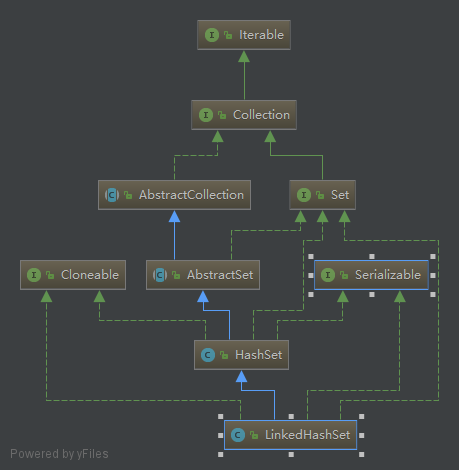

#### 3.3.2说明
HashSet的构造器中都是new的HashMap对象，就是说它是通过HashMap来实现的，每次add一个元素的实际上是将该元素作为map的键，但是值只是一个空的Object，迭代器获取到的set是map的keyset。LinkedHashSet继承了HashSet，HashSet又是通过HashMap实现的，Hashmap是各个Node通过链表的形式单向连接在一起的，所以linkedHashMap实际上也是基于hashMap实现的链表。
### 3.4 Vector
#### 3.4.1详细继承关系


#### 3.4.2说明
Vector 实现了RandmoAccess接口，即提供了随机访问功能。RandmoAccess是java中用来被List实现，为List提供快速访问功能的。在Vector中，我们即可以通过元素的序号快速获取元素对象；这就是快速随机访问。
#### 3.4.3特点
（1）Vector实际上是通过一个数组去保存数据的。当我们构造Vecotr时；若使用默认构造函数，则Vector的默认容量大小是10。
（2）Vector中的元素通过索引访问效率最高
（3）Vector的add操作是将新元素附加到数组原先最后一个元素的后面，set操作可以将元素插入到指定索引处，如果原先存在值，则更新
（4）各种操作元素增删改查的操作都是线程安全的，都已经加了锁，基本上都是同步锁，所以性能上一般
### 3.5 ArrayList
#### 3.5.1详细继承关系
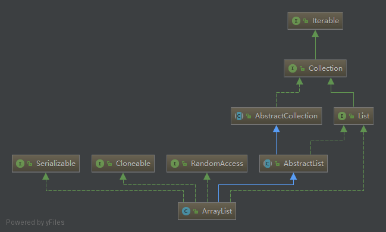

#### 3.5.2说明
ArrayList的数组线性表的特点为：类似数组形式进行存储，因此它的随机访问速度极快，同时它也继承了数组的缺点，比如不适合在线性表中频繁插入和删除操作，因为每次操作都需要移动元素。ArrayList是最常用的list之一，对它的全面了解对于你优化代码将带来很大的帮助。
##### 3.5.2.1 默认容量与最大长度
（1）默认容量为0
（2）最大长度为privatestatic final int MAX_ARRAY_SIZE = Integer.MAX_VALUE - 8;
##### 3.5.2.2 扩容方式
当元素超过现有容器时，扩容为原来的两倍
``` java
private void grow(int minCapacity) {
       // overflow-conscious code
       int oldCapacity = elementData.length;
       int newCapacity = oldCapacity + (oldCapacity >> 1);
        if (newCapacity - minCapacity < 0)
           newCapacity = minCapacity;
       if (newCapacity - MAX_ARRAY_SIZE > 0)
           newCapacity = hugeCapacity(minCapacity);
       // minCapacity is usually close to size, so this is a win:
       elementData = Arrays.copyOf(elementData, newCapacity);
}
```
##### 3.5.2.3 遍历方式
  （1）获取ArrayList的size之后利用for循环进行遍历
  （2）直接利用foreach进行元素遍历
##### 3.5.2.4 unsynchronized
ArrayList不是线程安全的，它和Vector本质上是等效的，如果需要保证线程安全可以使用Vector。
### 3.6 LinkedList
#### 3.6.1详细继承关系
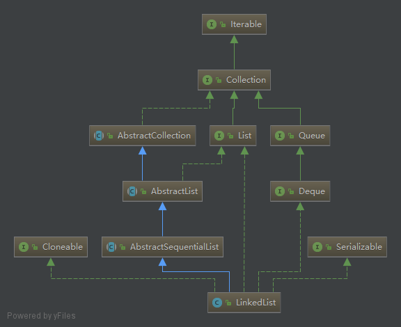

#### 3.6.2说明
LinkedList通过一个一个节点存储数据，单个节点中有元素指向前一个元素，以及有元素指向后一个元素，所以它是一个双向链表，它也支持索引访问
### 3.7 ArrayDeque
#### 3.7.1详细继承关系
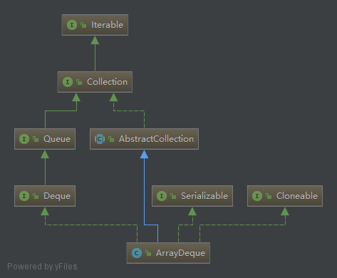

#### 3.7.2说明
它采用的是数组的形式保存数据，支持从头部取数据和从尾部取数据，在效率上明显高于linkedList
#### 3.7.3 特点
（1）采用poll操作，从头部开始提取数据，操作后，头部的标记往后移，原头部元素删除
（2）pop操作在pop操作的基础上增加了异常判断，当返回结果为空就抛出异常
（3）push操作支持从尾部插入数据
### 3.8 PriorityQueue
#### 3.8.1详细继承关系
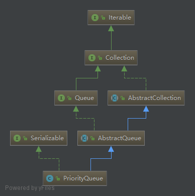

#### 3.8.2说明
从名称上看这是一个优先级队列，它通过默认容量是11，好像没有其他集合是默认大小为11的，这是第一个。
#### 3.8.3特点
（1）内部依靠数组保存数据
（2）队列不允许空元素
（3）利用siftUp和siftDown在队列增加元素和删除元素时，通过比较器判断元素插入的位置，删除时，删除优先级较低的位置的元素
（4）容量扩增的方法如下，就是它的这种扩增方式导致初始化时设置默认容量为11
``` java
   int newCapacity = oldCapacity + ((oldCapacity < 64) ? (oldCapacity + 2) : (oldCapacity >> 1));
```
原创文章转载请标明出处
更多文章请查看 
[http://www.canfeng.xyz](http://www.canfeng.xyz)