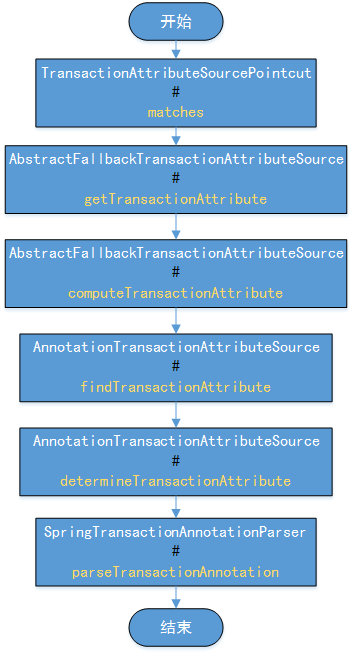
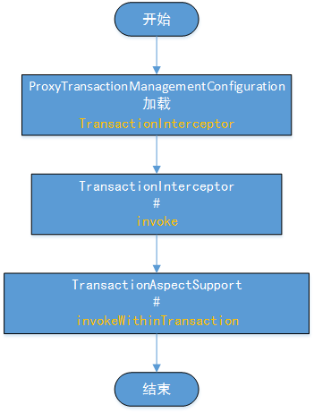

# 一、注解加载
## 1.1 流程
Spring是通过单例模式将@Transactional注解中的内容加载进来的，中间有一些是BeanFactory的工作，我省去了，直接从注解相关的类开始写流程了，流程大致如下图所示：


## 1.2 核心源码
源码部分主要记录一下spring容器怎么把注解加载进来的
### 1.2.1 getTransactionAttribute获取事务属性
``` java
// 判定方法的事务属性
public TransactionAttribute getTransactionAttribute(Method method, @Nullable Class<?> targetClass) {
	if (method.getDeclaringClass() == Object.class) {
		return null;
	}

	// 先从缓存中尝试获取属性信息.
	Object cacheKey = getCacheKey(method, targetClass);
	Object cached = this.attributeCache.get(cacheKey);
	if (cached != null) {
		//如果缓存的是一个无事务对象
		//直接返回空，这里使用==表示比较的对象引用是否相等.
		if (cached == NULL_TRANSACTION_ATTRIBUTE) {
			return null;
		}
		else {
			return (TransactionAttribute) cached;
		}
	}
	else {
		// 当没有缓存是，需要重新计算获取事务属性.
		TransactionAttribute txAttr = computeTransactionAttribute(method, targetClass);
		if (txAttr == null) {
         //如果方法没有事务，直接放入空事务对象.
			this.attributeCache.put(cacheKey, NULL_TRANSACTION_ATTRIBUTE);
		}
		else {
			String methodIdentification = ClassUtils.getQualifiedMethodName(method, targetClass);
			if (txAttr instanceof DefaultTransactionAttribute) {
				((DefaultTransactionAttribute) txAttr).setDescriptor(methodIdentification);
			}
			if (logger.isDebugEnabled()) {
				logger.debug("Adding transactional method '" + methodIdentification + "' with attribute: " + txAttr);
			}
        //将事务对象属性放到缓存中，缓存的key与类的类型和方法相关
			this.attributeCache.put(cacheKey, txAttr);
		}
		return txAttr;
	}
}
```
### 1.2.2 computeTransactionAttribute计算事务属性
这个方法的主要功能是，根据方法和类的类型获取事务信息
``` java
protected TransactionAttribute computeTransactionAttribute(Method method, @Nullable Class<?> targetClass) {
	//如果事务是只适用于public方法，且当前方法的修饰不是public，那么直接返回空.
	if (allowPublicMethodsOnly() && !Modifier.isPublic(method.getModifiers())) {
		return null;
	}

	// The method may be on an interface, but we need attributes from the target class.
	// If the target class is null, the method will be unchanged.
	Method specificMethod = AopUtils.getMostSpecificMethod(method, targetClass);
	//调用findTransactionAttribute方法获取事务属性，但是这个方法比较简单，就不展开记录了，后面直接分解它调用的下一级方法
	// First try is the method in the target class.
	TransactionAttribute txAttr = findTransactionAttribute(specificMethod);
	if (txAttr != null) {
		return txAttr;
	}

	// Second try is the transaction attribute on the target class.
	txAttr = findTransactionAttribute(specificMethod.getDeclaringClass());
	if (txAttr != null && ClassUtils.isUserLevelMethod(method)) {
		return txAttr;
	}

	if (specificMethod != method) {
		// Fallback is to look at the original method.
		txAttr = findTransactionAttribute(method);
		if (txAttr != null) {
			return txAttr;
		}
		// Last fallback is the class of the original method.
		txAttr = findTransactionAttribute(method.getDeclaringClass());
		if (txAttr != null && ClassUtils.isUserLevelMethod(method)) {
			return txAttr;
		}
	}

	return null;
}
```
### 1.2.3 determineTransactionAttribute判定事务属性
这个方法主要是通过逐个调用解析器解析，获取事务属性
``` java
protected TransactionAttribute determineTransactionAttribute(AnnotatedElement ae) {
	for (TransactionAnnotationParser annotationParser : this.annotationParsers) {
		TransactionAttribute attr = annotationParser.parseTransactionAnnotation(ae);
		if (attr != null) {
			return attr;
		}
	}
	return null;
}
```
### 1.2.4 parseTransactionAnnotation解析事务注解
``` java
public TransactionAttribute parseTransactionAnnotation(AnnotatedElement ae) {
	AnnotationAttributes attributes = AnnotatedElementUtils.findMergedAnnotationAttributes(
				ae, Transactional.class, false, false);
	if (attributes != null) {
		return parseTransactionAnnotation(attributes);
	}
	else {
		return null;
	}
}
```
``` java
//解析事务注解中的属性
protected TransactionAttribute parseTransactionAnnotation(AnnotationAttributes attributes) {
	//这个地方事务属性对象是有很多默认值的，它继承自DefaultTransactionDefinition
	RuleBasedTransactionAttribute rbta = new RuleBasedTransactionAttribute();
	// 传播
	Propagation propagation = attributes.getEnum("propagation");
	rbta.setPropagationBehavior(propagation.value());
	// 隔离等级
	Isolation isolation = attributes.getEnum("isolation");
	rbta.setIsolationLevel(isolation.value());
	// 超时时间
	rbta.setTimeout(attributes.getNumber("timeout").intValue());
	// 是否只读
	rbta.setReadOnly(attributes.getBoolean("readOnly"));
	// 事务管理器bean的名称
	rbta.setQualifier(attributes.getString("value"));
	ArrayList<RollbackRuleAttribute> rollBackRules = new ArrayList<>();
	// 回滚相关配置
	Class<?>[] rbf = attributes.getClassArray("rollbackFor");
	for (Class<?> rbRule : rbf) {
		RollbackRuleAttribute rule = new RollbackRuleAttribute(rbRule);
		rollBackRules.add(rule);
	}
	String[] rbfc = attributes.getStringArray("rollbackForClassName");
	for (String rbRule : rbfc) {
		RollbackRuleAttribute rule = new RollbackRuleAttribute(rbRule);
		rollBackRules.add(rule);
	}
	Class<?>[] nrbf = attributes.getClassArray("noRollbackFor");
	for (Class<?> rbRule : nrbf) {
		NoRollbackRuleAttribute rule = new NoRollbackRuleAttribute(rbRule);
		rollBackRules.add(rule);
	}
	String[] nrbfc = attributes.getStringArray("noRollbackForClassName");
	for (String rbRule : nrbfc) {
		NoRollbackRuleAttribute rule = new NoRollbackRuleAttribute(rbRule);
		rollBackRules.add(rule);
	}
	rbta.getRollbackRules().addAll(rollBackRules);
	return rbta;
}
```
好了到这里事务注解中的属性已近被加载到spring容器中了，通过cglib动态代理已经将注解加入到拦截链中了，想知道怎么加入到拦截链中的可以参考我的另一篇文章[spring-AOP注解源码分析](https://www.jianshu.com/p/7d95cefebcce)

# 二、事务实现
经过前面的流程，事务属性已近被加载到spring容器中了，然后就要探索代码在运行过程中事务注解时中的属性是怎么被利用起来的。
拦截器是通过ProxyTransactionManagementConfiguration这个自动配置类加载进来的
``` java
@Bean
@Role(BeanDefinition.ROLE_INFRASTRUCTURE)
public TransactionInterceptor transactionInterceptor() {
	TransactionInterceptor interceptor = new TransactionInterceptor();
	interceptor.setTransactionAttributeSource(transactionAttributeSource());
	if (this.txManager != null) {
		interceptor.setTransactionManager(this.txManager);
	}
	return interceptor;
}
```
## 2.1 动态代理流程


## 2.2 invokeWithinTransaction
``` java
protected Object invokeWithinTransaction(Method method, @Nullable Class<?> targetClass,
			final InvocationCallback invocation) throws Throwable {

	//获取事务属性信息.
	TransactionAttributeSource tas = getTransactionAttributeSource();
	final TransactionAttribute txAttr = (tas != null ? tas.getTransactionAttribute(method, targetClass) : null);
    //获取事务管理器
	final PlatformTransactionManager tm = determineTransactionManager(txAttr);
	// 获取切点定义信息
	final String joinpointIdentification = methodIdentification(method, targetClass, txAttr);

	if (txAttr == null || !(tm instanceof CallbackPreferringPlatformTransactionManager)) {
		//创建事务信息对象
		TransactionInfo txInfo = createTransactionIfNecessary(tm, txAttr, joinpointIdentification);
		Object retVal = null;
		try {
			//这个invocation是个功能函数，其实就是调用真正的那个方法
			retVal = invocation.proceedWithInvocation();
		}
		catch (Throwable ex) {
			// 执行异常抛出的操作
			completeTransactionAfterThrowing(txInfo, ex);
			throw ex;
		}
		finally {
		//保存事务状态信息
			cleanupTransactionInfo(txInfo);
		}
		//执行方法结束后的操作
		commitTransactionAfterReturning(txInfo);
		return retVal;
	}
	//下面的条件分支内的处理操作与上面差不多，就不看了 
	else {
		final ThrowableHolder throwableHolder = new ThrowableHolder();

		// It's a CallbackPreferringPlatformTransactionManager: pass a TransactionCallback in.
		try {
			Object result = ((CallbackPreferringPlatformTransactionManager) tm).execute(txAttr, status -> {
				TransactionInfo txInfo = prepareTransactionInfo(tm, txAttr, joinpointIdentification, status);
				try {
					return invocation.proceedWithInvocation();
				}
				catch (Throwable ex) {
					if (txAttr.rollbackOn(ex)) {
						// A RuntimeException: will lead to a rollback.
						if (ex instanceof RuntimeException) {
							throw (RuntimeException) ex;
						}
						else {
							throw new ThrowableHolderException(ex);
						}
					}
					else {
						// A normal return value: will lead to a commit.
						throwableHolder.throwable = ex;
						return null;
					}
				}
				finally {
					cleanupTransactionInfo(txInfo);
				}
			});

			// Check result state: It might indicate a Throwable to rethrow.
			if (throwableHolder.throwable != null) {
				throw throwableHolder.throwable;
			}
			return result;
		}
		catch (ThrowableHolderException ex) {
			throw ex.getCause();
		}
		catch (TransactionSystemException ex2) {
			if (throwableHolder.throwable != null) {
				logger.error("Application exception overridden by commit exception", throwableHolder.throwable);
				ex2.initApplicationException(throwableHolder.throwable);
			}
			throw ex2;
		}
		catch (Throwable ex2) {
			if (throwableHolder.throwable != null) {
				logger.error("Application exception overridden by commit exception", throwableHolder.throwable);
			}
			throw ex2;
		}
	}
}
```
## 2.3 determineTransactionManager事务管理器选择
``` java
protected PlatformTransactionManager determineTransactionManager(@Nullable TransactionAttribute txAttr) {
	// 直接返回默认的事务管理器
	if (txAttr == null || this.beanFactory == null) {
		return getTransactionManager();
	}

	String qualifier = txAttr.getQualifier();
	if (StringUtils.hasText(qualifier)) {
		//根据注解中的bean名称获取事务管理器
		return determineQualifiedTransactionManager(this.beanFactory, qualifier);
	}
	else if (StringUtils.hasText(this.transactionManagerBeanName)) {
		return determineQualifiedTransactionManager(this.beanFactory, this.transactionManagerBeanName);
	}
	else {
		PlatformTransactionManager defaultTransactionManager = getTransactionManager();
		if (defaultTransactionManager == null) {
			defaultTransactionManager = this.transactionManagerCache.get(DEFAULT_TRANSACTION_MANAGER_KEY);
			if (defaultTransactionManager == null) {
		//获取继承了PlatformTransactionManager类的管理器
				defaultTransactionManager = this.beanFactory.getBean(PlatformTransactionManager.class);
				this.transactionManagerCache.putIfAbsent(
							DEFAULT_TRANSACTION_MANAGER_KEY, defaultTransactionManager);
			}
		}
		return defaultTransactionManager;
	}
}
```
## 2.4 completeTransactionAfterThrowing事务异常处理
``` java
protected void completeTransactionAfterThrowing(@Nullable TransactionInfo txInfo, Throwable ex) {
	if (txInfo != null && txInfo.getTransactionStatus() != null) {
		if (logger.isTraceEnabled()) {
			logger.trace("Completing transaction for [" + txInfo.getJoinpointIdentification() +
						"] after exception: " + ex);
		}
		//如果rollback信息没有设置，默认return (ex instanceof RuntimeException || ex instanceof Error); 
		if (txInfo.transactionAttribute != null && txInfo.transactionAttribute.rollbackOn(ex)) {
			try {
			//调用事务管理器中的回滚方法
				txInfo.getTransactionManager().rollback(txInfo.getTransactionStatus());
			}
			catch (TransactionSystemException ex2) {
				logger.error("Application exception overridden by rollback exception", ex);
				ex2.initApplicationException(ex);
				throw ex2;
			}
			catch (RuntimeException | Error ex2) {
				logger.error("Application exception overridden by rollback exception", ex);
				throw ex2;
			}
		}
		else {
			// 不符合上面的情况，直接提交.
			// 不过在方法里面还判断了TransactionStatus.isRollbackOnly()如果成立，还是会执行回滚的.
			try {
				txInfo.getTransactionManager().commit(txInfo.getTransactionStatus());
			}
			catch (TransactionSystemException ex2) {
				logger.error("Application exception overridden by commit exception", ex);
				ex2.initApplicationException(ex);
				throw ex2;
			}
			catch (RuntimeException | Error ex2) {
				logger.error("Application exception overridden by commit exception", ex);
				throw ex2;
			}
		}
	}
}
```
## 2.5 commitTransactionAfterReturning 事件完成后的操作
``` java
protected void commitTransactionAfterReturning(@Nullable TransactionInfo txInfo) {
	if (txInfo != null && txInfo.getTransactionStatus() != null) {
		if (logger.isTraceEnabled()) {
			logger.trace("Completing transaction for [" + txInfo.getJoinpointIdentification() + "]");
		}
		//事务对应的任务完成之后，执行提交操作
		txInfo.getTransactionManager().commit(txInfo.getTransactionStatus());
	}
}
```
# 三、事务管理器
DataSourceTransactionManager是我最常用的事务管理器，从下面的依赖中引入
``` xml
<dependency>
	<groupId>org.springframework.boot</groupId>
	<artifactId>spring-boot-starter-data-jpa</artifactId>
</dependency>
```
它的回滚操作如下，是通过connection完成的回滚
``` java
protected void doRollback(DefaultTransactionStatus status) {
	DataSourceTransactionObject txObject = (DataSourceTransactionObject) status.getTransaction();
	Connection con = txObject.getConnectionHolder().getConnection();
	if (status.isDebug()) {
		logger.debug("Rolling back JDBC transaction on Connection [" + con + "]");
	}
	try {
		con.rollback();
	}
	catch (SQLException ex) {
		throw new TransactionSystemException("Could not roll back JDBC transaction", ex);
	}
}
```