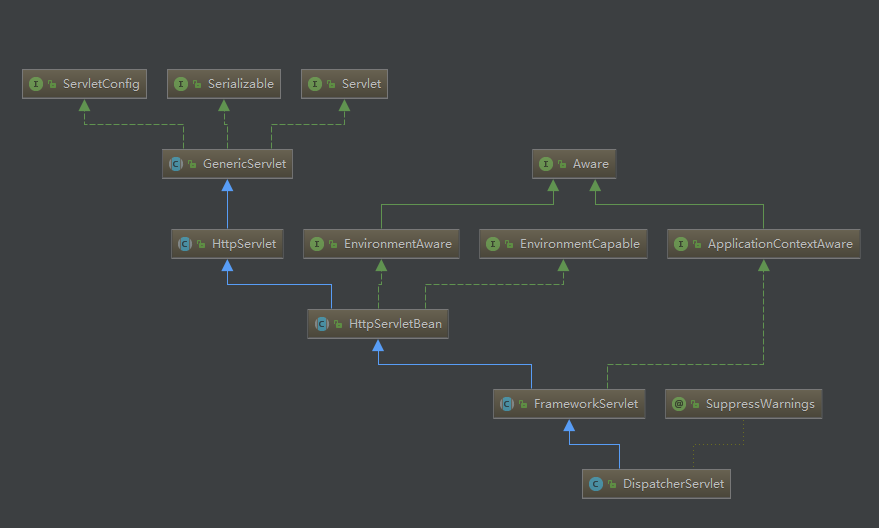
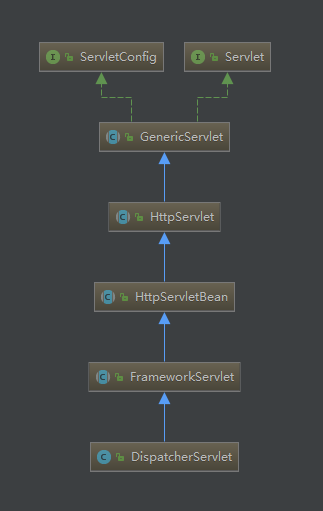
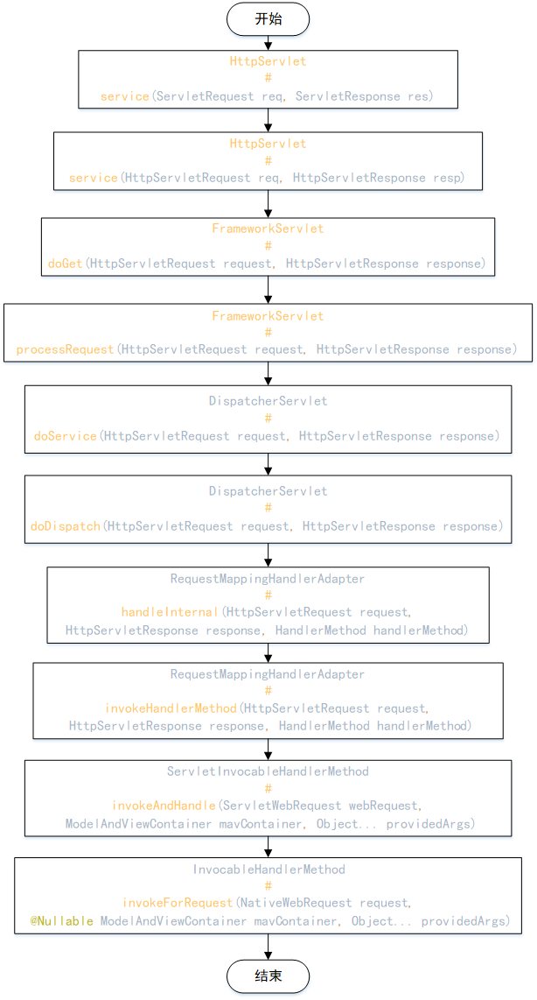

# 前言
现在服务器开发中，非常流行restful形式的接口，最为常见的开源框架有Springmvc，下面我们来简单的剖析一下
# 一、简单的rest接口
一个简单的rest接口一般都包含了Mapping（映射路径），参数等
``` java
 @GetMapping("/videos")
    public BaseResponse<List<SearchInfoVo>> searchVideos(@RequestParam("keyword") String keyword) {
        List<SearchInfoVo> list = searchInfoService.searchVideos(keyword);
        return ListResponse.list(list);
    }
```
# 二、映射建立源码分析
restful接口主要使用的几个注解如下
## 2.1 @RestController
它是@Controller的包装注解
``` java
@Target(ElementType.TYPE)
@Retention(RetentionPolicy.RUNTIME)
@Documented
// 可以看到RestController包含了@Controller和@ResponseBody
@Controller
@ResponseBody
public @interface RestController {
	@AliasFor(annotation = Controller.class)
	String value() default "";

}
```
``` java
@Target({ElementType.TYPE})
@Retention(RetentionPolicy.RUNTIME)
@Documented
// 看到下面这个@Component注解应该就知道@Controller注解到底是什么作用了
// 相当于把这个controller注入到容器中
@Component
public @interface Controller {
	@AliasFor(annotation = Component.class)
	String value() default "";
}
```
## 2.2 @RequestMapping
在RequestMappingHandlerMapping中完成注解属性的解析
``` java
protected RequestMappingInfo createRequestMappingInfo(
			RequestMapping requestMapping, @Nullable RequestCondition<?> customCondition) {
		RequestMappingInfo.Builder builder = RequestMappingInfo
				.paths(resolveEmbeddedValuesInPatterns(requestMapping.path()))
				.methods(requestMapping.method())
				.params(requestMapping.params())
				.headers(requestMapping.headers())
				.consumes(requestMapping.consumes())
				.produces(requestMapping.produces())
				.mappingName(requestMapping.name());
		if (customCondition != null) {
			builder.customCondition(customCondition);
		}
		return builder.options(this.config).build();
	}
```
但是RequestMappingHandlerMapping继承了InitializingBean，spring容器加载之后会调用下afterPropertiesSet方法，这个方法辗转会调用到AbstractHandlerMethodMapping.assertUniqueMethodMapping方法，检验url路径是否唯一，确认唯一才会把刚才得到的Mapping存放到mappingLookup这个链式hashMap中。
``` java
private void assertUniqueMethodMapping(HandlerMethod newHandlerMethod, T mapping) {
			HandlerMethod handlerMethod = this.mappingLookup.get(mapping);
			if (handlerMethod != null && !handlerMethod.equals(newHandlerMethod)) {
				throw new IllegalStateException(
						"Ambiguous mapping. Cannot map '" +	newHandlerMethod.getBean() + "' method \n" +
						newHandlerMethod + "\nto " + mapping + ": There is already '" +
						handlerMethod.getBean() + "' bean method\n" + handlerMethod + " mapped.");
			}
		}
```
## 2.3 @ResponseBody
关于这个注解我们可以在RequestResponseBodyMethodProcessor类中找到痕迹
``` java
public boolean supportsReturnType(MethodParameter returnType) {
		return (AnnotatedElementUtils.hasAnnotation(returnType.getContainingClass(), ResponseBody.class) ||
				returnType.hasMethodAnnotation(ResponseBody.class));
	}
```
这个类的继承结构如下：

这个类实现了接口HandlerMethodReturnValueHandler，也就是说如果supportsReturnType返回的是true，就会调用接口中的另外一个方法实现handleReturnValue，然后顺藤摸瓜，在RequestResponseBodyMethodProcessor的父类中可以看到如下代码，实际上它是通过HttpMessageConverter完成对象的转换。所以我们可以自己实现HttpMessageConverter转换对象类型
``` java
protected <T> void writeWithMessageConverters(@Nullable T value, MethodParameter returnType,
			ServletServerHttpRequest inputMessage, ServletServerHttpResponse outputMessage)
			throws IOException, HttpMediaTypeNotAcceptableException, HttpMessageNotWritableException {
                // 略过部分代码
                // 略过部分代码
                // 略过部分代码
		if (selectedMediaType != null) {
			selectedMediaType = selectedMediaType.removeQualityValue();
                       // 通过HttpMessageConverter完成对象的转换。，所以我们可以自己实现HttpMessageConverter转换对象类型
			for (HttpMessageConverter<?> converter : this.messageConverters) {
				GenericHttpMessageConverter genericConverter = (converter instanceof GenericHttpMessageConverter ?
						(GenericHttpMessageConverter<?>) converter : null);
				if (genericConverter != null ?
						((GenericHttpMessageConverter) converter).canWrite(targetType, valueType, selectedMediaType) :
						converter.canWrite(valueType, selectedMediaType)) {
					body = getAdvice().beforeBodyWrite(body, returnType, selectedMediaType,
							(Class<? extends HttpMessageConverter<?>>) converter.getClass(),
							inputMessage, outputMessage);
					if (body != null) {
						Object theBody = body;
						LogFormatUtils.traceDebug(logger, traceOn ->
								"Writing [" + LogFormatUtils.formatValue(theBody, traceOn) + "]");
						addContentDispositionHeader(inputMessage, outputMessage);
						if (genericConverter != null) {
							genericConverter.write(body, targetType, selectedMediaType, outputMessage);
						}
						else {
							((HttpMessageConverter) converter).write(body, selectedMediaType, outputMessage);
						}
					}
					else {
						if (logger.isDebugEnabled()) {
							logger.debug("Nothing to write: null body");
						}
					}
					return;
				}
			}
		}

		if (body != null) {
			throw new HttpMediaTypeNotAcceptableException(this.allSupportedMediaTypes);
		}
	}
```
## 2.4 @RequestParam
在有请求进来的时候将对应的参数映射到controller方法的形参中，在类RequestParamMethodArgumentResolver中做如下处理
``` java
public void contributeMethodArgument(MethodParameter parameter, @Nullable Object value,
			UriComponentsBuilder builder, Map<String, Object> uriVariables, ConversionService conversionService) {

		Class<?> paramType = parameter.getNestedParameterType();
		if (Map.class.isAssignableFrom(paramType) || MultipartFile.class == paramType || Part.class == paramType) {
			return;
		}
          // 获取到注解中的参数名称
		RequestParam requestParam = parameter.getParameterAnnotation(RequestParam.class);
		String name = (requestParam == null || StringUtils.isEmpty(requestParam.name()) ?
				parameter.getParameterName() : requestParam.name());
		Assert.state(name != null, "Unresolvable parameter name");
              // 将参数名称和参数值，放入到queryParams这个map中，然后在后面调用方法时从queryParams里面取值
		if (value == null) {
			if (requestParam != null &&
					(!requestParam.required() || !requestParam.defaultValue().equals(ValueConstants.DEFAULT_NONE))) {
				return;
			}
			builder.queryParam(name);
		}
		else if (value instanceof Collection) {
			for (Object element : (Collection<?>) value) {
				element = formatUriValue(conversionService, TypeDescriptor.nested(parameter, 1), element);
				builder.queryParam(name, element);
			}
		}
		else {
			builder.queryParam(name, formatUriValue(conversionService, new TypeDescriptor(parameter), value));
		}
	}
```
# 三、请求处理流程
请求处理流程我们从DispatcherServlet开始分析，先看一下它的类结构

上图的类结构看起来有点乱，我们整理一下，是不是清晰很多DispatchServlet继承了抽象的各个Servlet中方法。

再看一下请求从DispatcherServlet开始是怎么处理到我们的Controller中的，请求结果处理的流程忘记画在流程图上，主要使用triggerAfterCompletion方法完成

用简单的文字描述一下流程：请求进来判断请求类型，执行拦截器的前置处理方法，通过代码中建立好的映射关系找到controller中的方法，执行方法，然后执行拦截器中的后置处理方法。
# 四、处理流程源码分析
## 4.1 service方法
请求进来需要先将请求对象和返回对象强转
``` java
public void service(ServletRequest req, ServletResponse res)
        throws ServletException, IOException {

        HttpServletRequest  request;
        HttpServletResponse response;

        try {
          // 请求进来首先强制转换类型
            request = (HttpServletRequest) req;
            response = (HttpServletResponse) res;
        } catch (ClassCastException e) {
            throw new ServletException("non-HTTP request or response");
        }
        service(request, response);
    }
```
然后判断请求类型
``` java
protected void service(HttpServletRequest req, HttpServletResponse resp)
        throws ServletException, IOException {
        //获取请求中携带的方法类型
        String method = req.getMethod();

        if (method.equals(METHOD_GET)) {
            // 这个方法返回的就是-1
            long lastModified = getLastModified(req);
            if (lastModified == -1) {
                // tomcat容器不支持这个功能，直接处理get请求
                doGet(req, resp);
            } else {
                long ifModifiedSince;
                try {
                    ifModifiedSince = req.getDateHeader(HEADER_IFMODSINCE);
                } catch (IllegalArgumentException iae) {
                    // Invalid date header - proceed as if none was set
                    ifModifiedSince = -1;
                }
                if (ifModifiedSince < (lastModified / 1000 * 1000)) {
                    // If the servlet mod time is later, call doGet()
                    // Round down to the nearest second for a proper compare
                    // A ifModifiedSince of -1 will always be less
                    maybeSetLastModified(resp, lastModified);
                    doGet(req, resp);
                } else {
                    resp.setStatus(HttpServletResponse.SC_NOT_MODIFIED);
                }
            }
        //判断需要处理哪一中http的请求方法
        } else if (method.equals(METHOD_HEAD)) {
            long lastModified = getLastModified(req);
            maybeSetLastModified(resp, lastModified);
            doHead(req, resp);
        } else if (method.equals(METHOD_POST)) {
            doPost(req, resp);
        } else if (method.equals(METHOD_PUT)) {
            doPut(req, resp);
        } else if (method.equals(METHOD_DELETE)) {
            doDelete(req, resp);
        } else if (method.equals(METHOD_OPTIONS)) {
            doOptions(req,resp);
        } else if (method.equals(METHOD_TRACE)) {
            doTrace(req,resp);
        } else {
           // 暂无其他处理请求的方法，这里就直接输出异常提示了
            String errMsg = lStrings.getString("http.method_not_implemented");
            Object[] errArgs = new Object[1];
            errArgs[0] = method;
            errMsg = MessageFormat.format(errMsg, errArgs);
            resp.sendError(HttpServletResponse.SC_NOT_IMPLEMENTED, errMsg);
        }
    }
```
## 4.2 doGet方法
doGet方法在FrameworkServlet中重写了
``` java
protected final void doGet(HttpServletRequest request, HttpServletResponse response)
			throws ServletException, IOException {

		processRequest(request, response);
	}
```
## 4.3 processRequest方法
处理一下上下文，并调用doService方法去处理request和response
``` java
protected final void processRequest(HttpServletRequest request, HttpServletResponse response)
			throws ServletException, IOException {

		long startTime = System.currentTimeMillis();
		Throwable failureCause = null;
           // 初始化上下文信息
		LocaleContext previousLocaleContext = LocaleContextHolder.getLocaleContext();
		LocaleContext localeContext = buildLocaleContext(request);
		RequestAttributes previousAttributes = RequestContextHolder.getRequestAttributes();
		ServletRequestAttributes requestAttributes = buildRequestAttributes(request, response, previousAttributes);
		WebAsyncManager asyncManager = WebAsyncUtils.getAsyncManager(request);
		asyncManager.registerCallableInterceptor(FrameworkServlet.class.getName(), new RequestBindingInterceptor());
		initContextHolders(request, localeContext, requestAttributes);
		try {
			doService(request, response);
		}
		catch (ServletException | IOException ex) {
			failureCause = ex;
			throw ex;
		}
		catch (Throwable ex) {
			failureCause = ex;
			throw new NestedServletException("Request processing failed", ex);
		}
		finally {
			resetContextHolders(request, previousLocaleContext, previousAttributes);
			if (requestAttributes != null) {
				requestAttributes.requestCompleted();
			}
			logResult(request, response, failureCause, asyncManager);
			publishRequestHandledEvent(request, response, startTime, failureCause);
		}
	}
```
## 4.4 doService方法
``` java
protected void doService(HttpServletRequest request, HttpServletResponse response) throws Exception {
		logRequest(request);
		// 保存请求的原始属性快照,
		Map<String, Object> attributesSnapshot = null;
		if (WebUtils.isIncludeRequest(request)) {
			attributesSnapshot = new HashMap<>();
			Enumeration<?> attrNames = request.getAttributeNames();
			while (attrNames.hasMoreElements()) {
				String attrName = (String) attrNames.nextElement();
				if (this.cleanupAfterInclude || attrName.startsWith(DEFAULT_STRATEGIES_PREFIX)) {
					attributesSnapshot.put(attrName, request.getAttribute(attrName));
				}
			}
		}
		// 请求属性中注入上下文、处理器、主题信息等.
		request.setAttribute(WEB_APPLICATION_CONTEXT_ATTRIBUTE, getWebApplicationContext());
		request.setAttribute(LOCALE_RESOLVER_ATTRIBUTE, this.localeResolver);
		request.setAttribute(THEME_RESOLVER_ATTRIBUTE, this.themeResolver);
		request.setAttribute(THEME_SOURCE_ATTRIBUTE, getThemeSource());
		if (this.flashMapManager != null) {
			FlashMap inputFlashMap = this.flashMapManager.retrieveAndUpdate(request, response);
			if (inputFlashMap != null) {
				request.setAttribute(INPUT_FLASH_MAP_ATTRIBUTE, Collections.unmodifiableMap(inputFlashMap));
			}
			request.setAttribute(OUTPUT_FLASH_MAP_ATTRIBUTE, new FlashMap());
			request.setAttribute(FLASH_MAP_MANAGER_ATTRIBUTE, this.flashMapManager);
		}
		try {
			doDispatch(request, response);
		}
		finally {
			if (!WebAsyncUtils.getAsyncManager(request).isConcurrentHandlingStarted()) {
				// Restore the original attribute snapshot, in case of an include.
				if (attributesSnapshot != null) {
					restoreAttributesAfterInclude(request, attributesSnapshot);
				}
			}
		}
	}
```
## 4.5 doDispatch方法
``` java
protected void doDispatch(HttpServletRequest request, HttpServletResponse response) throws Exception {
		HttpServletRequest processedRequest = request;
		HandlerExecutionChain mappedHandler = null;
		boolean multipartRequestParsed = false;
		WebAsyncManager asyncManager = WebAsyncUtils.getAsyncManager(request);
		try {
			ModelAndView mv = null;
			Exception dispatchException = null;
			try {
               // 检查是否为multipart，一般文件流也是通过multipart传递的
				processedRequest = checkMultipart(request);
				multipartRequestParsed = (processedRequest != request);
				// 获取当前请求的处理器.
				mappedHandler = getHandler(processedRequest);
				if (mappedHandler == null) {
					noHandlerFound(processedRequest, response);
					return;
				}
				// 获取处理器的适配器.
				HandlerAdapter ha = getHandlerAdapter(mappedHandler.getHandler());
				String method = request.getMethod();
				boolean isGet = "GET".equals(method);
				if (isGet || "HEAD".equals(method)) {
					long lastModified = ha.getLastModified(request, mappedHandler.getHandler());
					if (new ServletWebRequest(request, response).checkNotModified(lastModified) && isGet) {
						return;
					}
				}
                               // interceptors的前置处理方法
                              // interceptors的前置处理方法
                              // interceptors的前置处理方法
				if (!mappedHandler.applyPreHandle(processedRequest, response)) {
					return;
				}
				// 调用适配器处理请求，这里是真正处理请求地方.
				mv = ha.handle(processedRequest, response, mappedHandler.getHandler());
				if (asyncManager.isConcurrentHandlingStarted()) {
					return;
				}
				applyDefaultViewName(processedRequest, mv);
				mappedHandler.applyPostHandle(processedRequest, response, mv);
			}
			catch (Exception ex) {
				dispatchException = ex;
			}
			catch (Throwable err) {
				// 4.3版本以后支持在异常处理器的方法上加@ExceptionHandler处理对应异常
				dispatchException = new NestedServletException("Handler dispatch failed", err);
			}
                //处理请求结果
			processDispatchResult(processedRequest, response, mappedHandler, mv, dispatchException);
		}
		catch (Exception ex) {
			triggerAfterCompletion(processedRequest, response, mappedHandler, ex);
		}
		catch (Throwable err) {
			triggerAfterCompletion(processedRequest, response, mappedHandler,
					new NestedServletException("Handler processing failed", err));
		}
		finally {
			if (asyncManager.isConcurrentHandlingStarted()) {
				// Instead of postHandle and afterCompletion
				if (mappedHandler != null) {
					mappedHandler.applyAfterConcurrentHandlingStarted(processedRequest, response);
				}
			}
			else {
				// Clean up any resources used by a multipart request.
				if (multipartRequestParsed) {
					cleanupMultipart(processedRequest);
				}
			}
		}
	}
```
## 4.6 handler 
下面主要是看Springmvc的流程怎么一步步的到了controller中的接口了
``` java
public final ModelAndView handle(HttpServletRequest request, HttpServletResponse response, Object handler)
			throws Exception {
		return handleInternal(request, response, (HandlerMethod) handler);
	}
```
``` java
protected ModelAndView handleInternal(HttpServletRequest request,
			HttpServletResponse response, HandlerMethod handlerMethod) throws Exception {
		ModelAndView mav;
		checkRequest(request);
		// 如果是同步的则加锁执行.
		if (this.synchronizeOnSession) {
			HttpSession session = request.getSession(false);
			if (session != null) {
				Object mutex = WebUtils.getSessionMutex(session);
				synchronized (mutex) {
					mav = invokeHandlerMethod(request, response, handlerMethod);
				}
			}
			else {
				// No HttpSession available -> no mutex necessary
				mav = invokeHandlerMethod(request, response, handlerMethod);
			}
		}
		else {
			// No synchronization on session demanded at all...
			mav = invokeHandlerMethod(request, response, handlerMethod);
		}
		if (!response.containsHeader(HEADER_CACHE_CONTROL)) {
			if (getSessionAttributesHandler(handlerMethod).hasSessionAttributes()) {
				applyCacheSeconds(response, this.cacheSecondsForSessionAttributeHandlers);
			}
			else {
				prepareResponse(response);
			}
		}
		return mav;
	}
```
``` java
protected ModelAndView invokeHandlerMethod(HttpServletRequest request,
			HttpServletResponse response, HandlerMethod handlerMethod) throws Exception {

		ServletWebRequest webRequest = new ServletWebRequest(request, response);
		try {
			WebDataBinderFactory binderFactory = getDataBinderFactory(handlerMethod);
                  // 这个方法里面会讲到怎么找到controller中的方法的
			ModelFactory modelFactory = getModelFactory(handlerMethod, binderFactory);
                  // 一系列的处理器，处理参数啊，处理结果等
			ServletInvocableHandlerMethod invocableMethod = createInvocableHandlerMethod(handlerMethod);
			if (this.argumentResolvers != null) {
				invocableMethod.setHandlerMethodArgumentResolvers(this.argumentResolvers);
			}
			if (this.returnValueHandlers != null) {
				invocableMethod.setHandlerMethodReturnValueHandlers(this.returnValueHandlers);
			}
			invocableMethod.setDataBinderFactory(binderFactory);
			invocableMethod.setParameterNameDiscoverer(this.parameterNameDiscoverer);

			ModelAndViewContainer mavContainer = new ModelAndViewContainer();
			mavContainer.addAllAttributes(RequestContextUtils.getInputFlashMap(request));
			modelFactory.initModel(webRequest, mavContainer, invocableMethod);
			mavContainer.setIgnoreDefaultModelOnRedirect(this.ignoreDefaultModelOnRedirect);
			AsyncWebRequest asyncWebRequest = WebAsyncUtils.createAsyncWebRequest(request, response);
			asyncWebRequest.setTimeout(this.asyncRequestTimeout);
			WebAsyncManager asyncManager = WebAsyncUtils.getAsyncManager(request);
			asyncManager.setTaskExecutor(this.taskExecutor);
			asyncManager.setAsyncWebRequest(asyncWebRequest);
			asyncManager.registerCallableInterceptors(this.callableInterceptors);
			asyncManager.registerDeferredResultInterceptors(this.deferredResultInterceptors);
			if (asyncManager.hasConcurrentResult()) {
				Object result = asyncManager.getConcurrentResult();
				mavContainer = (ModelAndViewContainer) asyncManager.getConcurrentResultContext()[0];
				asyncManager.clearConcurrentResult();
				LogFormatUtils.traceDebug(logger, traceOn -> {
					String formatted = LogFormatUtils.formatValue(result, !traceOn);
					return "Resume with async result [" + formatted + "]";
				});
				invocableMethod = invocableMethod.wrapConcurrentResult(result);
			}
			invocableMethod.invokeAndHandle(webRequest, mavContainer);
			if (asyncManager.isConcurrentHandlingStarted()) {
				return null;
			}
			return getModelAndView(mavContainer, modelFactory, webRequest);
		}
		finally {
			webRequest.requestCompleted();
		}
	}
```
## 4.7 getModelFactory
``` java
private ModelFactory getModelFactory(HandlerMethod handlerMethod, WebDataBinderFactory binderFactory) {
		SessionAttributesHandler sessionAttrHandler = getSessionAttributesHandler(handlerMethod);
		Class<?> handlerType = handlerMethod.getBeanType();
		Set<Method> methods = this.modelAttributeCache.get(handlerType);
		if (methods == null) {
                    //在这里找到controller中的方法
			methods = MethodIntrospector.selectMethods(handlerType, MODEL_ATTRIBUTE_METHODS);
			this.modelAttributeCache.put(handlerType, methods);
		}
		List<InvocableHandlerMethod> attrMethods = new ArrayList<>();
		// Global methods first
		this.modelAttributeAdviceCache.forEach((clazz, methodSet) -> {
			if (clazz.isApplicableToBeanType(handlerType)) {
				Object bean = clazz.resolveBean();
				for (Method method : methodSet) {
					attrMethods.add(createModelAttributeMethod(binderFactory, bean, method));
				}
			}
		});
		for (Method method : methods) {
			Object bean = handlerMethod.getBean();
			attrMethods.add(createModelAttributeMethod(binderFactory, bean, method));
		}
		return new ModelFactory(attrMethods, binderFactory, sessionAttrHandler);
	}
```
## 4.8 triggerAfterCompletion
controller中的方法执行完毕后执行这个方法
``` java
void triggerAfterCompletion(HttpServletRequest request, HttpServletResponse response, @Nullable Exception ex)
			throws Exception {
      // 获取方法的拦截器
		HandlerInterceptor[] interceptors = getInterceptors();
		if (!ObjectUtils.isEmpty(interceptors)) {
			for (int i = this.interceptorIndex; i >= 0; i--) {
				HandlerInterceptor interceptor = interceptors[i];
				try {
                                 // 执行拦截器的controller完成后处理方法
					interceptor.afterCompletion(request, response, this.handler, ex);
				}
				catch (Throwable ex2) {
					logger.error("HandlerInterceptor.afterCompletion threw exception", ex2);
				}
			}
		}
	}
```
