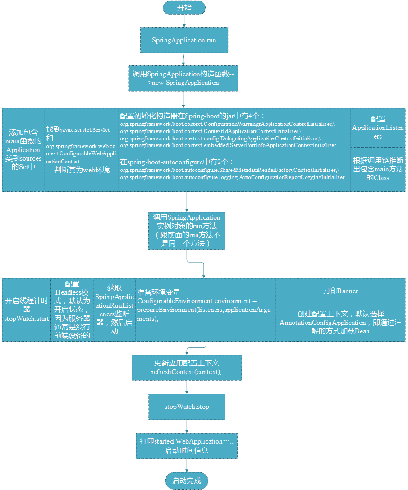

看了一整天的springboot的源码，头都有点疼了，稍微梳理了一下流程：

简单看完一遍之后没找到它在哪里加载了配置信息，Bean对象等，然后又看了一遍，发现在AbstractApplicationContext的refresh中：
``` java
public void refresh() throws BeansException, IllegalStateException {
        //它是上了同步锁的，不能多个线程同时进行
		synchronized (this.startupShutdownMonitor) {
			//设置spring容器的启动时间，撤销关闭状态，开启活跃状态，初始化属性源信息，验证环境信息中必须存在的配置，不存在就抛出异常.
			prepareRefresh();
			ConfigurableListableBeanFactory beanFactory = obtainFreshBeanFactory();		    
           //设置Bean的类加载器，Bean表达式解析器；添加属性编辑注册器 
          //添加PostProcessor，注册一些依赖等
			prepareBeanFactory(beanFactory);
			try {
				// Allows post-processing of the bean factory in context subclasses.
				postProcessBeanFactory(beanFactory);
				//从context中获取bean信息，并委托BeanFactory注册Bean.
				invokeBeanFactoryPostProcessors(beanFactory);

				// Register bean processors that intercept bean creation.
				registerBeanPostProcessors(beanFactory);

				//初始化国际化资源信息.
				initMessageSource();

				//初始化广播器，可以用广播发布事件.
				initApplicationEventMulticaster();

				//由子类自己实现，不同的容器做不同的事情.
				onRefresh();

				//检查并注册监听器.
				registerListeners();

				//实例化BeanFactory中已经被注册的但未被实例化的所有实例，除了标注了懒加载的.
				finishBeanFactoryInitialization(beanFactory);

				// Last step: publish corresponding event.
				finishRefresh();
			}

			catch (BeansException ex) {
				if (logger.isWarnEnabled()) {
					logger.warn("Exception encountered during context initialization - " +
							"cancelling refresh attempt: " + ex);
				}

				// Destroy already created singletons to avoid dangling resources.
				destroyBeans();

				// Reset 'active' flag.
				cancelRefresh(ex);

				// Propagate exception to caller.
				throw ex;
			}

			finally {
				// Reset common introspection caches in Spring's core, since we
				// might not ever need metadata for singleton beans anymore...
				resetCommonCaches();
			}
		}
	}

```
原创文章转载请标明出处
更多文章请查看 
[http://www.canfeng.xyz](http://www.canfeng.xyz)