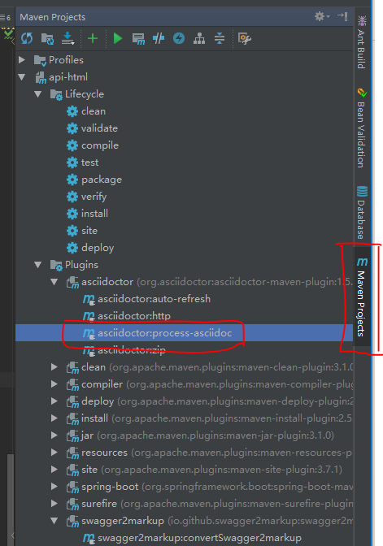
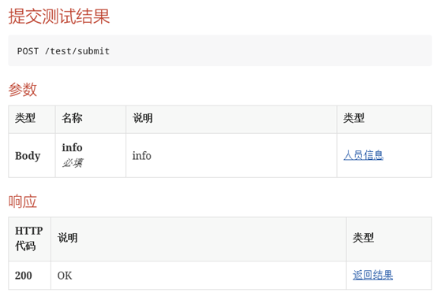
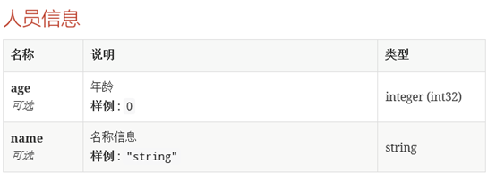
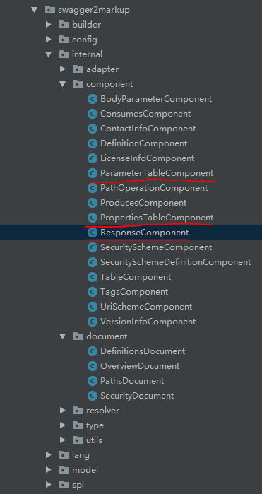
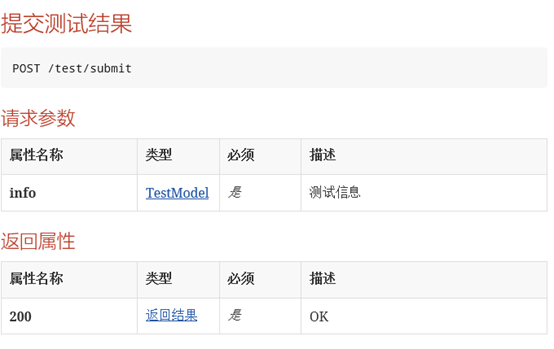
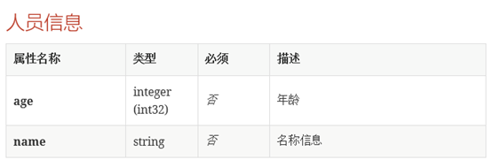
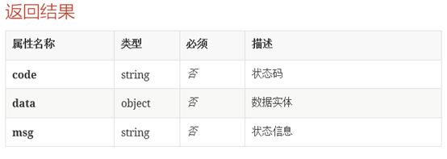

# 引言

随着前后端代码的分离，以及Restful API风格的流行，后端程序员既需要编写代码，又需要编写接口文档，无形之中加重了后端程序员的工作强度，同时后端程序员往往是不怎么喜欢编写文档的，此时一款自动生成接口文档的工具就显得非常不可缺少。Swagger的诞生，一定程度上拯救了程序员，它能自动生成接口文档，但却并未彻底拯救，因为格式不是我们想要的，但是程序员站在Swagger的基础上就可以完全实现自我救赎。
# 一、方法：
Swagger是一个可以自动生成API接口文档的工具，使用它，开发者可以节约文档编写的时间。要想使用它生成API文档需要先引入Swagger的jar包，本文通过结合idea编译器和java代码来演示。
## 1.1引入Swagger
首先我们需要先新建一个Springboot工程（新建的时候可以不选择依赖项），新建完毕后，我们在pom文件中添加swagger相关的依赖项和插件，用于引入Swagger。依赖项和插件如下所示：
``` xml
<dependencies>
  <dependency>
      <groupId>org.springframework.boot</groupId>
      <artifactId>spring-boot-starter-web</artifactId>
  </dependency>
  <dependency>
      <groupId>org.springframework.boot</groupId>
      <artifactId>spring-boot-starter-test</artifactId>
      <scope>test</scope>
  </dependency>
  <dependency>
      <groupId>com.spring4all</groupId>
      <artifactId>swagger-spring-boot-starter</artifactId>
      <version>1.7.1.RELEASE</version>
  </dependency>
  <dependency>
      <groupId>org.projectlombok</groupId>
      <artifactId>lombok</artifactId>
      <version>1.16.16</version>
      <scope>provided</scope>
  </dependency>
  <dependency>
      <groupId>io.github.swagger2markup</groupId>
      <artifactId>swagger2markup</artifactId>
      <version>1.3.1</version>
 </dependency>
  <!-- https://mvnrepository.com/artifact/com.alibaba/fastjson -->
  <dependency>
      <groupId>com.alibaba</groupId>
      <artifactId>fastjson</artifactId>
      <version>1.2.51</version>
  </dependency>
</dependencies>
<build>
  <plugins>
      <plugin>
        <groupId>org.springframework.boot</groupId>
        <artifactId>spring-boot-maven-plugin</artifactId>
      </plugin>
      <plugin>
        <groupId>io.github.swagger2markup</groupId>
        <artifactId>swagger2markup-maven-plugin</artifactId>
        <version>1.3.1</version>
        <configuration>
            <swaggerInput>http://localhost:8080/v2/api-docs</swaggerInput>
            <outputDir>src/docs/asciidoc/generated</outputDir>
            <config>
               <swagger2markup.markupLanguage>ASCIIDOC</swagger2markup.markupLanguage>
            </config>
        </configuration>
      </plugin>
      <plugin>
        <groupId>org.asciidoctor</groupId>
        <artifactId>asciidoctor-maven-plugin</artifactId>
        <version>1.5.6</version>
        <configuration>
            <sourceDirectory>src/docs/asciidoc/generated</sourceDirectory>
            <outputDirectory>src/docs/asciidoc/html</outputDirectory>
            <backend>html</backend>
            <sourceHighlighter>coderay</sourceHighlighter>
            <attributes>
              <toc>left</toc>
            </attributes>
        </configuration>
      </plugin>
  </plugins>
</build>
<repositories>
  <repository>
      <snapshots>
        <enabled>false</enabled>
        </snapshots>
        <id>jcenter-releases</id>
        <name>jcenter</name>
        <url>http://jcenter.bintray.com</url>
  </repository>
</repositories>
```
## 1.2添加注释项
在引入Swagger之后需要在对外提供的接口上添加注释，如下所示：
``` java
package com.wcf.swagger.apihtml.controller;
import com.wcf.swagger.apihtml.model.EvaluationInfo;
import com.wcf.swagger.apihtml.model.TestModel;
import com.wcf.swagger.apihtml.response.TestResult;
import io.swagger.annotations.Api;
import io.swagger.annotations.ApiImplicitParam;
import io.swagger.annotations.ApiImplicitParams;
import io.swagger.annotations.ApiOperation;
import org.springframework.web.bind.annotation.PostMapping;
import org.springframework.web.bind.annotation.RequestBody;
import org.springframework.web.bind.annotation.RequestMapping;
import org.springframework.web.bind.annotation.RestController;
/**
*@author wangcanfeng
*@note description
*@note Created in13:59-2018/11/28
 */
@RestController
@RequestMapping("/test")
@Api(description= "主要用于展示一些测试接口信息", value = "测试接口集合", produces = "application/json")
public class TestController {

    @PostMapping("/submit")
    @ApiOperation("提交测试结果")
    @ApiImplicitParams({@ApiImplicitParam(type= "body",
                     dataType = "EvaluationInfo", name = "planCode", value = "考评结果", required = true)})
public TestResultsubmitEvaluation(@RequestBodyTestModel info) {
           return new TestResult("0", true);
         }
 }


package com.wcf.swagger.apihtml.model;
import io.swagger.annotations.ApiModel;
import io.swagger.annotations.ApiModelProperty;
import lombok.AllArgsConstructor;
import lombok.Data;
import lombok.NoArgsConstructor;

/**
*@author wangcanfeng
*@note description
*@note Created in 14:05-2018/11/28
 */
@Data
@ApiModel("人员信息")
@NoArgsConstructor
@AllArgsConstructor
public class TestModel {

  @ApiModelProperty("名称信息")
  private Stringname;
  @ApiModelProperty("年龄")
  private Integerage;

}

package com.wcf.swagger.apihtml.response;
import io.swagger.annotations.ApiModel;
import io.swagger.annotations.ApiModelProperty;
import lombok.Data;

/**
*@author wangcanfeng
*@note description
*@note Created in10:45-2018/11/24
 */

@Data
@ApiModel("返回结果")
public class TestResult<T> {

  @ApiModelProperty("状态码")
  private String code;
  @ApiModelProperty("数据实体")
  private T data;
  @ApiModelProperty("状态信息")
  private Stringmsg;

    public TestResult(String code, T data){
          this.code=code;
          this .data=data;
        }
}
```
## 1.2生成HTML文档
本文先通过swagger生成了ascii文档，然后再生成HTML文档，步骤如下所示：

（1）在生成文档前，要保证程序运行没有bug，否则不能生成文档。可以编写一个test类，然后再使用test方法生成ascii：
``` java
@Test
public void generateAsciiDocsToFile() throwsException {

    // 输出Ascii到单文件
   Swagger2MarkupConfig config = new Swagger2MarkupConfigBuilder()
         .withMarkupLanguage(MarkupLanguage. ASCIIDOC)
         .withOutputLanguage(Language. ZH) //选择语言为中文
         .withGeneratedExamples() //选择需要输出入参和返回值样例
         .build();
  //localhost和8080可以改成指定的ip和端口号
  Swagger2MarkupConverter.from(new URL("http://localhost:8080/v2/api-docs"))
         .withConfig(config)
         .build()
//这里是输出文档的位置
.toFile(Paths.get("src/docs/asciidoc/generated/all"));
}
```
（2）配置plugin插件，设置输入输出文件位置：
``` xml
<plugin>
  <groupId>org.asciidoctor</groupId>
  <artifactId>asciidoctor-maven-plugin</artifactId>
  <version>1.5.6</version>
  <configuration>
      <sourceDirectory>src/docs/asciidoc/generated</sourceDirectory>
      <outputDirectory>src/docs/asciidoc/html</outputDirectory>
      <backend>html</backend>
      <sourceHighlighter>coderay</sourceHighlighter>
      <attributes>
        <toc>left</toc>
      </attributes>
  </configuration>
</plugin>
```
在sourceDirectory配置项中设置ascii文件的位置，在outputDirectory配置项中设置输出文件的位置。
（3）运行插件，输出HTML
点击idea的侧边栏中的Maven Projects菜单，然后打开Plugins，然后点击asciidoctor:process-asciidoc，如下所示：


到这里就生成了html文档了，但是格式并不是我们想要的，并不能完全提高效率，提高生产率。


## 1.3自定义格式
（1）Swagger提供的配置项，并没有设置修改格式的，所以需要修改源码，源码可以在github或者通过idea直接下载，然后自行创建一个maven工程去修改Swagger。因为我们不满意的地方是入参表，出参表，以及结构体定义表。打开源码，主要需要修改的部分为：

其中PropertiesTableComponent结构体定义的参数表对象类，ParameterTableComponent为入参表的对象类，然后ResponseComponent这个是返回参数对象类。修改它们的apply方法，可以调整表格中各个列的顺序，以及各个列中数据的值。具体的源码量较大，参见附录，附录贴了这三个主要修改类的的源码。然后修改lang文件夹中的labels_zh.properties，可以修改表头等地方的中文字样。
将这个修改过的源码打包，install到我们的maven目录中，然后再通过自己新建的maven工程配置的groupId和artifacId以及version信息引入修改过的swagger，替换源码：
``` xml
<dependency>
   <groupId>com.test.swagger</groupId>
   <artifactId>wcf-swagger</artifactId>
   <version>1.0-SNAPSHOT</version>
</dependency>
```
替换成
``` xml
<dependency>
   <groupId>io.github.swagger2markup</groupId>
   <artifactId>swagger2markup</artifactId>
   <version>1.3.1</version>
</dependency>
```
（2）修改后的展示效果：



到这里表格的格式已经基本符合我们的要求了，效果不错，如果还有别的要求可以继续修改源码。

# 二、总结：
Swagger源码生成的API文档虽然可以直接使用，但是它的格式在不同程度上影响了我们的使用，通常我们需要对它生成文档进行各种编辑或者只是复制出部分数据到我们已经编辑好格式的文档中，这么做不仅麻烦，还有可能出错。如果需要让它彻底的适应自身的文档格式需求，可以修改源码使得生成我们想要的文档格式。
通过修改Swagger源码，生成的自身所需求的文档格式，极大程度上减少了文档格式修改的时间，降低了开发成本，减少了开发环节，提升程序员的开发体验和舒适度。
# 三、附录：
## 3.1 ParameterTableComponent类源码：
``` java
/*
 * Copyright 2017 Robert Winkler
 *
 * Licensed under the Apache License, Version 2.0 (the "License");
 * you may not use this file except in compliance with the License.
 * You may obtain a copy of the License at
 *
 *        http://www.apache.org/licenses/LICENSE-2.0
 *
 * Unless required by applicable law or agreed to in writing, software
 * distributed under the License is distributed on an "AS IS" BASIS,
 * WITHOUT WARRANTIES OR CONDITIONS OF ANY KIND, either express or implied.
 * See the License for the specific language governing permissions and
 * limitations under the License.
 */
package io.github.swagger2markup.internal.component;


import ch.netzwerg.paleo.StringColumn;
import io.github.swagger2markup.Swagger2MarkupConverter;
import io.github.swagger2markup.internal.adapter.ParameterAdapter;
import io.github.swagger2markup.internal.resolver.DocumentResolver;
import io.github.swagger2markup.internal.type.ObjectType;
import io.github.swagger2markup.markup.builder.MarkupDocBuilder;
import io.github.swagger2markup.model.PathOperation;
import io.github.swagger2markup.spi.MarkupComponent;
import io.github.swagger2markup.spi.PathsDocumentExtension;
import io.swagger.models.parameters.Parameter;
import org.apache.commons.collections4.CollectionUtils;
import org.apache.commons.lang3.StringUtils;
import org.apache.commons.lang3.Validate;

import java.util.List;
import java.util.stream.Collectors;

import static ch.netzwerg.paleo.ColumnIds.StringColumnId;
import static io.github.swagger2markup.Labels.*;
import static io.github.swagger2markup.internal.utils.MarkupDocBuilderUtils.copyMarkupDocBuilder;
import static org.apache.commons.lang3.StringUtils.isNotBlank;

public class ParameterTableComponent extends MarkupComponent<ParameterTableComponent.Parameters> {


    private final DocumentResolver definitionDocumentResolver;
    private final TableComponent tableComponent;

    ParameterTableComponent(Swagger2MarkupConverter.Context context,
                            DocumentResolver definitionDocumentResolver) {
        super(context);
        this.definitionDocumentResolver = Validate.notNull(definitionDocumentResolver, "DocumentResolver must not be null");
        this.tableComponent = new TableComponent(context);

    }

    public static Parameters parameters(PathOperation operation,
                                                                List<ObjectType> inlineDefinitions,
                                                                int titleLevel) {
        return new Parameters(operation, inlineDefinitions, titleLevel);
    }

    @Override
    public MarkupDocBuilder apply(MarkupDocBuilder markupDocBuilder, Parameters params) {
        PathOperation operation = params.operation;
        List<ObjectType> inlineDefinitions = params.inlineDefinitions;
        List<Parameter> parameters = operation.getOperation().getParameters();
        if (config.getParameterOrdering() != null)
            parameters.sort(config.getParameterOrdering());

        // Filter parameters to display in parameters section
        List<Parameter> filteredParameters = parameters.stream()
                .filter(this::filterParameter).collect(Collectors.toList());

        MarkupDocBuilder parametersBuilder = copyMarkupDocBuilder(markupDocBuilder);
        applyPathsDocumentExtension(new PathsDocumentExtension.Context(PathsDocumentExtension.Position.OPERATION_PARAMETERS_BEGIN, parametersBuilder, operation));
        if (CollectionUtils.isNotEmpty(filteredParameters)) {
//            StringColumn.Builder typeColumnBuilder = StringColumn.builder(StringColumnId.of(labels.getLabel(TYPE_COLUMN)))
//                    .putMetaData(TableComponent.WIDTH_RATIO, "2");
            StringColumn.Builder nameColumnBuilder = StringColumn.builder(StringColumnId.of(labels.getLabel(NAME_COLUMN)))
                    .putMetaData(TableComponent.WIDTH_RATIO, "5");
            StringColumn.Builder descriptionColumnBuilder = StringColumn.builder(StringColumnId.of(labels.getLabel(DESCRIPTION_COLUMN)))
                    .putMetaData(TableComponent.WIDTH_RATIO, "9")
                    .putMetaData(TableComponent.HEADER_COLUMN, "true");
            StringColumn.Builder schemaColumnBuilder = StringColumn.builder(StringColumnId.of(labels.getLabel(SCHEMA_COLUMN)))
                    .putMetaData(TableComponent.WIDTH_RATIO, "3")
                    .putMetaData(TableComponent.HEADER_COLUMN, "true");
//            StringColumn.Builder defaultColumnBuilder = StringColumn.builder(StringColumnId.of(labels.getLabel(DEFAULT_COLUMN)))
//                    .putMetaData(TableComponent.WIDTH_RATIO, "2")
//                    .putMetaData(TableComponent.HEADER_COLUMN, "true");
            //是否必填的列
            StringColumn.Builder requireColumnBuilder = StringColumn.builder(StringColumnId.of(labels.getLabel(REQUIRE)))
                    .putMetaData(TableComponent.WIDTH_RATIO, "3");

            for (Parameter parameter : filteredParameters) {
                ParameterAdapter parameterAdapter = new ParameterAdapter(context,
                        operation, parameter, definitionDocumentResolver);

                inlineDefinitions.addAll(parameterAdapter.getInlineDefinitions());
                requireColumnBuilder.add(getParameterRequireColumnContent(markupDocBuilder,parameterAdapter));
//                typeColumnBuilder.add(parameterAdapter.displayType(markupDocBuilder));
                nameColumnBuilder.add(getParameterNameColumnContent(markupDocBuilder, parameterAdapter));

                schemaColumnBuilder.add(parameterAdapter.displaySchema(markupDocBuilder));
//                defaultColumnBuilder.add(parameterAdapter.displayDefaultValue(markupDocBuilder));
                descriptionColumnBuilder.add(parameterAdapter.displayDescription(markupDocBuilder));
            }
            //调整这里的参数顺序可以修改最后生成的表格的列的顺序
            parametersBuilder = tableComponent.apply(parametersBuilder, TableComponent.parameters(
//                    typeColumnBuilder.build(),
                    nameColumnBuilder.build(),
                    schemaColumnBuilder.build(),
                    requireColumnBuilder.build(),
                    descriptionColumnBuilder.build()
//                    defaultColumnBuilder.build()
            ));
        }
        applyPathsDocumentExtension(new PathsDocumentExtension.Context(PathsDocumentExtension.Position.OPERATION_PARAMETERS_END, parametersBuilder, operation));
        String parametersContent = parametersBuilder.toString();

        applyPathsDocumentExtension(new PathsDocumentExtension.Context(PathsDocumentExtension.Position.OPERATION_PARAMETERS_BEFORE, markupDocBuilder, operation));
        if (isNotBlank(parametersContent)) {
            markupDocBuilder.sectionTitleLevel(params.titleLevel, labels.getLabel(PARAMETERS));
            markupDocBuilder.text(parametersContent);
        }
        applyPathsDocumentExtension(new PathsDocumentExtension.Context(PathsDocumentExtension.Position.OPERATION_PARAMETERS_AFTER, markupDocBuilder, operation));

        return markupDocBuilder;
    }

    private String getParameterNameColumnContent(MarkupDocBuilder markupDocBuilder, ParameterAdapter parameter) {
        MarkupDocBuilder parameterNameContent = copyMarkupDocBuilder(markupDocBuilder);

        parameterNameContent.boldTextLine(parameter.getName(), true);
        //是否必填的信息都存在单独列里面
        //生成的名称列不需要有是否必填
//        if (parameter.getRequired())
//            parameterNameContent.italicText(labels.getLabel(FLAGS_REQUIRED).toLowerCase());
//        else
//            parameterNameContent.italicText(labels.getLabel(FLAGS_OPTIONAL).toLowerCase());
        return parameterNameContent.toString();
    }
    
    /**
     * 功能描述: 
     * @param markupDocBuilder 文件编辑器
     * @param parameter  参数对象
     * @return: 不用管
     * @since: v2.2
     * @Author:wangcanfeng
     * @Date: 2018/11/23 14:32
     */
    private String getParameterRequireColumnContent(MarkupDocBuilder markupDocBuilder, ParameterAdapter parameter) {
        MarkupDocBuilder parameterReuqireContent = copyMarkupDocBuilder(markupDocBuilder);
        //是否必填的信息都存在单独列里面
        if (parameter.getRequired())
            parameterReuqireContent.italicText(labels.getLabel(FLAGS_REQUIRED).toLowerCase());
        else
            parameterReuqireContent.italicText(labels.getLabel(FLAGS_OPTIONAL).toLowerCase());
        return parameterReuqireContent.toString();
    }

    /**
     * Filter parameters to display in parameters section
     *
     * @param parameter parameter to filter
     * @return true if parameter can be displayed
     */
    private boolean filterParameter(Parameter parameter) {
        return (!config.isFlatBodyEnabled() || !StringUtils.equals(parameter.getIn(), "body"));
    }

    /**
     * Apply extension context to all OperationsContentExtension.
     *
     * @param context context
     */
    private void applyPathsDocumentExtension(PathsDocumentExtension.Context context) {
        extensionRegistry.getPathsDocumentExtensions().forEach(extension -> extension.apply(context));
    }

    public static class Parameters {
        private final PathOperation operation;
        private final int titleLevel;
        private final List<ObjectType> inlineDefinitions;

        public Parameters(PathOperation operation,
                          List<ObjectType> inlineDefinitions,
                          int titleLevel) {
            this.operation = Validate.notNull(operation, "PathOperation must not be null");
            this.inlineDefinitions = Validate.notNull(inlineDefinitions, "InlineDefinitions must not be null");
            this.titleLevel = titleLevel;
        }
    }
}
```
## 3.2 PropertiesTableComponent源码：
``` java
/*
 * Copyright 2017 Robert Winkler
 *
 * Licensed under the Apache License, Version 2.0 (the "License");
 * you may not use this file except in compliance with the License.
 * You may obtain a copy of the License at
 *
 *        http://www.apache.org/licenses/LICENSE-2.0
 *
 * Unless required by applicable law or agreed to in writing, software
 * distributed under the License is distributed on an "AS IS" BASIS,
 * WITHOUT WARRANTIES OR CONDITIONS OF ANY KIND, either express or implied.
 * See the License for the specific language governing permissions and
 * limitations under the License.
 */
package io.github.swagger2markup.internal.component;

import ch.netzwerg.paleo.ColumnIds;
import ch.netzwerg.paleo.StringColumn;
import io.github.swagger2markup.Swagger2MarkupConverter;
import io.github.swagger2markup.internal.adapter.ParameterAdapter;
import io.github.swagger2markup.internal.adapter.PropertyAdapter;
import io.github.swagger2markup.internal.resolver.DocumentResolver;
import io.github.swagger2markup.internal.type.ObjectType;
import io.github.swagger2markup.internal.type.Type;
import io.github.swagger2markup.markup.builder.MarkupDocBuilder;
import io.github.swagger2markup.spi.MarkupComponent;
import io.swagger.models.properties.Property;
import io.swagger.util.Json;
import org.apache.commons.collections4.MapUtils;
import org.apache.commons.lang3.Validate;

import java.math.BigDecimal;
import java.text.DecimalFormat;
import java.text.DecimalFormatSymbols;
import java.util.List;
import java.util.Map;
import java.util.Optional;

import static io.github.swagger2markup.Labels.*;
import static io.github.swagger2markup.internal.utils.InlineSchemaUtils.createInlineType;
import static io.github.swagger2markup.internal.utils.MapUtils.toSortedMap;
import static io.github.swagger2markup.internal.utils.MarkupDocBuilderUtils.copyMarkupDocBuilder;
import static io.github.swagger2markup.internal.utils.MarkupDocBuilderUtils.markupDescription;
import static org.apache.commons.lang3.StringUtils.isNotBlank;


public class PropertiesTableComponent extends MarkupComponent<PropertiesTableComponent.Parameters> {


    private final DocumentResolver definitionDocumentResolver;
    private final TableComponent tableComponent;

    /**
     * Build a generic property table
     *
     * @param definitionDocumentResolver definition document resolver to apply to property type cross-reference
     */
    PropertiesTableComponent(Swagger2MarkupConverter.Context context,
                             DocumentResolver definitionDocumentResolver) {
        super(context);
        this.definitionDocumentResolver = definitionDocumentResolver;
        this.tableComponent = new TableComponent(context);
    }

    public static Parameters parameters(Map<String, Property> properties,
                                        String parameterName,
                                        List<ObjectType> inlineDefinitions) {
        return new Parameters(properties, parameterName, inlineDefinitions);
    }

    public MarkupDocBuilder apply(MarkupDocBuilder markupDocBuilder, Parameters params) {
        //TODO: This method is too complex, split it up in smaller methods to increase readability
        //展示属性名，类型，是否必填，描述列表
        //名称
        StringColumn.Builder nameColumnBuilder = StringColumn.builder(
                 ColumnIds.StringColumnId.of(labels.getLabel(NAME_COLUMN)))
                .putMetaData(TableComponent.WIDTH_RATIO, "5");
        //描述
        StringColumn.Builder descriptionColumnBuilder = StringColumn.builder(
                 ColumnIds.StringColumnId.of(
                 labels.getLabel(DESCRIPTION_COLUMN)))
                .putMetaData(TableComponent.WIDTH_RATIO, "9")
                .putMetaData(TableComponent.HEADER_COLUMN, "true");
        //内容
        StringColumn.Builder schemaColumnBuilder = StringColumn.builder(
                 ColumnIds.StringColumnId.of(labels.getLabel(SCHEMA_COLUMN)))
                .putMetaData(TableComponent.WIDTH_RATIO, "3")
                .putMetaData(TableComponent.HEADER_COLUMN, "true");

        //是否必填的列
        StringColumn.Builder requireColumnBuilder = StringColumn.builder(
                 ColumnIds.StringColumnId.of(labels.getLabel(REQUIRE)))
                .putMetaData(TableComponent.WIDTH_RATIO, "3");

        Map<String, Property> properties = params.properties;
        if (MapUtils.isNotEmpty(properties)) {
            Map<String, Property> sortedProperties = toSortedMap(properties, config.getPropertyOrdering());
            sortedProperties.forEach((String propertyName, Property property) -> {
                PropertyAdapter propertyAdapter = new PropertyAdapter(property);
                Type propertyType = propertyAdapter.getType(definitionDocumentResolver);

                if (config.isInlineSchemaEnabled()) {
                    propertyType = createInlineType(propertyType, 
                    propertyName, params.parameterName + " " + propertyName, params.inlineDefinitions);
                }

                Optional<Object> optionalExample = propertyAdapter.getExample(
                              config.isGeneratedExamplesEnabled(), markupDocBuilder);
                Optional<Object> optionalDefaultValue = propertyAdapter.getDefaultValue();
                Optional<Integer> optionalMaxLength = propertyAdapter.getMaxlength();
                Optional<Integer> optionalMinLength = propertyAdapter.getMinlength();
                Optional<String> optionalPattern = propertyAdapter.getPattern();

                Optional<BigDecimal> optionalMinValue = propertyAdapter.getMin();
                boolean exclusiveMin = propertyAdapter.getExclusiveMin();
                Optional<BigDecimal> optionalMaxValue = propertyAdapter.getMax();
                boolean exclusiveMax = propertyAdapter.getExclusiveMax();

                MarkupDocBuilder propertyNameContent = copyMarkupDocBuilder(markupDocBuilder);
                propertyNameContent.boldTextLine(propertyName, true);
                //不展示
//                if (propertyAdapter.getReadOnly()) {
//                    propertyNameContent.newLine(true);
//                    propertyNameContent.italicText(labels.getLabel(FLAGS_READ_ONLY).toLowerCase());
//                }

                MarkupDocBuilder descriptionContent = copyMarkupDocBuilder(markupDocBuilder);
                String description = markupDescription(config.getSwaggerMarkupLanguage(),
                        markupDocBuilder, property.getDescription());
                if (isNotBlank(description))
                    descriptionContent.text(description);

                if (optionalDefaultValue.isPresent()) {
                    if (isNotBlank(descriptionContent.toString())) {
                        descriptionContent.newLine(true);
                    }
                    descriptionContent.boldText(labels.getLabel(DEFAULT_COLUMN))
                   .text(COLON).literalText(Json.pretty(optionalDefaultValue.get()));
                }

                if (optionalMinLength.isPresent() && optionalMaxLength.isPresent()) {
                    // combination of minlength/maxlength
                    Integer minLength = optionalMinLength.get();
                    Integer maxLength = optionalMaxLength.get();

                    if (isNotBlank(descriptionContent.toString())) {
                        descriptionContent.newLine(true);
                    }

                    String lengthRange = minLength + " - " + maxLength;
                    if (minLength.equals(maxLength)) {
                        lengthRange = minLength.toString();
                    }

                    descriptionContent.boldText(labels.getLabel(LENGTH_COLUMN))
                     .text(COLON).literalText(lengthRange);

                } else {
                    if (optionalMinLength.isPresent()) {
                        if (isNotBlank(descriptionContent.toString())) {
                            descriptionContent.newLine(true);
                        }
                        descriptionContent.boldText(labels.getLabel(MINLENGTH_COLUMN)).
                       text(COLON).literalText(optionalMinLength.get().toString());
                    }

                    if (optionalMaxLength.isPresent()) {
                        if (isNotBlank(descriptionContent.toString())) {
                            descriptionContent.newLine(true);
                        }
                        descriptionContent.boldText(labels.getLabel(MAXLENGTH_COLUMN)).
               text(COLON).literalText(optionalMaxLength.get().toString());
                    }
                }

                if (optionalPattern.isPresent()) {
                    if (isNotBlank(descriptionContent.toString())) {
                        descriptionContent.newLine(true);
                    }
                    descriptionContent.boldText(labels.getLabel(PATTERN_COLUMN)).
                    text(COLON).literalText(Json.pretty(optionalPattern.get()));
                }

                DecimalFormat numberFormatter = new DecimalFormat("#.##",
                        DecimalFormatSymbols.getInstance(config.getOutputLanguage().toLocale()));

                if (optionalMinValue.isPresent()) {
                    if (isNotBlank(descriptionContent.toString())) {
                        descriptionContent.newLine(true);
                    }
                    String minValueColumn = exclusiveMin ? labels.
              getLabel(MINVALUE_EXCLUSIVE_COLUMN) : labels.getLabel(MINVALUE_COLUMN);
                  descriptionContent.boldText(minValueColumn).text(COLON)
                 .literalText(numberFormatter.format(optionalMinValue.get()));
                }

                if (optionalMaxValue.isPresent()) {
                    if (isNotBlank(descriptionContent.toString())) {
                        descriptionContent.newLine(true);
                    }
                    String maxValueColumn = exclusiveMax ? labels
                 .getLabel(MAXVALUE_EXCLUSIVE_COLUMN) : labels.getLabel(MAXVALUE_COLUMN);
                   descriptionContent.boldText(maxValueColumn).text(COLON)
                 .literalText(numberFormatter.format(optionalMaxValue.get()));
                }

                if (optionalExample.isPresent()) {
                    if (isNotBlank(description) || optionalDefaultValue.isPresent()) {
                        descriptionContent.newLine(true);
                    }
//                    descriptionContent.boldText(labels.getLabel(EXAMPLE_COLUMN))
//                .text(COLON).literalText(Json.pretty(optionalExample.get()));
                }

                nameColumnBuilder.add(propertyNameContent.toString());
                schemaColumnBuilder.add(propertyType.displaySchema(markupDocBuilder));
                requireColumnBuilder.add(getParameterRequireColumnContent(markupDocBuilder,property));
                descriptionColumnBuilder.add(descriptionContent.toString());
            });
        }

        return tableComponent.apply(markupDocBuilder, TableComponent.parameters(
                nameColumnBuilder.build(),
                schemaColumnBuilder.build(),
                requireColumnBuilder.build(),
                descriptionColumnBuilder.build()
                ));
    }

    public static class Parameters {
        private final Map<String, Property> properties;
        private final String parameterName;
        private final List<ObjectType> inlineDefinitions;

        public Parameters(Map<String, Property> properties,
                          String parameterName,
                          List<ObjectType> inlineDefinitions) {

            this.properties = Validate.notNull(properties, "Properties must not be null");
            this.parameterName = Validate.notBlank(parameterName, "ParameterName must not be blank");
            this.inlineDefinitions = Validate.notNull(inlineDefinitions, "InlineDefinitions must not be null");
        }
    }

    /**
     * 功能描述:
     *
     * @param markupDocBuilder 文件编辑器
     * @return: 不用管
     * @since: v2.2
     * @Author:wangcanfeng
     * @Date: 2018/11/23 14:32
     */
    private String getParameterRequireColumnContent(MarkupDocBuilder markupDocBuilder,Property property) {
        MarkupDocBuilder parameterRequireContent = copyMarkupDocBuilder(markupDocBuilder);
        //是否必填的信息都存在单独列里面
        if (property.getRequired())
            parameterRequireContent.italicText(labels.getLabel(FLAGS_REQUIRED).toLowerCase());
        else
            parameterRequireContent.italicText(labels.getLabel(FLAGS_OPTIONAL).toLowerCase());
//        parameterRequireContent.italicText("是");
        return parameterRequireContent.toString();
    }
}
```

## 3.3 ResponseComponent源码：
``` java
/*
 * Copyright 2017 Robert Winkler
 *
 * Licensed under the Apache License, Version 2.0 (the "License");
 * you may not use this file except in compliance with the License.
 * You may obtain a copy of the License at
 *
 *        http://www.apache.org/licenses/LICENSE-2.0
 *
 * Unless required by applicable law or agreed to in writing, software
 * distributed under the License is distributed on an "AS IS" BASIS,
 * WITHOUT WARRANTIES OR CONDITIONS OF ANY KIND, either express or implied.
 * See the License for the specific language governing permissions and
 * limitations under the License.
 */
package io.github.swagger2markup.internal.component;


import ch.netzwerg.paleo.StringColumn;
import io.github.swagger2markup.Swagger2MarkupConverter;
import io.github.swagger2markup.internal.adapter.ParameterAdapter;
import io.github.swagger2markup.internal.adapter.PropertyAdapter;
import io.github.swagger2markup.internal.resolver.DocumentResolver;
import io.github.swagger2markup.internal.type.ObjectType;
import io.github.swagger2markup.internal.type.Type;
import io.github.swagger2markup.markup.builder.MarkupDocBuilder;
import io.github.swagger2markup.model.PathOperation;
import io.github.swagger2markup.spi.MarkupComponent;
import io.github.swagger2markup.spi.PathsDocumentExtension;
import io.swagger.models.Response;
import io.swagger.models.properties.Property;
import io.swagger.util.Json;
import org.apache.commons.collections4.MapUtils;
import org.apache.commons.lang3.Validate;

import java.util.List;
import java.util.Map;
import java.util.Optional;

import static ch.netzwerg.paleo.ColumnIds.StringColumnId;
import static io.github.swagger2markup.Labels.*;
import static io.github.swagger2markup.internal.utils.InlineSchemaUtils.createInlineType;
import static io.github.swagger2markup.internal.utils.MapUtils.toSortedMap;
import static io.github.swagger2markup.internal.utils.MarkupDocBuilderUtils.*;
import static org.apache.commons.lang3.StringUtils.isNotBlank;

public class ResponseComponent extends MarkupComponent<ResponseComponent.Parameters> {

    private final TableComponent tableComponent;
    private final DocumentResolver definitionDocumentResolver;

    ResponseComponent(Swagger2MarkupConverter.Context context,
                      DocumentResolver definitionDocumentResolver) {
        super(context);
        this.definitionDocumentResolver = Validate.notNull(definitionDocumentResolver,
 "DocumentResolver must not be null");
        this.tableComponent = new TableComponent(context);
    }

    public static Parameters parameters(PathOperation operation,
                                        int titleLevel,
                                        List<ObjectType> inlineDefinitions) {
        return new Parameters(operation, titleLevel, inlineDefinitions);
    }

    @Override
    public MarkupDocBuilder apply(MarkupDocBuilder markupDocBuilder, Parameters params) {
        PathOperation operation = params.operation;
        Map<String, Response> responses = operation.getOperation().getResponses();

        MarkupDocBuilder responsesBuilder = copyMarkupDocBuilder(markupDocBuilder);
        applyPathsDocumentExtension(new PathsDocumentExtension.Context(
PathsDocumentExtension.Position.OPERATION_RESPONSES_BEGIN, responsesBuilder, operation));
        if (MapUtils.isNotEmpty(responses)) {
            //返回参数表也需要按照属性名，参数类型，是否必填，描述来展示

            //HTTP代码不需要展示
//            StringColumn.Builder httpCodeColumnBuilder = StringColumn.builder(StringColumnId.of(labels.getLabel(HTTP_CODE_COLUMN)))
//                    .putMetaData(TableComponent.WIDTH_RATIO, "2");
            StringColumn.Builder nameColumnBuilder = StringColumn.builder(StringColumnId.of(labels.getLabel(NAME_COLUMN)))
                    .putMetaData(TableComponent.WIDTH_RATIO, "5");

            StringColumn.Builder schemaColumnBuilder = StringColumn.builder(StringColumnId.of(labels.getLabel(SCHEMA_COLUMN)))
                    .putMetaData(TableComponent.WIDTH_RATIO, "3")
                    .putMetaData(TableComponent.HEADER_COLUMN, "true");
            //是否必填的列
            StringColumn.Builder requireColumnBuilder = StringColumn.builder(StringColumnId.of(labels.getLabel(REQUIRE)))
                    .putMetaData(TableComponent.WIDTH_RATIO, "3")
                    .putMetaData(TableComponent.HEADER_COLUMN, "true");
            StringColumn.Builder descriptionColumnBuilder = StringColumn.builder(StringColumnId.of(labels.getLabel(DESCRIPTION_COLUMN)))
                    .putMetaData(TableComponent.WIDTH_RATIO, "9")
                    .putMetaData(TableComponent.HEADER_COLUMN, "true");

            Map<String, Response> sortedResponses = toSortedMap(responses, config.getResponseOrdering());
            sortedResponses.forEach((String responseName, Response response) -> {
                String schemaContent = labels.getLabel(NO_CONTENT);
                if (response.getSchema() != null) {
                    Property property = response.getSchema();
                    Type type = new PropertyAdapter(property).getType(definitionDocumentResolver);

                    if (config.isInlineSchemaEnabled()) {
                        type = createInlineType(type, labels.getLabel(RESPONSE) + " " + responseName, 
                    operation.getId() + " " + labels.getLabel(RESPONSE) + " " 
                  + responseName, params.inlineDefinitions);
                    }

                    schemaContent = type.displaySchema(markupDocBuilder);
                }

                MarkupDocBuilder descriptionBuilder = copyMarkupDocBuilder(markupDocBuilder);

                descriptionBuilder.text(markupDescription(config.getSwaggerMarkupLanguage(), 
            markupDocBuilder, response.getDescription()));

//                Map<String, Property> headers = response.getHeaders();
//                if (MapUtils.isNotEmpty(headers)) {
//                   descriptionBuilder.newLine(true).boldText(
//                   labels.getLabel(HEADERS_COLUMN)).text(COLON);
//                    for (Map.Entry<String, Property> header : headers.entrySet()) {
//                        descriptionBuilder.newLine(true);
//                        Property headerProperty = header.getValue();
//                        PropertyAdapter headerPropertyAdapter = new PropertyAdapter(headerProperty);
//                        Type propertyType = headerPropertyAdapter.getType(definitionDocumentResolver);
//                        String headerDescription = markupDescription(config.getSwaggerMarkupLanguage(), 
//                         markupDocBuilder, headerProperty.getDescription());
//                        Optional<Object> optionalDefaultValue = headerPropertyAdapter.getDefaultValue();
//
//                        descriptionBuilder
//                                .literalText(header.getKey())
//                                .text(String.format(" (%s)", propertyType.displaySchema(markupDocBuilder)));
//
//                        if (isNotBlank(headerDescription) || optionalDefaultValue.isPresent()) {
//                            descriptionBuilder.text(COLON);
//
//                            if (isNotBlank(headerDescription) && !headerDescription.endsWith("."))
//                                headerDescription += ".";
//
//                            descriptionBuilder.text(headerDescription);
//
//                            optionalDefaultValue.ifPresent(o -> descriptionBuilder.text(" ")
//                                    .boldText(labels.getLabel(DEFAULT_COLUMN))
//                                    .text(COLON).literalText(Json.pretty(o)));
//                        }
//                    }
//                }

                //todo 不需要加载http代码
//                httpCodeColumnBuilder.add(boldText(markupDocBuilder, responseName));
                nameColumnBuilder.add(boldText(markupDocBuilder, responseName));
                requireColumnBuilder.add(getParameterRequireColumnContent(markupDocBuilder));
                descriptionColumnBuilder.add(descriptionBuilder.toString());
                schemaColumnBuilder.add(schemaContent);
            });

            //显示顺序需要改为属性名，类型，是否必填，描述
            responsesBuilder = tableComponent.apply(responsesBuilder,
                    TableComponent.parameters(
//                            httpCodeColumnBuilder.build(),
                            nameColumnBuilder.build(),
                            schemaColumnBuilder.build(),
                            requireColumnBuilder.build(),
                            descriptionColumnBuilder.build()));
        }
        applyPathsDocumentExtension(new PathsDocumentExtension.Context(
        PathsDocumentExtension.Position.OPERATION_RESPONSES_END, 
        responsesBuilder, operation));
        String responsesContent = responsesBuilder.toString();
        applyPathsDocumentExtension(new PathsDocumentExtension.Context(
        PathsDocumentExtension.Position.OPERATION_RESPONSES_BEFORE, 
              markupDocBuilder, operation));
        if (isNotBlank(responsesContent)) {
            markupDocBuilder.sectionTitleLevel(params.titleLevel, labels.getLabel(RESPONSES));
            markupDocBuilder.text(responsesContent);
        }
        applyPathsDocumentExtension(new PathsDocumentExtension.Context(
PathsDocumentExtension.Position.OPERATION_RESPONSES_AFTER, markupDocBuilder, operation));
        return markupDocBuilder;
    }

    /**
     * Apply extension context to all OperationsContentExtension.
     *
     * @param context context
     */
    private void applyPathsDocumentExtension(PathsDocumentExtension.Context context) {
        extensionRegistry.getPathsDocumentExtensions().forEach(extension -> extension.apply(context));
    }

    public static class Parameters {
        private final PathOperation operation;
        private final int titleLevel;
        private final List<ObjectType> inlineDefinitions;

        public Parameters(PathOperation operation,
                          int titleLevel,
                          List<ObjectType> inlineDefinitions) {

            this.operation = Validate.notNull(operation, "PathOperation must not be null");
            this.titleLevel = titleLevel;
            this.inlineDefinitions = Validate.notNull(inlineDefinitions, "InlineDefinitions must not be null");
        }
    }

    /**
     * 功能描述:
     *
     * @param markupDocBuilder 文件编辑器
     * @return: 不用管
     * @since: v2.2
     * @Author:wangcanfeng
     * @Date: 2018/11/23 14:32
     */
    private String getParameterRequireColumnContent(MarkupDocBuilder markupDocBuilder) {
        MarkupDocBuilder parameterRequireContent = copyMarkupDocBuilder(markupDocBuilder);
        //全部默认为需要
        parameterRequireContent.italicText(labels.getLabel(FLAGS_REQUIRED));
        return parameterRequireContent.toString();
    }
}
```
原创文章转载请标明出处
更多文章请查看 
[http://www.canfeng.xyz](http://www.canfeng.xyz)