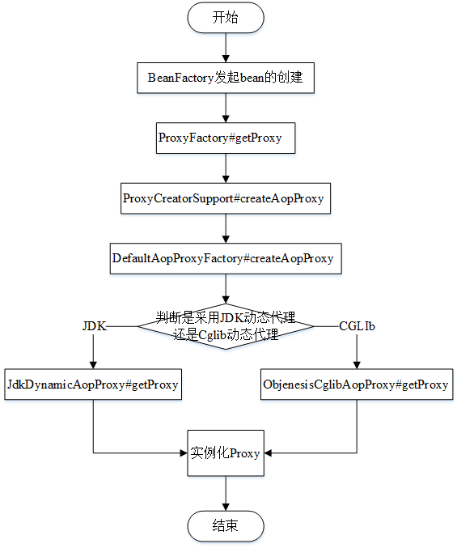

# 1.前言
在刚学java的时候看到编译器里显示的黄黄的字体还不知道那是注解，注解的名称也是后面才知道的，反正感觉它的逼格很高。后面为了提高自己的代码质量，也学会了注解的编写，不过一直没有去看到底是怎么实现的，这回总算弥补上年轻时代的缺憾了。
# 2.代理实例化的流程


## 2.1 ProxyFactory 代理工厂
代理工厂类继承于ProxyCreatorSupport
涉及的源码部分如下，很简单没什么好分析的，但是出于流程上，为了不断档，还是拿出来晒一晒：
``` java
public Object getProxy(@Nullable ClassLoader classLoader) {
	return createAopProxy().getProxy(classLoader);
}
```
## 2.2 ProxyCreatorSupport 代理创建支持类
这个方法加了一个同步锁，说明创建aop代理的时候是串型执行的
``` java
protected final synchronized AopProxy createAopProxy() {
    //创建代理的时候注册到AdvisedSupportListener监听器中
	if (!this.active) {
		activate();
	}
    //创建代理
	return getAopProxyFactory().createAopProxy(this);
}
```
## 2.3 DefaultAopProxyFactory aop代理工厂
``` java
public AopProxy createAopProxy(AdvisedSupport config) throws AopConfigException {
     //判断代理是否需要执行优化
     //判断是否直接代理目标类
     //判断是否没有代理接口或者代理的仅仅是的子类SpringProxy
	if(config.isOptimize() || config.isProxyTargetClass() || hasNoUserSuppliedProxyInterfaces(config)) {
		Class<?> targetClass = config.getTargetClass();
		if (targetClass == null) {
			throw new AopConfigException("TargetSource cannot determine target class: " +
					"Either an interface or a target is required for proxy creation.");
		}
        //判断目标类是不是接口类或Proxy的子类，或者在proxyClassCache中，这个缓存是一个弱引用缓存，内部信息在一段时间没用被使用就会清理掉
		if (targetClass.isInterface() || Proxy.isProxyClass(targetClass)) {
			return new JdkDynamicAopProxy(config);
		}
        //到了这里才使用cglib的代理，感觉上似乎很不乐意使用cglib一样
		return new ObjenesisCglibAopProxy(config);
	}
	else {
		return new JdkDynamicAopProxy(config);
	}
}
```
## 2.4 JdkDynamicAopProxy jdk动态aop代理
``` java
public Object getProxy(@Nullable ClassLoader classLoader) {
	if (logger.isDebugEnabled()) {
		logger.debug("Creating JDK dynamic proxy: target source is " + this.advised.getTargetSource());
	}
    //获取代理接口数组
	Class<?>[] proxiedInterfaces = AopProxyUtils.completeProxiedInterfaces(this.advised, true);
    //寻找是否包含了equals和hashcode的接口
	findDefinedEqualsAndHashCodeMethods(proxiedInterfaces);
    //实例化代理类
	return Proxy.newProxyInstance(classLoader, proxiedInterfaces, this);
}
```
## 2.5 ObjenesisCglibAopProxy cglib动态aop代理
``` java
public Object getProxy(@Nullable ClassLoader classLoader) {
	if (logger.isDebugEnabled()) {
		logger.debug("Creating CGLIB proxy: target source is " + this.advised.getTargetSource());
	}

	try {
		Class<?> rootClass = this.advised.getTargetClass();
		Assert.state(rootClass != null, "Target class must be available for creating a CGLIB proxy");

		Class<?> proxySuperClass = rootClass;
		if (ClassUtils.isCglibProxyClass(rootClass)) {
			proxySuperClass = rootClass.getSuperclass();
			Class<?>[] additionalInterfaces = rootClass.getInterfaces();
			for (Class<?> additionalInterface : additionalInterfaces) {
				this.advised.addInterface(additionalInterface);
			}
		}

		//检验类.
		validateClassIfNecessary(proxySuperClass, classLoader);

		// 创建 CGLIB的Enhancer
        // Enhancer允许为非接口类型创建一个Java代理
		Enhancer enhancer = createEnhancer();
		if (classLoader != null) {
			enhancer.setClassLoader(classLoader);
			if (classLoader instanceof SmartClassLoader &&
					((SmartClassLoader) classLoader).isClassReloadable(proxySuperClass)) {
				enhancer.setUseCache(false);
			}
		}
		enhancer.setSuperclass(proxySuperClass);
		enhancer.setInterfaces(AopProxyUtils.completeProxiedInterfaces(this.advised));
		enhancer.setNamingPolicy(SpringNamingPolicy.INSTANCE);
		enhancer.setStrategy(new ClassLoaderAwareUndeclaredThrowableStrategy(classLoader));
        //获取回调，设置aop的拦截链，cglib拦截是通过实现MethodInterceptor接口，在getCallBack里面会有。
		Callback[] callbacks = getCallbacks(rootClass);
		Class<?>[] types = new Class<?>[callbacks.length];
		for (int x = 0; x < types.length; x++) {
			types[x] = callbacks[x].getClass();
		}
		// 设置拦截器过滤器
		enhancer.setCallbackFilter(new ProxyCallbackFilter(
				this.advised.getConfigurationOnlyCopy(), this.fixedInterceptorMap, this.fixedInterceptorOffset));
		enhancer.setCallbackTypes(types);

		// 生成代理类，并创建代理实例.
		return createProxyClassAndInstance(enhancer, callbacks);
	}
	catch (CodeGenerationException | IllegalArgumentException ex) {
		throw new AopConfigException("Could not generate CGLIB subclass of class [" +
				this.advised.getTargetClass() + "]: " +
				"Common causes of this problem include using a final class or a non-visible class",
				ex);
	}
	catch (Throwable ex) {
		// TargetSource.getTarget() failed
		throw new AopConfigException("Unexpected AOP exception", ex);
	}
}


private Callback[] getCallbacks(Class<?> rootClass) throws Exception {
	//略略略略
    //DynamicAdvisedInterceptor这个内部类实现了我们在寻找的MethodInterceptor接口
	Callback aopInterceptor = new DynamicAdvisedInterceptor(this.advised);
	//略略略略
}
```
从上面两个实例化的过程中可以看到，接口类的代理会优先使用jdk的代理，jdk代理通过Proxy这个类来实例化，而cglib的代理是通过EnHancer来创建代理的
# 3 aop最终实现原理
## 3.1 JdkDynamicAopProxy的invoke
``` java
public Object intercept(Object proxy, Method method, Object[] args, MethodProxy methodProxy) throws Throwable {
	Object oldProxy = null;
	boolean setProxyContext = false;
	Object target = null;
	TargetSource targetSource = this.advised.getTargetSource();
	try {
		if (this.advised.exposeProxy) {
			// Make invocation available if necessary.
			oldProxy = AopContext.setCurrentProxy(proxy);
			setProxyContext = true;
		}
		// Get as late as possible to minimize the time we "own" the target, in case it comes from a pool...
		target = targetSource.getTarget();
		Class<?> targetClass = (target != null ? target.getClass() : null);
     //获取拦截链
		List<Object> chain = this.advised.getInterceptorsAndDynamicInterceptionAdvice(method, targetClass);
		Object retVal;
		//判断拦截链是不是空的，且修饰是不是public
		if (chain.isEmpty() && Modifier.isPublic(method.getModifiers())) {
			// We can skip creating a MethodInvocation: just invoke the target directly.
			// Note that the final invoker must be an InvokerInterceptor, so we know
			// it does nothing but a reflective operation on the target, and no hot
			// swapping or fancy proxying.
			Object[] argsToUse = AopProxyUtils.adaptArgumentsIfNecessary(method, args);
			retVal = methodProxy.invoke(target, argsToUse);
		}
		else {
			// 如果拦截链不是空的，那么就需要创建一个方法调用
            // proceed()方法里面会逐个调用拦截链里面的方法，如果有个拦截链出了问题，就跳过，避免因为拦截链的问题导致程序无法进行下去
			retVal = new CglibMethodInvocation(proxy, target, method, args, targetClass, chain, methodProxy).proceed();
		}
        //处理返回值类型
		retVal = processReturnType(proxy, target, method, retVal);
		return retVal;
	}
	finally {
		if (target != null && !targetSource.isStatic()) {
			targetSource.releaseTarget(target);
		}
		if (setProxyContext) {
			// Restore old proxy.
			AopContext.setCurrentProxy(oldProxy);
		}
	}
}
```
## 3.2 DynamicAdvisedInterceptor的intercept
``` java
public Object invoke(Object proxy, Method method, Object[] args) throws Throwable {
	MethodInvocation invocation;
	Object oldProxy = null;
	boolean setProxyContext = false;

	TargetSource targetSource = this.advised.targetSource;
	Object target = null;
	try {
        //这里的判断都是method的特殊形式处理，略过不看
		if (!this.equalsDefined && AopUtils.isEqualsMethod(method)) {
			// The target does not implement the equals(Object) method itself.
			return equals(args[0]);
		}
		else if (!this.hashCodeDefined && AopUtils.isHashCodeMethod(method)) {
			// The target does not implement the hashCode() method itself.
			return hashCode();
		}
		else if (method.getDeclaringClass() == DecoratingProxy.class) {
			// There is only getDecoratedClass() declared -> dispatch to proxy config.
			return AopProxyUtils.ultimateTargetClass(this.advised);
		}
		else if (!this.advised.opaque && method.getDeclaringClass().isInterface() &&
				method.getDeclaringClass().isAssignableFrom(Advised.class)) {
			// Service invocations on ProxyConfig with the proxy config...
			return AopUtils.invokeJoinpointUsingReflection(this.advised, method, args);
		}

		Object retVal;
        //这一幕是不是很熟悉，因为和上面cglib的处理流程一致
		if (this.advised.exposeProxy) {
			// Make invocation available if necessary.
			oldProxy = AopContext.setCurrentProxy(proxy);
			setProxyContext = true;
		}

		// Get as late as possible to minimize the time we "own" the target,
		// in case it comes from a pool.
		target = targetSource.getTarget();
		Class<?> targetClass = (target != null ? target.getClass() : null);

		//获取这个方法的拦截链.
		List<Object> chain = this.advised.getInterceptorsAndDynamicInterceptionAdvice(method, targetClass);

		// Check whether we have any advice. If we don't, we can fallback on direct
		// reflective invocation of the target, and avoid creating a MethodInvocation.
		if (chain.isEmpty()) {
			// We can skip creating a MethodInvocation: just invoke the target directly
			// Note that the final invoker must be an InvokerInterceptor so we know it does
			// nothing but a reflective operation on the target, and no hot swapping or fancy proxying.
			Object[] argsToUse = AopProxyUtils.adaptArgumentsIfNecessary(method, args);
			retVal = AopUtils.invokeJoinpointUsingReflection(target, method, argsToUse);
		}
		else {
			// We need to create a method invocation...
			invocation = new ReflectiveMethodInvocation(proxy, target, method, args, targetClass, chain);
			// Proceed to the joinpoint through the interceptor chain.
			retVal = invocation.proceed();
		}
        //这个地方也和cglib中的处理一样，只是cglib中用了processReturnType方法包装了这个流程
		// Massage return value if necessary.
		Class<?> returnType = method.getReturnType();
		if (retVal != null && retVal == target &&
				returnType != Object.class && returnType.isInstance(proxy) &&
				!RawTargetAccess.class.isAssignableFrom(method.getDeclaringClass())) {
			// Special case: it returned "this" and the return type of the method
			// is type-compatible. Note that we can't help if the target sets
			// a reference to itself in another returned object.
			retVal = proxy;
		}
		else if (retVal == null && returnType != Void.TYPE && returnType.isPrimitive()) {
			throw new AopInvocationException(
					"Null return value from advice does not match primitive return type for: " + method);
		}
		return retVal;
	}
	finally {
		if (target != null && !targetSource.isStatic()) {
			// Must have come from TargetSource.
			targetSource.releaseTarget(target);
		}
		if (setProxyContext) {
			// Restore old proxy.
			AopContext.setCurrentProxy(oldProxy);
		}
	}
}
```
## 3.3总结
整个流程是通过bean工厂发起bean的初始化，然后利用代理工厂创建代理实例，代理工厂分别调用cglib（CglibAopProxy）或jdk（JdkDynamicAopProxy）的aop代理创建代理实例，两个分支的重点都在拦截链的生成，拦截链是通过DefaultAdvisorChainFactory产生的。
看到这里我还是有点好奇，@Before和@After这些注解怎么生效的呢
我又去翻了一下源码
在BeanFactoryAspectJAdvisorsBuilder有如下代码
``` java
public List<Advisor> buildAspectJAdvisors() {
		//略略略略
	if (this.advisorFactory.isAspect(beanType)) {
		aspectNames.add(beanName);
		AspectMetadata amd = new AspectMetadata(beanType, beanName);
		if (amd.getAjType().getPerClause().getKind() == PerClauseKind.SINGLETON) {
			MetadataAwareAspectInstanceFactory factory =
					new BeanFactoryAspectInstanceFactory(this.beanFactory, beanName);
            //通过advisor工厂获取advisor，这个getAdvisors方法会调用到ReflectiveAspectJAdvisorFactory里面getAdvice，方法在下面
			List<Advisor> classAdvisors = this.advisorFactory.getAdvisors(factory);
			if (this.beanFactory.isSingleton(beanName)) {
                // 然后放入缓存中
				this.advisorsCache.put(beanName, classAdvisors);
			}
			else {
				this.aspectFactoryCache.put(beanName, factory);
			}
			advisors.addAll(classAdvisors);
			}
			else {
			// Per target or per this.
			if (this.beanFactory.isSingleton(beanName)) {
				throw new IllegalArgumentException("Bean with name '" + beanName +
											"' is a singleton, but aspect instantiation model is not singleton");
			}
			MetadataAwareAspectInstanceFactory factory =
					new PrototypeAspectInstanceFactory(this.beanFactory, beanName);
			this.aspectFactoryCache.put(beanName, factory);
			advisors.addAll(this.advisorFactory.getAdvisors(factory));
		}
	}
    //略略略略
}
```
``` java
public Advice getAdvice(Method candidateAdviceMethod, AspectJExpressionPointcut expressionPointcut,
		MetadataAwareAspectInstanceFactory aspectInstanceFactory, int declarationOrder, String aspectName) {
	// 略略略略
    //这个switch里面生成对应的advisor，给后面的jdk动态代理和cglib动态代理去使用
	switch (aspectJAnnotation.getAnnotationType()) {
		case AtBefore:
			springAdvice = new AspectJMethodBeforeAdvice(
					candidateAdviceMethod, expressionPointcut, aspectInstanceFactory);
			break;
		case AtAfter:
			springAdvice = new AspectJAfterAdvice(
					candidateAdviceMethod, expressionPointcut, aspectInstanceFactory);
			break;
		case AtAfterReturning:
			springAdvice = new AspectJAfterReturningAdvice(
					candidateAdviceMethod, expressionPointcut, aspectInstanceFactory);
			AfterReturning afterReturningAnnotation = (AfterReturning) aspectJAnnotation.getAnnotation();
			if (StringUtils.hasText(afterReturningAnnotation.returning())) {
				springAdvice.setReturningName(afterReturningAnnotation.returning());
			}
			break;
		case AtAfterThrowing:
			springAdvice = new AspectJAfterThrowingAdvice(
					candidateAdviceMethod, expressionPointcut, aspectInstanceFactory);
			AfterThrowing afterThrowingAnnotation = (AfterThrowing) aspectJAnnotation.getAnnotation();
			if (StringUtils.hasText(afterThrowingAnnotation.throwing())) {
				springAdvice.setThrowingName(afterThrowingAnnotation.throwing());
			}
			break;
		case AtAround:
			springAdvice = new AspectJAroundAdvice(
					candidateAdviceMethod, expressionPointcut, aspectInstanceFactory);
			break;
		case AtPointcut:
			if (logger.isDebugEnabled()) {
				logger.debug("Processing pointcut '" + candidateAdviceMethod.getName() + "'");
			}
			return null;
		default:
			throw new UnsupportedOperationException(
					"Unsupported advice type on method: " + candidateAdviceMethod);
	}
//略略略略
}
```