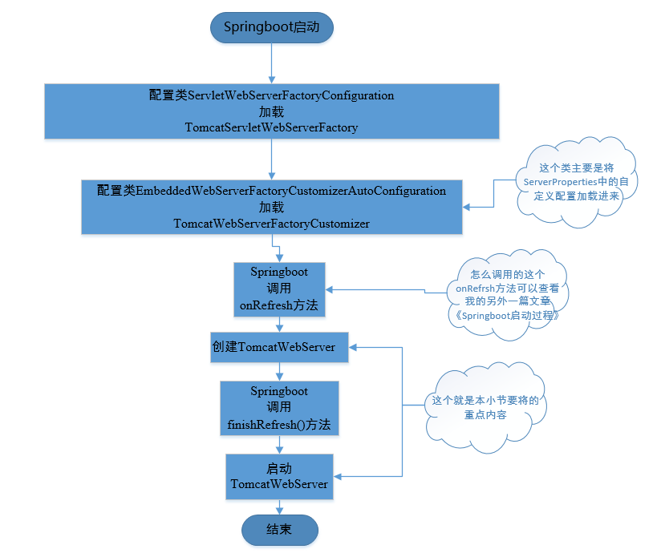

# 前言
找了一圈也没有找到合适内置容器源码解读的文章，就打算自己写一篇，方便后面阅读加深映像
Springboot相对于以前的Spring省去了很多配置xml的麻烦，而且还支持使用内嵌式的Servlet容器，非常的便利。既然这样，为了精准快速的定位问题，以及满足我们膨胀的好奇心，那我们就有必要了解便利的背后是什么操作了，学习高效的策略以便于提升自己嘛，下面我们用Tomcat来探索一下。篇幅较长，请耐心阅读，一定会有收获的。
还可以阅读一下我的另外一篇文章[《自己实现Servlet---我自己的“tomcat”》](https://www.jianshu.com/p/51e678ea3f17)
)，一定能够更好的理解web容器。
# 章节说明
1.内嵌式tomcat配置
配置项分析
2.启动流程
（1）启动主流程
（2）NioEndpoint启动监听
3.处理Http请求
一次http请求的生命周期
# 一、内嵌式tomcat配置
``` java
// 在类org.springframework.boot.autoconfigure.web.ServerProperties可以找到tomcat的相关配置参数
// 日志配置
private final Accesslog accesslog = new Accesslog();
// 授信的地址前缀
private String internalProxies = "10\\.\\d{1,3}\\.\\d{1,3}\\.\\d{1,3}|" // 10/8
				+ "192\\.168\\.\\d{1,3}\\.\\d{1,3}|" // 192.168/16
				+ "169\\.254\\.\\d{1,3}\\.\\d{1,3}|" // 169.254/16
				+ "127\\.\\d{1,3}\\.\\d{1,3}\\.\\d{1,3}|" // 127/8
				+ "172\\.1[6-9]{1}\\.\\d{1,3}\\.\\d{1,3}|" // 172.16/12
				+ "172\\.2[0-9]{1}\\.\\d{1,3}\\.\\d{1,3}|"
				+ "172\\.3[0-1]{1}\\.\\d{1,3}\\.\\d{1,3}|" //
				+ "0:0:0:0:0:0:0:1|::1";

// 请求头协议，一般为"X-Forwarded-Proto"
private String protocolHeader;
// ssl的头协议https
private String protocolHeaderHttpsValue = "https";
// 请求的原始端口号
private String portHeader = "X-Forwarded-Port";
// 请求源ip
private String remoteIpHeader;
// tomcat的文件基地址
private File basedir;
// 定期调用backgroundProcessor方法。backgroundProcessor方法主要用于重新加载Web应用程序的类文件和资源、扫描Session过期
@DurationUnit(ChronoUnit.SECONDS)
private Duration backgroundProcessorDelay = Duration.ofSeconds(10);
// 并行线程的最大值
private int maxThreads = 200;
// 最小的闲置线程数
private int minSpareThreads = 10;
// post请求的数据最大值
private DataSize maxHttpPostSize = DataSize.ofMegabytes(2);
// 请求头的最大值，如果是0，则取默认的8kb
private DataSize maxHttpHeaderSize = DataSize.ofBytes(0);
// 请求体数据的最大值
private DataSize maxSwallowSize = DataSize.ofMegabytes(2);
// 请求跳转时是否带上上下文
private Boolean redirectContextRoot = true;
// 是否使用相对的跳转路径
private Boolean useRelativeRedirects;
// 编码格式
private Charset uriEncoding = StandardCharsets.UTF_8;
// 最大的连接数10000
private int maxConnections = 10000;
// 当所有线程在忙的时候，等待队列中请求个数
private int acceptCount = 100;
```
# 二、启动流程
## 2.1 主流程


## 2.2 TomcatServletWebServerFactory
顾名思义它是一个TomcatWebServer的生产工厂，它内部有一个getWebServer的方法，是这个工厂用来生产WebServer的，然后我们需要查看一下它的类继承结构，不然理解上会断层


继承结构图中，我们可以看到它实现了ServletWebServerFactory这个接口。然后我们转到Springboot其中过程中的onRefresh方法中
``` java
protected void onRefresh() {
		super.onRefresh();
		try {// 创建WebServer
			createWebServer();
		}
		catch (Throwable ex) {
			throw new ApplicationContextException("Unable to start web server", ex);
		}
	}
```
``` java
private void createWebServer() {
		WebServer webServer = this.webServer;
        // 获取容器的上下文信息
		ServletContext servletContext = getServletContext();
        // 上下文对象和server对象都还没有初始化的话，通过工厂进行生成webserver
		if (webServer == null && servletContext == null) {
        	// 从spring容器中获取server的生产工厂
			ServletWebServerFactory factory = getWebServerFactory();
            // 调用工厂的方法去生产server
            // getSelfInitializer采用了lamda表达式去实现了初始化方法，下面稍微说一下
			this.webServer = factory.getWebServer(getSelfInitializer());
		}
        // 如果上下文不是空的，那么可能就是tomcat初始化失败了，可以使用上下文去初始化tomcat
        // 小小的推敲一下，说明tomcat的启动的基本信息都可以在context里面找到
		else if (servletContext != null) {
			try {
				getSelfInitializer().onStartup(servletContext);
			}
			catch (ServletException ex) {
				throw new ApplicationContextException("Cannot initialize servlet context",
						ex);
			}
		}
		initPropertySources();
	}
```
``` java
	protected ServletWebServerFactory getWebServerFactory() {
		// 从容器中获取所有实现了ServletWebServerFactory接口的bean，刚才我们看了类结构
        // TomcatServletWebServerFactory是实现了ServletWebServerFactory，如果它被容器加载了，然后这里就能获取到它了
		String[] beanNames = getBeanFactory()
				.getBeanNamesForType(ServletWebServerFactory.class);
        // spring容器中必须要存在一个实现接口ServletWebServerFactory的bean
		if (beanNames.length == 0) {
			throw new ApplicationContextException(
					"Unable to start ServletWebServerApplicationContext due to missing "
							+ "ServletWebServerFactory bean.");
		}
        // 如果有好几个实现的bean，也会报错，只允许存在一个，说明在springboot里面是不支持多个servlet容器并存的
		if (beanNames.length > 1) {
			throw new ApplicationContextException(
					"Unable to start ServletWebServerApplicationContext due to multiple "
							+ "ServletWebServerFactory beans : "
							+ StringUtils.arrayToCommaDelimitedString(beanNames));
		}
		return getBeanFactory().getBean(beanNames[0], ServletWebServerFactory.class);
	}
```
``` java
private org.springframework.boot.web.servlet.ServletContextInitializer getSelfInitializer() {
// 看到这里也许有人会疑惑，方法是有返回值的，怎么它返回了void
// 其实它是使用了lamda的匿名实现方式，换种写法可能更容易理解return servletContext->selfInitialize(servletContext)
		return this::selfInitialize;
	}

private void selfInitialize(ServletContext servletContext) throws ServletException {
		prepareWebApplicationContext(servletContext);
		registerApplicationScope(servletContext);
		WebApplicationContextUtils.registerEnvironmentBeans(getBeanFactory(),
				servletContext);
		for (ServletContextInitializer beans : getServletContextInitializerBeans()) {
			beans.onStartup(servletContext);
		}
	}
```
好了这里就到了重点了，开始生产webserver
``` java
@Override
public WebServer getWebServer(ServletContextInitializer... initializers) {
	Tomcat tomcat = new Tomcat();
    // 新建一个tomcat对象之后，开始配置参数，配置连接等
	File baseDir = (this.baseDirectory != null) ? this.baseDirectory
			: createTempDir("tomcat");
	tomcat.setBaseDir(baseDir.getAbsolutePath());
    // 这个Connector也是tomcat的核心，等会2.4小节会仔细分析一下
	Connector connector = new Connector(this.protocol);
	tomcat.getService().addConnector(connector);
	customizeConnector(connector);
	tomcat.setConnector(connector);
	tomcat.getHost().setAutoDeploy(false);
	configureEngine(tomcat.getEngine());
	for (Connector additionalConnector : this.additionalTomcatConnectors) {
		tomcat.getService().addConnector(additionalConnector);
	}
    // 准备上下文对象
	prepareContext(tomcat.getHost(), initializers);
    // 创建webserver
	return getTomcatWebServer(tomcat);
}
```
``` java
public TomcatWebServer(Tomcat tomcat, boolean autoStart) {
	Assert.notNull(tomcat, "Tomcat Server must not be null");
	this.tomcat = tomcat;
	this.autoStart = autoStart;
    // 初始化webserver
	initialize();
}

private void initialize() throws WebServerException {
	logger.info("Tomcat initialized with port(s): " + getPortsDescription(false));
	synchronized (this.monitor) {
		try {
			addInstanceIdToEngineName();

			Context context = findContext();
			context.addLifecycleListener((event) -> {
				if (context.equals(event.getSource())
						&& Lifecycle.START_EVENT.equals(event.getType())) {
					// 将连接从service中的连接移除，并转存到serviceConnectors这个map中
					removeServiceConnectors();
				}
			});

			// 启动tomcat，并触发启动监听事件，然后做一下StandardServer对象的初始化
			this.tomcat.start();

			// 我们可以在这里重新抛出主线程中的异常
			rethrowDeferredStartupExceptions();

			try {
				ContextBindings.bindClassLoader(context, context.getNamingToken(),
						getClass().getClassLoader());
			}
			catch (NamingException ex) {
				// Naming is not enabled. Continue
			}

			// 跟jetty不一样的是，tomcat里面的线程都是守护线程，主线程停止，子线程当即停止
			startDaemonAwaitThread();
		}
		catch (Exception ex) {
			stopSilently();
			throw new WebServerException("Unable to start embedded Tomcat", ex);
		}
	}
}
```
## 2.3 TomcatWebServerFactoryCustomizer
这个类是通过EmbeddedWebServerFactoryCustomizerAutoConfiguration加载进来的，不得不说这个类名是真的长，它主要就是将配置信息加载进来，在onRefresh之前加载。
``` java
// 这个方法有个入参，需要实现了接口ConfigurableTomcatWebServerFactory的bean，如果还没有忘记上面的类结构的话，你就会发现刚才的TomcatServletWebServerFactory也继承并实现了它。简而言之，就是把配置信息加载到TomcatServletWebServerFactory对象中。然后onRefresh的时候才能
public void customize(ConfigurableTomcatWebServerFactory factory) {
		ServerProperties properties = this.serverProperties;
		ServerProperties.Tomcat tomcatProperties = properties.getTomcat();
        // 这个方法里面主要都是配置相关的，没什么特别的
        // 不过PropertyMapper这个类的from when to的写法很有意思，可以模仿一下
		PropertyMapper propertyMapper = PropertyMapper.get();
		propertyMapper.from(tomcatProperties::getBasedir).whenNonNull()
				.to(factory::setBaseDirectory);
		propertyMapper.from(tomcatProperties::getBackgroundProcessorDelay).whenNonNull()
				.as(Duration::getSeconds).as(Long::intValue)
				.to(factory::setBackgroundProcessorDelay);
		customizeRemoteIpValve(factory);
		propertyMapper.from(tomcatProperties::getMaxThreads).when(this::isPositive)
				.to((maxThreads) -> customizeMaxThreads(factory,
						tomcatProperties.getMaxThreads()));
		propertyMapper.from(tomcatProperties::getMinSpareThreads).when(this::isPositive)
				.to((minSpareThreads) -> customizeMinThreads(factory, minSpareThreads));
		propertyMapper.from(this::determineMaxHttpHeaderSize).whenNonNull()
				.asInt(DataSize::toBytes).when(this::isPositive)
				.to((maxHttpHeaderSize) -> customizeMaxHttpHeaderSize(factory,
						maxHttpHeaderSize));
		propertyMapper.from(tomcatProperties::getMaxSwallowSize).whenNonNull()
				.asInt(DataSize::toBytes)
				.to((maxSwallowSize) -> customizeMaxSwallowSize(factory, maxSwallowSize));
		propertyMapper.from(tomcatProperties::getMaxHttpPostSize).asInt(DataSize::toBytes)
				.when((maxHttpPostSize) -> maxHttpPostSize != 0)
				.to((maxHttpPostSize) -> customizeMaxHttpPostSize(factory,
						maxHttpPostSize));
		propertyMapper.from(tomcatProperties::getAccesslog)
				.when(ServerProperties.Tomcat.Accesslog::isEnabled)
				.to((enabled) -> customizeAccessLog(factory));
		propertyMapper.from(tomcatProperties::getUriEncoding).whenNonNull()
				.to(factory::setUriEncoding);
		propertyMapper.from(properties::getConnectionTimeout).whenNonNull()
				.to((connectionTimeout) -> customizeConnectionTimeout(factory,
						connectionTimeout));
		propertyMapper.from(tomcatProperties::getMaxConnections).when(this::isPositive)
				.to((maxConnections) -> customizeMaxConnections(factory, maxConnections));
		propertyMapper.from(tomcatProperties::getAcceptCount).when(this::isPositive)
				.to((acceptCount) -> customizeAcceptCount(factory, acceptCount));
		customizeStaticResources(factory);
		customizeErrorReportValve(properties.getError(), factory);
	}
```
2.4 Connector及其相关
上面的TomcatServletWebServerFactory中有写到Connector的初始化，下面是我摘出来的跟Connector初始化有关的部分，可以看到默认都是采用Http11NioProtocol这个protocol协议
``` java
public static final String DEFAULT_PROTOCOL = "org.apache.coyote.http11.Http11NioProtocol";
private String protocol = DEFAULT_PROTOCOL;
Connector connector = new Connector(this.protocol);
....
// 然后给tomcat对象设置一下connector
tomcat.setConnector(connector);
```
``` java
 public Connector(String protocol) {
        boolean aprConnector = AprLifecycleListener.isAprAvailable() &&
                AprLifecycleListener.getUseAprConnector();
        if ("HTTP/1.1".equals(protocol) || protocol == null) {
            if (aprConnector) {
                protocolHandlerClassName = "org.apache.coyote.http11.Http11AprProtocol";
            } else {
            //好了，我们采用的就是这个，证据充分
                protocolHandlerClassName = "org.apache.coyote.http11.Http11NioProtocol";
            }
        } else if ("AJP/1.3".equals(protocol)) {
            if (aprConnector) {
                protocolHandlerClassName = "org.apache.coyote.ajp.AjpAprProtocol";
            } else {
                protocolHandlerClassName = "org.apache.coyote.ajp.AjpNioProtocol";
            }
        } else {
            protocolHandlerClassName = protocol;
        }

        // Instantiate protocol handler
        ProtocolHandler p = null;
        try {
        	// 获取Http11NioProtocol的class对象
            Class<?> clazz = Class.forName(protocolHandlerClassName);
            // 反射实例化对象
            // Http11NioProtocol的构造函数里面实例化了一个NioEndpoint对象
            p = (ProtocolHandler) clazz.getConstructor().newInstance();
        } catch (Exception e) {
            log.error(sm.getString(
                    "coyoteConnector.protocolHandlerInstantiationFailed"), e);
        } finally {
        	// 将实例化的对象赋值给属性，后面容器启动要用到
            this.protocolHandler = p;
        }

        // Default for Connector depends on this system property
        setThrowOnFailure(Boolean.getBoolean("org.apache.catalina.startup.EXIT_ON_INIT_FAILURE"));
    }
```
Springboot调用finishRefresh()方法会去启动webServer
``` java
private WebServer startWebServer() {
	WebServer webServer = this.webServer;
	if (webServer != null) {
		webServer.start();
	}
	return webServer;
}
@Override
public void start() throws WebServerException {
	synchronized (this.monitor) {
		if (this.started) {
			return;
		}
		try {
        	// 把一开始转存到serviceConnectors这个map中的connector再加回来
			addPreviouslyRemovedConnectors();
			Connector connector = this.tomcat.getConnector();
			if (connector != null && this.autoStart) {
				performDeferredLoadOnStartup();
			}
			checkThatConnectorsHaveStarted();
			this.started = true;
			logger.info("Tomcat started on port(s): " + getPortsDescription(true)
					+ " with context path '" + getContextPath() + "'");
		}
	.........多余的代码就不展示了
	}
}
private void addPreviouslyRemovedConnectors() {
		Service[] services = this.tomcat.getServer().findServices();
		for (Service service : services) {
        // serviceConnectors里面存放的就是一开始被移除的connector
			Connector[] connectors = this.serviceConnectors.get(service);
			if (connectors != null) {
				for (Connector connector : connectors) {
                	// 这里就是重点了，给服务加上连接，但是它不光具备add功能，它在方法内部启动了connector
					service.addConnector(connector);
					if (!this.autoStart) {
						stopProtocolHandler(connector);
					}
				}
				this.serviceConnectors.remove(service);
			}
		}
	}
```
添加连接到连接数组中，并启动连接
``` java
 @Override
    public void addConnector(Connector connector) {

        synchronized (connectorsLock) {
        // 可以发现连接是用的数组存储的，每次增加都需要进行数组拷贝
            connector.setService(this);
            Connector results[] = new Connector[connectors.length + 1];
            System.arraycopy(connectors, 0, results, 0, connectors.length);
            results[connectors.length] = connector;
            connectors = results;
        }

        try {
            if (getState().isAvailable()) {
            // 这里才是我们的重点，启动connector；
            // connector也是继承了LifecycleBase的，查看LifecycleBase的start方法。
                connector.start();
            }
        } catch (LifecycleException e) {
            throw new IllegalArgumentException(
                    sm.getString("standardService.connector.startFailed", connector), e);
        }
        // Report this property change to interested listeners
        support.firePropertyChange("connector", null, connector);
    }
@Override
public final synchronized void start() throws LifecycleException {
    if (LifecycleState.STARTING_PREP.equals(state) || LifecycleState.STARTING.equals(state) ||
            LifecycleState.STARTED.equals(state)) {
        // 打印日志
        if (log.isDebugEnabled()) {
            Exception e = new LifecycleException();
            log.debug(sm.getString("lifecycleBase.alreadyStarted", toString()), e);
        } else if (log.isInfoEnabled()) {
            log.info(sm.getString("lifecycleBase.alreadyStarted", toString()));
        }
        return;
     }
     // 根据状态执行对应的方法，这里面不做展开
     if (state.equals(LifecycleState.NEW)) {
         init();
     } else if (state.equals(LifecycleState.FAILED)) {
         stop();
     } else if (!state.equals(LifecycleState.INITIALIZED) &&
             !state.equals(LifecycleState.STOPPED)) {
         invalidTransition(Lifecycle.BEFORE_START_EVENT);
     }
     try {
         setStateInternal(LifecycleState.STARTING_PREP, null, false);
         // 好了这个就是我们的重点了，在LifecycleBase中它是一个抽象方法，所以直接看Connector里面的方法实现
         startInternal();
         if (state.equals(LifecycleState.FAILED)) {
             // This is a 'controlled' failure. The component put itself into the
             // FAILED state so call stop() to complete the clean-up.
             stop();
         } else if (!state.equals(LifecycleState.STARTING)) {
             // Shouldn't be necessary but acts as a check that sub-classes are
             // doing what they are supposed to.
             invalidTransition(Lifecycle.AFTER_START_EVENT);
         } else {
             setStateInternal(LifecycleState.STARTED, null, false);
         }
        } catch (Throwable t) {
            // This is an 'uncontrolled' failure so put the component into the
            // FAILED state and throw an exception.
            handleSubClassException(t, "lifecycleBase.startFail", toString());
        }
}
@Override
protected void startInternal() throws LifecycleException {
     // Validate settings before starting
    if (getPortWithOffset() < 0) {
        throw new LifecycleException(sm.getString(
                "coyoteConnector.invalidPort", Integer.valueOf(getPortWithOffset())));
    }
    setState(LifecycleState.STARTING);
    try {
    // 这个handler刚才已经赋值过了，是Http11NioProtocol的实例化对象
        protocolHandler.start();
    } catch (Exception e) {
        throw new LifecycleException(
                sm.getString("coyoteConnector.protocolHandlerStartFailed"), e);
    }
}
```
然后我们就来分析一下Http11NioProtocol，它的start隐藏了什么,这个start方法位于它的父类AbstractProtocol中
``` java
 @Override
    public void start() throws Exception {
        if (getLog().isInfoEnabled()) {
            getLog().info(sm.getString("abstractProtocolHandler.start", getName()));
            logPortOffset();
        }
        // 启动endpoint，再往里面看，快到底了
        endpoint.start();
        // 观察超时
        monitorFuture = getUtilityExecutor().scheduleWithFixedDelay(
                new Runnable() {
                    @Override
                    public void run() {
                        if (!isPaused()) {
                            startAsyncTimeout();
                        }
                    }
                }, 0, 60, TimeUnit.SECONDS);
    }
    // start中的内容如下，主要有两个步骤bindWithCleanup和startInternal
   public final void start() throws Exception {
        if (bindState == BindState.UNBOUND) {
        // 这个方法里面调用了一个bind方法，但是是个抽象方法，因为我们前面新建的是NioEndPoint对象，所以去看它的bind实现
            bindWithCleanup();
            bindState = BindState.BOUND_ON_START;
        }
        startInternal();
    }
```
下面是NioEndPoint两个启动的核心方法了
``` java
 @Override
    public void bind() throws Exception {
    	// 这里就证明了HTTP也是封装了socket
        // 不过这里还没有开始接收请求呢，要等下面的方法才开启接收
        initServerSocket();
        setStopLatch(new CountDownLatch(1));
        // 如果必要的话初始化一下ssl
        initialiseSsl();
        selectorPool.open(getName());
    }
protected void initServerSocket() throws Exception {
        if (!getUseInheritedChannel()) {
         	// 初始化开启serverSocket的通道
            serverSock = ServerSocketChannel.open();
            socketProperties.setProperties(serverSock.socket());
            InetSocketAddress addr = new InetSocketAddress(getAddress(), getPortWithOffset());
            serverSock.socket().bind(addr,getAcceptCount());
        } else {
            // 系统的通道
            Channel ic = System.inheritedChannel();
            if (ic instanceof ServerSocketChannel) {
                serverSock = (ServerSocketChannel) ic;
            }
            if (serverSock == null) {
                throw new IllegalArgumentException(sm.getString("endpoint.init.bind.inherited"));
            }
        }
        // serverSock.configureBlocking(true);它设置成了阻塞模式
        // 后面开启accept就会一直阻塞到由请求过来
        serverSock.configureBlocking(true); //mimic APR behavior
    }
```
``` java
@Override
    public void startInternal() throws Exception {
        if (!running) {
        	// 先设置一下标志位
            running = true;
            paused = false;
            if (socketProperties.getProcessorCache() != 0) {
                processorCache = new SynchronizedStack<>(SynchronizedStack.DEFAULT_SIZE,
                        socketProperties.getProcessorCache());
            }
            if (socketProperties.getEventCache() != 0) {
                eventCache = new SynchronizedStack<>(SynchronizedStack.DEFAULT_SIZE,
                        socketProperties.getEventCache());
            }
            if (socketProperties.getBufferPool() != 0) {
                nioChannels = new SynchronizedStack<>(SynchronizedStack.DEFAULT_SIZE,
                        socketProperties.getBufferPool());
            }
            // 创建工作线程池
            if (getExecutor() == null) {
                createExecutor();
            }
            // 初始化连接限制，默认 maxConnections=10000
            initializeConnectionLatch();

            // 启动轮询线程，内部有一个通道选择器，selector和socketChannel要绑定一下，可以补一下nio的相关知识哦
            poller = new Poller();
            Thread pollerThread = new Thread(poller, getName() + "-ClientPoller");
            pollerThread.setPriority(threadPriority);
            pollerThread.setDaemon(true);
            pollerThread.start();
            // 新建Acceptor对象，Acceptor是实现了Runnable接口的
            // 它的run方法实现了最终调用了serverSock.accept()
            // 但是initServerSocket里面设置了阻塞模式，当没有事件进来的时候会一直阻塞
            // 每当有请求进来的时候就会组装报文对象---NioSocketWrapper
            startAcceptorThread();
        }
    }
```
推荐可以仔细的阅读一下NioEndPoint，类的位置在package org.apache.tomcat.util.net中，尤其是里面的几个内部类如：PollerEvent轮询事件，Poller轮询器，NioSocketWrapper对socket的读写包装，SocketProcessor是scoket的处理器

因为上面只说到了socketChannel的初始化和accept，没有将scoketChannel和selector绑定，所以我们展开说一下Poller,它实现了Runnable接口，上面的流程中有： pollerThread.start()，所以我们进去看它的run方法
``` java
  @Override
        public void run() {
            // 死循环，直到线程死亡，或者被中断
            while (true) {
            // 设置事件标志，默认是没有事件
                boolean hasEvents = false;
                try {
                    if (!close) {
                    // events方法在下面有展开
                        hasEvents = events();
                        if (wakeupCounter.getAndSet(-1) > 0) {
                            // If we are here, means we have other stuff to do
                            // Do a non blocking select
                            keyCount = selector.selectNow();
                        } else {
                            keyCount = selector.select(selectorTimeout);
                        }
                        wakeupCounter.set(0);
                    }
                    //....................................................
                   // 在不影响阅读的情况下省略了部分代码，有需要的话可以去看一下源码
                Iterator<SelectionKey> iterator =
                    keyCount > 0 ? selector.selectedKeys().iterator() : null;
            // 下面的流程就是tomcat处理http请求的流程了
            // processKey这个方法等会会详细分析
            while (iterator != null && iterator.hasNext()) {
                SelectionKey sk = iterator.next();
                NioSocketWrapper socketWrapper = (NioSocketWrapper) sk.attachment();
                // Attachment may be null if another thread has called
                // cancelledKey()
                if (socketWrapper == null) {
                    iterator.remove();
                } else {
                    iterator.remove();
                    processKey(sk, socketWrapper);
                }
            }
            // 处理超时问题
            timeout(keyCount,hasEvents);
        }
        getStopLatch().countDown();
	}

 public boolean events() {
            boolean result = false;
            PollerEvent pe = null;
            for (int i = 0, size = events.size(); i < size && (pe = events.poll()) != null; i++ ) {
            // 有事件的时候返回值就是true了
                result = true;
                try {
                // 这个地方发现事件继承了Runnable接口其实是个幌子，它直接调用了run方法，真尴尬
                    pe.run();
                    pe.reset();
                    if (running && !paused && eventCache != null) {
                        eventCache.push(pe);
                    }
                } catch ( Throwable x ) {
                    log.error(sm.getString("endpoint.nio.pollerEventError"), x);
                }
            }
            return result;
        }
 @Override
public void run() {
        if (interestOps == OP_REGISTER) {
            try {
            // 这里通道就和selector绑定了，产生SelectionKey对象，存在SelectorImpl的Set中
            // poller的run方法中就可以获取到它了,然后processKey方法就可以处理请求了
                socket.getIOChannel().register(socket.getSocketWrapper().getPoller().getSelector(),
                SelectionKey.OP_READ, socket.getSocketWrapper());
            } catch (Exception x) {
                log.error(sm.getString("endpoint.nio.registerFail"), x);
            }
        } else {
        // 这里的代码就不展示了，因为我们上面 有这个步骤 r.reset(socket, OP_REGISTER)，所以if()条件一定成立
        }
	}
```
# 三、处理Http请求


第三节分三个部分（1）请求预处理（2）请求解析（3）请求处理
## 3.1 请求预处理
请求预处理中我们将会看到，tomcat是怎么做解析准备，然后怎么提交给线程池处理请求的
上面的Poller的run方法中还有一段代码没解释，其中有一个步骤： processKey(sk, socketWrapper)，这个步骤就是开始处理http请求了
``` java
protected void processKey(SelectionKey sk, NioSocketWrapper socketWrapper) {
// 这个方法里面没有做任何相关的请求解析
// 做了三个判断close（endPoint被关闭），isReadable（是否读操作），getSendfileData（是否发送文件）
// 然后调用如下方法
       processSocket(socketWrapper, SocketEvent.OPEN_READ, true)
    }
// processSocket也只是创建了Processor，并通过开始创建好的线程池给Processor分配线程
 public boolean processSocket(SocketWrapperBase<S> socketWrapper,
            SocketEvent event, boolean dispatch) {
        try {
            if (socketWrapper == null) {
                return false;
            }
            SocketProcessorBase<S> sc = null;
            // 从栈里面提取出来一个一直在排队的栈，避免被插队
            if (processorCache != null) {
                sc = processorCache.pop();
            }
            if (sc == null) {
            // 新建一个处理器,下面我们展开看看SocketProcessor类
                sc = createSocketProcessor(socketWrapper, event);
            } else {
                sc.reset(socketWrapper, event);
            }
            Executor executor = getExecutor();
            // 也可以设置不分配，不分配的直接调用处理器的run方法
            if (dispatch && executor != null) {
            // 线程池分配线程执行处理器，从这里可以看出，如果线程池所有线程都被占用了，就只能等着了
                executor.execute(sc);
            } else {
                sc.run();
            }
        } catch (RejectedExecutionException ree) {
            getLog().warn(sm.getString("endpoint.executor.fail", socketWrapper) , ree);
            return false;
        } catch (Throwable t) {
            ExceptionUtils.handleThrowable(t);
            // This means we got an OOM or similar creating a thread, or that
            // the pool and its queue are full
            getLog().error(sm.getString("endpoint.process.fail"), t);
            return false;
        }
        return true;
    }
```
SocketProcessor的类信息详细解释一下
``` java
 protected class SocketProcessor extends SocketProcessorBase<NioChannel> {
        public SocketProcessor(SocketWrapperBase<NioChannel> socketWrapper, SocketEvent event) {
            super(socketWrapper, event);
        }
        // 父类中的run方法会调用它
        @Override
        protected void doRun() {
            NioChannel socket = socketWrapper.getSocket();
            SelectionKey key = socket.getIOChannel().keyFor(socket.getSocketWrapper().getPoller().getSelector());
            Poller poller = NioEndpoint.this.poller;
            if (poller == null) {
                socketWrapper.close();
                return;
            }
            try {
                int handshake = -1;
                try {
                // 状态标志设置
                    if (key != null) {
                        if (socket.isHandshakeComplete()) {
                            handshake = 0;
                        } else if (event == SocketEvent.STOP || event == SocketEvent.DISCONNECT ||
                                event == SocketEvent.ERROR) {
                            handshake = -1;
                        } else {
                        // 这里handshake=0，正常流程都进到了这里
                            handshake = socket.handshake(key.isReadable(), key.isWritable());
                            event = SocketEvent.OPEN_READ;
                        }
                    }
                } catch (IOException x) {
                    handshake = -1;
                    if (log.isDebugEnabled()) log.debug("Error during SSL handshake",x);
                } catch (CancelledKeyException ckx) {
                    handshake = -1;
                }
                if (handshake == 0) {
                    SocketState state = SocketState.OPEN;
                    // 处理来自socket的请求
                    if (event == null) {
                        state = getHandler().process(socketWrapper, SocketEvent.OPEN_READ);
                    } else {
                    // 然后Handler去处理事件报文了，下一个小节我们去找一下ConnectorHandler
                    // 看它是怎么处理的
                        state = getHandler().process(socketWrapper, event);
                    }
                    if (state == SocketState.CLOSED) {
                        poller.cancelledKey(key, socketWrapper);
                    }
                } else if (handshake == -1 ) {
                    poller.cancelledKey(key, socketWrapper);
                } else if (handshake == SelectionKey.OP_READ){
                    socketWrapper.registerReadInterest();
                } else if (handshake == SelectionKey.OP_WRITE){
                    socketWrapper.registerWriteInterest();
                }
            } catch (CancelledKeyException cx) {
                poller.cancelledKey(key, socketWrapper);
            } catch (VirtualMachineError vme) {
                ExceptionUtils.handleThrowable(vme);
            } catch (Throwable t) {
                log.error(sm.getString("endpoint.processing.fail"), t);
                poller.cancelledKey(key, socketWrapper);
            } finally {
                socketWrapper = null;
                event = null;
                //return to cache
                if (running && !paused && processorCache != null) {
                    processorCache.push(this);
                }
            }
        }
    }
```
注意这个process方法真的特别长，有250多行，为了避免方法过长影响理解，我将有些非主流程的代码用中文注释带过了
``` java
public SocketState process(SocketWrapperBase<S> wrapper, SocketEvent status) {
            // (1)打印debug日志，socket的事件状态日志
            // (2)wrapper判断是否为空，为空直接 return SocketState.CLOSED;
            S socket = wrapper.getSocket();
            // 这个东西我尝试相同的同步请求，请求了几次，发现每次都是拿到空的对象
            // 然后发现是异步的才会可能获取到
            // 下面有提到connections是用来建立socket和processor联系的map
            Processor processor = connections.get(socket);
            // (3)打印debug日志，processor的相关日志
            // 超时情形下三种会触发：
            // a）.processor为空，
            // b）.processor是异步的，还有一种
            // c）.Async 的超时用另外一个线程来计算和处理
            // 然后因为是异步处理的，有时候超时的话就不再需要反馈信息
            // 这里检查一下，避免再去处理
            if (SocketEvent.TIMEOUT == status && (processor == null ||
                    !processor.isAsync() || !processor.checkAsyncTimeoutGeneration())) {
                // 这是一个有效的空指令
                return SocketState.OPEN;
            }
            // 满足processor是同步的和processor需要超时信息的反馈
            if (processor != null) {
                // 确保异步超时不会被触发
                getProtocol().removeWaitingProcessor(processor);
            } else if (status == SocketEvent.DISCONNECT || status == SocketEvent.ERROR) {
                // 连接断开，或者异常了，就不做处理，直接返回关闭的socket状态
                return SocketState.CLOSED;
            }
            // 容器做一下标记
            ContainerThreadMarker.set();
            try {
                if (processor == null) {
                    String negotiatedProtocol = wrapper.getNegotiatedProtocol();
                    // OpenSSL 通常返回空， JSSE通常返回“”，如果没有商定协议的话
                    if (negotiatedProtocol != null && negotiatedProtocol.length() > 0) {
                        UpgradeProtocol upgradeProtocol =
                                getProtocol().getNegotiatedProtocol(negotiatedProtocol);
                        if (upgradeProtocol != null) {
                            processor = upgradeProtocol.getProcessor(
                                    wrapper, getProtocol().getAdapter());
                        } else if (negotiatedProtocol.equals("http/1.1")) {
                            // 这里不做处理，在下面获取processor，http1.1是默认的协议
                        } else {
                            // openssl 1.0.2的alpn回调不支持握手失败，如果无法协商任何协议
                            // 则会出现错误。因此，我们需要断开这里的连接。
                            if (getLog().isDebugEnabled()) {
                                getLog().debug(sm.getString(
                                    "abstractConnectionHandler.negotiatedProcessor.fail",
                                    negotiatedProtocol));
                            }
                            return SocketState.CLOSED;
                            /*
                             * 如果使用了openssl 1.1.0那我们用这里的代码块替换上面的代码
                            // Failed to create processor. This is a bug.
                            throw new IllegalStateException(sm.getString(
                                    "abstractConnectionHandler.negotiatedProcessor.fail",
                                    negotiatedProtocol));
                            */
                        }
                    }
                }
                // 使用了http 1.1协议的来到了这里
                if (processor == null) {
                    processor = recycledProcessors.pop();
                    // (4)打印debug日志，processor的出栈日志
                }
                if (processor == null) {
                // 没有拿到处理器，则创建一个，并注册，这里我们新建的是Http11Processor对象
                    processor = getProtocol().createProcessor();
                    register(processor);
                }
                // 不是ssl连接的话，里面的对象是空的
                processor.setSslSupport(
                        wrapper.getSslSupport(getProtocol().getClientCertProvider()));

                // 建立socket和processor的映射关系
                connections.put(socket, processor);
                SocketState state = SocketState.CLOSED;
                do {
                // 这里面就要处理报文了，也会返回给远程端返回结果
                    state = processor.process(wrapper, status);
                    if (state == SocketState.UPGRADING) {
                      // 正常情况下不会进到这里，代码就不展示了，有兴趣可以看一下源码
                      // 里面是处理状态是SocketState.UPGRADING的代码逻辑
                    }
                } while ( state == SocketState.UPGRADING);

                if (state == SocketState.LONG) {
                    // 在长轮询中获取结果时，保持socket和processor的联系
                    longPoll(wrapper, processor);
                    if (processor.isAsync()) {
                        getProtocol().addWaitingProcessor(processor);
                    }
                } else if (state == SocketState.OPEN) {
                    // 一般的http请求都会进到这里，轮询下一个请求
                    connections.remove(socket);
                    release(processor);
                    wrapper.registerReadInterest();
                } else if (state == SocketState.SENDFILE) {
                    // 如果是还在发送文件，则需要等文件发送完
                }
           // 再次省略部分代码
            } finally {
            // 清除标记
                ContainerThreadMarker.clear();
            }
            // 移除socket和processor的联系
            connections.remove(socket);
            // 回收processor
            release(processor);
            return SocketState.CLOSED;
        }
```
## 3.2 请求解析
内嵌的tomcat中有两种处理器：AjpProcessor和Http11Processor，因为我们采用的http1.1协议，采用Http11Processor，类结构如下：


processor的报文处理方法process，在AbstractProcessorLight这个抽象类中

``` java
public SocketState process(SocketWrapperBase<?> socketWrapper, SocketEvent status)
            throws IOException {
        SocketState state = SocketState.CLOSED;
        Iterator<DispatchType> dispatches = null;
        do {
            if (dispatches != null) {
                DispatchType nextDispatch = dispatches.next();
                state = dispatch(nextDispatch.getSocketStatus());
            } else if (status == SocketEvent.DISCONNECT) {
                // 断开连接了就不用管了
            } else if (isAsync() || isUpgrade() || state == SocketState.ASYNC_END) {
                state = dispatch(status);
                if (state == SocketState.OPEN) {
                    // 可能存在管道数据需要读取
                    state = service(socketWrapper);
                }
            } else if (status == SocketEvent.OPEN_WRITE) {
                // 异步处理后提取写事件
                state = SocketState.LONG;
            } else if (status == SocketEvent.OPEN_READ){
            // 因为我们前面SocketEvent是OPEN_READ，所以直接看这里
            // 这里socketWrapper还没有转成request和response
                state = service(socketWrapper);
            } else {
                // 默认处理，关闭socket
                state = SocketState.CLOSED;
            }
            // ....................
            // 打日志之类的处理就省略了
        } while (state == SocketState.ASYNC_END ||
                dispatches != null && state != SocketState.CLOSED);
        return state;
    }
```
在看Http11Processor类里面的service方法，又是一个200多行的超长方法
这些解析的方法行数都特别多
http请求分为三个部分，请求行+请求头+请求体
``` java
public SocketState service(SocketWrapperBase<?> socketWrapper)
        throws IOException {
        // request = new Request();
        RequestInfo rp = request.getRequestProcessor();
        rp.setStage(org.apache.coyote.Constants.STAGE_PARSE);
        // 初始化io
        setSocketWrapper(socketWrapper);
        inputBuffer.init(socketWrapper);
        outputBuffer.init(socketWrapper);
        // 初始化标志
        keepAlive = true;
        openSocket = false;
        readComplete = true;
        boolean keptAlive = false;
        SendfileState sendfileState = SendfileState.DONE;
        while (!getErrorState().isError() && keepAlive && !isAsync() && upgradeToken == null &&
                sendfileState == SendfileState.DONE && !protocol.isPaused()) {
            // 处理请求头
            try {
            // 解析请求行的过程就在parseRequestLine这个方法里
                if (!inputBuffer.parseRequestLine(keptAlive, protocol.getConnectionTimeout(),
                        protocol.getKeepAliveTimeout())) {
                    if (inputBuffer.getParsingRequestLinePhase() == -1) {
                        return SocketState.UPGRADING;
                    } else if (handleIncompleteRequestLineRead()) {
                        break;
                    }
                }
                if (protocol.isPaused()) {
                    // 503 - Service unavailable
                    response.setStatus(503);
                    setErrorState(ErrorState.CLOSE_CLEAN, null);
                } else {
                    keptAlive = true;
                    // 请求头中的数据条目数默认最大100条
                    request.getMimeHeaders().setLimit(protocol.getMaxHeaderCount());
                    // 解析请求头
                    if (!inputBuffer.parseHeaders()) {
                        //解析到一半的情况
                        openSocket = true;
                        readComplete = false;
                        break;
                    }
                    if (!protocol.getDisableUploadTimeout()) {
                        socketWrapper.setReadTimeout(protocol.getConnectionUploadTimeout());
                    }
                }
            } catch (IOException e) {
                // 打印debug日志，代码省略
                setErrorState(ErrorState.CLOSE_CONNECTION_NOW, e);
                break;
            } catch (Throwable t) {
                ExceptionUtils.handleThrowable(t);
                UserDataHelper.Mode logMode = userDataHelper.getNextMode();
                if (logMode != null) {
                    String message = sm.getString("http11processor.header.parse");
                    switch (logMode) {
                        case INFO_THEN_DEBUG:
                            message += sm.getString("http11processor.fallToDebug");
                            //$FALL-THROUGH$
                        case INFO:
                            log.info(message, t);
                            break;
                        case DEBUG:
                            log.debug(message, t);
                    }
                }
                // 400 - Bad Request
                response.setStatus(400);
                setErrorState(ErrorState.CLOSE_CLEAN, t);
            }
            // ......................
            // 请求有upgrade的情况处理，代码不展示

            if (getErrorState().isIoAllowed()) {
                // 设置过滤器，并处理一些请求头
                rp.setStage(org.apache.coyote.Constants.STAGE_PREPARE);
                try {
                // 准备request，处理编码啊，异常，长度等情况
                // 在Http11Processor初始化的过程中，会新建很多过滤器
                // 过滤器存在一个数组中，第一个过滤器是IdentityInputFilter，默认就采用它
                // 在后面需要取用请求体的时候才真正的解析，这里只是选用那个解析过滤器
                    prepareRequest();
                } catch (Throwable t) {
                    ExceptionUtils.handleThrowable(t);
                    if (log.isDebugEnabled()) {
                        log.debug(sm.getString("http11processor.request.prepare"), t);
                    }
                    // 500 - Internal Server Error
                    response.setStatus(500);
                    setErrorState(ErrorState.CLOSE_CLEAN, t);
                }
            }
            // 同时存活的请求上限处理，默认100，代码省略
            if (getErrorState().isIoAllowed()) {
               rp.setStage(org.apache.coyote.Constants.STAGE_SERVICE);
               //处理请求，这里socketWrapper已经转成request和response了
               getAdapter().service(request, response);
            }
          //request收尾工作，代码省略
    }
```
请求行解析的详细过程如下，请求头的解析过程类似，就不详细展开了
``` java
boolean parseRequestLine(boolean keptAlive, int connectionTimeout, int keepAliveTimeout)
            throws IOException {
        // 是否正在解析
        if (!parsingRequestLine) {
            return true;
        }
        // 跳过空行，\r或者\n都表示空行
        if (parsingRequestLinePhase < 2) {
            byte chr = 0;
            do {
                // 读取后面的bytes
                if (byteBuffer.position() >= byteBuffer.limit()) {
                    if (keptAlive) {
                        // 不在读入bytes，直接设置keepAliveTimeout
                        wrapper.setReadTimeout(keepAliveTimeout);
                    }
                    // byteBuffer的position和limit设置
                    if (!fill(false)) {
                        // 读取处于挂起状态，因此不再处于初始状态
                        parsingRequestLinePhase = 1;
                        return false;
                    }
                    // 至少一个byte收到了，设置一下connectionTimeout
                    wrapper.setReadTimeout(connectionTimeout);
                }
                if (!keptAlive && byteBuffer.position() == 0 && byteBuffer.limit() >= CLIENT_PREFACE_START.length - 1) {
                    boolean prefaceMatch = true;
                    for (int i = 0; i < CLIENT_PREFACE_START.length && prefaceMatch; i++) {
                        if (CLIENT_PREFACE_START[i] != byteBuffer.get(i)) {
                            prefaceMatch = false;
                        }
                    }
                    if (prefaceMatch) {
                        // 匹配到HTTP/2的序言
                        parsingRequestLinePhase = -1;
                        return false;
                    }
                }
                // 设置一下request的起始时间
                if (request.getStartTime() < 0) {
                    request.setStartTime(System.currentTimeMillis());
                }
                // 继续读取byteBuffer中的值
                chr = byteBuffer.get();
                // \r或者\n都表示空行
            } while ((chr == Constants.CR) || (chr == Constants.LF));
            // 位置往前挪一位
            byteBuffer.position(byteBuffer.position() - 1);
            parsingRequestLineStart = byteBuffer.position();
            parsingRequestLinePhase = 2;
            // 接收到的请求打印出来，默认的编码格式ISO_8859_1
            if (log.isDebugEnabled()) {
                log.debug("Received ["
                        + new String(byteBuffer.array(), byteBuffer.position(), byteBuffer.remaining(),
                         StandardCharsets.ISO_8859_1) + "]");
            }
        }
        if (parsingRequestLinePhase == 2) {
            // 读取请求方法名，如POST，GET
            boolean space = false;
            while (!space) {
                if (byteBuffer.position() >= byteBuffer.limit()) {
                    if (!fill(false)) // byteBuffer的position和limit设置
                        return false;
                }
                // Spec says method name is a token followed by a single SP but
                // also be tolerant of multiple SP and/or HT.
                int pos = byteBuffer.position();
                byte chr = byteBuffer.get();
                if (chr == Constants.SP || chr == Constants.HT) {
                    space = true;
                    // 这里获取到请求方法名
                    request.method().setBytes(byteBuffer.array(), parsingRequestLineStart,
                            pos - parsingRequestLineStart);
                } else if (!HttpParser.isToken(chr)) {
                    byteBuffer.position(byteBuffer.position() - 1);
                    // 避免未知的协议导致异常出现
                    request.protocol().setString(Constants.HTTP_11);
                    throw new IllegalArgumentException(sm.getString("iib.invalidmethod"));
                }
            }
            parsingRequestLinePhase = 3;
        }
        if (parsingRequestLinePhase == 3) {
        // 第三部分是个空格，代码也是重复就不展示了
        }
        if (parsingRequestLinePhase == 4) {
            int end = 0;
            // 读取URI信息
            boolean space = false;
            while (!space) {
                if (byteBuffer.position() >= byteBuffer.limit()) {
                    if (!fill(false))
                        return false;
                }
                int pos = byteBuffer.position();
                byte chr = byteBuffer.get();
                if (chr == Constants.SP || chr == Constants.HT) {
                    space = true;
                    end = pos;
                } else if (chr == Constants.CR || chr == Constants.LF) {
                    // HTTP/0.9处理方式
                    parsingRequestLineEol = true;
                    space = true;
                    end = pos;
                } else if (chr == Constants.QUESTION && parsingRequestLineQPos == -1) {
                    parsingRequestLineQPos = pos;
                } else if (parsingRequestLineQPos != -1 && !httpParser.isQueryRelaxed(chr)) {
                    // 避免未知的协议导致异常出现
                    request.protocol().setString(Constants.HTTP_11);
                    throw new IllegalArgumentException(sm.getString("iib.invalidRequestTarget"));
                } else if (httpParser.isNotRequestTargetRelaxed(chr)) {
                    // 避免未知的协议导致异常出现
                    request.protocol().setString(Constants.HTTP_11);
                    throw new IllegalArgumentException(sm.getString("iib.invalidRequestTarget"));
                }
            }
            //请求参数和路径
            if (parsingRequestLineQPos >= 0) {
                request.queryString().setBytes(byteBuffer.array(), parsingRequestLineQPos + 1,
                        end - parsingRequestLineQPos - 1);
                request.requestURI().setBytes(byteBuffer.array(), parsingRequestLineStart,
                        parsingRequestLineQPos - parsingRequestLineStart);
            } else {
                request.requestURI().setBytes(byteBuffer.array(), parsingRequestLineStart,
                        end - parsingRequestLineStart);
            }
            parsingRequestLinePhase = 5;
        }
        if (parsingRequestLinePhase == 5) {
         // 第五部分是个空格，代码也是重复就不展示了
        }
        if (parsingRequestLinePhase == 6) {
           //请求行的最后一个部分，是http协议
            while (!parsingRequestLineEol) {
                if (byteBuffer.position() >= byteBuffer.limit()) {
                    if (!fill(false))
                        return false;
                }
                int pos = byteBuffer.position();
                byte chr = byteBuffer.get();
                if (chr == Constants.CR) {
                    end = pos;
                } else if (chr == Constants.LF) {
                    if (end == 0) {
                        end = pos;
                    }
                    parsingRequestLineEol = true;
                } else if (!HttpParser.isHttpProtocol(chr)) {
                    throw new IllegalArgumentException(sm.getString("iib.invalidHttpProtocol"));
                }
            }
            if ((end - parsingRequestLineStart) > 0) {
            // 设置协议信息
                request.protocol().setBytes(byteBuffer.array(), parsingRequestLineStart,
                        end - parsingRequestLineStart);
            } else {
                request.protocol().setString("");
            }
            parsingRequestLine = false;
            parsingRequestLinePhase = 0;
            parsingRequestLineEol = false;
            parsingRequestLineStart = 0;
            return true;
        }
        throw new IllegalStateException(
                "Invalid request line parse phase:" + parsingRequestLinePhase);
    }
```
## 3.3 请求处理
service方法在CoyoteAdapter类中，方法中代码行数太多，避免看的难受，就省略部分
``` java
public void service(org.apache.coyote.Request req, org.apache.coyote.Response res)
            throws Exception {
        Request request = (Request) req.getNote(ADAPTER_NOTES);
        Response response = (Response) res.getNote(ADAPTER_NOTES);
        if (request == null) {
            // 创建对象
            request = connector.createRequest();
            request.setCoyoteRequest(req);
            response = connector.createResponse();
            response.setCoyoteResponse(res);
            // 请求和返回互相绑定
            request.setResponse(response);
            response.setRequest(request);
            // 记录此时的request和response对象
            req.setNote(ADAPTER_NOTES, request);
            res.setNote(ADAPTER_NOTES, response);
            // 设置请求编码方式
            req.getParameters().setQueryStringCharset(connector.getURICharset());
        }
        if (connector.getXpoweredBy()) {
        // 这个东西通常需要隐藏，不然会显示你的编码语言，不安全
            response.addHeader("X-Powered-By", POWERED_BY);
        }
        boolean async = false;
        boolean postParseSuccess = false;
        req.getRequestProcessor().setWorkerThreadName(THREAD_NAME.get());
        try {
            // Parse and set Catalina and configuration specific request parameters
            postParseSuccess = postParseRequest(req, request, res, response);
            if (postParseSuccess) {
                //检查是否支持异步，并设置参数
                request.setAsyncSupported(
                        connector.getService().getContainer().getPipeline().isAsyncSupported());
                // 使用Container去处理请求
                // getFirst的返回对象是Valve，在Tomcat初始化的时候存放在容器中
                // 在TomcatWebServerFactoryCustomizer这个类中可以看到几个
                // 还有一些是直接通过Pipeline接口注入进来的
                // 请求流程中涉及到的主要有：StandardEngineValve，ErrorReportValve，StandardHostValve
                // AuthenticatorBase,StandardContextValve,StandardWrapperValve
                connector.getService().getContainer().getPipeline().getFirst().invoke(
                        request, response);
            }
            if (request.isAsync()) {
               // 异步的处理方式，不做展开，有兴趣的可以去看一下源码
            } else {
                request.finishRequest();
                response.finishResponse();
            }

        } catch (IOException e) {
            // Ignore
        } finally {
            AtomicBoolean error = new AtomicBoolean(false);
            res.action(ActionCode.IS_ERROR, error);
            if (request.isAsyncCompleting() && error.get()) {
                res.action(ActionCode.ASYNC_POST_PROCESS,  null);
                async = false;
            }
         	// Access的日志，代码省略
            req.getRequestProcessor().setWorkerThreadName(null);
            // 手动回收，减少GC
            if (!async) {
                updateWrapperErrorCount(request, response);
                request.recycle();
                response.recycle();
            }
        }
    }
```
StandardWrapperValve是pipeline中的最后一个Valve实现类
它的invoke方法内有创建拦截链的信息以及调用拦截链的doFilter
``` java
 ApplicationFilterChain filterChain =
                ApplicationFilterFactory.createFilterChain(request, wrapper, servlet);
filterChain.doFilter(request.getRequest(),
                                    response.getResponse());
```
然后doFilter又调用了internalDoFilter
``` java
 private void internalDoFilter(ServletRequest request,
                                  ServletResponse response)
        throws IOException, ServletException {
        // 拦截链是一个数组，一个个执行下去
        if (pos < n) {
            ApplicationFilterConfig filterConfig = filters[pos++];
            try {
                Filter filter = filterConfig.getFilter();
                if (request.isAsyncSupported() && "false".equalsIgnoreCase(
                        filterConfig.getFilterDef().getAsyncSupported())) {
                    request.setAttribute(Globals.ASYNC_SUPPORTED_ATTR, Boolean.FALSE);
                }
                if( Globals.IS_SECURITY_ENABLED ) {
                    final ServletRequest req = request;
                    final ServletResponse res = response;
                    Principal principal =
                        ((HttpServletRequest) req).getUserPrincipal();
                    Object[] args = new Object[]{req, res, this};
                    SecurityUtil.doAsPrivilege ("doFilter", filter, classType, args, principal);
                } else {
                    filter.doFilter(request, response, this);
                }
            } catch (IOException | ServletException | RuntimeException e) {
                throw e;
            } catch (Throwable e) {
                e = ExceptionUtils.unwrapInvocationTargetException(e);
                ExceptionUtils.handleThrowable(e);
                throw new ServletException(sm.getString("filterChain.filter"), e);
            }
            return;
        }
        // 然后拦截链执行完了，开始使用
        try {
            if (ApplicationDispatcher.WRAP_SAME_OBJECT) {
                lastServicedRequest.set(request);
                lastServicedResponse.set(response);
            }
            if (request.isAsyncSupported() && !servletSupportsAsync) {
                request.setAttribute(Globals.ASYNC_SUPPORTED_ATTR,
                        Boolean.FALSE);
            }
            // 这里有两个分支，一个是security的，还有一个是直接调用servlet去执行请求的
            if ((request instanceof HttpServletRequest) &&
                    (response instanceof HttpServletResponse) &&
                    Globals.IS_SECURITY_ENABLED ) {
                final ServletRequest req = request;
                final ServletResponse res = response;
                Principal principal =
                    ((HttpServletRequest) req).getUserPrincipal();
                Object[] args = new Object[]{req, res};
                SecurityUtil.doAsPrivilege("service",
                                           servlet,
                                           classTypeUsedInService,
                                           args,
                                           principal);
            } else {
            // 这里就使用HttpServlet去执行请求了
                servlet.service(request, response);
            }
        } catch (IOException | ServletException | RuntimeException e) {
            throw e;
        } catch (Throwable e) {
            e = ExceptionUtils.unwrapInvocationTargetException(e);
            ExceptionUtils.handleThrowable(e);
            throw new ServletException(sm.getString("filterChain.servlet"), e);
        } finally {
            if (ApplicationDispatcher.WRAP_SAME_OBJECT) {
                lastServicedRequest.set(null);
                lastServicedResponse.set(null);
            }
        }
    }
```
# 总结
文章涵盖了tomcat的启动过程和请求处理流程（包括了报文解析），和SpringMvc的相关流程总算可以串起来了，虽然还有很多地方不是特别清楚，但是对后面定位相关问题，肯定是有巨大帮助的。
后面如果自己写一个容器估计还能对它的理解更深一层。
