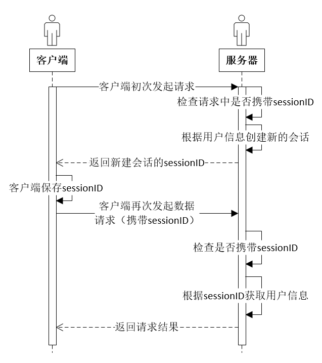

# 前言
现在大多数网站在用户登录之后，在一段时间内就可以免去登录输入密码等操作，非常的方便。这里我以spring-security为样例讲解一下怎么去实现它。
# 实现原理
首先这里我们需要交代一下背后的基础知识，有两个点：session和cookie
（1）当服务器收到客户端请求的时候，服务器会检查客户端的请求中是否包含了先前请求过的会话标示（一般称为sessionId），如果存在先前请求过的会话标示，服务器会去获取该标示对应的会话，如果不存在的话，服务器会根据用户信息重新创建会话，并给客户端返回对应的sessionId。
（2）上面提到服务器会给客户端返回会话标示，那么就需要有对应的字段存放会话标示了，cookie就可以用来存放服务器返回给客户端会话标示。
（3）题外话，session是保存在服务器上的，cookie是保存在客户端（浏览器）上的


# 源码解析
## 用户信息拦截器
spring-security中存在一个用户信息拦截器：UsernamePasswordAuthenticationFilter，每个用户请求都会经过这个拦截器
``` java
public void doFilter(ServletRequest req, ServletResponse res, FilterChain chain)
			throws IOException, ServletException {
		HttpServletRequest request = (HttpServletRequest) req;
		HttpServletResponse response = (HttpServletResponse) res;
        // 判断是否为登录请求
        // 在初始化UsernamePasswordAuthenticationFilter时，已经初始化了一个登录的路径，这里就用那个路径去匹配
		if (!requiresAuthentication(request, response)) {
			chain.doFilter(request, response);
			return;
		}
		if (logger.isDebugEnabled()) {
			logger.debug("Request is to process authentication");
		}
		Authentication authResult;
		try {
        // 进行登录验证，如果验证失败会抛出异常
			authResult = attemptAuthentication(request, response);
			if (authResult == null) {
				// return immediately as subclass has indicated that it hasn't completed
				// authentication
				return;
			}
			sessionStrategy.onAuthentication(authResult, request, response);
		}
		catch (InternalAuthenticationServiceException failed) {
			logger.error(
					"An internal error occurred while trying to authenticate the user.",
					failed);
			unsuccessfulAuthentication(request, response, failed);
			return;
		}
		catch (AuthenticationException failed) {
			// Authentication failed
			unsuccessfulAuthentication(request, response, failed);
			return;
		}
		// Authentication success
		if (continueChainBeforeSuccessfulAuthentication) {
			chain.doFilter(request, response);
		}
        // 如果上面验证成功之后，这里面就需要保存用户的session了
		successfulAuthentication(request, response, chain, authResult);
	}
```

登录成功后的session处理
``` java
protected void successfulAuthentication(HttpServletRequest request,
			HttpServletResponse response, FilterChain chain, Authentication authResult)
			throws IOException, ServletException {

		if (logger.isDebugEnabled()) {
			logger.debug("Authentication success. Updating SecurityContextHolder to contain: "
					+ authResult);
		}

		SecurityContextHolder.getContext().setAuthentication(authResult);
        // rememberMeServices默认有两种形式：PersistentTokenBasedRememberMeServices（持久化token）
        // 和TokenBasedRememberMeServices（内存token），
        // 这里以TokenBasedRememberMeServices为例
		rememberMeServices.loginSuccess(request, response, authResult);

		// Fire event
		if (this.eventPublisher != null) {
			eventPublisher.publishEvent(new InteractiveAuthenticationSuccessEvent(
					authResult, this.getClass()));
		}

		successHandler.onAuthenticationSuccess(request, response, authResult);
	}
```

## “记住我”配置和实现流程
继承类WebSecurityConfigurerAdapter，并复写下面这个方法
``` java
   @Override
    protected void configure(HttpSecurity http) throws Exception {
        http
                .addFilterBefore(interceptor,FilterSecurityInterceptor.class)
                .authorizeRequests()
                .antMatchers("/get/**","/post/**","/delete/**","/put/**").permitAll()
                .antMatchers("/login").permitAll()
                .anyRequest().authenticated()
                .and()
                .formLogin().loginPage("/login").defaultSuccessUrl("/home", true).successHandler(new WCFAuthenticationSuessHandler())
                .failureUrl("/login?error=true").failureHandler(new SimpleUrlAuthenticationFailureHandler("/login?error=true"))
                .and()
                .exceptionHandling().accessDeniedHandler(handler).and()
                .logout().logoutSuccessUrl("/home")
                .invalidateHttpSession(true).clearAuthentication(true)
                // 调用rememberMe()方法之后可以调用相关的配置方法。具体可以查看RememberMeConfigurer类中支持哪些配置
                .and().rememberMe().alwaysRemember(true).tokenValiditySeconds(60*60*48);
    }
```
实现流程
``` java
public void onLoginSuccess(HttpServletRequest request, HttpServletResponse response,
			Authentication successfulAuthentication) {

		String username = retrieveUserName(successfulAuthentication);
		String password = retrievePassword(successfulAuthentication);

		// 这里必须要具有用户名，如果没有用户名它这里的逻辑就不会产生免登陆信息
		if (!StringUtils.hasLength(username)) {
			logger.debug("Unable to retrieve username");
			return;
		}
        // 如果设置了登录后擦除密码，就会从自定义的userDetailsService中根据用户名获取密码
		if (!StringUtils.hasLength(password)) {
			UserDetails user = getUserDetailsService().loadUserByUsername(username);
			password = user.getPassword();

			if (!StringUtils.hasLength(password)) {
				logger.debug("Unable to obtain password for user: " + username);
				return;
			}
		}
        // 设置免登陆超时时间
		int tokenLifetime = calculateLoginLifetime(request, successfulAuthentication);
		long expiryTime = System.currentTimeMillis();
		// 免登陆默认两周
		expiryTime += 1000L * (tokenLifetime < 0 ? TWO_WEEKS_S : tokenLifetime);
        // 制作免登陆的认证信息
		String signatureValue = makeTokenSignature(expiryTime, username, password);
        // 制作免登陆的cookie，并放入response中，然后浏览器就会收到这个cookie，它下次请求时需要携带这个cookie
		setCookie(new String[] { username, Long.toString(expiryTime), signatureValue },
				tokenLifetime, request, response);

		if (logger.isDebugEnabled()) {
			logger.debug("Added remember-me cookie for user '" + username
					+ "', expiry: '" + new Date(expiryTime) + "'");
		}
	}
```
## 通过cookie获取session
RememberMeAuthenticationFilter这个拦截器会使用rememberMeService的自动登录方法
``` java
public void doFilter(ServletRequest req, ServletResponse res, FilterChain chain)
			throws IOException, ServletException {
		HttpServletRequest request = (HttpServletRequest) req;
		HttpServletResponse response = (HttpServletResponse) res;
        // 如果上下文中包含了用户信息，那么就直接完成验证，也不需要再进入到下面的拦截器里面了
        // 这里需要注意的是不要把自定义的拦截器放在它后面了，不然就不起作用了
		if (SecurityContextHolder.getContext().getAuthentication() == null) {
        // 调用rememberMeService的自动登录方法
			Authentication rememberMeAuth = rememberMeServices.autoLogin(request,
					response);
       if (rememberMeAuth != null) {
				// Attempt authenticaton via AuthenticationManager
				try {
					rememberMeAuth = authenticationManager.authenticate(rememberMeAuth);
		// 将用户信息保存在threadLocal中，下次获取到用户信息就会通过这个拦截器了，然后就不会进到下一个拦截器了
					SecurityContextHolder.getContext().setAuthentication(rememberMeAuth);

					onSuccessfulAuthentication(request, response, rememberMeAuth);
        // 下面的不是很重要，代码就省了
	    。。。。。。。。
      }
	}
```
解析cookie，然后获取用户信息
``` java
public final Authentication autoLogin(HttpServletRequest request,
			HttpServletResponse response) {
        // 提取请求中的cookie
		String rememberMeCookie = extractRememberMeCookie(request);
		if (rememberMeCookie == null) {
			return null;
		}
		logger.debug("Remember-me cookie detected");
		if (rememberMeCookie.length() == 0) {
			logger.debug("Cookie was empty");
			cancelCookie(request, response);
			return null;
		}
		UserDetails user = null;
		try {
        // 这里会去解析token
			String[] cookieTokens = decodeCookie(rememberMeCookie);
        // 根据cookie获取用户信息
			user = processAutoLoginCookie(cookieTokens, request, response);
        // 校验用户信息
			userDetailsChecker.check(user);
			logger.debug("Remember-me cookie accepted");
			return createSuccessfulAuthentication(request, user);
		}
		catch (CookieTheftException cte) {
			cancelCookie(request, response);
			throw cte;
		}
		catch (UsernameNotFoundException noUser) {
			logger.debug("Remember-me login was valid but corresponding user not found.",
					noUser);
		}
		catch (InvalidCookieException invalidCookie) {
			logger.debug("Invalid remember-me cookie: " + invalidCookie.getMessage());
		}
		catch (AccountStatusException statusInvalid) {
			logger.debug("Invalid UserDetails: " + statusInvalid.getMessage());
		}
		catch (RememberMeAuthenticationException e) {
			logger.debug(e.getMessage());
		}
		cancelCookie(request, response);
		return null;
	}
```
解析cookie
``` java
protected String[] decodeCookie(String cookieValue) throws InvalidCookieException {
		for (int j = 0; j < cookieValue.length() % 4; j++) {
			cookieValue = cookieValue + "=";
		}

		if (!Base64.isBase64(cookieValue.getBytes())) {
			throw new InvalidCookieException(
					"Cookie token was not Base64 encoded; value was '" + cookieValue
							+ "'");
		}

		String cookieAsPlainText = new String(Base64.decode(cookieValue.getBytes()));
        // 根据cookie生成时的分割符号，解析cookie，解析完了就是   用户名：超时时间：认证信息
		String[] tokens = StringUtils.delimitedListToStringArray(cookieAsPlainText,
				DELIMITER);

		if ((tokens[0].equalsIgnoreCase("http") || tokens[0].equalsIgnoreCase("https"))
				&& tokens[1].startsWith("//")) {
			// Assume we've accidentally split a URL (OpenID identifier)
			String[] newTokens = new String[tokens.length - 1];
			newTokens[0] = tokens[0] + ":" + tokens[1];
			System.arraycopy(tokens, 2, newTokens, 1, newTokens.length - 1);
			tokens = newTokens;
		}

		return tokens;
	}
```
根据cookie解析得到的信息去获取用户信息
``` java
protected UserDetails processAutoLoginCookie(String[] cookieTokens,
			HttpServletRequest request, HttpServletResponse response) {
		if (cookieTokens.length != 3) {
			throw new InvalidCookieException("Cookie token did not contain 3"
					+ " tokens, but contained '" + Arrays.asList(cookieTokens) + "'");
		}
		long tokenExpiryTime;
		try {
			tokenExpiryTime = new Long(cookieTokens[1]).longValue();
		}
		catch (NumberFormatException nfe) {
			throw new InvalidCookieException(
					"Cookie token[1] did not contain a valid number (contained '"
							+ cookieTokens[1] + "')");
		}
        // 判断cookie是否已经超时
		if (isTokenExpired(tokenExpiryTime)) {
			throw new InvalidCookieException("Cookie token[1] has expired (expired on '"
					+ new Date(tokenExpiryTime) + "'; current time is '" + new Date()
					+ "')");
		}
        // 校验cookie包含的用户是否存在
		UserDetails userDetails = getUserDetailsService().loadUserByUsername(
				cookieTokens[0]);

		// 根据用户信息重新生成认证信息
		String expectedTokenSignature = makeTokenSignature(tokenExpiryTime,
				userDetails.getUsername(), userDetails.getPassword());
        // 判断cookie中携带的认证信息是否和生成的一致
		if (!equals(expectedTokenSignature, cookieTokens[2])) {
			throw new InvalidCookieException("Cookie token[2] contained signature '"
					+ cookieTokens[2] + "' but expected '" + expectedTokenSignature + "'");
		}
		return userDetails;
	}
```
# 结束语
这就已经讲完了大致的“记住我”的实现流程：用户登录->用户信息生成cookie->cookie解析反向获取用户信息->验证解析后的用户信息->完成用户免登陆操作