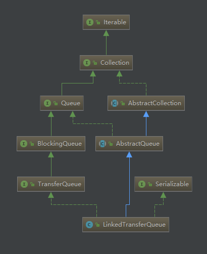

# 前言
当我们身在分布式开发中时经常会碰到突然大量的消息造访，而我们的消费者无法及时处理，最终导致消息丢失，甚至服务崩溃。这个时候我们就需要暂时将这些不速之客请到“休息室”去坐一下。
阻塞队列BlockingQueue就是我们经常使用的“休息室”。阻塞队列可以有效的阻止大量的消息冲击我们的服务，设置队列大小可以将无法处理的消息阻止在外。本文将学习jdk1.7中加入的阻塞队列--LinkedTransferQueue
# 一、LinkedTransferQueue简介
## 1.1 命名
**线性传输队列** 网上查不到它的合适的翻译，我就给它取了一个名字--线性传输队列。线性传输队列的类继承结构如图所示

## 1.2 原理简介
从图中我们可以看到它底层是Collection和Queue，因此它是具有集合特性的，同时还具有Queue的基本功能。名字中还带了Linked，说明他是链表形式的，然后它还引入了一个新的TransferQueue接口特性，有如下接口，接口的功能在下面讲述
（1）boolean tryTransfer(E e);  
（2）void transfer(E e) throws InterruptedException;
（3）boolean tryTransfer(E e, long timeout, TimeUnit unit)  throws InterruptedException;  
（4）boolean hasWaitingConsumer(); 
（5）int getWaitingConsumerCount(); 
## 1.3 LinkedTransferQueue核心方法
以我目前的能力只能分析到这里了，光分析这个就有点勉强了，awaitMatch就不分析了
``` java
    /**
     * tryTransfer相关的方法底层实现都是通过xfer实现的
     * 根据它的表现，这是一个拉和吃一体的方法，非常全能
     *
     * @param e        需要插入的信息
     * @param haveData true表示数据插入，false表示数据请求
     * @param how      操作类型，有四种类型：NOW（即时）, ASYNC（异步）, SYNC（同步）, or TIMED（超时模式）
     * @param nanos    超时时间，单位纳秒
     */
    private E xfer(E e, boolean haveData, int how, long nanos) {
        // 如果选择了有数据要插入，但是数据又是空的，就直接抛出异常
        if (haveData && (e == null))
            throw new NullPointerException();
        // 非常复杂的一个逻辑，又没有注释，所以这里的注释都是我以为，如果有问题请不吝赐喷
        // 最外圈的for循环是没有限制条件的，通过循环里面的continue restart跳转
        restart: for (Node s = null, t = null, h = null; ; ) {
            // 这个for节点的条件有点小复杂，但是没关系，一步步来
            // 这里利用了java从左往右的特性
            // t != (t = tail)这句话是，先拿到t的值，此时t=null，然后再将t赋值为tail
            // 最后做比较,null != tail，当然条件成立了，此时t已经是tail了，初始化时的tail.isData是true
            // 最后结论当haveData时（存值） p=tail，当不是haveData时（取值）p=head，符合队列特性
            for (Node p = (t != (t = tail) && t.isData == haveData) ? t
                    : (h = head); ; ) {
                final Node q;
                final Object item;
                // 如果haveData为true（存数据）
                // p不是数据节点且item是null，条件成立，反之不成立
                // 如果haveData为false（取数据）
                // p是数据节点且item不是null，条件成立，反之不成立
                // 从上述说明看出:
                // 存数据时，p=tail不是数据节点进入；
                // 取数据时，p=head是数据节点进入
                // 但isData和item是一致的，所以取数据才进入这个条件,除非数据被取走了
                // 下个请求进来就直接从新的head取数据了
                if (p.isData != haveData
                        && haveData == ((item = p.item) == null)) {
                    if (h == null) h = head;
                    // 尝试匹配，匹配成功更新p节点
                    if (p.tryMatch(item, e)) {
                        // 取数据时，一般情况下(h=head)!=(p=head)是false，
                        // 可能别的线程在这个时候有操作，h和p之间已经有被取走的节点了
                        // 可能Node还在，但是里面的item已经是空的了，所以要将p矫正成新的头节点
                        if (h != p) skipDeadNodesNearHead(h, p);
                        return (E) item;
                    }
                }

                // 存数据时，p是尾节点，尾节点后没有数据了，说明这就是个尾节点，能进入条件
                // 取数据时，p是头节点，头结点后面如果是空的,也能进入条件
                if ((q = p.next) == null) {
                    // 如果操作方式是NOW，那么直接返回输入的数据
                    if (how == NOW) return e;
                    // 给s创建一个空节点，e是空的就创建请求节点，否则创建数据节点
                    if (s == null) s = new Node(e);
                    // 更新next节点成功的话,到下个循环
                    if (!p.casNext(null, s)) continue;
                    // p不是尾节点，把s更新成最新的尾节点
                    if (p != t) casTail(t, s);
                    // 这个时候ASYNC就也需要返回了
                    if (how == ASYNC) return e;
                    // 旋转等待数据
                    return awaitMatch(s, p, e, (how == TIMED), nanos);
                }
                // 退到最外面的for循环重新开始
                if (p == (p = q)) continue restart;
            }
        }
    }
```
判断是否有已经等待的消费者，通过是否有空节点来判断
``` java
   public boolean hasWaitingConsumer() {
        restartFromHead: for (;;) {
            for (Node p = head; p != null;) {
                Object item = p.item;
                if (p.isData) {
                    // 如果队列里面还是有数据的
                    // 直接break
                    if (item != null)
                        break;
                }
                // 如果数据已经被人取走了，只剩下空节点了，
                // 这个时候当前线程就是等待者，然后就返回true
                else if (item == null)
                    return true;
                if (p == (p = p.next))
                    continue restartFromHead;
            }
            return false;
        }
    }
```
通过当前空节点数目来判断等待的消费者数目
``` java
 /**
     * 当前等待的消费者数目
     * @return
     */
    public int getWaitingConsumerCount() {
        return countOfMode(false);
    }
    private int countOfMode(boolean data) {
        restartFromHead: for (;;) {
            int count = 0;
            for (Node p = head; p != null;) {
                // p节点是否被匹配了，当数据节点里面的item是空的，匹配成功
                if (!p.isMatched()) {
                    // 因为p.isData是true,所以是数据请求时，
                    if (p.isData != data)
                        return 0;
                    // 等待累加,其实就是在循环内查看被其他线程取空的数据节点有多少个
                    if (++count == Integer.MAX_VALUE)
                        break;  // @see Collection.size()
                }
                if (p == (p = p.next))
                    continue restartFromHead;
            }
            return count;
        }
    }
```

# 二、重要方法功能
通过上面的分析，我大致了解了LinkedTransferQueue类中几个方法的功能
## 2.1 put 方法
顾名思义，这是一个存数据的方法
``` java
public void put(E e) {
        xfer(e, true, ASYNC, 0);
    }
```
异步存放插入数据，在tail后面插入新的节点，因为整个数据结构是链表，所以是无界的，所以不会阻塞
## 2.2 offer 方法
offer有两种方式，一种带超时的，一直不带超时的（表面上的）
``` java
 public boolean offer(E e, long timeout, TimeUnit unit) {
        xfer(e, true, ASYNC, 0);
        return true;
    }
 public boolean offer(E e) {
        xfer(e, true, ASYNC, 0);
        return true;
    }
从源码中很容易判断出，这是个障眼法，因为本身就是不会阻塞的，所以超时时间就是个摆设，设置了没用
```
## 2.3 add 方法
和上面的offer效果是一模一样的
``` java
 public boolean add(E e) {
        xfer(e, true, ASYNC, 0);
        return true;
    }
```
## 2.4 tryTransfer 方法
有两种，一种直接返回，一种超时返回
从上面的源码看NOW操作方式都没有创建新的节点，也就是不会把数据放到队列中，直接给等待中的消费者，如果没有等待中的，直接返回false，并且不会入队
``` java
public boolean tryTransfer(E e) {
        return xfer(e, true, NOW, 0) == null;
    }
 public boolean tryTransfer(E e, long timeout, TimeUnit unit)
        throws InterruptedException {
        if (xfer(e, true, TIMED, unit.toNanos(timeout)) == null)
            return true;
        if (!Thread.interrupted())
            return false;
        throw new InterruptedException();
    }
```
## 2.5 transfer方法
同步插入数据，如果没有取数据的消费者，一直等待。中间不支持中断线程，否则抛出异常
``` java
  public void transfer(E e) throws InterruptedException {
        if (xfer(e, true, SYNC, 0) != null) {
            Thread.interrupted(); // failure possible only due to interrupt
            throw new InterruptedException();
        }
    }
```
## 2.6 take 方法
操作方式是SYNC,一直等待，直到取到数据
``` java
 public E take() throws InterruptedException {
        E e = xfer(null, false, SYNC, 0);
        if (e != null)
            return e;
        Thread.interrupted();
        throw new InterruptedException();
    }
```
## 2.7 poll 方法
有两种方式，一种直接返回，一种带超时时间的
直接返回的话可能就是空的数据，超时会阻塞线程，直到获取到数据或者超时
``` java

    public E poll(long timeout, TimeUnit unit) throws InterruptedException {
        E e = xfer(null, false, TIMED, unit.toNanos(timeout));
        if (e != null || !Thread.interrupted())
            return e;
        throw new InterruptedException();
    }

    public E poll() {
        return xfer(null, false, NOW, 0);
    }
```
## 2.8 getWaitingConsumerCount和hasWaitingConsumer
这两个方法在上面已经做过源码分析了，一个是获取当前等待的线程数，一个是判断当前有没有在等待的
# 结语
xfer()这个方法里面还有很多逻辑没有弄懂，等下次完全读懂了后再更新一下


