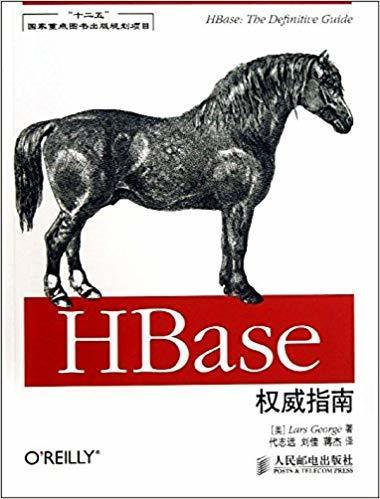
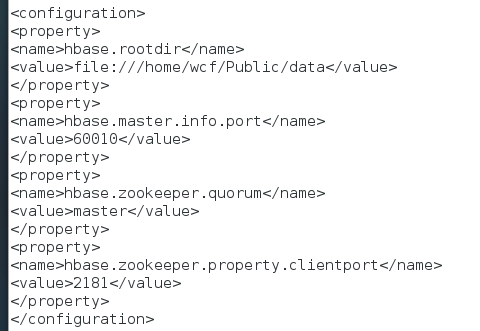
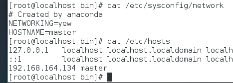
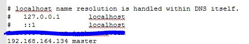
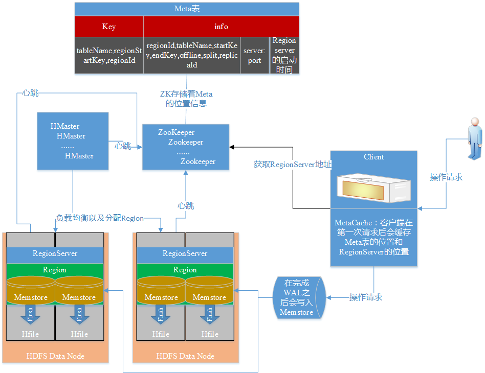

# 1.第一章，了解Hbase
这本书稍微有点年头了，看了一下第一次出版时间是2013年了，仅供参考吧，反正各种技术思路是最重要的
Hbase是由三种服务构成的：Region
Server、HBase HMaster、zookeeper，Region Server负责数据的读写，HMaster负责Region的分配以及数据库的创建和删除，Zookeeper负责维护集群的状态，以及集群中各个服务器的数据同步等。

（1）Hbase是一个非关系型数据库，按列式存储数据

（2）Hbase的列可以动态增加，并且列为空就不存储数据，节省了存储空间

（3）Hbase可以提高并发读写操作的支持

（4）Hbase不能支持条件查询，只支持按照Rowkey进行查询

（5）暂时不能支持Master server故障切换，当Master宕机后，整个系统会挂掉

（6）Hbase的伸缩能力强，适合分布式，但是它的数据类型相较于传统服务器比较简单

# 2.第二章，安装使用
（1）从官网上下载Hbase的安装包（安装环境最好是linux的环境），然后进行解压安装，做一些简单的配置（书上讲的大部分配置感觉不应该放在这个章节，读这个章节的人要是对大数据生态的组件都了解了的话也就不必阅读这本书了吧）

（2）通过shell指令进行简单的增删改查操作，到这里算是基本会使用hbase。

# 3.第三章，学习用代码调用hbase
（1）这里必须要吐槽一下，居然不介绍怎么用java远程连接hbase

（2）修改hbase的conf文件夹下的hbase-site.xml

修改linux服务器的hostname后（如下图），重启网络/etc/init.d/network restart

然后修改windows中C:\Windows\System32\drivers\etc问价夹下的hosts文件，在下面增加需要远程访问的hbase的ip地址和hostname

# 4.第四章，高级javaAPI
（1）Filter：行过滤器RowFilter，列簇过滤器FamilyFilter，列过滤器QualifierFilter，值过滤器，参考列过滤器。

（2）专用过滤器：单列值过滤器，单列排除过滤器，分页过滤器，行键过滤器，首次行键过滤器，包含结束的过滤器，时间戳过滤器，列计数过滤器，列分页过滤器，列前缀过滤器，随机行过滤器。

（3）附加过滤器：跳转过滤器，全匹配过滤器

（4）计数器：单计数器和多计数器

（5）协处理器：允许用户在region服务器上运行自己的代码，更准确的说是允许用户执行region级的操作，并且可以使用与RDBMS中触发器类似的功能，在客户端，用户不用关心操作具体在哪里执行，HBase的分布式框架会帮助用户把这些工作变的透明。

# 5.第五章，客户端API
这一张看完了感觉也没学到什么，除了一些概念和想法，别的接口全是Deprecated，再次感叹这几年技术发展太快了

# 6.第六章，可用客户端
（1）可以通过Hbase的bin目录下的shell脚本打开Hbase自带的rest服务，通过./hbase rest start打开的时候可以直接在界面上看到rest请求的实时日志，通过./hbase-daemon.sh start rest打开的时候可以让rest服务在后台运行。

（2）介绍了几款RPC框架用法：Avro，Thrift。

（3）后面还乱七八糟的介绍了别的有点关系的组件，如HIVE，Kafka，还有他们的UI界面，可以不看跳过。

# 7第七章，与MapReduce集成
（1）MapReduce作业从一个文件中读取数据并写入Hbase，这个例子让我不得不绝望，为什么不把源码贴全一点，好歹知道是引入的那个类的，相同类名的类这么多，没办法只能看看他的代码，不能自己敲了。

（2）越看越生气，还是看hadoop相关书籍吧，这一张看着等于浪费时间，好多代码贴的乱七八糟的。

# 8第八章，架构
（1）B+Tree和LSM树：总结一下LSM更加块状，B+Tree可能导致存储碎片吧

（2）regionserver存储工作原理：HRegionServer负责打开region，并创建对应的HRegion实例。当HRegion被打开后，它会为每个表的HColumnFamily创建一个Store实例，这些列簇是用户之前创建表时定义的。每个Store实例包含一个或多个StoreFile实例，它们是实际数据存储文件HFile的轻量级封装。每个Store还有其对应的一个MemStore，一个HRegionServer分享了一个HLog实例。

当用户向HRegionServer发起HTable.put请求时，它会把请求交给对应的HRegion实例来处理，第一步是要决定数据是否需要写道HLog类实现的预写日志中，WAL是标准的Hadoop SequenceFile，并且存储了HLogKey实例。这些键包括序号和实际数据，因此在服务器崩溃的时候还能恢复这些数据。

一旦数据被写入WAL中，数据就会被放到MemStore中，同时还会检查MenStore是否已经满了，如果满了，就会被请求刷写到磁盘中，刷写请求由另外一个HRegionServer执行，它会把数据写成HDFS中的一个新的HFile，同时也会保存最后写入的序号，系统就知道哪些数据被持久化了。

最后。我自己学习总结了一下Hbase的架构

HFile：HFile就是Hadoop磁盘文件，一个列族中的数据保存在一个或多个HFile中，这些HFile是对列族的数据进行水平切分后得到的。

MemStore：HFile在内存中的体现。当我们update/delete/create时，会先写MemStore，写完后就给客户端response了，当Memstore达到一定大

Region：HBase中的数据都是按row-key进行排序的，对这些按row-key排序的数据进行水平切分，每一片称为一个Region，它有startkey和endkey，Region的大小可以配置，一台RegionServer中可以放多个Region

Zookeeper：选举Master，Master会定时向ZK发送心跳，如果发现中断，ZK会认为这个Master挂掉了，重新选举Master。HRegionServer也会和ZK维持活跃关系，当心跳断掉之后ZK也会任务这个RegionServer挂掉了。、

HMaster：对Region进行负载均衡，合理分配任务到RegionServer

RegionServer：提供数据的读写服务，当客户端访问数据时，直接和Region Server通信。注意：第一次是从ZK中获取Meta信息，后续才是直接通信。

原创文章转载请标明出处

更多文章请查看

[http://www.canfeng.xyz](http://www.canfeng.xyz)