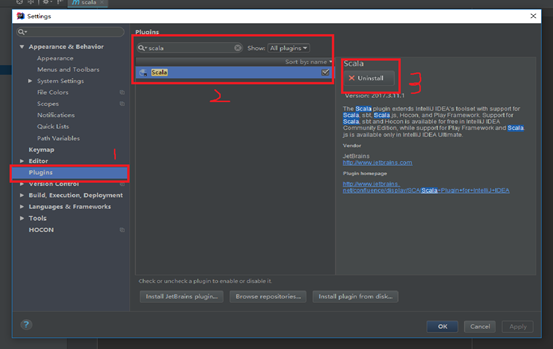
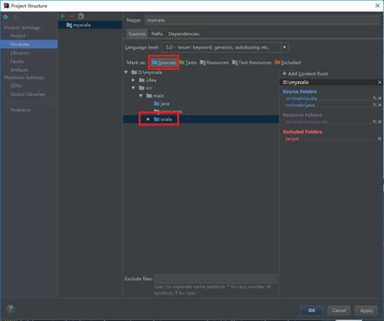
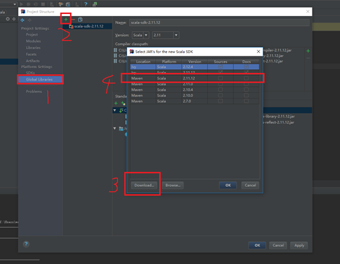
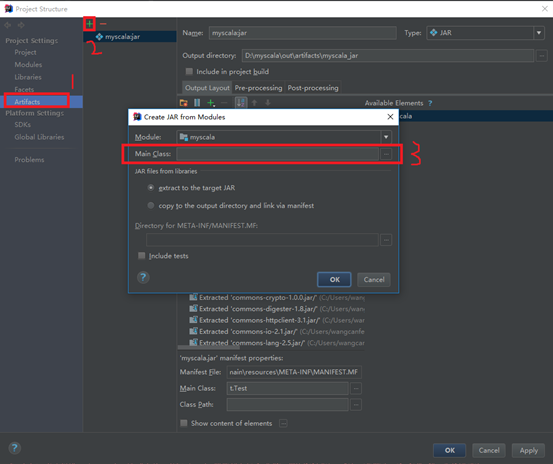
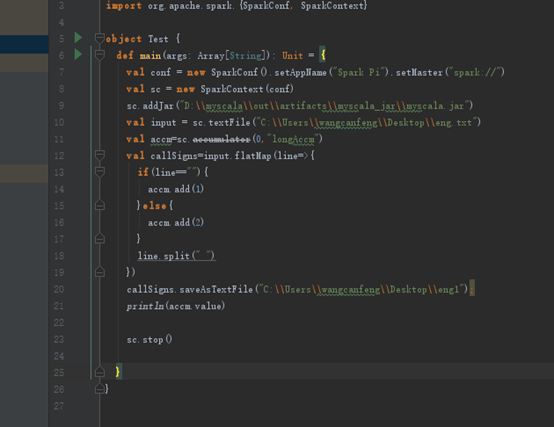

引言
目前Intellijidea对于Scala来说是一款不错的编译器，同时主流的开发环境大多采取maven构建，方便代码的打包编译，和第三方jar包的引用和管理。同时利用idea+maven的方式构建scala工程还有一个好处：可以将java代码和scala代码在同一个工程中，混合开发，非常便利。

环境搭建
步骤一：安装scala插件

在File—>Settings中找到Plugins，搜索scala，进行安装，如下图所示，大概10分钟后安装完毕，重启idea。

步骤二：构建maven工程（或者在已经建立的maven工程基础上）
在File—>New—>Project中选择Maven，直接点击下一步，一直next，直接完成项目构建。

步骤三：创建scala的source文件夹
    在新构建的工程main文件夹下新建一个scala文件夹，并标记为source，如图所示

步骤四：添加scala的sdk
在File—>Project

Structure中找到Global Libraries,点击加号，如果没有对应的scala版本，点击Download进行下载。完成下载后选中，点击OK，如图所示

步骤五：引入spark的jar包
在maven中加入依赖包配置，如引入spark相关的jar，2.1.0版本的spark的jar包几乎涵盖了所有的spark开发相关的jar包。

<dependency>

    <groupId>org.apache.spark</groupId>

    <artifactId>spark-core_2.11</artifactId>

    <version>2.1.0</version>

</dependency>

步骤六：打包
在File—>Project

Structure中找到Artifacts,点击加号，构建新的jar，选择主类后，点击ok，完成jar包构建配置，如下图所示，然后可以在Buildàbuild artifacts，构建新的jar。

步骤七：本地运行scala调试程序

本文原文在我的小站中http://www.canfeng.xyz/blog/article?slug=htfbIaS6

