# Spark2.2.1基础平台搭建流程
# 引言：
    由于公司存在自己的大数据架构，这个spark基础平台只能提供基础业务测试使用，但是鉴于它的搭建过程比较简单，流程较少，比较适合练手，和验证某些相关业务。比如说学习scala过程中想要结合实际环境测试一下，没有多余的环境可以使用，那就可以自己搭建一个简单的环境临时使用。

# 一、准备工作：
（1）下载工具包：

scala-2.12.4.tgz
spark-2.2.1-bin-hadoop2.7.tgz
jdk-8u151-linux-x64.tar.gz
hadoop-3.0.0.tar.gz
CentOS-7-x86_64-DVD-1511.iso
VMware-workstation-full-14.0.0.24051.exe

（2）安装环境：
windows10-64
内存16G以上（太小了印象程序运行）

# 二、安装步骤：
步骤一：安装软件
安装VMware-workstation之后创建三个虚拟机，再安装centos7，每一个虚拟机的安装都采用一样的配置。
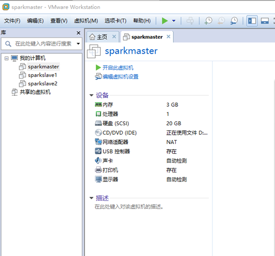

## 步骤二：配置ip
三个虚拟机在安装的时候采用自动配置ip的方式就行了，这里我的三个服务器的ip为

192.168.164.128sparkmaster

192.168.164.129sparkslave1

192.168.164.130sparkslave2

在host文件配置情况，设置好之后保存退出

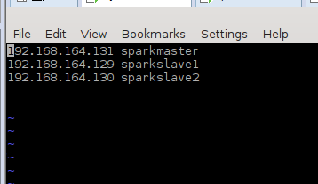

最后关闭防火墙 systemctl stop firewalld.service #停止firewall

systemctl disable firewalld.service #

禁止firewall开机启动

三台虚拟机中都需要执行

## 步骤三：配置免密登录
配置三台虚拟机之间ssh免密登录，执行以下指令。

ssh-keygen -t rsa

cd .ssh/

cp id_rsa.pub authorized_keys

把三个虚拟机中的authorized_keys进行合并，然后用合并后的authorized_keys替代原来的authorized_keys文件。测试三台虚拟机之间能否进行免密登录，如果可行，则进行下一步。

## 步骤四：解压各个安装包
安装jdk，直接把下载好的jdk压缩包在合适的位置进行解压。

安装hadoop，直接把下载好的hadoop压缩包进行解压

安装scala，直接把下载好的scala压缩包进行解压

安装spark，直接把下载好的spark压缩包进行解压

三台虚拟机中进行一样的操作

## 步骤五：配置环境变量
在/etc/profile文件的末尾添加以下信息，保存退出。
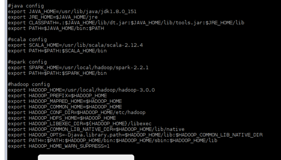

测试各个组件环境变量是否配置成功，可以用各个组件的version指令，进行测试，如jdk，会出现如下信息
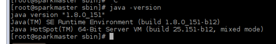

## 步骤六：修改hadoop-env.sh文件
在文件末尾增加jdk路径和hadoop路径，保存退出

vim/usr/local/hadoop/hadoop-3.0.0/etc/hadoop/hadoop-env.sh

## 步骤七：修改hdfs-site.xml
   vim/usr/local/hadoop/hadoop-3.0.0/etc/hadoop/hdfs-site.xml
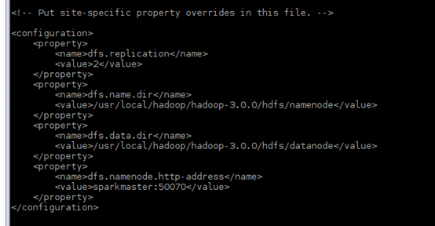

## 步骤八：修改mapred-site.xml
   vim/usr/local/hadoop/hadoop-3.0.0/etc/hadoop/mapred-site.xml
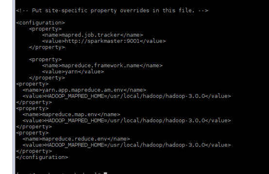
步骤九：在workers中增加主机名
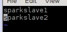

## 步骤十：修改yarn-site.xml
注意：如果不配置hostname会提示找不到master
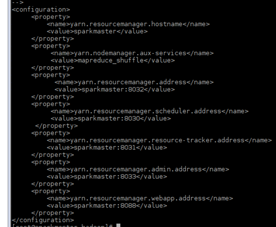

## 步骤十一：在core-site.xml中增加新的主机地址
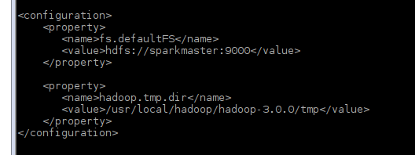
## 步骤十二：格式化namenode
Hadoop namenode –format

执行成功后会有格式化成功的提示

## 步骤十三：启动
因为我们需要的spark环境，因此只需要启动hadoop的hdfs，然后启动spark的管理

   start-dfs.env.sh

   再在spark的具体目录下启动start-all.env.sh以免和hadoop的启动混淆。

启动完成之后查看master中的jps进程

查看slave的进程
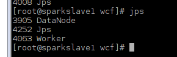
在浏览器中输入ip和端口号http://192.168.164.131:8080/查看当前服务运行情况
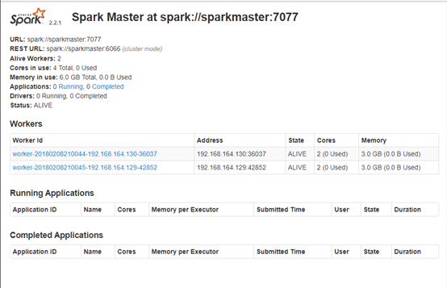

服务一切运行正常。。

本文原文在我的个人小站中   http://www.canfeng.xyz/blog/article?slug=zhdlTIBi