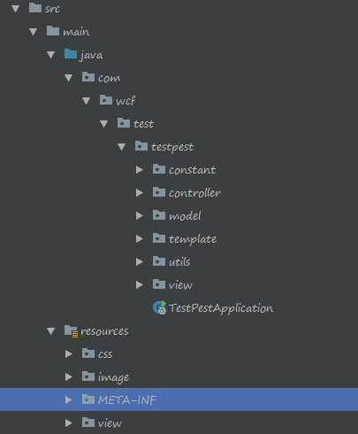
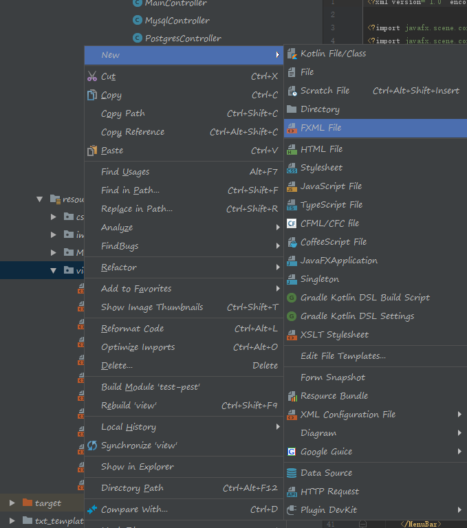
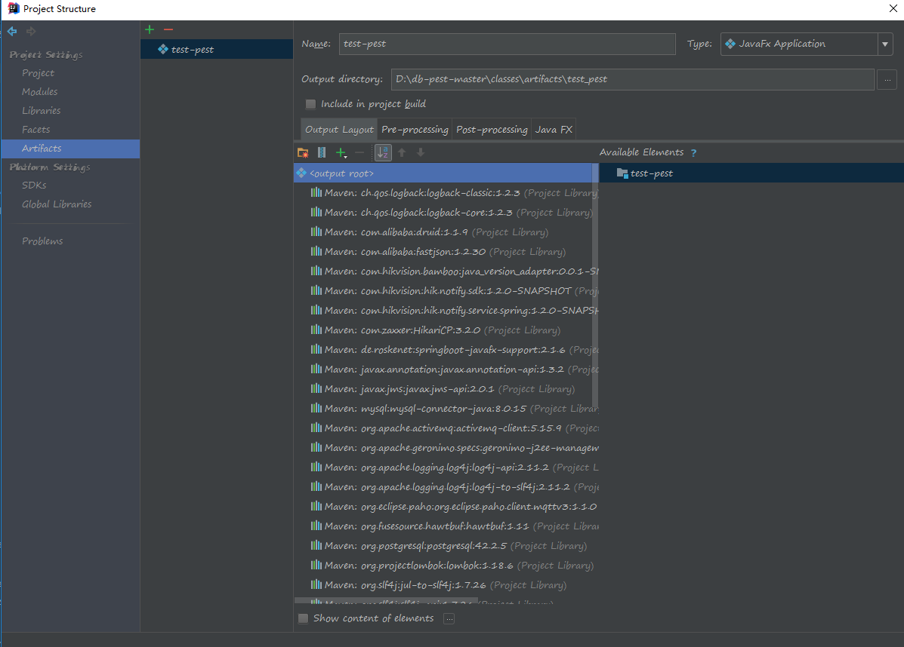
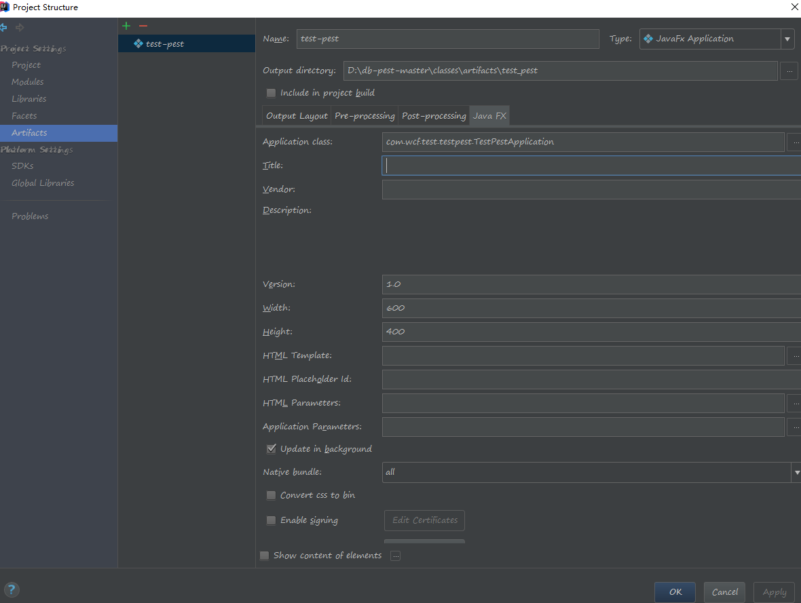
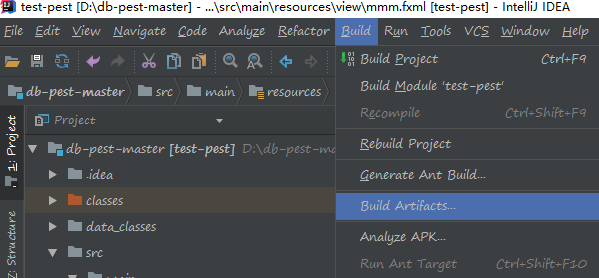

# 前言
很多时候，我总会有一些莫名其妙的想法，但是光会后端就只能通过main函数调用来实现我的想法，这种实践手法就有点low，后来我学会了vue-cli构建前端工程，但这个工作量有点大，仅适合闲时较多的时候去做。这个时候我捡起了以前用过的javafx，它和swing其实也差不多，但是更方便，再加上以前我做过C#开发，有很多东西是互通的，减少了很多学习成本。
# 步骤说明
因为springboot的使用比spring方便太多了，这里我采用的基于springboot来构建javafx的工程，然后我采用的编译器是idea
## 步骤1
首先我们创建一个springboot项目（这个过程就跳过了，这个教程百度上很多的），然后创建后面要放代码的文件夹，方便后续代码管理，如下所示。

- constant文件夹用于存放静态变量
- controller用于存放页面控制器代码
- model用于对象类
- template这个是我这个项目中用
- utils用于存放工具类
- view用于存放自定义的展示页面控件
- css用于存放静态的css文件，css是用来美化展示页面的，一个好看的页面对于一个桌面应用来说尤为重要
- image用于存放静态图片资源
- view用于存放fxml，相当于html，这里可以配置展示页面的各个空间的位置，大小，颜色什么的
## 步骤2
然后引入需要依赖的jar包
``` xml
<?xml version="1.0" encoding="UTF-8"?>
<project xmlns="http://maven.apache.org/POM/4.0.0" xmlns:xsi="http://www.w3.org/2001/XMLSchema-instance"
         xsi:schemaLocation="http://maven.apache.org/POM/4.0.0 http://maven.apache.org/xsd/maven-4.0.0.xsd">
    <modelVersion>4.0.0</modelVersion>
    <parent>
        <groupId>org.springframework.boot</groupId>
        <artifactId>spring-boot-starter-parent</artifactId>
        <version>2.1.4.RELEASE</version>
        <relativePath/> <!-- lookup parent from repository -->
    </parent>
    <groupId>com.wcf.test</groupId>
    <artifactId>test-pest</artifactId>
    <version>1.0</version>
    <name>test-pest</name>
    <description>I'm afraid of test the performance of my code</description>

    <properties>
        <java.version>1.8</java.version>
    </properties>

    <dependencies>
        <dependency>
            <groupId>org.springframework.boot</groupId>
            <artifactId>spring-boot-starter</artifactId>
        </dependency>

        <dependency>
            <groupId>org.springframework.boot</groupId>
            <artifactId>spring-boot-starter-jdbc</artifactId>
        </dependency>

        <dependency>
            <groupId>mysql</groupId>
            <artifactId>mysql-connector-java</artifactId>
            <scope>runtime</scope>
        </dependency>
        <dependency>
            <groupId>org.postgresql</groupId>
            <artifactId>postgresql</artifactId>
            <scope>runtime</scope>
        </dependency>

        <!-- https://mvnrepository.com/artifact/com.alibaba/druid -->
        <dependency>
            <groupId>com.alibaba</groupId>
            <artifactId>druid</artifactId>
            <version>1.1.9</version>
        </dependency>

        <dependency>
            <groupId>org.projectlombok</groupId>
            <artifactId>lombok</artifactId>
            <optional>true</optional>
        </dependency>

        <!-- 这个必须要引入，是用来让javafx支持springboot的，必须要引入
        且这个jar的版本和springboot版本必须要对应，否则程序会报错 -->
        <dependency>
            <groupId>de.roskenet</groupId>
            <artifactId>springboot-javafx-support</artifactId>
            <version>2.1.6</version>
        </dependency>

        <dependency>
            <groupId>com.alibaba</groupId>
            <artifactId>fastjson</artifactId>
            <version>1.2.30</version>
        </dependency>

    </dependencies>

    <build>
        <plugins>
            <plugin>
                <groupId>org.springframework.boot</groupId>
                <artifactId>spring-boot-maven-plugin</artifactId>
            </plugin>
        </plugins>
    </build>
</project>
```
## 步骤3
改造启动类，如下所示
这里说明一下，因为我需要用户手动配置数据库连接信息，所以我把DataSourceAutoConfiguration给移除了，不然会报错。
``` java
@SpringBootApplication(scanBasePackages = {"com.wcf.test.testpest"},exclude = {DataSourceAutoConfiguration.class})
public class TestPestApplication extends AbstractJavaFxApplicationSupport {

	@Override
	public void start(Stage primaryStage) throws Exception {
		primaryStage.setTitle("测试工具");
		primaryStage.setResizable(false);
		// 启动时将主窗口注入到容器中
		ContainerUtils.setPrimaryStage(primaryStage);
		// 初始化线程池
		ContainerUtils.createThreadPool();
        // 这里是我自定义的退出确认提示窗口
		primaryStage.setOnCloseRequest(windowEvent -> {
			windowEvent.consume();
			MakeSureExitPage sure = new MakeSureExitPage(windowEvent, primaryStage);
			sure.show();
		});
		super.start(primaryStage);
	}


	public static void main(String[] args) {
		launch(TestPestApplication.class, MainView.class, new InitializationView(), args);
	}
}
```
## 步骤4
到这里还有两个类没有交代MainView和InitializationView，前者是用于唤起主窗口的，后者是用于初始化页面加载的，你可以设置过场动画什么的
``` java
package com.wcf.test.testpest.view;

import de.felixroske.jfxsupport.AbstractFxmlView;
import de.felixroske.jfxsupport.FXMLView;

/**
 * @author wangcanfeng
 * @time 2019/5/10
 * @function
 **/
@FXMLView(value = "/view/main.fxml")
public class MainView extends AbstractFxmlView {
}
```
``` java
package com.wcf.test.testpest.view;

import de.felixroske.jfxsupport.SplashScreen;
import javafx.scene.Group;
import javafx.scene.Parent;
import javafx.scene.image.ImageView;

/**
 * @author wangcanfeng
 * @time 2019/5/17
 * @function
 **/
public class InitializationView  extends SplashScreen {
    @Override
    public String getImagePath() {
        return "/image/chain.JPG";
    }

    @Override
    public Parent getParent() {
        Group gp = new Group();
        ImageView imageView = new ImageView(this.getClass().getResource(this.getImagePath()).toExternalForm());
        gp.getChildren().add(imageView);
        return gp;
    }
}
```
## 步骤5
编写主窗口控制器
``` java
package com.wcf.test.testpest.controller;

import de.felixroske.jfxsupport.FXMLController;
import javafx.fxml.FXMLLoader;
import javafx.fxml.Initializable;
import javafx.scene.Parent;
import javafx.scene.Scene;
import javafx.stage.Stage;

import java.io.IOException;
import java.net.URL;
import java.util.ResourceBundle;

/**
 * @author wangcanfeng
 * @time 2019/5/10
 * @function
 **/
public class MainController implements Initializable {

    @Override
    public void initialize(URL location, ResourceBundle resources) {
        System.out.println("成功启动主窗口");
    }
}
```
## 步骤6
在view文件夹中创建fxml

然后在fxml中配置好对应的controller
``` xml
<?xml version="1.0" encoding="UTF-8"?>

<?import java.lang.*?>
<?import java.util.*?>
<?import javafx.scene.*?>
<?import javafx.scene.control.*?>
<?import javafx.scene.layout.*?>

<AnchorPane xmlns="http://javafx.com/javafx"
            xmlns:fx="http://javafx.com/fxml"
            fx:controller="com.wcf.test.testpest.controller.MainController"
            prefHeight="400.0" prefWidth="600.0">

</AnchorPane>
```
## 步骤7
打包成exe的相关配置，这里它打完包之后就会把对应的java运行需要的jar都装进去，估计会有200M左右


## 步骤8
进行打包
