# Jmeter基础操作文档

## 引言：

Jmeter是一种基于Java的压力测试工具，由apache组织开发。它的设计初衷是用于Web应用方面的测试，如软件压力测试，但后来逐渐的扩展到其他测试领域。 目前我们可以用它测试接口功能，返回参数等是否正常，它可以模拟相当的资源调用压力，测试服务器应对不同压力的能力和整体性能，Jmeter的作为一款自动化测试工具，它不仅仅能用于测试接口，还能用于测试数据库、FTP服务器能等等。

## 一、Jmeter的优势

1.Jmeter是Apache组织开发的一款免费开源软件，它可以根据实际需求扩展各个功能

2.支持接口测试、压力测试，入门简单，操作便捷

3.支持多平台，可在Linux、Windows、Mac上进行测试使用。

## 二、环境准备

1.安装JDK2.在官网上下载jmeter，链接地址为http://jmeter.apache.org/download_jmeter.cgi

## 三、操作案例

### 1.基础操作

以Windows平台为例，解压jmeter压缩包之后，打开bin文件夹，找到jmeter.bat，别犹豫，双击打开，软件加载完毕后会打开一个jmeter客户端（为了下次打开方便，可以给它设置一个桌面快捷方式，下次可以从桌面直接打开），客户端的界面如下图所示：
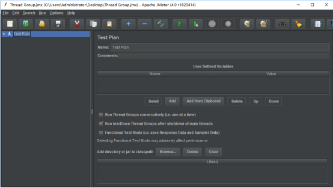
可以给testplan修改名称，在name中输入预先想好的测试代号，或是别的名称。
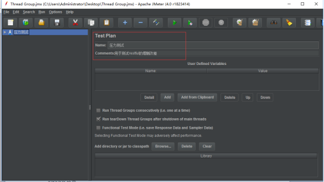
新增一个线程组用于测试，如图，右键test plan(压力测试)-->add-->Threads(Users)-->Thread Group，完成线程组的创建。
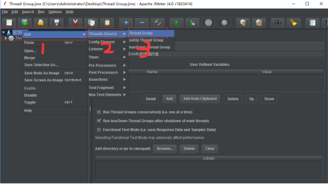
新增一个观测器用于检测返回结果，如图，右键Thread Group-->Listener-->View Results Tree，完成观测器的创建。
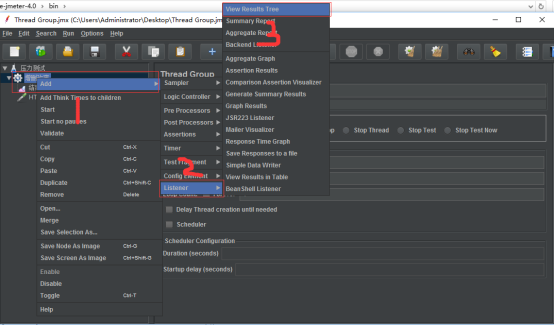
通过新建HTTP Request分别处理增删改查各个接口测试
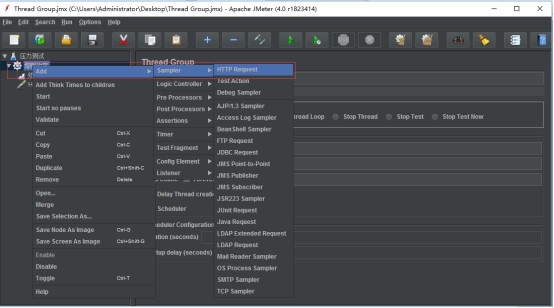
### 2.有参数：GET
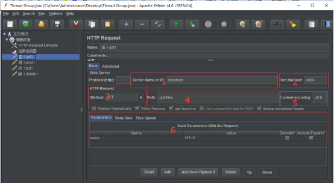
在1中输入服务器ip，在2中输入服务的端口号，在3中选择HTTP请求方式为GET，4中路径设置为/get/files（根据实际值设置），5中设置编码格式，6中设置参数

### 3. 带图片或文件POST接口
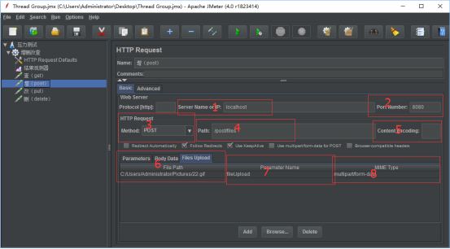
在1中输入服务器ip，在2中输入服务的端口号，在3中选择HTTP请求方式为POST，4中路径设置为/post/files（根据实际值设置），5中设置编码格式，6中对FileUpload页签进行设置，填入路径，7中填入参数名，对应restful接口的参数名，MIME Type中填写multipart/form-data。

### 4. Delete接口
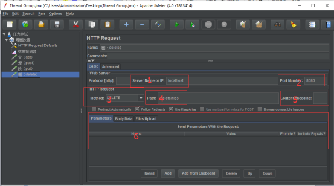
在1中输入服务器ip，在2中输入服务的端口号，在3中选择HTTP请求方式为DELETE，4中路径设置为/delete/files（根据实际值设置），5中设置编码格式，6中设置参数

### 5. PUT接口
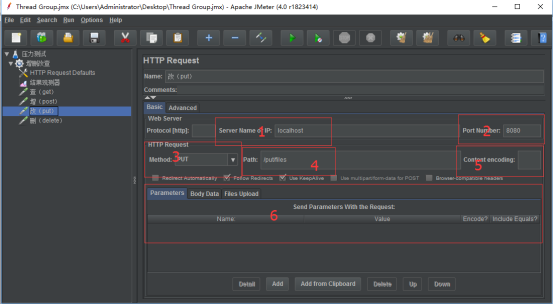
在1中输入服务器ip，在2中输入服务的端口号，在3中选择HTTP请求方式为PUT，4中路径设置为/delete/files（根据实际值设置），5中设置编码格式，6中设置参数

### 6. 查看返回结果
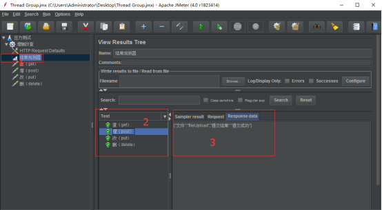
在1中可以看到4个HTTP请求的返回状态，绿色表示连接成功，红色表示连接失败，点击它，再3中可以看到具体的restful返回结果

### 7. 默认配置
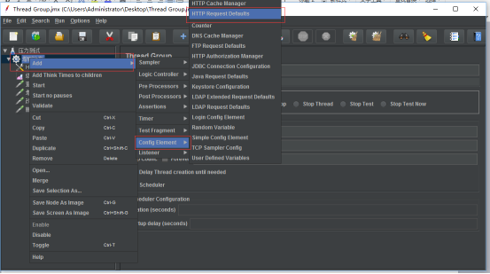
右键新建一个HTTP Request Defaults，如下图所示

可以在框中配置默认的ip、端口等信息，这样就不需要在每一个HTTP Request中重复设置一些基础信息了，修改的时候也能批量修改，提升测试效率。

### 8.载入JMX脚本

在新建完各个线程信息之后，我们需要对配置好的文件进行保存，选择合适的地方保存后，可以看到生成了一个jmx文件。下回还需要使用这个测试脚本只需要载入这个jmx文件就行
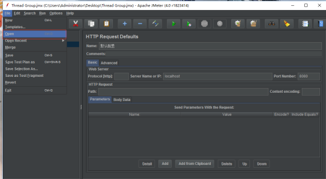

注意要点：

在jmeter测试过程中不能将dos窗口关闭，否则整个软件都将关闭，若是没有对相关操作进行保存，可能需要重新来过。

本文在我自己的小站里更新了关于消息中间件的监听以及引入jar包的操作

 http://www.canfeng.xyz/blog/article?slug=3OF50Ndu

原创文章，转载请标明出处，谢谢