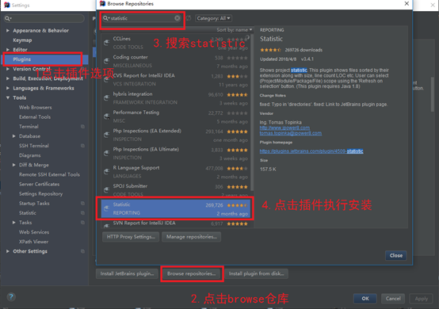
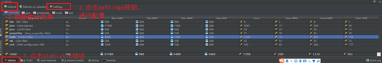
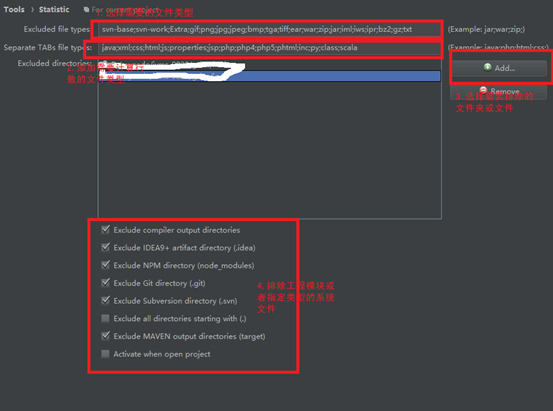
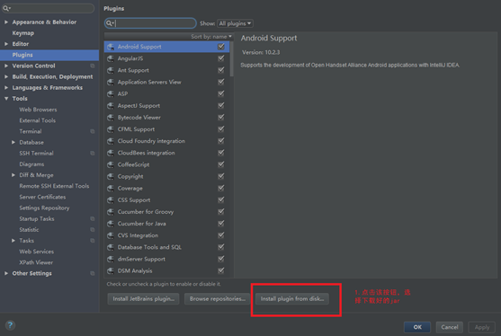

Idea代码行统计插件教程
1.搜索插件，执行安装

2.使用方式

3.配置排除类型和排除包

4.当第一步无法完成时，选择到官网上直接下载jar
http://plugins.jetbrains.com/plugin/4509-statistic

5.选择下载好的jar，执行安装

原创文章转载请标明出处

更多文章请查看

[http://www.canfeng.xyz](http://www.canfeng.xyz)