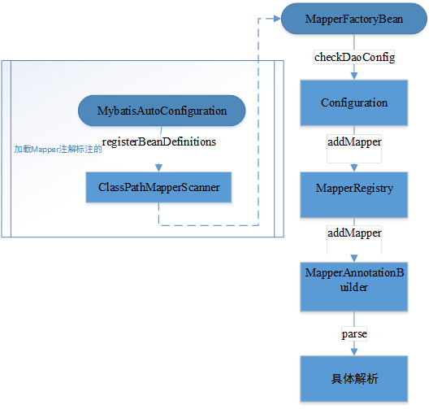

# 八. cache
cache包内都是一些cache的实现类，用于Cache接口，它申明了如下方法：
``` java
  //取得ID
  String getId();
  //存入值
  void putObject(Object key, Object value);
  //获取值
  Object getObject(Object key);
  //删除值
  Object removeObject(Object key);
  //清空
  void clear();
  //取得大小
  int getSize();
  //取得读写锁, 从3.2.6开始没用了，要SPI自己实现锁
  ReadWriteLock getReadWriteLock();
```
## 8.1TransactionalCacheManager事务缓存管理
它的方法和Cache接口中的方法有类似的地方，都存在put，get，clear方法，但是多了commit和rollback方法，用于事务的提交和回滚，它是用来管理TransactionalCache类的，TransactionalCache类实现内容很简单，就不多做解释了。
## 8.2 decorators
包里面的类用的是装饰者设计模式，装饰者模式通过组合的方式扩展对象的特性，这种方式允许我们在任何时候对对象的功能进行扩展甚至是运行时扩展，而若我们用继承来完成对类的扩展则只能在编译阶段实现，所以在某些时候装饰者模式比继承（inheritance）要更加灵活。装饰者设计模式具有如下特点：
1，装饰者（decorator）和被装饰（扩展）的对象有着相同的超类（supertype）。
2，我们可以用多个装饰者去装饰一个对象。
3，我们可以用装饰过的对象替换代码中的原对象，而不会出问题（因为他们有相同的超类）。
4，装饰者可以在委托（delegate，即调用被装饰的类的成员完成一些工作）被装饰者的行为完成之前或之后加上他自己的行为。
5，一个对象能在任何时候被装饰，甚至是运行时。
### 8.2.1 PerpetualCache永久缓存
每个永久缓存都有一个id，它使用id来区分多个永久缓存实例对象，它使用一个HashMap来存放缓存，因此它是不支持多线程的，需要用户自己实现多线程。
### 8.2.2 FifoCache
一个先进先出的缓存，通过链表来维护缓存的先进先出，且缓存默认最多只能存放1024个单位，通过设置size可以改变缓存的容量，从源码来看它并不支持多线程。
### 8.2.3 BlockingCache阻塞式缓存
它在读取的时候会加上锁，在读取完之后再将锁进行释放，但是在写数据的时候它并没有加锁。
### 8.2.4其他缓存
其他缓存还有日志缓存，lru缓存，定时删除缓存，支持序列化的缓存（发现内部有一个bug，算是一个小彩蛋），软引用缓存，弱引用缓存，以及一个不被使用的同步锁缓存。
# 九. mapping
包里面大量采用了建造者设计模式，建造者设计模式是将复杂的建造过程都定义为抽象方法，然后通过具体类实现各个建造过程，然后提供一个build方法，将各个建造过程串起来，建造者设计模式很好的实现了建造过程解耦，代码复用率高，但是它比较适用于一些相似程度较高的对象，如果差异性较大，则不适用。
## 9.1CacheBuilder
看到这个类的时候明显觉得它应该放到cache包中，再不济也应该是builder中，该类使用了建造者设计模式， 
它的build方法中申明了构建流程，它还有一些类似普通对象中的set方法，只不过它的返回的自身，用于链式编程。
``` java
public Cache build() {
    setDefaultImplementations();
    //先new一个base的cache(PerpetualCache)，注意这里的cache必须要拥有一个String入参的构造器
    Cache cache = newBaseCacheInstance(implementation, id);
    //设额外属性
    setCacheProperties(cache);
    // issue #352, do not apply decorators to custom caches
    if (PerpetualCache.class.equals(cache.getClass())) {
      for (Class<? extends Cache> decorator : decorators) {
          //装饰者模式一个个包装cache
        cache = newCacheDecoratorInstance(decorator, cache);
        //又要来一遍设额外属性
        setCacheProperties(cache);
      }
      //最后附加上标准的装饰者
      cache = setStandardDecorators(cache);
    } else if (!LoggingCache.class.isAssignableFrom(cache.getClass())) {
        //如果不是日志缓存或者日志缓存的子类，需要新建一个缓存对象
      cache = new LoggingCache(cache);
    }
    return cache;
  }
```
## 9.2 MappedStatement
这个类是用来完成映射声明的，包含了参数映射parameterMap与结果映射resultMaps，语句映射StatementType有三种类型STATEMENT（非预编译）、PREPARED（预编译）、CALLABLE（不清楚，没用过QAQ）。
## 9.3 ParameterMapping参数映射
声明java类型和jdbc类型的映射，如果没有指定的handler，则从handler注册器中寻找javatype对应的handler。
``` java
private void resolveTypeHandler() {
        //如果没有指定特殊的typeHandler，则根据javaType，jdbcType来查表确定一个默认的typeHandler
      if (parameterMapping.typeHandler == null && parameterMapping.javaType != null) {
        Configuration configuration = parameterMapping.configuration;
        TypeHandlerRegistry typeHandlerRegistry = configuration.getTypeHandlerRegistry();
        parameterMapping.typeHandler = typeHandlerRegistry.getTypeHandler(parameterMapping.javaType, parameterMapping.jdbcType);
      }
    }
```
9.4 ResultMapping结果映射
它的静态内部类Builder有三种形式的构造器，且支持通过列名和typeHandler指定映射，支持列名和javatype指定映射，以及支持lazy方式。实际上通过列名和javatype指定映射是通过类型转换注册器中获取的类型转换器：
``` java
    private void resolveTypeHandler() {
      if (resultMapping.typeHandler == null && resultMapping.javaType != null) {
        Configuration configuration = resultMapping.configuration;
        TypeHandlerRegistry typeHandlerRegistry = configuration.getTypeHandlerRegistry();
        resultMapping.typeHandler = typeHandlerRegistry.getTypeHandler(resultMapping.javaType, resultMapping.jdbcType);
      }
    }
```
注：结果集类型有三种FORWARD_ONLY（不支持前后滚动），SCROLL_INSENSITIVE（支持前后滚动，占用内存大），SCROLL_SENSITIVE（支持前后滚动，对于修改敏感）。

# 十一. builder
动态 SQL 是 mybatis 的强大特性之一，也是它优于其他 ORM 框架的一个重要原因。mybatis 在对 sql 语句进行预编译之前，会对 sql 进行动态解析，解析为一个 BoundSql 对象，也是在此处对动态 SQL 进行处理的。
## 11.1 InitializingObject
在3.4.2以上版本的代码中新增了一个接口InitializingObject，接口中只有一个方法initialize()，方法说明中表示这个方法用于所有参数设置完毕之后调用，可以在CacheBuilder中的build方法中调用的setCacheProperties方法发现，这个方法的尾部增加一些代码：
``` java
 //继承过InitializingObject的类对象才需要调用initialize方法
    if (InitializingObject.class.isAssignableFrom(cache.getClass())){
      try {
        ((InitializingObject) cache).initialize();
      } catch (Exception e) {
        throw new CacheException("Failed cache initialization for '" +
            cache.getId() + "' on '" + cache.getClass().getName() + "'", e);
      }
    }
```
## 11.2 BaseBuilder
这个抽象的基类中定义了三个属性，其实就是一个属性，即configuration对象，其他两个属性都是从configuration中获取的，configuration通过构造函数传入。浏览整个类之后，了解到这个基类主要是处理利用别名获取类型和类型处理器。
## 11.3 SqlSourceBuilder
这里说明一下${}和#{}的区别：在mybatis中存在两种参数界定的符号：$和#。但他们在使用的时候产生效果是不同的，一个#{}会被解析为参数占位符？，而${}可以理解为只是简单的进行了字符串替换如:Select * from test where name=${name}，当name=’wangcanfeng’时，sql语句就会被解析为Select * from test where name=’wangcanfeng’，这个替换在预编译之前就已经做好了。这样会产生sql注入的问题，如：name=test; delete test;解析后就变成了Select * from test where name= test; delete test;。传入的参数中隐藏了一个删除表的操作。想想就可怕。
SQL源码构建器继承了BaseBuilder，新增了解析sql的方法：
``` java
//解析sql
  public SqlSource parse(String originalSql, Class<?> parameterType, Map<String, Object> additionalParameters) {
    ParameterMappingTokenHandler handler = new ParameterMappingTokenHandler(configuration, parameterType, additionalParameters);
    //替换#{}中间的部分,如何替换，逻辑在ParameterMappingTokenHandler
    GenericTokenParser parser = new GenericTokenParser("#{", "}", handler);
    String sql = parser.parse(originalSql);
    //返回静态SQL源码
    return new StaticSqlSource(configuration, sql, handler.getParameterMappings());
  }
```
其中ParameterMappingTokenHandler中实现的token处理方法如下，它使用?代替#{property}，且把参数存在parameterMappings这个list中。
``` java
public String handleToken(String content) {
      //先构建参数映射
      parameterMappings.add(buildParameterMapping(content));
      //如何替换很简单，永远是一个问号，但是参数的信息要记录在parameterMappings里面供后续使用
      return "?";
    }
```
## 11.4xml
这个用于解析xml的mapper，本人喜欢使用注解形式的mapper，所以就打算随便看看
### 11.4.1 XMLConfigBuilder
构造函数中设置了XPath解析器和Configuration：
``` java
//其他构造函数处理传入的参数之后，都是调用的这个构造函数，传入XPathParser
  private XMLConfigBuilder(XPathParser parser, String environment, Properties props) {
    //首先调用父类初始化Configuration
    super(new Configuration());
    //错误上下文设置成SQL Mapper Configuration(XML文件配置),以便后面出错了报错用吧
    ErrorContext.instance().resource("SQL Mapper Configuration");
    //将Properties全部设置到Configuration里面去
    this.configuration.setVariables(props);
    this.parsed = false;
    this.environment = environment;
    this.parser = parser;
  }
```
只有一个开放性接口parse()用于解析配置信息的内容：
``` java
public Configuration parse() {
    //只解析一次
    if (parsed) {
      throw new BuilderException("Each XMLConfigBuilder can only be used once.");
    }
    parsed = true;
    //解析configuration节点
    parseConfiguration(parser.evalNode("/configuration"));
    return configuration;
  }

  private void parseConfiguration(XNode root) {
    try {
      //issue #117 read properties first
      //调用各个私有方法解析配置文件，给注册器、配置信息等类中赋值
      propertiesElement(root.evalNode("properties"));
      Properties settings = settingsAsProperties(root.evalNode("settings"));
      loadCustomVfs(settings);
      typeAliasesElement(root.evalNode("typeAliases"));
      pluginElement(root.evalNode("plugins"));
      objectFactoryElement(root.evalNode("objectFactory"));
      objectWrapperFactoryElement(root.evalNode("objectWrapperFactory"));
      reflectorFactoryElement(root.evalNode("reflectorFactory"));
      settingsElement(settings);
      // read it after objectFactory and objectWrapperFactory issue #631
      environmentsElement(root.evalNode("environments"));
      databaseIdProviderElement(root.evalNode("databaseIdProvider"));
      typeHandlerElement(root.evalNode("typeHandlers"));
      mapperElement(root.evalNode("mappers"));
    } catch (Exception e) {
      throw new BuilderException("Error parsing SQL Mapper Configuration. Cause: " + e, e);
    }
  }
```
### 11.4.2 XMLIncludeTransformer include转换
该类只拥有一个对外接口，对外接口用于处理xml配置文件中的include节点：
``` java
public void applyIncludes(Node source) {
    Properties variablesContext = new Properties();
    Properties configurationVariables = configuration.getVariables();
    if (configurationVariables != null) {
      variablesContext.putAll(configurationVariables);
    }
    applyIncludes(source, variablesContext, false);
  }
  //接口相较与之前版本增加了后两个参数
  private void applyIncludes(Node source, final Properties variablesContext, boolean included) {
    //从sql配置文件中解析出一个include节点
    if (source.getNodeName().equals("include")) {
      //走到这里，单独解析<include refid="userColumns"/>
      //拿到SQL片段
      Node toInclude = findSqlFragment(getStringAttribute(source, "refid"), variablesContext);
      Properties toIncludeContext = getVariablesContext(source, variablesContext);
      applyIncludes(toInclude, toIncludeContext, true);
      if (toInclude.getOwnerDocument() != source.getOwnerDocument()) {
        //意思是include节点和传入的源节点归属的文件不同就引入？
        toInclude = source.getOwnerDocument().importNode(toInclude, true);
      }
      //用toInclude去代替source
      source.getParentNode().replaceChild(toInclude, source);
      //没看明白为什么要用while，就不停的获取首子节点插入到本身前面？
      while (toInclude.hasChildNodes()) {
        toInclude.getParentNode().insertBefore(toInclude.getFirstChild(), toInclude);
      }
      toInclude.getParentNode().removeChild(toInclude);
    } else if (source.getNodeType() == Node.ELEMENT_NODE) {
      //这段是新加的逻辑，用variablesContext中的配置替换source中的配置
      if (included && !variablesContext.isEmpty()) {
        // replace variables in attribute values
        NamedNodeMap attributes = source.getAttributes();
        for (int i = 0; i < attributes.getLength(); i++) {
          Node attr = attributes.item(i);
          attr.setNodeValue(PropertyParser.parse(attr.getNodeValue(), variablesContext));
        }
      }
      NodeList children = source.getChildNodes();
      for (int i = 0; i < children.getLength(); i++) {
        applyIncludes(children.item(i), variablesContext, included);
      }
    } else if (included && source.getNodeType() == Node.TEXT_NODE
        && !variablesContext.isEmpty()) {
      // replace variables in text node
      source.setNodeValue(PropertyParser.parse(source.getNodeValue(), variablesContext));
    }
  }
```
### 11.4.3 XMLMapperBuilder
这个类中主要是解析xml形式的Mapper，由于本人偏好于使用注解形式的mapper，这个类就跳过了。
### 11.4.4 XMLStatementBuilder
该类只有一个对外方法parseStatementNode()，用于xml中的sql语句解析。
## 11.5 annotation
感觉注解形式的mapper明显比xml形式的mapper使用方便很多，也有利于代码调试，更加灵活。
### 11.5.1ProviderContext
Provider上下文，mybatis在3.4.5中新增了个final类，用于记录provider中的上下文信息：
``` java
//Provider的类型
  private final Class<?> mapperType;
  //provider中的方法
  private final Method mapperMethod;
```
### 11.5.2ProviderSqlSource
继承了SqlSource，用于获取Provider注解中的type属性和method属性的值，然后利用provider中定义的method方法生成sql，从而获取BoundSql对象：
``` java
//构造器中传入配置信息，provider注解对象，
  public ProviderSqlSource(Configuration configuration, Object provider, Class<?> mapperType, Method mapperMethod) {
    String providerMethodName;
    try {
      this.configuration = configuration;
      this.sqlSourceParser = new SqlSourceBuilder(configuration);
      //从注解中获取type和method属性的值,因为无法从对象中直接获取值，所以采用反射
      this.providerType = (Class<?>) provider.getClass().getMethod("type").invoke(provider);
      providerMethodName = (String) provider.getClass().getMethod("method").invoke(provider);
      //遍历与注解中方法名对应上的方法
      for (Method m : this.providerType.getMethods()) {
        if (providerMethodName.equals(m.getName()) && CharSequence.class.isAssignableFrom(m.getReturnType())) {
            //意思就是在provider中的方法不能重复
          if (providerMethod != null){
            throw new BuilderException("Error creating SqlSource for SqlProvider. Method '"
                    + providerMethodName + "' is found multiple in SqlProvider '" + this.providerType.getName()
                    + "'. Sql provider method can not overload.");
          }
          this.providerMethod = m;
          this.providerMethodArgumentNames = new ParamNameResolver(configuration, m).getNames();
          this.providerMethodParameterTypes = m.getParameterTypes();
        }
      }
    } catch (BuilderException e) {
      throw e;
    } catch (Exception e) {
      throw new BuilderException("Error creating SqlSource for SqlProvider.  Cause: " + e, e);
    }
    if (this.providerMethod == null) {
      throw new BuilderException("Error creating SqlSource for SqlProvider. Method '"
          + providerMethodName + "' not found in SqlProvider '" + this.providerType.getName() + "'.");
    }
    for (int i = 0; i< this.providerMethodParameterTypes.length; i++) {
      Class<?> parameterType = this.providerMethodParameterTypes[i];
      if (parameterType == ProviderContext.class) {
        if (this.providerContext != null){
          throw new BuilderException("Error creating SqlSource for SqlProvider. ProviderContext found multiple in SqlProvider method ("
              + this.providerType.getName() + "." + providerMethod.getName()
              + "). ProviderContext can not define multiple in SqlProvider method argument.");
        }
//生成provider上下文
        this.providerContext = new ProviderContext(mapperType, mapperMethod);
        this.providerContextIndex = i;
      }
    }
  }

//获取BoundSql对象
public BoundSql getBoundSql(Object parameterObject) {
      //根据传入的参数构建sql语句对应的BoundSql对象
    SqlSource sqlSource = createSqlSource(parameterObject);
    return sqlSource.getBoundSql(parameterObject);
  }

  private SqlSource createSqlSource(Object parameterObject) {
    try {
      int bindParameterCount = providerMethodParameterTypes.length - (providerContext == null ? 0 : 1);
      String sql;
      if (providerMethodParameterTypes.length == 0) {
        sql = invokeProviderMethod();
      } else if (bindParameterCount == 0) {
          //调用provider中生成sql的方法
        sql = invokeProviderMethod(providerContext);
      } else if (bindParameterCount == 1 &&
              (parameterObject == null || providerMethodParameterTypes[(providerContextIndex == null || providerContextIndex == 1) ? 0 : 1].isAssignableFrom(parameterObject.getClass()))) {
        sql = invokeProviderMethod(extractProviderMethodArguments(parameterObject));
      } else if (parameterObject instanceof Map) {
        @SuppressWarnings("unchecked")
        Map<String, Object> params = (Map<String, Object>) parameterObject;
        sql = invokeProviderMethod(extractProviderMethodArguments(params, providerMethodArgumentNames));
      } else {
        throw new BuilderException("Error invoking SqlProvider method ("
                + providerType.getName() + "." + providerMethod.getName()
                + "). Cannot invoke a method that holds "
                + (bindParameterCount == 1 ? "named argument(@Param)": "multiple arguments")
                + " using a specifying parameterObject. In this case, please specify a 'java.util.Map' object.");
      }
      Class<?> parameterType = parameterObject == null ? Object.class : parameterObject.getClass();
      return sqlSourceParser.parse(replacePlaceholder(sql), parameterType, new HashMap<String, Object>());
    } catch (BuilderException e) {
      throw e;
    } catch (Exception e) {
      throw new BuilderException("Error invoking SqlProvider method ("
          + providerType.getName() + "." + providerMethod.getName()
          + ").  Cause: " + e, e);
    }
  }
```
### 11.5.3 MapperAnnotationBuilder
期待这个类已经很久了，总算是看到这里了，顾名思义这个类用于处理mapper上的注解的。整个加载流程为：

MapperAnnotationBuilder调用内部的parse方法，完成每一个Mapper中注解的解析：
``` java
public void parse() {
    String resource = type.toString();
    //判断是否已经载入过
    if (!configuration.isResourceLoaded(resource)) {
      //载入xml文件的mapper
      loadXmlResource();
      //加入资源列表
      configuration.addLoadedResource(resource);
      //设置辅助器的Namespace
      assistant.setCurrentNamespace(type.getName());
      //解析缓存
      parseCache();
      //解析缓存引用
      parseCacheRef();
      //从mapper的class中获取所有方法
      Method[] methods = type.getMethods();
      for (Method method : methods) {
        try {
          // issue #237
          //判断是否桥接方法，桥接方法不是真正的实现方法，而是调用真正的实现方法
          if (!method.isBridge()) {
            //开始解析，这里才是真的主要解析
            parseStatement(method);
          }
        } catch (IncompleteElementException e) {
          //在配置中记录解析失败的方法
          configuration.addIncompleteMethod(new MethodResolver(this, method));
        }
      }
    }
    //解析待定的方法
    parsePendingMethods();
  }
```
（1）解析缓存
``` java
  private void parseCache() {
    //获取类上的CacheNamespace注解信息
    CacheNamespace cacheDomain = type.getAnnotation(CacheNamespace.class);
    if (cacheDomain != null) {
      Integer size = cacheDomain.size() == 0 ? null : cacheDomain.size();
      Long flushInterval = cacheDomain.flushInterval() == 0 ? null : cacheDomain.flushInterval();
      //利用PropertyParser解析Property注解注属性名和configuration中的配置对应的参数
      Properties props = convertToProperties(cacheDomain.properties());
      //根据提供的参数配置新的缓存
      assistant.useNewCache(cacheDomain.implementation(), cacheDomain.eviction(), flushInterval, size, cacheDomain.readWrite(), cacheDomain.blocking(), props);
    }
  }
```
（2）解析缓存引用
``` java
  private void parseCacheRef() {
    //获取类上的CacheNamespaceRef注解信息
    CacheNamespaceRef cacheDomainRef = type.getAnnotation(CacheNamespaceRef.class);
    if (cacheDomainRef != null) {
      //获取引用的是哪个Mapper的缓存的type
      Class<?> refType = cacheDomainRef.value();
      //获取引用的是哪个Mapper的缓存的name
      String refName = cacheDomainRef.name();
      //名称和类型不能同时为空
      if (refType == void.class && refName.isEmpty()) {
        throw new BuilderException("Should be specified either value() or name() attribute in the @CacheNamespaceRef");
      }
      //名称为类型不能同时设置
      if (refType != void.class && !refName.isEmpty()) {
        throw new BuilderException("Cannot use both value() and name() attribute in the @CacheNamespaceRef");
      }
      //根据命名空间读取缓存
      //这里有个问题，如果引用和实际缓存调换过来加载，那怎么办
      String namespace = (refType != void.class) ? refType.getName() : refName;
      assistant.useCacheRef(namespace);
    }
  }
```
（3）解析Statement（这个类的核心）
``` java
void parseStatement(Method method) {
        //获取参数类型，当只有一个入参的时候获取到的类型为入参的类型，多个入参时获取到的是ParamMap.class
        Class<?> parameterTypeClass = getParameterType(method);
        //根据方法上标注的注解Lang中的值获取语言驱动
        LanguageDriver languageDriver = getLanguageDriver(method);
        //从注解中获取sqlSource
        //获取SqlSource从Insert|Select|Update|Delete注解或者InsertProvider|SelectProvider|UpdateProvider|DeleteProvider注解
        SqlSource sqlSource = 
                   getSqlSourceFromAnnotations(method, parameterTypeClass, languageDriver);
        //如果sqlSource是空的，并没有报错，说明是允许没有注解的，在代码编写的时候需要注意不能遗漏
        if (sqlSource != null) {
            Options options = method.getAnnotation(Options.class);
            //获取全限定名
            final String mappedStatementId = type.getName() + "." + method.getName();
            //批量大小
            Integer fetchSize = null;
            //执行超时时间
            Integer timeout = null;
            //是否预编译
            StatementType statementType = StatementType.PREPARED;
            //结果集类型，默认不支持滚动
            ResultSetType resultSetType = ResultSetType.FORWARD_ONLY;
            //注解上的sql类型，
            //Insert|Select|Update|Delete|InsertProvider|SelectProvider|UpdateProvider|DeleteProvider
            SqlCommandType sqlCommandType = getSqlCommandType(method);
            boolean isSelect = sqlCommandType == SqlCommandType.SELECT;
            //如果是查询类型，默认清楚缓存
            boolean flushCache = !isSelect;
            //查询类型默认使用缓存
            boolean useCache = isSelect;

            KeyGenerator keyGenerator;
            String keyProperty = null;
            String keyColumn = null;
            //如果是更新或者插入
            if (SqlCommandType.INSERT.equals(sqlCommandType) || SqlCommandType.UPDATE.equals(sqlCommandType)) {
                // first check for SelectKey annotation - that overrides everything else
                SelectKey selectKey = method.getAnnotation(SelectKey.class);
                if (selectKey != null) {
                    //处理SelectKey注解，从这里可以看出，在删除和查询操作中是不支持这个注解的
                    keyGenerator = handleSelectKeyAnnotation(selectKey, mappedStatementId, 
                                 getParameterType(method), languageDriver);
                    keyProperty = selectKey.keyProperty();
                } else if (options == null) {
                    keyGenerator = configuration.isUseGeneratedKeys() ?
                           Jdbc3KeyGenerator.INSTANCE : NoKeyGenerator.INSTANCE;
                } else {
                    //是否使用自增键
                    keyGenerator = options.useGeneratedKeys() ? 
                           Jdbc3KeyGenerator.INSTANCE : NoKeyGenerator.INSTANCE;
                    keyProperty = options.keyProperty();
                    keyColumn = options.keyColumn();
                }
            } else {
                keyGenerator = NoKeyGenerator.INSTANCE;
            }

            if (options != null) {
                if (FlushCachePolicy.TRUE.equals(options.flushCache())) {
                    flushCache = true;
                } else if (FlushCachePolicy.FALSE.equals(options.flushCache())) {
                    flushCache = false;
                }
                useCache = options.useCache();
                fetchSize = options.fetchSize() > -1 || 
                            options.fetchSize() == Integer.MIN_VALUE ? options.fetchSize() : null; //issue #348
                timeout = options.timeout() > -1 ? options.timeout() : null;
                statementType = options.statementType();
                resultSetType = options.resultSetType();
            }

            String resultMapId = null;
            ResultMap resultMapAnnotation = method.getAnnotation(ResultMap.class);
            if (resultMapAnnotation != null) {
                String[] resultMaps = resultMapAnnotation.value();
                StringBuilder sb = new StringBuilder();
                for (String resultMap : resultMaps) {
                    //每次进来都需要判断，倒不如最后切割掉
                    if (sb.length() > 0) {
                        sb.append(",");
                    }
                    sb.append(resultMap);
                }
                //直接单个String，每个id之间用逗号隔开和插入String数组效果应该是一样的
                resultMapId = sb.toString();
            } else if (isSelect) {
                //如果是搜索类型的，还需要解析没有结果集注解的映射
                //当没有注解时resultMapId存在，但其对应的映射可以为空
                //获得  类型名.方法名-参数1类型-参数2类型，跟参数表的唯一性相呼应
                resultMapId = parseResultMap(method);
            }
            //全局都是使用的一个assistant，将新解析出来的Statement加入到Map中
            assistant.addMappedStatement(mappedStatementId, sqlSource, statementType, sqlCommandType,
                    fetchSize, timeout,// ParameterMapID
                    null, parameterTypeClass, resultMapId, getReturnType(method), resultSetType, flushCache,
                    useCache,// TODO gcode issue #577
                    false, keyGenerator, keyProperty, keyColumn,
                    // DatabaseID
                    null, languageDriver,
                    // ResultSets
                    options != null ? nullOrEmpty(options.resultSets()) : null);
        }
    }
```
# 十二.session
这个包包含了（1）Configuration，是整个mybatis的核心类（2）ResultContext接口上下文，声明了获取结果，结果条数等接口（3）ResultHandler结果处理器，声明了一个处理结果上下文中的结果的接口。（4）SqlSessionFactory会话工厂，声明了多个获取SqlSession的方法。（5）还有SqlSession接口，一个mubatis的核心接口。
## 12.1RowBounds分页记录器
不限制分页条件，默认查询条数最大为int的上限，起始偏移位0。
## 12.2SqlSession
继承了Closeable接口，可以使用try-with-resource的方式关闭io流。
内部声明了不同类型的查询接口：
（1）<T> T selectOne(String statement); 
``` java
   // 根据指定的SqlID获取一条记录的封装对象
  <T> T selectOne(String statement);
   // 根据指定的SqlID获取一条记录的封装对象，只不过这个方法容许我们可以给sql传递一些参数
   // 一般在实际使用中，这个参数传递的是pojo，或者Map或者ImmutableMap
    <T> T selectOne(String statement, Object parameter);
   // 根据指定的sqlId获取多条记录
     <E> List<E> selectList(String statement);
   // 获取多条记录，这个方法容许我们可以传递一些参数
     <E> List<E> selectList(String statement, Object parameter);
   // 获取多条记录，这个方法容许我们可以传递一些参数，不过这个方法容许我们进行分页查询。
   //需要注意的是默认情况下，Mybatis为了扩展性，仅仅支持内存分页。
   //也就是会先把所有的数据查询出来以后，然后在内存中进行分页。因此在实际的情况中，需要注意
   <E> List<E> selectList(String statement, Object parameter, RowBounds rowBounds);
   // 将查询到的结果列表转换为Map类型。
    <K, V> Map<K, V> selectMap(String statement, String mapKey);
   // 将查询到的结果列表转换为Map类型。这个方法容许我们传入需要的参数
    <K, V> Map<K, V> selectMap(String statement, Object parameter, String mapKey);
   // 强化将结果转成map的接口，增加分页能力
     <K, V> Map<K, V> selectMap(String statement, Object parameter, String mapKey, RowBounds rowBounds);
//支持通过自定义结果处理器处理查询结果,允许传入参数
  void select(String statement, Object parameter, ResultHandler handler);
   // 获取一条记录,并转交给ResultHandler处理。这个方法容许我们自己定义对
   // 查询到的行的处理方式。不过一般用的并不是很多
    void select(String statement, ResultHandler handler);
   // 获取一条记录,加上分页,并转交给ResultHandler处理
   void select(String statement, Object parameter, RowBounds rowBounds, ResultHandler handler);
   // 插入记录。一般情况下这个语句在实际项目中用的并不是太多，而且更多使用带参数的insert函数
    int insert(String statement);
   // 插入记录，容许传入参数。
    int insert(String statement, Object parameter);
   // 更新记录。返回的是受影响的行数
    int update(String statement);
   // 更新记录
    int update(String statement, Object parameter);
   // 删除记录,返回的是受影响的行数
    int delete(String statement);
   // 删除记录,返回的是受影响的行数
   int delete(String statement, Object parameter);

  //以下是事务控制方法,commit,rollback
   void commit();
  void commit(boolean force);
  void rollback();
  void rollback(boolean force);
   // 刷新批处理语句,返回批处理结果
  List<BatchResult> flushStatements();
  // 关闭Session
  void close();
   // 清理Session缓存
    void clearCache();
   // 得到配置
  Configuration getConfiguration();
   // 得到映射器
   // 这个巧妙的使用了泛型，使得类型安全
   // mybatis3.4.2版本以上的注解形式已经支持多表联查了，连xml都不需要写了，很方便
    <T> T getMapper(Class<T> type);
   // 得到数据库连接
    Connection getConnection();
```
## 12.3SqlSessionFactoryBuilder
Sql会话工厂构建器支持用字节流和字符流创建sql会话工厂，返回的对象都是实现了SqlSeesionFactory接口的DefaultSqlSessionFactory。
## 11.4SqlSessionManager
实现了SqlSessionFactory和SqlSession，拥有一个私有构造器，在构造器中传入sqlSessionFactory对象：
``` java
private SqlSessionManager(SqlSessionFactory sqlSessionFactory) {
    this.sqlSessionFactory = sqlSessionFactory;
    //使用代理的方式获取SqlSession的实例对象
    // SqlSessionInterceptor为实现了InvocationHandler的静态内部类
    this.sqlSessionProxy = (SqlSession) Proxy.newProxyInstance(
        SqlSessionFactory.class.getClassLoader(),
        new Class[]{SqlSession.class},
        new SqlSessionInterceptor());
  }
```
静态内部类中实现的invoke方法：
``` java
public Object invoke(Object proxy, Method method, Object[] args) throws Throwable {
      //如果之前调用过startManagedSession(),调用这个方法可以设置是否自动提交，事务等配置
      //然后会从sqlSessionFactory对象中取出sqlSession
      //并填入到ThreadLocal的对象localSqlSession的ThreadLocalMap中，方便后续读取。
      final SqlSession sqlSession = SqlSessionManager.this.localSqlSession.get();
      if (sqlSession != null) {
        try {
          return method.invoke(sqlSession, args);
        } catch (Throwable t) {
          throw ExceptionUtil.unwrapThrowable(t);
        }
      } else {
        //自动从工厂中获取session对象
        //使用了try-catch-resource的方式
        try (SqlSession autoSqlSession = openSession()) {
          try {
            final Object result = method.invoke(autoSqlSession, args);
            autoSqlSession.commit();
            return result;
          } catch (Throwable t) {
            autoSqlSession.rollback();
            throw ExceptionUtil.unwrapThrowable(t);
          }
        }
      }
    }
```
SqlSessionManager对外提供静态的newInstance方法，在方法中通过SqlSessionFactoryBuilder构建sqlSessionFactory对象，然后在利用SqlSessionManager构造器完成初始化：
``` java
public static SqlSessionManager newInstance(Reader reader) {
    //通过SqlSessionFactoryBuilder构建sqlSessionFactory对象，然后在利用SqlSessionManager构造器完成初始化
    return new SqlSessionManager(new SqlSessionFactoryBuilder().build(reader, null, null));
  }
```
# 十三.scripting脚本
LanguageDriver语言驱动接口声明了三个方法：
``` java
  //创建参数处理器
  ParameterHandler createParameterHandler(MappedStatement mappedStatement, Object parameterObject, BoundSql boundSql);
  //创建SQL源码(mapper xml方式)
  SqlSource createSqlSource(Configuration configuration, XNode script, Class<?> parameterType);
  //创建SQL源码(注解方式)
  SqlSource createSqlSource(Configuration configuration, String script, Class<?> parameterType);
```
## 13.1LanguageDriverRegistry 
语言驱动注册器通过一个map存储各个语言驱动，map的键为class类型，且必须继承自LanguageDriver接口：
``` java
public void register(Class<? extends LanguageDriver> cls) {
    if (cls == null) {
      throw new IllegalArgumentException("null is not a valid Language Driver");
    }
    if (!LANGUAGE_DRIVER_MAP.containsKey(cls)) {
      try {
          //如果没有注册过，新建一个实例，存入map。
        LANGUAGE_DRIVER_MAP.put(cls, cls.newInstance());
      } catch (Exception ex) {
        throw new ScriptingException("Failed to load language driver for " + cls.getName(), ex);
      }
    }
  }
```
## 13.2 defaults
默认的参数处理器通过构造函数传入属性值，再通过方法给构造器入参中包含的typeHandler给传入的PreparedStatement设置属性：
``` java
public void setParameters(PreparedStatement ps) {
    ErrorContext.instance().activity("setting parameters").object(mappedStatement.getParameterMap().getId());
    List<ParameterMapping> parameterMappings = boundSql.getParameterMappings();
    if (parameterMappings != null) {
      for (int i = 0; i < parameterMappings.size(); i++) {
        ParameterMapping parameterMapping = parameterMappings.get(i);
        //如果参数类型为OUT，则不做处理
        if (parameterMapping.getMode() != ParameterMode.OUT) {
          Object value;
          String propertyName = parameterMapping.getProperty();
          if (boundSql.hasAdditionalParameter(propertyName)) { // issue #448 ask first for additional params
            value = boundSql.getAdditionalParameter(propertyName);
          } else if (parameterObject == null) {
            value = null;
          } else if (typeHandlerRegistry.hasTypeHandler(parameterObject.getClass())) {
            value = parameterObject;
          } else {
            MetaObject metaObject = configuration.newMetaObject(parameterObject);
            value = metaObject.getValue(propertyName);
          }
          TypeHandler typeHandler = parameterMapping.getTypeHandler();
          JdbcType jdbcType = parameterMapping.getJdbcType();
          if (value == null && jdbcType == null) {
            jdbcType = configuration.getJdbcTypeForNull();
          }
          try {
            //调用类型处理器中的参数设置方法
            typeHandler.setParameter(ps, i + 1, value, jdbcType);
          } catch (TypeException e) {
            throw new TypeException("Could not set parameters for mapping: " + parameterMapping + ". Cause: " + e, e);
          } catch (SQLException e) {
            throw new TypeException("Could not set parameters for mapping: " + parameterMapping + ". Cause: " + e, e);
          }
        }
      }
    }
  }
```
## 13.3 xmltags XML标签
### 13.3.1 DynamicContext动态上下文
这里面用到了OGNL（Object-Graph Navigation Language），它是一种功能强大的表达式语言，通过它简单一致的表达式语法，可以存取对象的任意属性，调用对象的方法，遍历整个对象的结构图，实现字段类型转化等功能。它使用相同的表达式去存取对象的属性。从没有学过，后期有需要再学吧。
DynamicContext通过静态内部类ContextMap（继承了HashMap）实现Map类型的取值过程，在构造器中初始化了ContextMap：
``` java
//在DynamicContext的构造函数中，根据传入的参数对象是否为Map类型，有两个不同构造ContextMap的方式。
  //而ContextMap作为一个继承了HashMap的对象，作用就是用于统一参数的访问方式：用Map接口方法来访问数据。
  //具体来说，当传入的参数对象不是Map类型时，Mybatis会将传入的POJO对象用MetaObject对象来封装，
  //当动态计算sql过程需要获取数据时，用Map接口的get方法包装 MetaObject对象的取值过程。
  public DynamicContext(Configuration configuration, Object parameterObject) {
	//绝大多数调用的地方parameterObject为null
    if (parameterObject != null && !(parameterObject instanceof Map)) {
      //如果不是map型
      MetaObject metaObject = configuration.newMetaObject(parameterObject);
      bindings = new ContextMap(metaObject);
    } else {
      bindings = new ContextMap(null);
    }
    bindings.put(PARAMETER_OBJECT_KEY, parameterObject);
    bindings.put(DATABASE_ID_KEY, configuration.getDatabaseId());
  }
```
### 13.3.2 DynamicSqlSource动态sql源码
通过构造器传入一个SqlNode的实现类对象、和Configuration对象，通过实现方法getBoundSql获取SQL：
``` java
//得到绑定的SQL
  @Override
  public BoundSql getBoundSql(Object parameterObject) {
    //生成一个动态上下文
    DynamicContext context = new DynamicContext(configuration, parameterObject);
	//这里SqlNode.apply只是将${}这种参数替换掉，并没有替换#{}这种参数
    rootSqlNode.apply(context);
	//调用SqlSourceBuilder
    SqlSourceBuilder sqlSourceParser = new SqlSourceBuilder(configuration);
    Class<?> parameterType = parameterObject == null ? Object.class : parameterObject.getClass();
	//SqlSourceBuilder.parse,注意这里返回的是StaticSqlSource,解析完了就把那些参数都替换成?了，也就是最基本的JDBC的SQL写法
    SqlSource sqlSource = sqlSourceParser.parse(context.getSql(), parameterType, context.getBindings());
	//看似是又去递归调用SqlSource.getBoundSql，其实因为是StaticSqlSource，所以没问题，不是递归调用
    BoundSql boundSql = sqlSource.getBoundSql(parameterObject);
    for (Map.Entry<String, Object> entry : context.getBindings().entrySet()) {
      boundSql.setAdditionalParameter(entry.getKey(), entry.getValue());
    }
    return boundSql;
  }
```
### 13.3.3ExpressionEvaluator表达式求值器
这个类中的方法并没有特别的地方，不过里面提到了一点，基本数据类型的数组是不能用Arrays.asList()转换成List的，因为List接口定义的内部元素可以用泛型类表示，而基本类型不能用泛型表示，基本类型的数组用此方法，该数组会转成List的首个元素。同时，用Arrays中的静态方法转出来的List不支持add和remove。
### 13.3.4ForEachSqlNode遍历sql节点
它实现了SqlNode接口，利用正则解析脚本中的包含foreach的sql
``` java
  public void appendSql(String sql) {
      //起始符号和结束符号分别为 "#{"  和  "}"
      GenericTokenParser parser = new GenericTokenParser("#{", "}", new TokenHandler() {
        @Override
        public String handleToken(String content) {
          //利用正则表达式完成文本替换
          String newContent = content.replaceFirst("^\\s*" + item + "(?![^.,:\\s])", itemizeItem(item, index));
          if (itemIndex != null && newContent.equals(content)) {
            newContent = content.replaceFirst("^\\s*" + itemIndex + "(?![^.,:\\s])", itemizeItem(itemIndex, index));
          }
          return new StringBuilder("#{").append(newContent).append("}").toString();
        }
      });
      delegate.appendSql(parser.parse(sql));
    }
```
### 13.3.5XMLLanguageDriver
支持解析XML脚本和注解中添加的脚本解析
``` java
//XML形式的mapper
  @Override
  public SqlSource createSqlSource(Configuration configuration, XNode script, Class<?> parameterType) {
	//用XML脚本构建器解析
    XMLScriptBuilder builder = new XMLScriptBuilder(configuration, script, parameterType);
    return builder.parseScriptNode();
  }

  //在接口上添加注释的mapper
  //解析在注解中添加的脚本
  @Override
  public SqlSource createSqlSource(Configuration configuration, String script, Class<?> parameterType) {
    // issue #3
    if (script.startsWith("<script>")) {
      XPathParser parser = new XPathParser(script, false, configuration.getVariables(), new XMLMapperEntityResolver());
      return createSqlSource(configuration, parser.evalNode("/script"), parameterType);
    } else {
      // issue #127
      script = PropertyParser.parse(script, configuration.getVariables());
      TextSqlNode textSqlNode = new TextSqlNode(script);
      //一种是动态，一种是原始
      if (textSqlNode.isDynamic()) {
        return new DynamicSqlSource(configuration, textSqlNode);
      } else {
        return new RawSqlSource(configuration, script, parameterType);
      }
    }
```
# 十四.reflection
    顾名思义，这个包应该是用于反射操作的，通过其他代码的阅读也可以知道mybatis有大量地方采用了反射机制。
## 14.1JDK
这个类因为没有地方引用，在以前的版本中也不存在，所以具体的用法不得而知，但是可以知道的是，它应该是用于检测系统使用的JDK版本中是否包含指定类。
## 14.2 ReflectorFactory反射工厂
反射工厂中声明了三个方法：
``` java
  //是否允许Class缓存
  boolean isClassCacheEnabled();
  //允许缓存
  void setClassCacheEnabled(boolean classCacheEnabled);
  //找到缓存中的type对应的class
  Reflector findForClass(Class<?> type);
```
## 14.3 DefaultReflectorFactory默认反射工厂
默认反射工厂实现了反射工厂的三个方法，在Reflector findForClass(Class<?> type)的实现方法中，原先是有同步锁的，现在已经移除了，当classCacheEnabled允许的时候就可以从缓存Map中获取到type对应的Reflector。
## 14.4 Reflector反射器    
    它的构造函数中基本上涉及了类中的素有方法，主要是为了收集传入的Class对应的属性，getter和setter方法。
``` java
public Reflector(Class<?> clazz) {
    type = clazz;
    //默认构造函数为无参构造函数
    addDefaultConstructor(clazz);
    //getter方法必须是没有入参的，然后每个属性只对应一个getter（如果isMe和getMe，则取isMe）
    addGetMethods(clazz);
    //setter方法取的是入参类型精确型（有多个取子类）
    addSetMethods(clazz);
    //添加属性
    addFields(clazz);
    //get对应的属性列表
    readablePropertyNames = getMethods.keySet().toArray(new String[getMethods.keySet().size()]);
    //set对应的属性列表
    writeablePropertyNames = setMethods.keySet().toArray(new String[setMethods.keySet().size()]);
    //这个map是为了消除大小写敏感吗，那万一转成大写之后一样了怎么办
    for (String propName : readablePropertyNames) {
      caseInsensitivePropertyMap.put(propName.toUpperCase(Locale.ENGLISH), propName);
    }
    for (String propName : writeablePropertyNames) {
      caseInsensitivePropertyMap.put(propName.toUpperCase(Locale.ENGLISH), propName);
    }
  }
```
## 14.5factory
## 14.5.1ObjectFactory对象工厂
内部声明了4个方法：
``` java
  //设置参数
  void setProperties(Properties properties);
  //通过Class对象创建
  <T> T create(Class<T> type);
  //通过Class对象和构造器创建
  <T> T create(Class<T> type, List<Class<?>> constructorArgTypes, List<Object> constructorArgs);
   //判断是不是集合
  <T> boolean isCollection(Class<T> type);
```
### 14.5.2DefaultObjectFactory默认对象工厂
默认对象工厂实现了对象工厂的基本功能，使用者可以使用create方法创建对象。
``` java
public <T> T create(Class<T> type, List<Class<?>> constructorArgTypes, List<Object> constructorArgs) {
    //转换类型，将一些接口类型转成class类型
    Class<?> classToCreate = resolveInterface(type);
    // we know types are assignable
    //根据传入的参数找到构造函数，然后利用对应的构造函数创建对象实例
    return (T) instantiateClass(classToCreate, constructorArgTypes, constructorArgs);
  }
//类型处理
protected Class<?> resolveInterface(Class<?> type) {
    Class<?> classToCreate;
    if (type == List.class || type == Collection.class || type == Iterable.class) {
      //集合采用ArrayList的ArrayList
      classToCreate = ArrayList.class;
    } else if (type == Map.class) {
      //map对应HashMap
      classToCreate = HashMap.class;
    } else if (type == SortedSet.class) { // issue #510 Collections Support
      //有序set对应TreeSet
      classToCreate = TreeSet.class;
    } else if (type == Set.class) {
      //普通set对应HashSet
      classToCreate = HashSet.class;
    } else {
      //其他类型，估计是自定义的吧，就使用原先的类型
      classToCreate = type;
    }
    return classToCreate;
  }
```
## 14.6invoker调用器
自定义了一个调用器接口类，有三个实现类，属性的get和set调用器，还有方法的调用器，这里有个坑：
``` java
    public MethodInvoker(Method method) {
        this.method = method;
//这里有点坑，参数类型只有一个的时候取参数类型，超过1个的时候取返回值类型
        if (method.getParameterTypes().length == 1) {
            type = method.getParameterTypes()[0];
        } else {
            type = method.getReturnType();
        }
    }
```
## 14.7property属性
主要作用有复制属性，获取属性名。但是在复制属性的地方有个坑点，估计写代码的时候没有考虑性能：
``` java
  public static void copyBeanProperties(Class<?> type, Object sourceBean, Object destinationBean) {
    Class<?> parent = type;
    while (parent != null) {
      final Field[] fields = parent.getDeclaredFields();
      for(Field field : fields) {
        try {
          field.setAccessible(true);
          //这里拷贝的效率比较低，n个属性的话，需要在n个属性中找get，在n个属性中找set，复杂度为n^3，可以考虑优化
          field.set(destinationBean, field.get(sourceBean));
        } catch (Exception e) {
          // Nothing useful to do, will only fail on final fields, which will be ignored.
        }
      }
      parent = parent.getSuperclass();
    }
  }
```
### 14.7.1PropertyTokenizer
    解析属性，在调用链全名中获取属性名，如father.son,获取到son，如father.son[5],还是获取到son。
## 14.8wrapper包装器
### 14.8.1ObjectWrapper和BaseWrapper
ObjectWrapper对象包装器中定义了基本的包装器相关的方法，BaseWrapper是一个抽象类，增加了两个方法，用于设置数组，List，Map的值。
### 14.8.2BeanWrapper对象包装器
BeanWrapper结合了MetaClass、Reflector、PropertyTokenizer，完成了通过属性名，从对象中取值，设置值，获取属性类型，获取方法返回值类型等功能。
``` java
  @Override
  //通过反射器从prop中传入的属性名在object中对应的字段中取值
  public Object get(PropertyTokenizer prop) {
    if (prop.getIndex() != null) {
      Object collection = resolveCollection(prop, object);
      //从集合中获取值
      return getCollectionValue(prop, collection);
    } else {
      //从map中找到与属性名对应的get方法调用器
      //从object中获取属性值
      return getBeanProperty(prop, object);
    }
  }

  @Override
  //通过反射器给从prop中传入的属性名在object中对应的字段赋值value
  public void set(PropertyTokenizer prop, Object value) {
    if (prop.getIndex() != null) {
      Object collection = resolveCollection(prop, object);
      setCollectionValue(prop, collection, value);
    } else {
      //从map中找到与属性名对应的get方法调用器
      //给object设置属性值
      setBeanProperty(prop, object, value);
    }
  }

  @Override
  //这个方法名有歧义，功能实现的找到属性名，而不是属性
  public String findProperty(String name, boolean useCamelCaseMapping) {
    //从一个键为大写属性名，值为真属性名的map中获取真实属性名
    return metaClass.findProperty(name, useCamelCaseMapping);
  }
```
原创文章转载请标明出处
更多文章请查看 
[http://www.canfeng.xyz](http://www.canfeng.xyz)