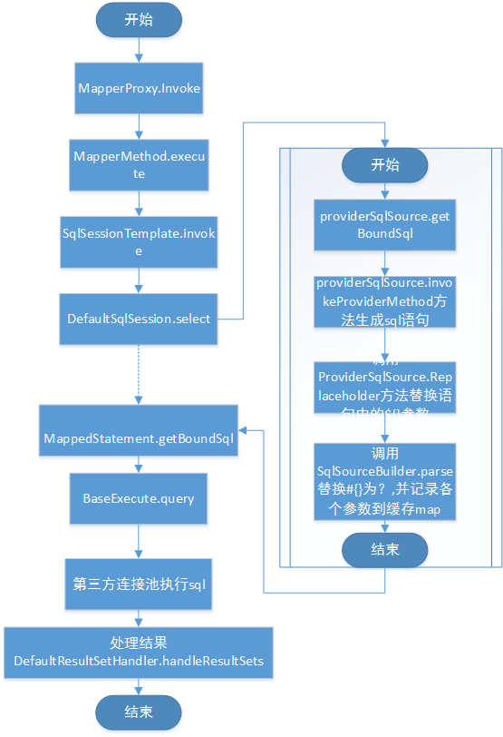

# 十四.binding
## 14.1MapperMethod
映射器方法构造函数中需要传入Mapper的type，具体的Method对象以及配置。然后在构造器初始化一个SqlCommand静态内部类对象和MethodSignature静态内部类对象。
（1）初始化SqlCommand
``` java
   public SqlCommand(Configuration configuration, Class<?> mapperInterface, Method method) {
      //获取方法名
      final String methodName = method.getName();
      final Class<?> declaringClass = method.getDeclaringClass();
      //获取到映射器声明，当declaringClass和mapperInterface相同时，直接返回了空
      //也就是说在configuration必须要存在映射声明，或者declaringClass为实现类，而不是mapperInterface
      MappedStatement ms = resolveMappedStatement(mapperInterface, methodName, declaringClass,
          configuration);
      if (ms == null) {
        if(method.getAnnotation(Flush.class) != null){
          name = null;
          type = SqlCommandType.FLUSH;
        } else {
          throw new BindingException("Invalid bound statement (not found): "
              + mapperInterface.getName() + "." + methodName);
        }
      } else {
        name = ms.getId();
        type = ms.getSqlCommandType();
        if (type == SqlCommandType.UNKNOWN) {
          throw new BindingException("Unknown execution method for: " + name);
        }
      }
}
```
（2）初始化MethodSignature
``` java
  public MethodSignature(Configuration configuration, Class<?> mapperInterface, Method method) {
      //解析返回参数类型
      Type resolvedReturnType = TypeParameterResolver.resolveReturnType(method, mapperInterface);
      //判断是否为普通类
      if (resolvedReturnType instanceof Class<?>) {
        this.returnType = (Class<?>) resolvedReturnType;
        //判断是否为泛型类
      } else if (resolvedReturnType instanceof ParameterizedType) {
        this.returnType = (Class<?>) ((ParameterizedType) resolvedReturnType).getRawType();
      } else {
        this.returnType = method.getReturnType();
      }
      //返回类型是否为void
      this.returnsVoid = void.class.equals(this.returnType);
      //返回类型是集合还是数组
      this.returnsMany = configuration.getObjectFactory().isCollection(this.returnType) || this.returnType.isArray();
      this.returnsCursor = Cursor.class.equals(this.returnType);
      this.returnsOptional = Optional.class.equals(this.returnType);
      //获取map的键值取于哪一列
      this.mapKey = getMapKey(method);
      //返回是否为map
      this.returnsMap = this.mapKey != null;
      //获取方法参数表中RowBounds位于第几个
      this.rowBoundsIndex = getUniqueParamIndex(method, RowBounds.class);
      //获取方法参数表中ResultHandler位于第几个
      this.resultHandlerIndex = getUniqueParamIndex(method, ResultHandler.class);
      //解析标注Param的注解，获取注解的value，将参数的位置和value存入map
      this.paramNameResolver = new ParamNameResolver(configuration, method);
}
```
（3）execute方法
``` java
public Object execute(SqlSession sqlSession, Object[] args) {
    Object result;
    switch (command.getType()) {
      case INSERT: {
        //返回param参数map，键值为@Param的value，值为方法入参数的值
    	Object param = method.convertArgsToSqlCommandParam(args);
    	//command.getName()=statementId
        //调用sqlSession中的insert方法，返回值类型可以为void|boolean|integer|long
        result = rowCountResult(sqlSession.insert(command.getName(), param));
        break;
      }
      case UPDATE: {
        Object param = method.convertArgsToSqlCommandParam(args);
        result = rowCountResult(sqlSession.update(command.getName(), param));
        break;
      }
      case DELETE: {
        Object param = method.convertArgsToSqlCommandParam(args);
        result = rowCountResult(sqlSession.delete(command.getName(), param));
        break;
      }
      case SELECT:
        //具有ResultHandler的方法
        if (method.returnsVoid() && method.hasResultHandler()) {
          executeWithResultHandler(sqlSession, args);
          result = null;
        } else if (method.returnsMany()) {
          //返回数组类型或Collection类型的结果集
          result = executeForMany(sqlSession, args);
        } else if (method.returnsMap()) {
          //返回map类型的结果集
          result = executeForMap(sqlSession, args);
        } else if (method.returnsCursor()) {
          result = executeForCursor(sqlSession, args);
        } else {
          Object param = method.convertArgsToSqlCommandParam(args);
          result = sqlSession.selectOne(command.getName(), param);
          if (method.returnsOptional() &&
              (result == null || !method.getReturnType().equals(result.getClass()))) {
            result = Optional.ofNullable(result);
          }
        }
        break;
      case FLUSH:
        result = sqlSession.flushStatements();
        break;
      default:
        throw new BindingException("Unknown execution method for: " + command.getName());
    }
    if (result == null && method.getReturnType().isPrimitive() && !method.returnsVoid()) {
      throw new BindingException("Mapper method '" + command.getName() 
          + " attempted to return null from a method with a primitive return type (" + method.getReturnType() + ").");
    }
    return result;
  }
```
## 14.2MapperProxy
映射器代理主要是往methodCache中插入新的MapperMethod，且委托MapperMethod执行方法：
``` java
  public Object invoke(Object proxy, Method method, Object[] args) throws Throwable {
    try {
      if (Object.class.equals(method.getDeclaringClass())) {
        //如果实现类是Object，直接执行方法，如toString()。
        return method.invoke(this, args);
        //判断是否是接口中的default方法
      } else if (isDefaultMethod(method)) {
        return invokeDefaultMethod(proxy, method, args);
      }
    } catch (Throwable t) {
      throw ExceptionUtil.unwrapThrowable(t);
    }
    //如果不在缓存中则新增缓存，method为键，MapperMethod对象为value
    final MapperMethod mapperMethod = cachedMapperMethod(method);
    //使用MapperMethod中的方法进行执行。
    return mapperMethod.execute(sqlSession, args);
  }
```
## 14.3 MapperProxyFactory映射代理工厂
映射器代理工厂是一个泛型类，通过newInstance(MapperProxy<T> mapperProxy)方法和newInstance(SqlSession sqlSession)方法来产生Mapper的实例对象。
14.4 MapperRegistry映射注册机
（1）获取映射
``` java
  public <T> T getMapper(Class<T> type, SqlSession sqlSession) {
    //从缓存中获取映射器代理工厂
    final MapperProxyFactory<T> mapperProxyFactory = (MapperProxyFactory<T>) knownMappers.get(type);
    if (mapperProxyFactory == null) {
      throw new BindingException("Type " + type + " is not known to the MapperRegistry.");
    }
    try {
      //通过sqlSession获取实例化Mapper对象
      return mapperProxyFactory.newInstance(sqlSession);
    } catch (Exception e) {
      throw new BindingException("Error getting mapper instance. Cause: " + e, e);
    }
  }
```
（2）添加映射
``` java
  public <T> void addMapper(Class<T> type) {
    //只有是interface才会执行下面的逻辑，也就是说Mapper只能是接口
    if (type.isInterface()) {
      if (hasMapper(type)) {
        throw new BindingException("Type " + type + " is already known to the MapperRegistry.");
      }
      boolean loadCompleted = false;
      try {
        knownMappers.put(type, new MapperProxyFactory<T>(type));
        // It's important that the type is added before the parser is run
        // otherwise the binding may automatically be attempted by the
        // mapper parser. If the type is already known, it won't try.
        //解析Mapper
        MapperAnnotationBuilder parser = new MapperAnnotationBuilder(config, type);
        //这里面会有很多异常情况抛出，如果抛出异常，就不能设置loadComplete为true
        parser.parse();
        loadCompleted = true;
      } finally {
        if (!loadCompleted) {
          knownMappers.remove(type);
        }
      }
    }
  }
```
15.executor
执行流程：


执行器包内核心接口定义了如下方法：
``` java
//没有结果处理器
  ResultHandler NO_RESULT_HANDLER = null;
  //执行更新
  int update(MappedStatement ms, Object parameter) throws SQLException;
  //执行查询，自己传入cacheKey和boundSql
  <E> List<E> query(MappedStatement ms, Object parameter, RowBounds rowBounds, ResultHandler resultHandler, CacheKey cacheKey, BoundSql boundSql) throws SQLException;
  //执行查询，和上面的接口差不多，只不过上面的后两个参数通过传入的参数生成
  <E> List<E> query(MappedStatement ms, Object parameter, RowBounds rowBounds, ResultHandler resultHandler) throws SQLException;
  //带指向箭头的查询
  <E> Cursor<E> queryCursor(MappedStatement ms, Object parameter, RowBounds rowBounds) throws SQLException;
  //执行冲刷批处理
  List<BatchResult> flushStatements() throws SQLException;
  //提交
  void commit(boolean required) throws SQLException;
  //回滚
  void rollback(boolean required) throws SQLException;
  //创建缓存Key对象
  CacheKey createCacheKey(MappedStatement ms, Object parameterObject, RowBounds rowBounds, BoundSql boundSql);
  //是否已经缓存
  boolean isCached(MappedStatement ms, CacheKey key);
  //清除本地换缓存
  void clearLocalCache();
  //延迟加载
  void deferLoad(MappedStatement ms, MetaObject resultObject, String property, CacheKey key, Class<?> targetType);
  //获取事务对象
  Transaction getTransaction();
  //关闭连接
  void close(boolean forceRollback);
  //是否已经关闭
  boolean isClosed();
  //设置执行器包装
  void setExecutorWrapper(Executor executor);
```
## 15.1ErrorContext错误上下文
用于存放错误信息，内部有一个ThreadLocal用于读取线程本地变量信息。
## 15.2CachingExecutor
这个类实现了Executor接口，但是它并没有真正的去执行，而是调用构造器中传入的执行器对象去执行，感觉像是一个委托执行器。
## 15.3BaseExecutor基础执行器
这是一个抽象类，实现了Executor中定义的部分方法，主要为：
（1）update方法：
``` java
  public int update(MappedStatement ms, Object parameter) throws SQLException {
    //先设置错误上下文信息，resource就是Mapper的资源全路径
    ErrorContext.instance().resource(ms.getResource()).activity("executing an update").object(ms.getId());
    if (closed) {
      throw new ExecutorException("Executor was closed.");
    }
    clearLocalCache();
    //调用update方法，这里没有实现，等待实体类去实现
    return doUpdate(ms, parameter);
  }
```
（2）query查询方法：
``` java
  public <E> List<E> query(MappedStatement ms, Object parameter, RowBounds rowBounds, ResultHandler resultHandler, CacheKey key, BoundSql boundSql) throws SQLException {
    //设置错误上下文resource是mapper的全路径，id是路径后+.方法名+参数类型，全局唯一
    ErrorContext.instance().resource(ms.getResource()).activity("executing a query").object(ms.getId());
    if (closed) {
      throw new ExecutorException("Executor was closed.");
    }
    if (queryStack == 0 && ms.isFlushCacheRequired()) {
      clearLocalCache();
    }
    List<E> list;
    try {
      queryStack++;
      //如果没有传入结果处理器，则从缓存中取数据
      list = resultHandler == null ? (List<E>) localCache.getObject(key) : null;
      if (list != null) {
        //处理缓存中的OUT参数，根据key取
        handleLocallyCachedOutputParameters(ms, key, parameter, boundSql);
      } else {
        //从数据库中获取数据
        list = queryFromDatabase(ms, parameter, rowBounds, resultHandler, key, boundSql);
      }
    } finally {
      queryStack--;
    }
    //如果没有意外这里应该都是0吧
    if (queryStack == 0) {
      //逐个载入延迟队列的元素
      for (DeferredLoad deferredLoad : deferredLoads) {
        deferredLoad.load();
      }
      // issue #601
      //队列全部清空
      deferredLoads.clear();
      if (configuration.getLocalCacheScope() == LocalCacheScope.STATEMENT) {
        // issue #482
        clearLocalCache();
      }
    }
    return list;
  }
  private <E> List<E> queryFromDatabase(MappedStatement ms, Object parameter, RowBounds rowBounds, ResultHandler resultHandler, CacheKey key, BoundSql boundSql) throws SQLException {
    List<E> list;
    //先用一个placeHolder占一下位子
    //是不是防止别的地方插入，这个东西有点奇怪
    localCache.putObject(key, EXECUTION_PLACEHOLDER);
    try {
      //调用查询接口
      list = doQuery(ms, parameter, rowBounds, resultHandler, boundSql);
    } finally {
      //删除占位
      localCache.removeObject(key);
    }
    //放入真正的查询结果
    localCache.putObject(key, list);
    if (ms.getStatementType() == StatementType.CALLABLE) {
      //如果是callable类型，则放入缓存，待取用
      localOutputParameterCache.putObject(key, parameter);
    }
    return list;
  }
```
（3）deferLoad延迟加载：
``` java
public void deferLoad(MappedStatement ms, MetaObject resultObject, String property, CacheKey key, Class<?> targetType) {
    if (closed) {
      throw new ExecutorException("Executor was closed.");
    }
    DeferredLoad deferredLoad = new DeferredLoad(resultObject, property, key, localCache, configuration, targetType);
   //判断能不能加载---缓存中不为空，或者不是placeHolder，这么一来刚才用的占位符就有意义了
    if (deferredLoad.canLoad()) {
      deferredLoad.load();
    } else {
      //为什么不把刚才的对象放在队列中，需要新new一个？
      deferredLoads.add(new DeferredLoad(resultObject, property, key, localCache, configuration, targetType));
    }
  }
```
（4）createCacheKey缓存key：
``` java
  public CacheKey createCacheKey(MappedStatement ms, Object parameterObject, RowBounds rowBounds, BoundSql boundSql) {
    if (closed) {
      throw new ExecutorException("Executor was closed.");
    }
    //生成key对象
    CacheKey cacheKey = new CacheKey();
    //实际上就是调用了他内部list的add方法
    cacheKey.update(ms.getId());
    cacheKey.update(rowBounds.getOffset());
    cacheKey.update(rowBounds.getLimit());
    cacheKey.update(boundSql.getSql());
    List<ParameterMapping> parameterMappings = boundSql.getParameterMappings();
    TypeHandlerRegistry typeHandlerRegistry = ms.getConfiguration().getTypeHandlerRegistry();
    // mimic DefaultParameterHandler logic
    for (ParameterMapping parameterMapping : parameterMappings) {
      if (parameterMapping.getMode() != ParameterMode.OUT) {
        Object value;
        //获取属性名
        String propertyName = parameterMapping.getProperty();
        if (boundSql.hasAdditionalParameter(propertyName)) {
          value = boundSql.getAdditionalParameter(propertyName);
        } else if (parameterObject == null) {
          value = null;
          //如果有使用类型处理器，就不处理，直接赋值
        } else if (typeHandlerRegistry.hasTypeHandler(parameterObject.getClass())) {
          value = parameterObject;
        } else {
          MetaObject metaObject = configuration.newMetaObject(parameterObject);
          value = metaObject.getValue(propertyName);
        }
        cacheKey.update(value);
      }
    }
    if (configuration.getEnvironment() != null) {
      // issue #176
      //缓存环境的id
      cacheKey.update(configuration.getEnvironment().getId());
    }
    return cacheKey;
  }
```
## 15.4keygen包
### 15.4.1Jdbc3KeyGenerator
   它的processBefore是没用的，只有后置处理生效了
``` java
public void processBatch(MappedStatementms, Statement stmt, Object parameter) {

   //自动生成的键值名，如自增序列的列名
   final String[] keyProperties = ms.getKeyProperties();
   if (keyProperties == null || keyProperties.length == 0) {
     return;
    }

   ResultSet rs = null;
    try {
     //调用statement的方法获取生成键
     rs = stmt.getGeneratedKeys();
     final Configuration configuration = ms.getConfiguration();
     if (rs.getMetaData().getColumnCount() >= keyProperties.length) {
       //获取唯一参数
       Object soleParam = getSoleParameter(parameter);
       if (soleParam != null) {
         //将rs中的值赋给soleParam
         assignKeysToParam(configuration, rs, keyProperties, soleParam);
       } else {
         //给子属性赋值
         assignKeysToOneOfParams(configuration, rs, keyProperties, (Map) parameter);
       }
     }
    }catch (Exception e) {
     throw new ExecutorException("Error getting generated key or settingresult to parameter object. Cause: " + e, e);
    }finally {
     if (rs != null) {
       try {
         rs.close();
       } catch (Exception e) {
         // ignore
       }
     }
    }
  }
```
## 15.4.2SelectKeyGenerator
这个和Jdbc3的Key生成器正好相反，它只有ProcessBefore有用。
``` java
private voidprocessGeneratedKeys(Executor executor, MappedStatement ms, Object parameter) {

    try {
      if (parameter != null &&keyStatement != null && keyStatement.getKeyProperties() != null) {
        String[] keyProperties =keyStatement.getKeyProperties();
        final Configuration configuration =ms.getConfiguration();
        final MetaObject metaParam =configuration.newMetaObject(parameter);
        if (keyProperties != null) {
          // Do not close keyExecutor.
          // The transaction will be closed byparent executor.
          Executor keyExecutor =configuration.newExecutor(executor.getTransaction(), ExecutorType.SIMPLE);
          List values =keyExecutor.query(keyStatement, parameter, RowBounds.DEFAULT,Executor.NO_RESULT_HANDLER);
          if (values.size() == 0) {
            throw newExecutorException("SelectKey returned no data.");           
          } else if (values.size() > 1) {
            throw newExecutorException("SelectKey returned more than one value.");
          } else {
            MetaObject metaResult =configuration.newMetaObject(values.get(0));
            if (keyProperties.length == 1) {
              if(metaResult.hasGetter(keyProperties[0])) {
                //给metaParam中与keyProperties[0]属性名对应的属性赋值
                setValue(metaParam,keyProperties[0], metaResult.getValue(keyProperties[0]));
              } else {
                // no getter for the property -maybe just a single value object
                // so try that
                setValue(metaParam,keyProperties[0], values.get(0));
              }
            } else {
             handleMultipleProperties(keyProperties, metaParam, metaResult);
            }
          }
        }
      }
    } catch (ExecutorException e) {
      throw e;
    } catch (Exception e) {
      throw new ExecutorException("Errorselecting key or setting result to parameter object. Cause: " + e, e);
    }
  }
```
## 15.5 statement包
### 15.5.1StatementHandler接口类
它是一个接口类，内部声明了8个接口方法，BaseStatementHandler中简单了实现了部分功能，从未称为基类，但是BaseStatementHandler是一个抽象的类，它还是有部分是空的，内部实现了部分方法，还有部分方法未实现，待真正的实现类去实现。
``` java
  //通过连接和事务超时，获取Statement
  Statement prepare(Connection connection, Integer transactionTimeout)
      throws SQLException;
  //statement参数化
  void parameterize(Statement statement)
      throws SQLException;
  //批处理
  void batch(Statement statement)
      throws SQLException;
  //更新操作
  int update(Statement statement)
      throws SQLException;
  //查询操作
  <E> List<E> query(Statement statement, ResultHandler resultHandler)
      throws SQLException;
  //查询
  <E> Cursor<E> queryCursor(Statement statement)
      throws SQLException;
  //获取boundSql
  BoundSql getBoundSql();
  //得到参数处理器
  ParameterHandler getParameterHandler();
```
### 15.5.2 StatementUtil
工具类中提供了一个应用事务超时的方法：
``` java
public static void applyTransactionTimeout(Statement statement, Integer queryTimeout,
         Integer transactionTimeout) throws SQLException {
    if (transactionTimeout == null){
      return;
    }
    Integer timeToLiveOfQuery = null;
    if (queryTimeout == null || queryTimeout == 0) {
      //查询超时为0或空，则超时就等于事务超时时间
      timeToLiveOfQuery = transactionTimeout;
    } else if (transactionTimeout < queryTimeout) {
      //当事务超时时间小于查询超时时间，取事务超时
      //貌似可以和上面的条件和并0<=transactionTimeout<queryTimeout
      timeToLiveOfQuery = transactionTimeout;
    }
    //到这里应该能发现，如果查询超时小于事务超时，则不做更改
    if (timeToLiveOfQuery != null) {
      statement.setQueryTimeout(timeToLiveOfQuery);
    }
  }
```
## 15.7result包
### 15.7.1 DefaultMapResultHandler
``` java
public void handleResult(ResultContext<? extends V> context) {
    //以前版本是将得到的Object强转到V，现在是直接赋值
    final V value = context.getResultObject();
    //利用对象工厂和对象包装器，反射工厂对value进行包装
    final MetaObject mo = MetaObject.forObject(value, objectFactory, objectWrapperFactory, reflectorFactory);
    // TODO is that assignment always true?
    final K key = (K) mo.getValue(mapKey);
    //利用属性中的map存放key属性名和值
    mappedResults.put(key, value);
  }
```
### 15.7.2 DefaultResultSetHandler默认结果集处理器
默认的结果集貌似就是ArrayList，两个构造器的实现结果都一样：
``` java
  public DefaultResultHandler() {
    list = new ArrayList<>();
  }

  @SuppressWarnings("unchecked")
  public DefaultResultHandler(ObjectFactory objectFactory) {
    //通过对象工厂构建List，和上面的构造器效果是一样的，最终处理成了ArrayList
    //这里既然最终结果都一样，为什么不直接使用新建一个对象，非得要使用对象工厂去新建呢，降低了整体的效率
    list = objectFactory.create(List.class);
  }
```
## 15.8resultset包
### 15.8.1 ResultSetHandler
接口声明了三个方法，相较于从前新增了一个方法：
``` java
  //处理结果集
  <E> List<E> handleResultSets(Statement stmt) throws SQLException;
  //新增的接口，处理Cursor结果集
  <E> Cursor<E> handleCursorResultSets(Statement stmt) throws SQLException;
  //处理出参数
  void handleOutputParameters(CallableStatement cs) throws SQLException;
```
### 15.8.2 ResultSetWrapper结果集包装器
（1）包装器的构造函数中将结果的列名、类型、jdbc中的数据类型，存放到三个列表中：
``` java
  public ResultSetWrapper(ResultSet rs, Configuration configuration) throws SQLException {
    super();
    //从配置中获取类型处理注册器
    this.typeHandlerRegistry = configuration.getTypeHandlerRegistry();
    this.resultSet = rs;
    final ResultSetMetaData metaData = rs.getMetaData();
    //结果集的列数
    final int columnCount = metaData.getColumnCount();
    for (int i = 1; i <= columnCount; i++) {
      //结果集列名，默认都是使用的列标签
      columnNames.add(configuration.isUseColumnLabel() ? metaData.getColumnLabel(i) : metaData.getColumnName(i));
      //类型处理
      jdbcTypes.add(JdbcType.forCode(metaData.getColumnType(i)));
      //列名对应的值的type
      classNames.add(metaData.getColumnClassName(i));
    }
  }
```
（2）获取类型处理器：
``` java
public TypeHandler<?> getTypeHandler(Class<?> propertyType, String columnName) {
    TypeHandler<?> handler = null;
    //从类型处理map中获取类型处理器map
    Map<Class<?>, TypeHandler<?>> columnHandlers = typeHandlerMap.get(columnName);
    if (columnHandlers == null) {
      columnHandlers = new HashMap<>();
      typeHandlerMap.put(columnName, columnHandlers);
    } else {
      handler = columnHandlers.get(propertyType);
    }
    if (handler == null) {
      //根据列名获取jdbc类型，前面有三个列表（列名，jdbc类型，java类型）
      // 数据的时候是同步存入的，取用的时候也可以同步取用
      JdbcType jdbcType = getJdbcType(columnName);
      //获取类型处理器
      handler = typeHandlerRegistry.getTypeHandler(propertyType, jdbcType);
      // Replicate logic of UnknownTypeHandler#resolveTypeHandler
      // See issue #59 comment 10
      if (handler == null || handler instanceof UnknownTypeHandler) {
        //找到list中的索引
        final int index = columnNames.indexOf(columnName);
        //根据索引获取java类型
        final Class<?> javaType = resolveClass(classNames.get(index));
        if (javaType != null && jdbcType != null) {
          handler = typeHandlerRegistry.getTypeHandler(javaType, jdbcType);
        } else if (javaType != null) {
          handler = typeHandlerRegistry.getTypeHandler(javaType);
        } else if (jdbcType != null) {
          handler = typeHandlerRegistry.getTypeHandler(jdbcType);
        }
      }
      //最终都没有获得类型处理器，新建一个Object类型处理器
      if (handler == null || handler instanceof UnknownTypeHandler) {
        handler = new ObjectTypeHandler();
      }
      columnHandlers.put(propertyType, handler);
    }
    return handler;
  }
```
（3）映射的Map加载：
``` java
  //加载已经映射的和未映射的列名
  private void loadMappedAndUnmappedColumnNames(ResultMap resultMap, String columnPrefix) throws SQLException {
    List<String> mappedColumnNames = new ArrayList<>();
    List<String> unmappedColumnNames = new ArrayList<>();
    final String upperColumnPrefix = columnPrefix == null ? null : columnPrefix.toUpperCase(Locale.ENGLISH);
    //给它加上upperColumnPrefix前缀
    final Set<String> mappedColumns = prependPrefixes(resultMap.getMappedColumns(), upperColumnPrefix);
    for (String columnName : columnNames) {
      //在这里有个疑惑，字段名是小写的就不能映射了吗，存到unmappedColumnNames？
      final String upperColumnName = columnName.toUpperCase(Locale.ENGLISH);
      if (mappedColumns.contains(upperColumnName)) {
        mappedColumnNames.add(upperColumnName);
      } else {
        unmappedColumnNames.add(columnName);
      }
    }
    //resultMapId:前缀  为键，映射完成的list以及未完成的list为值的map
    mappedColumnNamesMap.put(getMapKey(resultMap, columnPrefix), mappedColumnNames);
    unMappedColumnNamesMap.put(getMapKey(resultMap, columnPrefix), unmappedColumnNames);
  }
```
### 15.8.3 DefaultResultSetHandler
（1）结果集处理方法
``` java
  //处理结果集
    private void handleResultSet(ResultSetWrapper rsw, ResultMap resultMap, 
            List<Object> multipleResults, ResultMapping parentMapping) throws SQLException {
    try {
      if (parentMapping != null) {
        handleRowValues(rsw, resultMap, null, RowBounds.DEFAULT, parentMapping);
      } else {
        if (resultHandler == null) {
          //如果没有结果处理器
          //新建一个默认的结果处理器
          DefaultResultHandler defaultResultHandler = new DefaultResultHandler(objectFactory);
          //调用行结果处理方法
          handleRowValues(rsw, resultMap, defaultResultHandler, rowBounds, null);
          //添加对象工厂中的list到多结果集中
          multipleResults.add(defaultResultHandler.getResultList());
        } else {
          handleRowValues(rsw, resultMap, resultHandler, rowBounds, null);
        }
      }
    } finally {
      // issue #228 (close resultsets)
      //关闭结果集，防止泄露
      closeResultSet(rsw.getResultSet());
    }
  }
```
（2）行值获取
``` java
//获取到一行的值
  private Object getRowValue(ResultSetWrapper rsw, ResultMap resultMap, String columnPrefix) throws SQLException {
    final ResultLoaderMap lazyLoader = new ResultLoaderMap();
    //创建行值对象
    Object rowValue = createResultObject(rsw, resultMap, lazyLoader, columnPrefix);
    if (rowValue != null && !hasTypeHandlerForResultObject(rsw, resultMap.getType())) {
      //通过行值新建元对象，用于后面的赋值
      final MetaObject metaObject = configuration.newMetaObject(rowValue);
      boolean foundValues = this.useConstructorMappings;
      if (shouldApplyAutomaticMappings(resultMap, false)) {
        //非嵌套的时候使用自动映射，以前的版本是默认前缀为空的，当前版本增加了columnPrefix
        foundValues = applyAutomaticMappings(rsw, resultMap, metaObject, columnPrefix) || foundValues;
      }
      foundValues = applyPropertyMappings(rsw, resultMap, metaObject, lazyLoader, columnPrefix) || foundValues;
      foundValues = lazyLoader.size() > 0 || foundValues;
      rowValue = foundValues || configuration.isReturnInstanceForEmptyRow() ? rowValue : null;
    }
    return rowValue;
  }
```
# 十六.parsing
看包名应该是用于解析的，包中的内容较少，只有一个接口，声明了一个解析token的方法。
## 16.1 GenericTokenParser
这个类中有三个属性，token的结束标记和开始标记，以及token的处理器，都通过构造器注入。解析起始符号和结束符号之间的字符串，使用自己实现的TokenHandler。
``` java
  public String parse(String text) {
    if (text == null || text.isEmpty()) {
      return "";
    }
    // 查找token起始符号的位置，如果没有直接返回
    int start = text.indexOf(openToken, 0);
    if (start == -1) {
      return text;
    }
    char[] src = text.toCharArray();
    int offset = 0;
    final StringBuilder builder = new StringBuilder();
    StringBuilder expression = null;
    //循环解析到所有起始符号和结束符号解析完毕，获取中间的值
    while (start > -1) {
      if (start > 0 && src[start - 1] == '\\') {
        // this open token is escaped. remove the backslash and continue.
        builder.append(src, offset, start - offset - 1).append(openToken);
        offset = start + openToken.length();
      } else {
        // found open token. let's search close token.
        if (expression == null) {
          expression = new StringBuilder();
        } else {
          //清零,其实没有清零，只是toString的时候会是个空的字符串
          expression.setLength(0);
        }
        builder.append(src, offset, start - offset);
        offset = start + openToken.length();
        int end = text.indexOf(closeToken, offset);
        while (end > -1) {
          if (end > offset && src[end - 1] == '\\') {
            // this close token is escaped. remove the backslash and continue.
            expression.append(src, offset, end - offset - 1).append(closeToken);
            offset = end + closeToken.length();
            end = text.indexOf(closeToken, offset);
          } else {
            expression.append(src, offset, end - offset);
            offset = end + closeToken.length();
            break;
          }
        }
        if (end == -1) {
          // close token was not found.
          builder.append(src, start, src.length - start);
          offset = src.length;
        } else {
          //使用自己的handler去处理解析到的值
          builder.append(handler.handleToken(expression.toString()));
          offset = end + closeToken.length();
        }
      }
      start = text.indexOf(openToken, offset);
    }
    if (offset < src.length) {
      //把尾巴也拼接上
      builder.append(src, offset, src.length - offset);
    }
    return builder.toString();
  }
```
## 16.2 PropertyParser属性解析器
属性解析器用传入的map中的value替换输入字符串中起始标记和结束标记之间的值（相当于key）。
## 16.3 XPathParser
第一次接触到这个XPath，XPath是一门在 XML 文档中查找信息的语言。XPath 可用来在 XML 文档中对元素和属性进行遍历。XPath 是W3C XSLT标准的主要元素，并且 XQuery 和 XPointer 都构建于 XPath 表达之上。因此，对 XPath 的理解是很多高级 XML 应用的基础。
PS：关于xpath的源码都在javax的xml包中。
# 十七.plugin插件
这个包内部主要实现了拦截器的功能，为什么包名不叫interceptor呢？Interceptor接口内部声明了三个方法：
``` java
  //拦截
  Object intercept(Invocation invocation) throws Throwable;

  //插入
  Object plugin(Object target);

  //设置属性
  void setProperties(Properties properties);
```
## 17.1InterceptorChain拦截链
拦截链内部有个ArrayList存放各个拦截器，通过方法注入插件：
``` java
public Object pluginAll(Object target) {
    //循环调用每个Interceptor.plugin方法
    //让人捉摸不透的地方是，返回的target只能是最后一个interceptor
    // 只有一个的情况下倒是没问题，多个的时候这样返回不就是有问题吗
    for (Interceptor interceptor : interceptors) {
      //在PluginTest中能够看到调用Plugin中的wrap方法，返回结果。
      target = interceptor.plugin(target);
    }
    return target;
  }
```
# 17.2 Invocation
我对于这个样式的类已经慕名已久了，在刚遇到反射的时候就看到有一个invoke方法，但是没有往下看去窥其全貌，仅仅保持了好奇心，到现在也没空去看这个方法，但是学过JVM之后大致知道它是怎么实现的，等学JDK反射部分的源码时再深入学习好了。
这个类内部具有三个属性通过构造器注入，通过proceed方法实际调用target中的method方法。：
``` java
//调用的对象
  private Object target;
  //调用的方法
  private Method method;
  //方法的参数表
  private Object[] args;
```
## 17.3 Plugin
前面提到，拦截器中的plugin方法会调用到Plugin类中的静态方法wrap：
``` java
public static Object wrap(Object target, Interceptor interceptor) {
    //取得签名Map
    Map<Class<?>, Set<Method>> signatureMap = getSignatureMap(interceptor);
    //取得要改变行为的类(ParameterHandler|ResultSetHandler|StatementHandler|Executor)
    Class<?> type = target.getClass();
    //取得接口
    Class<?>[] interfaces = getAllInterfaces(type, signatureMap);
    //产生代理
    if (interfaces.length > 0) {
      return Proxy.newProxyInstance(
          type.getClassLoader(),
          interfaces,
          new Plugin(target, interceptor, signatureMap));
    }
    return target;
  }
//取得签名Map
  private static Map<Class<?>, Set<Method>> getSignatureMap(Interceptor interceptor) {
    //取Intercepts注解，例子可参见ExamplePlugin.java
    Intercepts interceptsAnnotation = interceptor.getClass().getAnnotation(Intercepts.class);
    // issue #251
    //必须得有Intercepts注解，没有报错
    if (interceptsAnnotation == null) {
      throw new PluginException("No @Intercepts annotation was found in interceptor " 
                       + interceptor.getClass().getName());      
    }
    //value是数组型，Signature的数组
    Signature[] sigs = interceptsAnnotation.value();
    //每个class里有多个Method需要被拦截,所以这么定义
    Map<Class<?>, Set<Method>> signatureMap = new HashMap<Class<?>, Set<Method>>();
    for (Signature sig : sigs) {
      Set<Method> methods = signatureMap.get(sig.type());
      if (methods == null) {
        methods = new HashSet<Method>();
        signatureMap.put(sig.type(), methods);
      }
      try {
        Method method = sig.type().getMethod(sig.method(), sig.args());
        methods.add(method);
      } catch (NoSuchMethodException e) {
        throw new PluginException("Could not find method on " + sig.type() + " named "
                  + sig.method() + ". Cause: " + e, e);
      }
    }
    return signatureMap;
  }

  //取得接口
  private static Class<?>[] getAllInterfaces(Class<?> type, Map<Class<?>, Set<Method>> signatureMap) {
    Set<Class<?>> interfaces = new HashSet<Class<?>>();
    while (type != null) {
      for (Class<?> c : type.getInterfaces()) {
        //貌似只能拦截ParameterHandler|ResultSetHandler|StatementHandler|Executor
        //拦截其他的无效
        //当然我们可以覆盖Plugin.wrap方法，达到拦截其他类的功能
        if (signatureMap.containsKey(c)) {
          interfaces.add(c);
        }
      }
      //获取它extends的类
      type = type.getSuperclass();
    }
    return interfaces.toArray(new Class<?>[interfaces.size()]);
  }
```
17.4 Intercepts和Signature注解
在PluginTest中找到一个用例，在自定义实现Interceptor接口，并在实现的类上标注注解，如下所示：
``` java
  @Intercepts({@Signature(type = Map.class, method = "get", args = {Object.class})})
  public static class AlwaysMapPlugin implements Interceptor {
    @Override
    public Object intercept(Invocation invocation) throws Throwable {
      return "Always";
    }

    @Override
    public Object plugin(Object target) {
      return Plugin.wrap(target, this);
    }

    @Override
    public void setProperties(Properties properties) {
    }
  }
```
原创文章转载请标明出处
更多文章请查看 
[http://www.canfeng.xyz](http://www.canfeng.xyz)