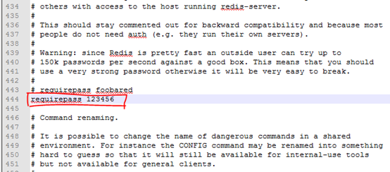
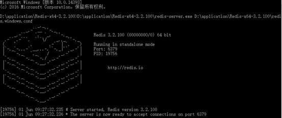
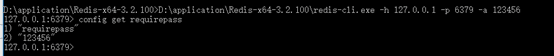
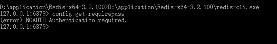
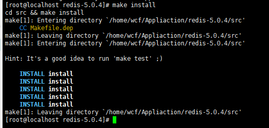
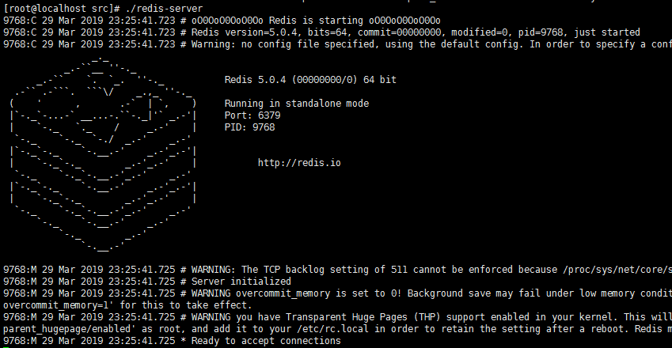

# Redis简介
略

# 1.Jdk安装
# 2.Redis安装
# 3.Windows环境下安装
## 3.1.下载redis安装包
https://github.com/MicrosoftArchive/redis/releases

## 3.2.解压
解压后得到Redis-x64-3.2.100，打开文件夹，找到redis.windows.conf文件，用文件编辑器打开后，设置用户密码

## 3.3 运行redis
在cmd窗口中运行指令redis-server.exe redis.windows.conf

启动成功

## 3.4 打开redis客户端，测试密码设置是否成功

注意，如果不进行登录，是获取不到requirepass的，会出现以下提示

# 4.linux环境安装
## 4.1redis下载
http://download.redis.io/releases/redis-5.0.4.tar.gz

## 4.2解压
tar -zxvf redis-5.0.4.tar.gz

## 4.3安装
进入到解压目录，然后执行命令

make

命令窗口中会出现一连串的执行运行信息

执行make install，会出现以下信息

## 4.4运行
进入到src目录中，执行 ./redis-server

到这里redis就已经启动成功了。

原创文章转载请标明出处

更多文章请查看

[http://www.canfeng.xyz](http://www.canfeng.xyz)

