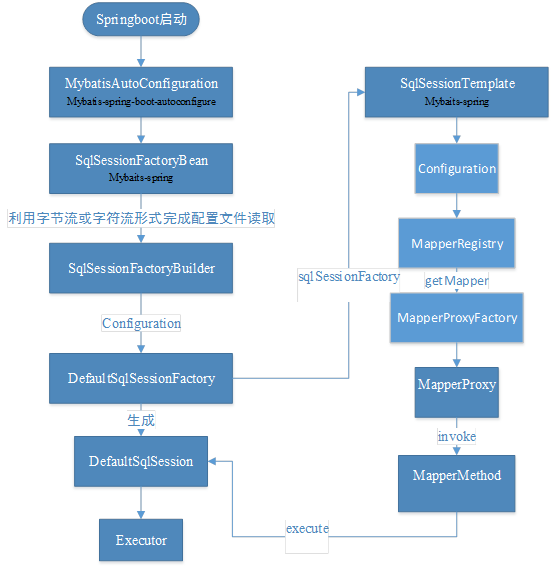
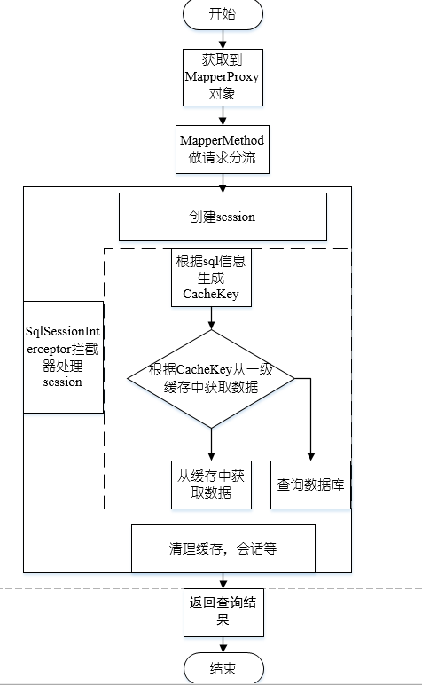

# 前言
现在有不少的项目采用了springboot+springmvc+mybaits，我们都知道mybatis存在以一级缓存和二级缓存，这里先不谈二级缓存，主要了解一下一级缓存，旨在用一级缓存提升查询性能，一级缓存可以配置session有效和statement有效，默认是session有效。
然后关于mybatis的mapper接口类我们又是通过@Autowared的形式注入的，那么一条数据处理链路中多个Autowared进来的mapper会公用同一个session吗？
# 一、前情提要
先贴一张我以前阅读mybatis源码的mapper载入流程图

# 二、流程详解
## 2.1 处理流程图

## 2.2 源码分析
### 2.2.1 code--1
到这里我们已经知道@Autowared注解引入的mapper类其实是MapperProxy对象
``` java
@Override
public Object invoke(Object proxy, Method method, Object[] args) throws Throwable {
  try {
   if (Object.class.equals(method.getDeclaringClass())) {
     return method.invoke(this, args);
   } else if (isDefaultMethod(method)) {
     return invokeDefaultMethod(proxy, method, args);
   }
  } catch (Throwable t) {
  throw ExceptionUtil.unwrapThrowable(t);
  }
  // 找到容器中的对应mapper中的方法，然后调用它的execute方法
  final MapperMethod mapperMethod = cachedMapperMethod(method);
  return mapperMethod.execute(sqlSession, args);
}
```
 ### 2.2.2 code--2
MapperMethod对各种类型的sql做分流处理，这里我们的方法是select，所以直接查看case SELECT
``` java
public Object execute(SqlSession sqlSession, Object[] args) {
  Object result;
  switch (command.getType()) {
   case INSERT: {
   Object param = method.convertArgsToSqlCommandParam(args);
     result = rowCountResult(sqlSession.insert(command.getName(), param));
     break;
   }
   case UPDATE: {
     Object param = method.convertArgsToSqlCommandParam(args);
     result = rowCountResult(sqlSession.update(command.getName(), param));
     break;
   }
   case DELETE: {
     Object param = method.convertArgsToSqlCommandParam(args);
     result = rowCountResult(sqlSession.delete(command.getName(), param));
     break;
   }
   case SELECT:
     if (method.returnsVoid() && method.hasResultHandler()) {
       executeWithResultHandler(sqlSession, args);
       result = null;
     } else if (method.returnsMany()) {
       result = executeForMany(sqlSession, args);
     } else if (method.returnsMap()) {
       result = executeForMap(sqlSession, args);
     } else if (method.returnsCursor()) {
       result = executeForCursor(sqlSession, args);
     } else {
     // 组装参数对象，然后调用sqlsession里面的方法，在后面有展开
       Object param = method.convertArgsToSqlCommandParam(args);
       result = sqlSession.selectOne(command.getName(), param);
     }
     break;
   case FLUSH:
     result = sqlSession.flushStatements();
     break;
   default:
     throw new BindingException("Unknown execution method for: " + command.getName());
  }
  if (result == null && method.getReturnType().isPrimitive() && !method.returnsVoid()) {
   throw new BindingException("Mapper method '" + command.getName()
       + " attempted to return null from a method with a primitive return type (" + method.getReturnType() + ").");
  }
  return result;
}
```
### 2.2.3 code--3
SqlSessionTemplate
``` java
@Override
public <T> T selectOne(String statement, Object parameter) {
  // 在看这里的源码的时候，有点瞎，怎么这里调用的是selectone，但是却调用到了SqlSessionInterceptor的invoke
  // 后来发现想错了，这里用的接口代理，然后再代理里面处理事务，session的关闭等操作。
  return this.sqlSessionProxy.<T> selectOne(statement, parameter);
}
// 在SqlSessionTemplate内部的一个接口代理实现类，这里是一个流程中的重点
private class SqlSessionInterceptor implements InvocationHandler {
@Override
public Object invoke(Object proxy, Method method, Object[] args) throws Throwable {
  // 获取sqlSession，下面有方法源码,详见code--4
  SqlSession sqlSession = getSqlSession(
      SqlSessionTemplate.this.sqlSessionFactory,
      SqlSessionTemplate.this.executorType,
      SqlSessionTemplate.this.exceptionTranslator);
  try {
  		  // 这里触发被拦截的接口调用
          Object result = method.invoke(sqlSession, args);
      if (!isSqlSessionTransactional(sqlSession, SqlSessionTemplate.this.sqlSessionFactory)) {
        // 成功了之后就触发commit
        sqlSession.commit(true);
      }
      return result;
  } catch (Throwable t) {
    Throwable unwrapped = unwrapThrowable(t);
    if (SqlSessionTemplate.this.exceptionTranslator != null && unwrapped instanceof PersistenceException) {
      // release the connection to avoid a deadlock if the translator is no loaded. See issue #22
      closeSqlSession(sqlSession, SqlSessionTemplate.this.sqlSessionFactory);
      sqlSession = null;
      Throwable translated = SqlSessionTemplate.this.exceptionTranslator.translateExceptionIfPossible((PersistenceException) unwrapped);
      if (translated != null) {
        unwrapped = translated;
      }
    }
    throw unwrapped;
  } finally {
     if (sqlSession != null) {
     // 下面有源码，详见code--7
       closeSqlSession(sqlSession, SqlSessionTemplate.this.sqlSessionFactory);
     }
   }
  }
}
```
### 2.2.4 code--4
SqlSessionUtils
``` java
// 获取SqlSession
public static SqlSession getSqlSession(SqlSessionFactory sessionFactory, ExecutorType executorType, PersistenceExceptionTranslator exceptionTranslator) {
  notNull(sessionFactory, NO_SQL_SESSION_FACTORY_SPECIFIED);
  notNull(executorType, NO_EXECUTOR_TYPE_SPECIFIED);
  // 事务锁管理器中获取SqlSessionHolder，如果没有事务的话，这里获取到的就是空的
  SqlSessionHolder holder = (SqlSessionHolder) TransactionSynchronizationManager.getResource(sessionFactory);
  SqlSession session = sessionHolder(executorType, holder);
  if (session != null) {
    return session;
  }
  if (LOGGER.isDebugEnabled()) {
    LOGGER.debug("Creating a new SqlSession");
  }
  // 如果上面没有获取到sqlsession，这里就会去开启一个sqlsseion了
  session = sessionFactory.openSession(executorType);
  // 只有满足这个条件的才会被注册TransactionSynchronizationManager.isSynchronizationActive()
  registerSessionHolder(sessionFactory, executorType, exceptionTranslator, session);
  return session;
}
```
### 2.2.5 code--5
DefaultSqlSession
``` java
@Override
public <E> List<E> query(MappedStatement ms, Object parameterObject, RowBounds rowBounds, ResultHandler resultHandler) throws SQLException {
  // 这里载入参数，封装sql
  BoundSql boundSql = ms.getBoundSql(parameterObject);
  // 这里生成一级缓存的键值，在同一个session中，根据这个键可以从一级缓存中获取到数据而不访问数据库
  CacheKey key = createCacheKey(ms, parameterObject, rowBounds, boundSql);
  return query(ms, parameterObject, rowBounds, resultHandler, key, boundSql);
}
```
### 2.2.6 code--6
BaseExecutor
``` java
public <E> List<E> query(MappedStatement ms, Object parameter, RowBounds rowBounds, ResultHandler resultHandler, CacheKey key, BoundSql boundSql) throws SQLException {
  ErrorContext.instance().resource(ms.getResource()).activity("executing a query").object(ms.getId());
  if (closed) {
    throw new ExecutorException("Executor was closed.");
  }
  // 这里如果配置查询前冲刷缓存，那么就会把一级缓存清理干净，但是这种情况很少
  if (queryStack == 0 && ms.isFlushCacheRequired()) {
    clearLocalCache();
  }
  List<E> list;
  try {
    queryStack++;
    // 从缓存中拿数据
    list = resultHandler == null ? (List<E>) localCache.getObject(key) : null;
    if (list != null) {
      handleLocallyCachedOutputParameters(ms, key, parameter, boundSql);
    } else {
    // 如果缓存中没有这些数据，那么去查询数据库
      list = queryFromDatabase(ms, parameter, rowBounds, resultHandler, key, boundSql);
    }
  } finally {
    queryStack--;
  }
  if (queryStack == 0) {
    for (DeferredLoad deferredLoad : deferredLoads) {
      deferredLoad.load();
    }
    // issue #601
    deferredLoads.clear();
    if (configuration.getLocalCacheScope() == LocalCacheScope.STATEMENT) {
      // issue #482
      clearLocalCache();
    }
  }
  return list;
}
// 从数据库中查询数据
private <E> List<E> queryFromDatabase(MappedStatement ms,
									  Object parameter,
									  RowBounds rowBounds,
									  ResultHandler resultHandler,
									  CacheKey key,
									  BoundSql boundSql) throws SQLException {
  List<E> list;
  localCache.putObject(key, EXECUTION_PLACEHOLDER);
  try {
  // 执行查询语句
    list = doQuery(ms, parameter, rowBounds, resultHandler, boundSql);
  } finally {
  // 它这里是先拿出来，在放进去新的，不知道为啥不直接覆盖
    localCache.removeObject(key);
  }
  // 存储新的查询结果
  localCache.putObject(key, list);
  if (ms.getStatementType() == StatementType.CALLABLE) {
    localOutputParameterCache.putObject(key, parameter);
  }
  return list;
}
```
### 2.2.7 code--7
SqlSessionUtils
``` java
// 关闭session
public static void closeSqlSession(SqlSession session, SqlSessionFactory sessionFactory) {
  notNull(session, NO_SQL_SESSION_SPECIFIED);
  notNull(sessionFactory, NO_SQL_SESSION_FACTORY_SPECIFIED);
  SqlSessionHolder holder = (SqlSessionHolder) TransactionSynchronizationManager.getResource(sessionFactory);
  if ((holder != null) && (holder.getSqlSession() == session)) {
    if (LOGGER.isDebugEnabled()) {
      LOGGER.debug("Releasing transactional SqlSession [" + session + "]");
    }
    holder.released();
  } else {
    if (LOGGER.isDebugEnabled()) {
      LOGGER.debug("Closing non transactional SqlSession [" + session + "]");
    }
    session.close();
  }
}
// 处理session的关闭
public void close() {
  try {
    executor.close(isCommitOrRollbackRequired(false));
    closeCursors();
    dirty = false;
  } finally {
    ErrorContext.instance().reset();
  }
}

public void close(boolean forceRollback) {
  try {
    try {
      rollback(forceRollback);
    } finally {
      if (transaction != null) {
      // 事务管理也关闭
        transaction.close();
      }
    }
  } catch (SQLException e) {
    // Ignore.  There's nothing that can be done at this point.
    log.warn("Unexpected exception on closing transaction.  Cause: " + e);
  } finally {
  // 最终主动将所有相关对象引用清空，方便回收，从这里我们就明确的知道了
  // Autowired进来的mapper代理类，是没有一级缓存的功能的，它在查询完毕之后就清理了会话和一级缓存
  // 从这里来看，似乎一级缓存没有帮到什么还拖累了查询
    transaction = null;
    deferredLoads = null;
    localCache = null;
    localOutputParameterCache = null;
    closed = true;
  }
}
```
