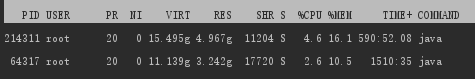
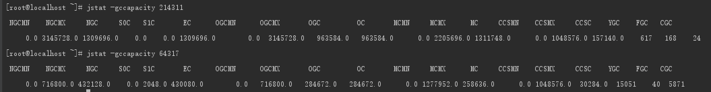
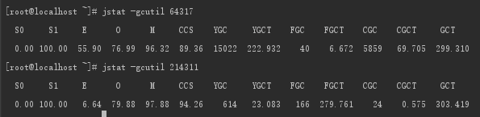
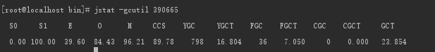
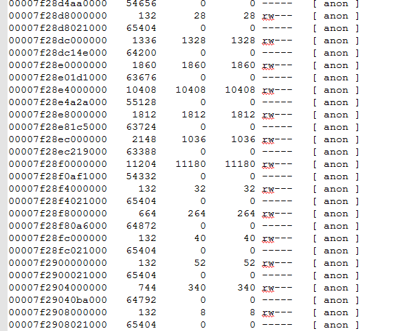
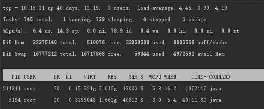
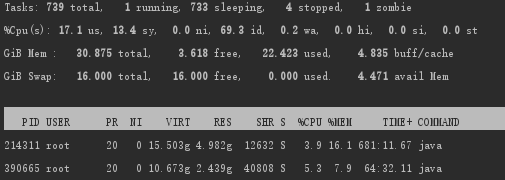
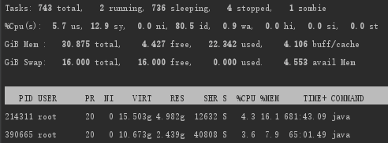
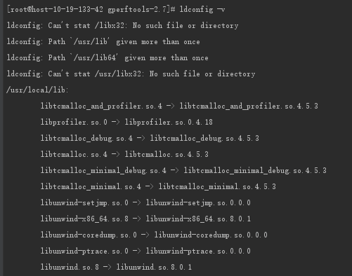
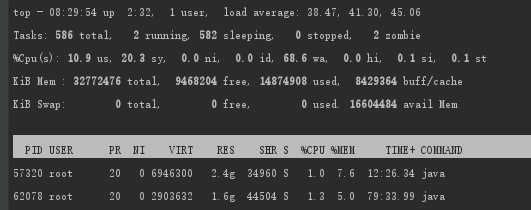

一次服务器内存调优的记录
# 前言
我们部署在linux上的服务，不约而同的出现了内存占用过高的情况，有些甚至都快到了100%了， 照理说服务应该会出现无法正常运行的情况，但是并没有，很奇怪，最明显的现象是两个tomcat占用的内存不断的在增加，下意识的想到了内存泄漏，然后展开了如下的一系列定位。
## jstat中的各个指标含义
S0C：年轻代中第一个survivor（幸存区）的容量 (kb)
S1C：年轻代中第二个survivor（幸存区）的容量 (kb)
S0U：年轻代中第一个survivor（幸存区）目前已使用空间 (kb)
S1U：年轻代中第二个survivor（幸存区）目前已使用空间 (kb)
EC：年轻代中Eden（伊甸园）的容量 (kb)
EU：年轻代中Eden（伊甸园）目前已使用空间 (kb)
OC：Old代的容量 (kb)
OU：Old代目前已使用空间 (kb)
PC：Perm(持久代)的容量 (kb)
PU：Perm(持久代)目前已使用空间 (kb)
YGC：从应用程序启动到采样时年轻代中gc次数
YGCT：从应用程序启动到采样时年轻代中gc所用时间(s)
FGC：从应用程序启动到采样时old代(全gc)gc次数
FGCT：从应用程序启动到采样时old代(全gc)gc所用时间(s)
CGC：并发 GC Stop-The-World 的次数
CGTT:并发 GC Stop-The-World 的时间(s)
GCT：从应用程序启动到采样时gc用的总时间(s)
NGCMN：年轻代(young)中初始化(最小)的大小 (kb)
NGCMX：年轻代(young)的最大容量 (kb)
NGC：年轻代(young)中当前的容量 (kb)
OGCMN：old代中初始化(最小)的大小 (kb)
OGCMX：old代的最大容量 (kb)
OGC：old代当前新生成的容量 (kb)
PGCMN：perm代中初始化(最小)的大小 (kb)
PGCMX：perm代的最大容量 (kb)
PGC：perm代当前新生成的容量 (kb)
S0：年轻代中第一个survivor（幸存区）已使用的占当前容量百分比
S1：年轻代中第二个survivor（幸存区）已使用的占当前容量百分比
E：年轻代中Eden（伊甸园）已使用的占当前容量百分比
O：old代已使用的占当前容量百分比
P：perm代已使用的占当前容量百分比
S0CMX：年轻代中第一个survivor（幸存区）的最大容量 (kb)
S1CMX ：年轻代中第二个survivor（幸存区）的最大容量 (kb)
ECMX：年轻代中Eden（伊甸园）的最大容量 (kb)
DSS：当前需要survivor（幸存区）的容量 (kb)（Eden区已满）
CCS: 类指针压缩空间使用率，可以用-XX:-UseCompressedClassPointers关闭
TT： 持有次数限制
MTT ： 最大持有次数限制
# 一、服务器情况
服务持续运行一个月左右
两个内存占用异常的tomcat

|用户名|进程号|配置|
|--------|--------|--------|
|root| 64317|-Xms700m -Xmx700m -server -XX:+HeapDumpOnOutOfMemoryError -XX:MaxDirectMemorySize=64M -Djava.protocol.handler.pkgs=org.apache.catalina.webresources -Dorg.apache.catalina.security.SecurityListener.UMASK=0027 -Dignore.endorsed.dirs= -classpath|
|root|214311|-Xms1024m -Xmx3072m -XX:CICompilerCount=2 -XX:MaxDirectMemorySize=64M -XX:InitiatingHeapOccupancyPercent=70 -XX:ParallelGCThreads=2 -XX:ConcGCThreads=2 -XX:G1ReservePercent=10|
## 1.1 GC容量情况

## 1.2 GC情况

## 1.3 详细分析
（1）两个tomcat的gc情况可以发现进程号为64317的进程YGC次数明显超过进程号为214311的进程，它的新生代回收时间（YGCT）较长也可以理解，我们假设它的吞吐量较高，所以新生代频繁生成，频繁回收。
（2）再来说说FGC，full gc一般发生在堆内存剩余不足的情况下，如果服务器调参合理的话，一般很少会发生full gc。然后我们比较发现64317虽然YGC较多，但是FGC明显少于214311，可见214311的堆内存压力明显高于64317，同时暴露出一个问题，214311的堆内存分配存在不合理，导致了频繁full gc。
（3）再来看看CGC，64317的CGC非常恐怖，居然有5000多次，也导致了CGCT时间过长，虽然在使用过程中产生STW不可避免，但是Stop-The-World对系统性能存在影响，我们应该尽量去减少它的产生。
在新生代进行的GC叫做minor GC，在老年代进行的GC都叫major GC，Full GC同时作用于新生代和老年代。在垃圾回收过程中经常涉及到对对象的挪动（比如上文提到的对象在Survivor 0和Survivor 1之间的复制），进而导致需要对对象引用进行更新。为了保证引用更新的正确性，Java将暂停所有其他的线程，这种情况被称为“Stop-The-World”，导致系统全局停顿。
综上所述，可以将214311的堆内存Xmx调大，减少其FGC，而针对64317，可以调整其年轻代的堆内存分配，减少它的GC停顿时间。GC停顿时间长会导致服务停止，没有响应，如遇到HA系统，可能引起主备切换，严重危害生产环境。
# 二、JVM优化
## 2.1 参数调整
因为214311这个进程正在使用，暂时不能停止，所以先对64317进程进行调优，对JVM进行调参优化，减少其CGC次数，原先的配置中我们发现没有配置年轻代大小，这里我们设置一下年轻代大小（有必要的话可以设置一下年轻代初始值大小），如下所示
|用户名|进程号|配置|
|--------|--------|--------|
|root|390665|-Xms768m -Xmx768m -Xmn384m -XX:MetaspaceSize=256m -XX:MaxMetaspaceSize=512m -Dcom.sun.management.jmxremote -Djava.rmi.server.hostname=10.19.164.40 -Dcom.sun.management.jmxremote.port=19999 -Dcom.sun.management.jmxremote.ssl=false -Dcom.sun.management.jmxremote.authenticate=false -server -XX:+HeapDumpOnOutOfMemoryError -XX:MaxDirectMemorySize=64M|
其中MetaspaceSize是初始化的Metaspace大小，该值越大触发Metaspace GC的时机就越晚。随着GC的到来，虚拟机会根据实际情况调控Metaspace的大小，可能增加上线也可能降低。MaxMetaspaceSize用于限制Metaspace增长的上限，防止因为某些情况导致Metaspace无限的使用本地内存。
## 2.2 结果   
最终修改了tomcat的配置之后，运行了两天，这里的FGC，次数不是很准确，本身没这么多，我手动触发了几次

# 三、再次观察RES内存
其实，到现在tomcat的内存占用异常的情况还是未有好转，这个时候就换个角度想想，是不是服务器的问题导致的呢，对比windows上相同的服务，占用内存就正常很多，然后我发现看到的RES是包含了共享库和共享内存。
## 3.1打破砂锅弄明白
既然要查看他的内存情况，那么就通过pmap把所有内存信息打印出来，如通过pmap pid -->test.txt将java进程的内存映射打印出来（也可以通过pldd pid -->test.txt将共享对象打印出来）。数据打印出来之后我很中二的先用代码比较器比较几个tomcat的共享库信息，然后计算了公用的库占用内存大小，这种特别傻的行为，各位童鞋就不用再做了T_T!。
然后我发现pmap文档中有一些奇奇怪怪的64MB的内存块

这是啥，百度了好一会之后终于有了结果，arena内存池，是linux用于管理内存的一种机制。如果不配置的情况下，它可以给每个进程提供cores*8*64MB的空间，我们的服务器上有16个核，算起来最多能占用8个G，现在还不算它的巅峰，然后把这些64MB去掉的话我们的内存占用情况其实很正常。
## 3.2 修改配置
（1）百度上查的
/etc/profile追加一行：
export MALLOC_ARENA_MAX=1
source /etc/profile
改了之后发现没鬼用
我们通过strings /proc/{pid}/environ 查看进程对应的环境变量时，发现没有这个环境变量
（2）查看catalina.sh脚本
脚本中有这么一段逻辑
``` shell
if [ -r "$CATALINA_BASE/bin/setenv.sh" ]; then
  . "$CATALINA_BASE/bin/setenv.sh"
elif [ -r "$CATALINA_HOME/bin/setenv.sh" ]; then
  . "$CATALINA_HOME/bin/setenv.sh"
fi
```
但是在bin文件夹下没有这个setenv.sh，所以我们需要自己touch一个setenv.sh，然后在里面添加如下内容
``` shell
export MALLOC_ARENA_MAX=4
#这个是为了证明是不是真的有执行这个脚本
echo 'wcf set arena'
```
## 3.3 最终结果
然后保存退出，重启tomcat，查看res和virt都有明显的锐减，说明我们的配置生效了，然后再查看进程对应的环境变量，确认一下，确实多了一个配置。

然后我们再top一下

上面一个是没改过的，下面的是我改过的，两者的virt差距相当明显。
## 3.4说明
原因其实java进程开启多线程调用数据，会采用内存池，保证每个线程都有一个堆，这样避免内存分配时需要额外的锁来降低性能。但是过多的内存池使用会导致有res暴涨，还可能会出现内存空洞，因为64MB的内存块需要栈顶释放了之后才会被系统回收，否则还是计入当前进程内的。如果栈中其他的都释放了，但是栈顶的还在使用中，那这个内存块就有点浪费了，就是所谓的内存空洞。所以我们可以限制内存池的个数，避免这种现象，具体设置MALLOC_ARENA_MAX为多少需要根据业务需求实测，我配置的4只是根据网上的经验尝试了一下

# 四、其他

我们通过RES之和得到内存已经使用了85%左右，但是根据top指令中展示的信息used/total=73%不到点，其实我们实际可用的内存是avail，因为在linux中它尽可能的cache和buffer一些数据，提高文件读取的性能，以方便下次使用。但实际上这些内存，如果需要的话，也是可以立刻拿来使用的,当然也不是所有的buff/cache都是可以拿来使用的。
执行下面的这个命令，free立马就变多了
echo 3 > /proc/sys/vm/drop_caches


# 五、采用tcmalloc
PS：最好在一个能够让你任性的环境里瞎搞
## 5.1 安装libunwind
（1）首先我们下载libunwind
[libunwind下载地址](http://download.savannah.nongnu.org/releases/libunwind/libunwind-1.2.tar.gz)
（2）解压make
``` shell
tar zxvf libunwind-1.2.tar.gz	
cd libunwind-1.2/
./configure	
make	
make install	
make clean
```
## 5.2 安装gperftools
（1）下载
[gperftools](https://github.com/gperftools/gperftools/releases/download/gperftools-2.7/gperftools-2.7.tar.gz)
（2）解压make
``` shell
tar zxvf google-perftools-2.7.tar.gz
cd gperftools-2.7/	
./configure	
make	
make install	
make clean	
#加入/usr/local/lib(libunwind的lib所在目录)	
echo "/usr/local/lib" > /etc/ld.so.conf.d/usr_local_lib.conf 	
#使libunwind生效	
ldconfig
```
## 5.3 确认是否生效
通过ldconfig -v查看

## 5.4 给进程配置环境变量
在tomcat的bin文件夹下面的setenv.sh中写入如下内容
``` shell
ldconfig	
export LD_PRELOAD=/usr/local/lib/libtcmalloc.so
#你想要把tcmalloc的heap文件写入到哪个文件夹
export HEAPPROFILE=/test/wcf/tcmalloc/heap
```
## 5.5 重启tomcat进程

这里可以看到62078这个进程（和上面优化的5194是同一个服务）virt比上面arena配置成4个时候更低（不过这不重要），然后RES也正常，剩下的就是性能测试和稳定性测试了。
## 六、最后的最后
（1）修改完arena的时候，前几天看它的时候每天有几百KB的内存上涨，到今天它又回落了，所以说是一个波动的形式
（2）修改完tcmalloc之后，当天就会在一定范围内产生波动，跟网上夸它的描述比较相符，看起来是它对内存的分配和回收上的表现更为优秀
到这里排查tomcat内存异常算是结束了，tcmalloc和修改arena的配置都是行的通的，相对来说tcmalloc更优秀一点（再未充分测试性能的前提下）。然后我采访了几个小伙伴，其中有人所在公司采用的就是tcmalloc，所以在生产环境上用也是行的通的。
参考文献：
[Java GC 变量含义(S0 S1 E O P YGC YGCT FGC FGCT GCT)](https://blog.csdn.net/yuxin6866/article/details/77718748)
[当Java虚拟机遇上Linux Arena内存池](https://cloud.tencent.com/developer/article/1054839)