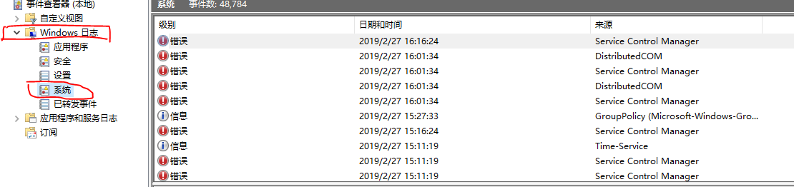

问题：
数据库提示内存溢出，平台崩溃，tomcat停止，总是基本上所有服务都不能正常运行了，但是时间点不在正常工作时间范围内。

定位1：
首先因为不在工作时间点内，所以可以排除人为操作。先查看一下tomcat下面运行的组件在哪个时间点出现运行异常，初步定位到凌晨3点左右，tomcat提示内存溢出，崩溃，然后停止运行了，但是平台有看门狗，所以又将它拉起来了，不过从日志中看到又重启失败了。然后查看数据库日志信息，数据库中也是在3点左右报的内存溢出异常。

定位2：
数据库和tomcat都提示了内存溢出，但是当前运行环境的内存总共32G，却只使用了17G，还有大量剩余，因此按理说重启服务应该是能够解决问题的，但是重启服务后平台还是无法正常运行，从日志中看到了大量的组件间接口调用失败的信息，推断了基础组件没有正常运行。

定位3：
这个时候已经无法从后台相关的日志信息中定位问题了，因为服务器是windows系统的，所以查看windows系统事件日志，如图在控制面板中打开事件日志

然后选择windows日志->系统

找到对应时间点的日志，我发现了有一个wireshark的工具占用了大量的内存，可能是某个粗心的测试忘记关了，然后导致了很多组件崩溃，包括了有个基础组件下的单独的MongoDB，而MongoDB没有看门狗管理，需要单独重启，所以没有被拉起来。

定位到问题后，处理了异常信息，重启后服务正常运行了

原创文章转载请标明出处

更多文章请查看

[http://www.canfeng.xyz](http://www.canfeng.xyz)