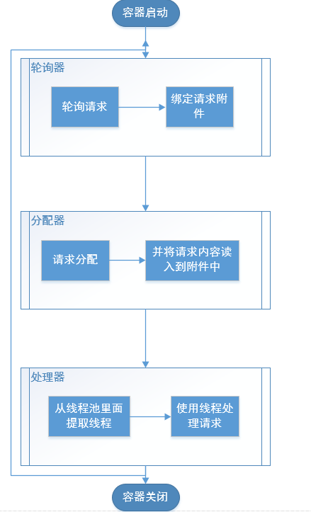

# 前言
看到网上有很多现成的Web容器：Tomcat、Jetty、Undertow、JBoss、WebLogic、WebSphere等，心里就痒痒的，也想要尝试自己写一个。然后我就从最熟悉的Tomcat下手，先学习了一下它，不过自从上回写了[《学Springboot必须要懂的内嵌式Tomcat启动与请求处理》](https://www.jianshu.com/p/7dbaac902074)之后，总感觉思路还不是很清晰，毕竟Tomcat是一个较为重量级的容器了，它内部有很多分支在初学时会使得理解变的很困难，索性就边写边理解吧。
# 一、我的理解
整体流程如下所示：


线程池处理请求的时候需要解析请求报文，然后将请求报文转成请求对象，方便后续处理，最后将执行结果返回给终端
# 二、代码实现
## 2.1主函数开启容器
``` java
public class Main {
    public static void main(String[] args) {
        WcfServlet servlet=new WcfServlet();
        servlet.start();
    }
}
```
## 2.2容器的入口，包括端口号和ip的绑定，以及 轮询器的启动
``` java
package com.wcf.test;

import org.apache.logging.log4j.LogManager;
import org.apache.logging.log4j.Logger;

import java.io.IOException;
import java.net.InetAddress;
import java.net.InetSocketAddress;
import java.nio.channels.Selector;
import java.nio.channels.ServerSocketChannel;

/**
 * @author wangcanfeng
 * @description 服务容器
 * @Date Created in 15:44-2019/7/29
 */
public class WcfServlet {

    Logger logger = LogManager.getLogger(WcfServlet.class);
    /**
     * 系统默认端口号
     */
    private final static int DEFAULT_PORT = 7528;

    /**
     * socketChannel
     */
    private volatile ServerSocketChannel socketChannel = null;

    public WcfServlet() {
        try {
            // 新建一个channel
            socketChannel = ServerSocketChannel.open();
            // 绑定一下ip和端口号
            socketChannel.socket().bind(new InetSocketAddress(InetAddress.getLocalHost(), DEFAULT_PORT));
            //设置ServerSocket以非阻塞方式工作
            socketChannel.configureBlocking(false);
        } catch (Exception e) {
            logger.error("construct servlet failed", e);
        }
    }

    /**
     * 功能描述: 启动容器
     *
     * @param
     * @return:void
     * @since: v1.0
     * @Author:wangcanfeng
     * @Date: 2019/7/29-16:26
     */
    public void start() {
        try {
            Poller poller=new Poller();
            poller.register(this.socketChannel);
            poller.start();
        } catch (Exception e) {
            e.printStackTrace();
        }
    }
}

```
## 2.3轮询器，用于轮询进来的请求，然后将请求交给分配器处理
``` java
package com.wcf.test;

import org.apache.logging.log4j.LogManager;
import org.apache.logging.log4j.Logger;

import java.io.IOException;
import java.nio.channels.SelectionKey;
import java.nio.channels.Selector;
import java.nio.channels.ServerSocketChannel;
import java.nio.channels.SocketChannel;
import java.util.Iterator;

/**
 * @author wangcanfeng
 * @description 轮询器，轮询请求
 * @Date Created in 16:19-2019/7/29
 */
public class Poller extends Thread {

    private Logger logger = LogManager.getLogger(Poller.class);
    /**
     * 通道选择器
     */
    private final Selector selector;

    /**
     * 可以使用的通道数
     */
    private volatile int keyCount = 0;

    private volatile ServerSocketChannel socketChannel;

    public Poller() throws IOException {
        // 新建一个通道选择器
        // open的方法实现各个操作系统都是不一样的，需要注意一下
        selector = Selector.open();
    }

    /**
     * 功能描述: 给选择器绑定通道
     *
     * @param ssc 服务器通道
     * @return:void
     * @since: v1.0
     * @Author:wangcanfeng
     * @Date: 2019/7/29-16:30
     */
    public void register(ServerSocketChannel ssc) throws Exception {
        // 将通道注册到selector上，当有多个终端连接时，都是由这个selector来管理，实现传说中的多路复用
        // 让选择器监听socket的变化
        ssc.register(selector, SelectionKey.OP_ACCEPT);
        this.socketChannel = ssc;
    }


    @Override
    public void run() {
        while (true) {
            try {
                keyCount = selector.select();
            } catch (IOException e) {
                logger.error("find selector failed", e);
            }
            Iterator<SelectionKey> keys =
                    keyCount > 0 ? selector.selectedKeys().iterator() : null;
            while (keys != null && keys.hasNext()) {
                SelectionKey sk = keys.next();
                keys.remove();
                // ssc需要先处理连接请求
                if (sk.isValid() && sk.isAcceptable()) {
                    accept(sk);
                }
                // 附件的包装器，把附件绑定到sk上，附件的生命周期和sk一致，但是附件不会随着网络传播
                InformationWrapper wrapper = new InformationWrapper();
                sk.attach(wrapper);
                if (sk.isValid() && sk.isReadable()) {
                    Dispatcher dispatcher = new Dispatcher(sk);
                    dispatcher.dispatch();
                }
            }
        }
    }

    /**
     * 功能描述: 接收连接请求，重新绑定通道，并关注读请求
     *
     * @param sk
     * @return:void
     * @since: v1.0
     * @Author:wangcanfeng
     * @Date: 2019/7/29-19:28
     */
    private void accept(SelectionKey sk) {
        try {
            ServerSocketChannel serverSocketChannel = (ServerSocketChannel) sk.channel();
            SocketChannel sc = serverSocketChannel.accept();
            sc.configureBlocking(false);
            sc.register(selector, SelectionKey.OP_READ);
            //将sk对应的Channel设置成准备接受其他请求
            sk.interestOps(SelectionKey.OP_ACCEPT);
        } catch (Exception e) {
            logger.error("accept information from client failed", e);
        }
    }

}

```
## 2.4分配器将任务分配给处理器去处理
``` java
package com.wcf.test;

import org.apache.logging.log4j.LogManager;
import org.apache.logging.log4j.Logger;

import java.io.IOException;
import java.nio.channels.SelectionKey;

/**
 * @author wangcanfeng
 * @description 任务分配器，分配任务给处理器
 * @Date Created in 16:51-2019/7/29
 */
public class Dispatcher {

    private final static Logger logger = LogManager.getLogger(Dispatcher.class);

    private SelectionKey sk;

    public Dispatcher(SelectionKey sk) {
        this.sk = sk;
    }

    /**
     * 功能描述: 处理事件内容
     *
     * @param
     * @return:void
     * @since: v1.0
     * @Author:wangcanfeng
     * @Date: 2019/7/29-19:58
     */
    public void dispatch() {
        InformationWrapper wrapper = (InformationWrapper) sk.attachment();
        if (wrapper == null) {
            cancelledKey(sk);
        } else {
            processKey(wrapper);
        }
    }

    /**
     * 功能描述: 处理包装器中的数据
     *
     * @param wrapper
     * @return:void
     * @since: v1.0
     * @Author:wangcanfeng
     * @Date: 2019/7/29-18:40
     */
    private void processKey(InformationWrapper wrapper) {
        try {
            // 将数据读入信息包装器中
            wrapper.read(sk);
        } catch (IOException e) {
            cancelledKey(sk);
            logger.error("read information failed", e);
        }
        ThreadPool.getExecutors().execute(new Handler(wrapper));
    }

    /**
     * 功能描述: 将SelectionKey从select的Set中取消
     *
     * @param sk
     * @return:void
     * @since: v1.0
     * @Author:wangcanfeng
     * @Date: 2019/7/29-18:39
     */
    public static void cancelledKey(SelectionKey sk) {
        try {
            if (sk != null) {
                sk.attach(null);
                if (sk.isValid()) {
                    sk.cancel();
                }
                // 虽然被cancel了，但是这个通道还是可以使用的，所以这个通道需要关闭一下
                if (sk.channel().isOpen()) {
                    sk.channel().close();
                }
            }
        } catch (Throwable e) {
            logger.error("channelCloseFail", e);
        }
    }
}
```
## 2.5处理器，处理请求内容
``` java
package com.wcf.test;

import org.apache.logging.log4j.LogManager;
import org.apache.logging.log4j.Logger;

/**
 * @author wangcanfeng
 * @description 处理器，具体处理请求内容
 * @Date Created in 11:09-2019/7/30
 */
public class Handler implements Runnable {

    private final static Logger logger = LogManager.getLogger(Dispatcher.class);

    /**
     * 请求附件信息
     */
    private InformationWrapper wrapper;

    /**
     * 长连接标识
     */
    private final static String PROTOCOL_LONG = "long";

    public Handler(InformationWrapper wrapper) {
        this.wrapper = wrapper;
    }

    @Override
    public void run() {
        // 判断是长连接还是短连接
        // 假设长连接请求是有long开头的
        try {
            if (wrapper.getInfoStr().startsWith(PROTOCOL_LONG)) {
                // 长连接只需要写数据到通道中，不需要消除sk
                wrapper.write();
            } else {
                // 处理一下http请求的报文，生成请求对象
                HttpRequest request = new HttpRequest();
                request.getRequest(wrapper);
                // 处理请求
                // ......
                // 处理完毕
                HttpResponse.response(wrapper, "请求已处理".getBytes());
                // 短连接用完之后需要消除当前的SelectionKey
                Dispatcher.cancelledKey(wrapper.getSelectionKey());
            }
        } catch (Exception e) {
            logger.error("handler information failed", e);
            Dispatcher.cancelledKey(wrapper.getSelectionKey());
        }
    }

}
```
## 2.6附件对象，和sk一起消亡
``` java
package com.wcf.test;

import java.io.IOException;
import java.nio.ByteBuffer;
import java.nio.channels.SelectionKey;
import java.nio.channels.SocketChannel;
import java.nio.charset.Charset;

/**
 * @author wangcanfeng
 * @description 信息包装器
 * @Date Created in 16:01-2019/7/29
 */
public class InformationWrapper {

    /**
     * 信息流
     */
    private final ByteBuffer information;

    /**
     * 通道和选择器的绑定键
     */
    private SelectionKey selectionKey;

    /**
     * socket的通道
     */
    private SocketChannel socketChannel;

    /**
     * 编码后的字符串信息
     */
    private final StringBuffer stringBuffer;

    /**
     * 默认的编码格式
     */
    private final static Charset DEFAULT_CHARSET = Charset.forName("UTF-8");

    /**
     * 允许的单次传送最大信息体积
     */
    private final static int ALLOW_CONTENT_LENGTH = 2 * 1024 * 1024;

    public InformationWrapper() {
        information = ByteBuffer.allocate(ALLOW_CONTENT_LENGTH);
        stringBuffer = new StringBuffer(ALLOW_CONTENT_LENGTH);
    }

    /**
     * 功能描述: 通过SelectionKey获取到通道，再从通道路面读取流
     *
     * @param sk
     * @return:void
     * @since: v1.0
     * @Author:wangcanfeng
     * @Date: 2019/7/29-18:37
     */
    public void read(SelectionKey sk) throws IOException {
        this.selectionKey = sk;
        this.socketChannel = (SocketChannel) sk.channel();
        while (socketChannel.read(information) > 0) {
            information.flip();
            stringBuffer.append(DEFAULT_CHARSET.decode(information));
        }
    }

    /**
     * 功能描述: 将指定的信息写到通道中
     *
     * @param bbf
     * @return:void
     * @since: v1.0
     * @Author:wangcanfeng
     * @Date: 2019/7/30-11:01
     */
    public void write(ByteBuffer bbf) throws IOException {
        this.socketChannel.write(bbf);
    }

    /**
     * 功能描述: 直接写当前附件中的信息到通道中
     *
     * @param
     * @return:void
     * @since: v1.0
     * @Author:wangcanfeng
     * @Date: 2019/7/30-11:01
     */
    public void write() throws IOException {
        this.socketChannel.write(DEFAULT_CHARSET.encode(stringBuffer.toString()));

    }

    public SelectionKey getSelectionKey() {
        return selectionKey;
    }

    public ByteBuffer getInformation() {
        return information;
    }

    public String getInfoStr() {
        return stringBuffer.toString();
    }

    public SocketChannel getChannel() {
        return socketChannel;
    }

}
```
## 2.7请求对象
``` java
package com.wcf.test;

import org.apache.logging.log4j.LogManager;
import org.apache.logging.log4j.Logger;

import java.io.UnsupportedEncodingException;
import java.net.URLDecoder;
import java.util.HashMap;
import java.util.Map;

/**
 * @author wangcanfeng
 * @description
 * @Date Created in 13:42-2019/7/30
 */
public class HttpRequest {

    private final static Logger logger = LogManager.getLogger(HttpRequest.class);
    /**
     * 请求方法
     */
    private String method;

    /**
     * 请求路径
     */
    private String path;

    /**
     * 请求版本信息
     */
    private String version;

    /**
     * 请求头信息
     */
    private Map<String, String> headers = new HashMap<>();

    /**
     * 请求体
     */
    private String body;

    private final static String UTF8 = "UTF-8";

    public HttpRequest getRequest(InformationWrapper wrapper) {
        String info = wrapper.getInfoStr();
        // 首先获取请求方法
        if (info == null || info.length() == 0) {
            return null;
        } else {
            // 解析请求报文
            // 浏览器中换行符使用了\r\n，估计是为了适配windows和linux
            String[] arr = info.split("\r\n");
            //
            if (arr.length < 2) {
                return null;
            }
            // 解析请求行
            try {
                resolveRequestLine(arr[0]);
            } catch (UnsupportedEncodingException e) {
                logger.error("UnsupportedEncodingException", e);
            }
            int count = 1;
            for (; count < arr.length; count++) {
                if ("".equals(arr[count])) {
                    break;
                } else {
                    resolveRequestHeader(arr[count]);
                }
            }
            // 获取请求体
            if (count < arr.length) {
                resolveRequestBody(arr[count + 1]);
            }
            return this;
        }
    }

    /**
     * 功能描述: 解析请求行，获取请求方法名，请求路径，http协议版本
     *
     * @param line 请求行
     * @return:void
     * @since: v1.0
     * @Author:wangcanfeng
     * @Date: 2019/7/30-14:09
     */
    private void resolveRequestLine(String line) throws UnsupportedEncodingException {
        // 根据空格切割字符串
        String[] arr = line.split(" ");
        this.method = arr[0];
        // 因为在请求中可能存在特殊字符，一般都会做URL编码处理
        // 所以这里需要对请求路径需要进行解码
        this.path = URLDecoder.decode(arr[1], UTF8);
        this.version = arr[2];
    }

    /**
     * 功能描述: 解析请求头
     *
     * @param header
     * @return:void
     * @since: v1.0
     * @Author:wangcanfeng
     * @Date: 2019/7/30-14:31
     */
    private void resolveRequestHeader(String header) {
        // 切割字符串，获取请求头中的字段名和字段值，存入map中
        String[] arr = header.split(": ");
        if (arr.length > 1) {
            headers.put(arr[0], arr[1]);
        } else {
            logger.warn("this header's format is not right");
        }
    }

    /**
     * 功能描述: 解析请求体
     *
     * @param body
     * @return:void
     * @since: v1.0
     * @Author:wangcanfeng
     * @Date: 2019/7/30-14:32
     */
    private void resolveRequestBody(String body) {
        this.body = body;
    }

    public String getMethod() {
        return method;
    }

    public String getPath() {
        return path;
    }

    public String getVersion() {
        return version;
    }

    public Map<String, String> getHeaders() {
        return headers;
    }
}

```
## 2.8返回对象
``` java
package com.wcf.test;

import java.io.IOException;
import java.nio.ByteBuffer;

/**
 * @author wangcanfeng
 * @description
 * @Date Created in 10:53-2019/7/30
 */
public class HttpResponse {

    /**
     * 功能描述: 给终端回应
     *
     * @param wrapper 附件信息
     * @param bytes 需要返回的实际内容
     * @return:void
     * @since: v1.0
     * @Author:wangcanfeng
     * @Date: 2019/7/30-10:57
     */
    public static void response(InformationWrapper wrapper, byte[] bytes) throws IOException {
        ByteBuffer buf = ByteBuffer.allocate(1024);
        buf.put("HTTP/1.1 200\r\n".getBytes());
        buf.put("Content-Type: text/html; charset=utf-8\r\n".getBytes());
        buf.put("Date: Thu, 26 Jul 2018 01:54:53 GMT\r\n".getBytes());
        buf.put("\r\n".getBytes());
        buf.put("<html><head><title>Hello</title></head><body><h1>".getBytes());
        // 写出指定的信息
        buf.put(bytes);
        buf.put("</h1></body></html>".getBytes());
        buf.flip();
        wrapper.write(buf);
    }
}
```
# 最后
到这里我们只需要修改Handler中的处理过程就可以简单的完成我们的容器了，如果需要更好的实现这个容器，还可以对处理器进行复用等优化操作